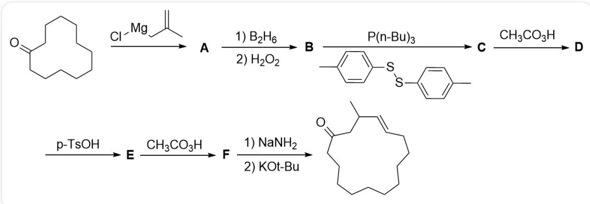
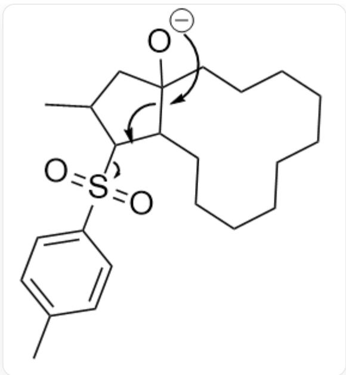

# Question

The construction of macrocycles can be achieved through fragmentation reactions:

Reaction of `C1CCCCC(=O)CCCCCC1` with `C=C(C)C[Mg]Cl` yields A, followed by reaction first with

borane and then with hydrogen peroxide to yield  $\mathbf{B}$ , reaction with tri-n-butylphosphine and

CC1=CC=C(SSC2=CC=C(C)C=C2)C=C1 to yield C, reaction with peracetic acid to yield D, reaction with

p-toluenesulfonic acid to yield  $\mathbf{E}$ , followed by reaction with peracetic acid to yield  $\mathbf{F}$ , and finally reaction first

with sodium amide and then with potassium tert-butoxide to yield  $\mathrm{CC1 / C = C / CCC}$  cccccccc  $(= 0)\mathrm{C}1$

Select the correct item from the following options:

A. All other options are incorrect.  
B. B contains two alcohol hydroxyl groups, both of which are tertiary alcohols.  
C. C contains two oxygen atoms.  
D. Both the generation of  $\mathbf{D}$  and the generation of  $\mathbf{F}$  reactions utilize peracetic acid. In both reactions, each molecule of reactant consumes one molecule of peracetic acid.  
E. E contains 3 cycles

F. The generation of the final product 1 involves 3 cyclic intermediates.

# Answer

Correct Answer: F

# Detailed Explanation

First, the Grignard reagent  $\mathrm{C = C(C)C[Mg]Cl}$  undergoes carbonyl addition to  $\mathrm{^{\prime}C1CCCCC(=O)CCCCCC1}$  to yield A:OC1(CC(C)=C)CCCCCCCCCCC1'.

# CHECKPOINT

1 PTS

The structure of  $\mathbf{A}$  is  $\mathrm{OC1(CC(C) = C)CCCCCCCCCCCC1}$

The generation of B from A is a typical hydroboration-oxidation condition, used to convert alkenes into alcohols. First, borane adds to the less sterically hindered carbon of the alkene, and is then converted to a hydroxyl group under the action of hydrogen peroxide, yielding B:  $\mathrm{OC1(CC(CO)C)CCCCCCCCCC}$  C1, which has two alcohol hydroxyl groups, but one of them is a primary alcohol, so option B is incorrect.

# CHECKPOINT

1 PTS

The structure of B is  $\mathbf{\nabla}^{\prime}$  OC1(CC(CO)C)CCCCCCCCCCC1, which has two alcohol hydroxyl groups, but one of them is a primary alcohol, so option B is incorrect

When  $\mathbf{B}$  is converted to  $\mathbf{C}$ , first, tri-n-butylphosphine attacks the disulfide bond, producing  $\mathrm{^{\prime}CC}\mathrm{CC}[\mathrm{P} + ](\mathrm{CC})$  (CCCC) (CCCC)SC1=CC=C(C)C=C1\`, which then reacts with the least sterically hindered alcohol hydroxyl group, leaving thiophenol, to give  $\mathrm{^{\prime}OC1(CC(CO[P + ](CCC)(CCC)CCC)C)CCCCCCCCCCCC1}$ . Finally, thiophenol attacks,

leaving  $\mathrm{O} = \mathrm{P}(\mathrm{CCCC})(\mathrm{CCCC})\mathrm{CCC}$  , yielding C: OC1(CC(CSC2=CC=C(C)C=C2)C)CCCCCCCCCCCCC1, which has only one oxygen atom, so option C is incorrect.

# CHECKPOINT

1 PTS

The structure of  $\mathbf{C}$  is  $\mathrm{OC1(CC(CSC2 = CC = C(C)C = C2)C)CCCCCCCCCC}^{\prime}$ , which has only one oxygen atom, so option C is incorrect

Under the action of peracetic acid, the sulfur atom is oxidized, and the thioether is oxidized to a sulfone, giving D:  $\mathrm{OC1(CC(CS(C2 = CC = C(C)C = C2)(= O) = O)C)CCCCCCCCCC}$

# CHECKPOINT

1 PTS

The structure of  $\mathbf{D}$  is  $\mathrm{OC1(CC(CS(C2 = CC = C(C)C = C2)(= O) = O)C)CCCCCCCCCC}$

Under the action of a strong acid, the tertiary alcohol undergoes elimination, which can produce two alkenes E1:  $\mathrm{CC}(\mathrm{CS}(\mathrm{C}1 = \mathrm{CC} = \mathrm{C}(\mathrm{C})\mathrm{C} = \mathrm{C}1)(= 0) = 0)\mathrm{C} / \mathrm{C}2 = \mathrm{C} / \mathrm{CCCCCCCCCC}2$  and E2: CC(CS(C1=CC=C(C)C=C1)  $(= 0) = 0) / C = C2$  CCCCCCCCC $\mathbb{C}\backslash 2$ '. In the next step, the double bond is oxidized to an epoxide by peracetic acid, corresponding to F1: CC(CS(C1=CC=C(C)C=C1)(=O)=O)CC2(O3)C3CCCCCCCCCC2' and F2: CC(CS(C1=CC=C(C)C=C1)(=O)=O)C(O2)C32CCCCCCCCCC3'.

The generation of  $\mathbf{D}$  consumes two molecules of peracetic acid, and the generation of  $\mathbf{F}$  consumes one molecule of peracetic acid, so option D is incorrect.

# CHECKPOINT

1 PTS

The generation of  $\mathbf{D}$  consumes two molecules of peracetic acid, and the generation of  $\mathbf{F}$  consumes one molecule of peracetic acid, so option D is incorrect

Under the action of a strong base,  $\mathbf{F}$  loses a proton from the  $\alpha$ -position of the sulfone, attacking the epoxide. At this time,  $\mathbf{F2}$  cannot obtain a suitable fragmentation intermediate, only  $\mathbf{F1}$  can produce  ${}^{\mathrm{CC}}\mathrm{C1S}(\mathrm{C2} = \mathrm{CC} = \mathrm{C}(\mathrm{C})\mathrm{C} = \mathrm{C2})(= \mathrm{O}) = \mathrm{O})\mathrm{CC3}(\mathrm{O})\mathrm{C1CCCCCCCCCC3}^{\cdot}$ .  $\mathbf{F1}$  has three rings, so option  $\mathbf{F}$  is correct.

# CHECKPOINT

1 PTS

The intermediate of the resulting product is  $\mathrm{CC}(\mathrm{C1S}(\mathrm{C2} = \mathrm{CC} = \mathrm{C}(\mathrm{C})\mathrm{C} = \mathrm{C2})$ $(= 0) = 0)\mathrm{CC3(O)C1CCCCCCCCCC3}$ , which has three rings, so option F is correct

Therefore, the structure of  $\mathbf{F}$  is  $\mathrm{CC(CS(C1 = CC = C(C)C = C1)(= O) = O)CC2(O3)C3CCCCCCCCCC2^{\prime}}$ , and the structure of  $\mathbf{E}$  is  $\mathrm{CC(CS(C1 = CC = C(C)C = C1)(= O) = O)C / C2 = C / CCCCCCCCCCC2^{\prime}}$ , which has two rings, so option E is incorrect.

# CHECKPOINT

1 PTS

The structure of  $\mathbf{F}$  is  $\mathrm{CC}(\mathrm{CS}(\mathrm{C}1 = \mathrm{CC} = \mathrm{C}(\mathrm{C})\mathrm{C} = \mathrm{C}1)(= 0) = 0)\mathrm{CC}2(\mathrm{O}3)\mathrm{C}3\mathrm{CCCC}^{\prime \prime}\mathrm{CCC}^{\prime \prime}\mathrm{CC}2^{\prime \prime}$ , and the structure of  $\mathbf{E}$  is  $\mathrm{CC}(\mathrm{CS}(\mathrm{C}1 = \mathrm{CC} = \mathrm{C}(\mathrm{C})\mathrm{C} = \mathrm{C}1)(= 0) = 0)\mathrm{C} / \mathrm{C}2 = \mathrm{C} / \mathrm{CCCC}^{\prime \prime}\mathrm{CCC}^{\prime \prime}\mathrm{CC}2^{\prime \prime}$ , which has two rings, so option E is incorrect

Subsequently, the alcohol anion causes the newly formed five-membered ring to fragment, leaving  $\mathrm{CC}(\mathrm{C} = \mathrm{C}1) = \mathrm{CC} = \mathrm{C}1\mathrm{S}([\mathrm{O} - ]) = \mathrm{O}^{\prime}$ , to obtain the product.

Shows the fragmentation mechanism, where the negative charge of the alcohol anion is transferred to the connected carbon-carbon single bond, then a trans double bond is generated, leaving

$$
^ {\prime} C C (C = C 1) = C C = C 1 S ([ O - ]) = O ^ {\prime}
$$