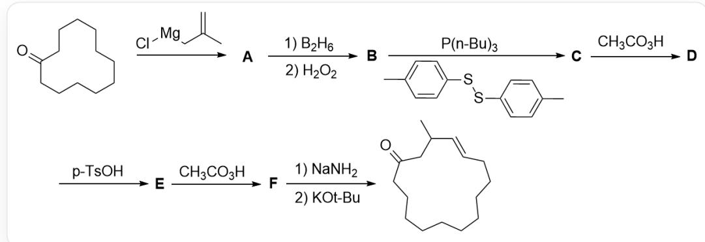
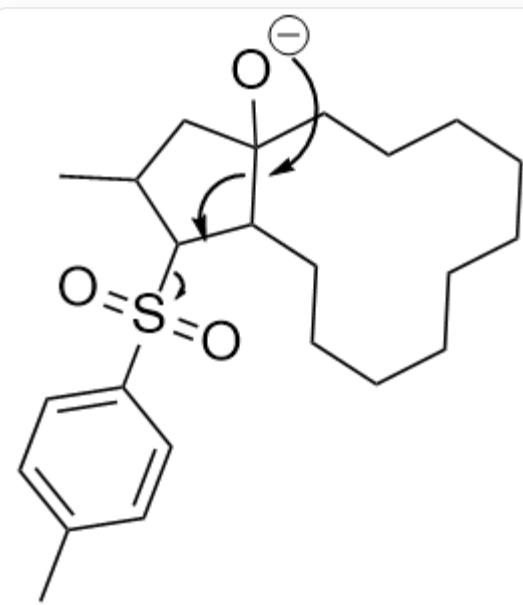

# 题目

利用碎裂化反应可实现大环的构建：

`C1CCCCC(=O)CCCCCC1`与`C=C(C)C[Mg]Cl`反应得到A，再先与乙硼烷、随后与过氧化氢反应得到B，与三正丁基膦和`CC1=CC=C(SSC2=CC=C(C)C=C2)C=C1`反应得到C，与过乙酸反应得到D，与对甲苯磺酸反应得到E，再与过乙酸反应得到F，最后先与氨基钠反应，随后与叔丁醇钾反应得到

$$
^ {\prime} C C 1 / C = C / C C C C C C C C C C (= O) C 1 ^ {\prime}
$$

选出以下选项中正确的一项：

A. 其他选项均不正确  
B. B中具有两个醇羟基且均为三级醇  
C. C中有两个氧原子  
D. 生成  $\mathrm{D}$  和生成  $\mathrm{F}$  这两步反应均用到了过乙酸, 这两个反应每分子反应物均消耗一分子过乙酸  
E. E中具有3个环  
F. 生成最终1产物的过程中历经了3个环的中间体

# 答案

正确答案: F

# 详细解析

首先，格氏试剂  $\mathrm{C = C(C)C[Mg]Cl}$  与  $\mathrm{C1CCCCC(=O)CCCCC1}$  的羰基加成得到A： $\mathrm{OC1(CC(C) = C)CCCCCCCCCCCC}$ 。

# CHECKPOINT

1 PTS

A 的结构为OC1(CC(C)=C)CCCCCCCCCCCC1

A生成B是一个典型的硼氢化氧化条件，用于将烯烃转化为醇。首先硼烷加成在烯烃位阻较小的碳上，随后在过氧化氢作用下被转化为羟基，得到B：`OC1(CC(CO)C)CCCCCCCCCCCC1`，具有两个醇羟基，但其中一个是一级醇，选项B错误

# CHECKPOINT

1 PTS

B 的结构为`OC1(CC(CO)C)CCCCCCCCCCCCC1`，具有两个醇羟基，但其中一个是一级醇，选项B错误

B生成C时，首先三正丁基膦进攻二硫键，产生 $\mathrm{CCCC}[\mathrm{P} + ](\mathrm{CCCC})(\mathrm{CCC})\mathrm{SC1} = \mathrm{CC} = \mathrm{C}(\mathrm{C})\mathrm{C} = \mathrm{C}1^{\prime}$ ，随后与位阻最小的醇羟基反应，离去硫酚，得到 $\mathrm{OC1}(\mathrm{CC}(\mathrm{CO}[\mathrm{P} + ])(\mathrm{CCCC})(\mathrm{CCC})\mathrm{CCC})\mathrm{C})\mathrm{CCCC}$  CCCCCCCC1，最后硫酚进攻，离去  $\mathrm{O} = \mathrm{P}(\mathrm{CCC})(\mathrm{CCC})\mathrm{CCC}$  ，得到到 C： $\mathrm{OC1}(\mathrm{CC}(\mathrm{CSC2} = \mathrm{CC} = \mathrm{C}(\mathrm{C})\mathrm{C} = \mathrm{C}2)\mathrm{C})\mathrm{CCCGCCCCG}$  CC

# CHECKPOINT

1 PTS

C的结构为\`OC1(CC(CSC2=CC=C(C)C=C2)C)CCCCCCCCCCCC1`，仅有一个氧原子，选项C错误

在过乙酸作用下，硫原子被氧化，硫醚被氧化为砜，得到 \(\mathbf{D}\)：`OC1(CC(CS(C2=CC=C(C)C=C2)\( (=O)=O)C)CCCCCCCCCCCCC1`

# CHECKPOINT

1 PTS

D 的结构为  $\mathrm{OC} 1 \left(\mathrm{CC} \left(\mathrm{CS} \left(\mathrm{C} 2 = \mathrm{CC} = \mathrm{C} (\mathrm{C}) \mathrm{C} = \mathrm{C} 2\right)\right) (= 0) = 0\right) \mathrm{C}\right)$  CCCCCCCCCCC1

在强酸作用下，三级醇发生消除，可产生两种烯烃E1：CC(CS(C1=CC=C(C)C=C1)  $(= 0) = 0)\mathrm{C} / \mathrm{C}2 = \mathrm{C} / \mathrm{CCCC}$  CCCCCC2和E2：CC(CS(C1=CC=C(C)C=C1)(=O)=O)/C=C2CCCCCCCCCC $\mathbb{C}\backslash 2$  ，在下一步双键被过乙酸氧化为环氧，对应F1：CC(CS(C1=CC=C(C)C=C1)  $(= 0) = 0)\mathrm{CC2}(03)\mathrm{C3CCCC}$  CCCCCC2 和 F2 ： CC(CS(C1=CC=C(C)C=C1)  $(= 0) = 0)\mathrm{C(O2)}\mathrm{C32CCCC}$  CCCCCC3。

生成D消耗两分子过乙酸，生成F消耗一分子过乙酸，选项D错误

# CHECKPOINT

1 PTS

生成D消耗两分子过乙酸，生成F消耗一分子过乙酸，选项D错误

F在强碱作用下拔除砜α位的氢，进攻环氧，此时F2无法得到合适的碎裂化中间体，只有F1可以产生 $\mathrm{CC(C1S(C2 = CC = C(C)C = C2)(= O) = O)CC3(O)C1CCCCCCCCCC}$ 。F1有三个环，选项F正确

# CHECKPOINT

1 PTS

得到产物的中间体为  $\mathrm{CC(C1S(C2 = CC = C(C)C = C2)(=O) = O)CC3(O)C1CCCCCCCCCC}$  选项F正确

因此  $\mathbf{F}$  的结构为  $\mathrm{CC}(\mathrm{CS}(\mathrm{C}1 = \mathrm{CC} = \mathrm{C}(\mathrm{C})\mathrm{C} = \mathrm{C}1)(= 0) = 0)\mathrm{CC}2(\mathrm{O}3)\mathrm{C}3\mathrm{CCCC}\mathrm{CCCC}\mathrm{CC}2^{\prime}$ ， $\mathbf{E}$  的结构为  $\mathrm{CC}(\mathrm{CS}(\mathrm{C}1 = \mathrm{CC} = \mathrm{C}(\mathrm{C})\mathrm{C} = \mathrm{C}1)(= 0) = 0)\mathrm{C} / \mathrm{C}2 = \mathrm{C} / \mathrm{CCCC}\mathrm{CCCC}\mathrm{CC}2^{\prime}$ ，有两个环，选项E错误。

# CHECKPOINT

1 PTS

F的结构为 $\mathrm{CC(CS(C1 = CC = C(C)C = C1)(=O) = O)CC2(O3)C3CCCCCCCCCC2^{\prime}}$ ，E的结构为 $\mathrm{CC(CS(C1 = CC = C(C)C = C1)(=O) = O)C / C2 = C / CCCCCCCCC2^{\prime}}$ ，有两个环，选项E错误

随后醇负离子使得新产生的五元环碎裂，离去  $\mathrm{CC}(\mathrm{C} = \mathrm{C}1) = \mathrm{CC} = \mathrm{C}1\mathrm{S}([\mathrm{O} - ]) = \mathrm{O}$  ，得到产物。

展示出碎裂化的机理，醇负离子的负电荷转移到所连的碳碳单键上，接着产生反式双键，离去

$$
^ {\prime} C C (C = C 1) = C C = C 1 S ([ O - ]) = O ^ {\prime}
$$