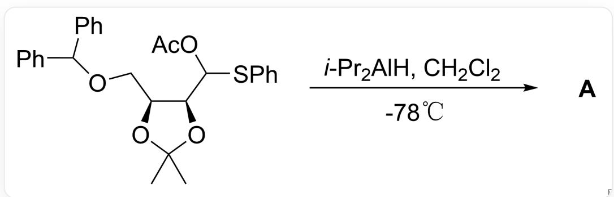
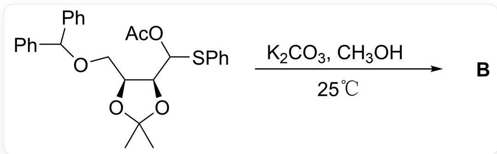
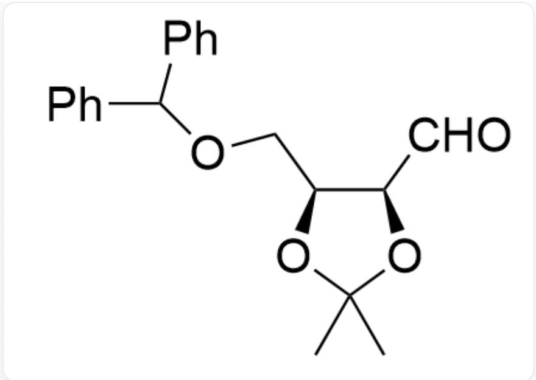
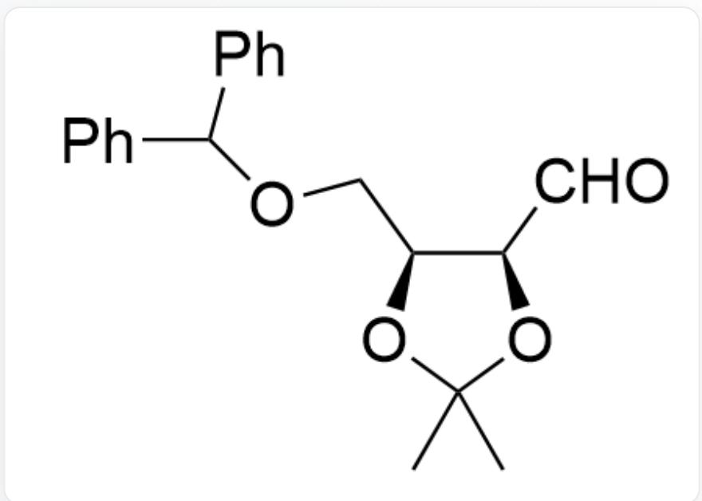
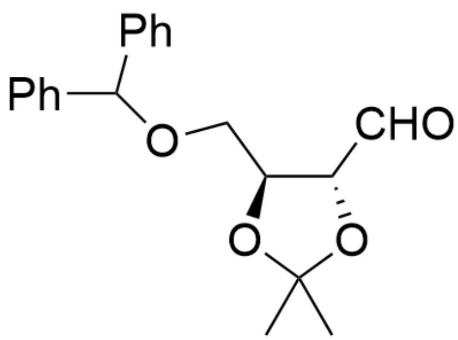
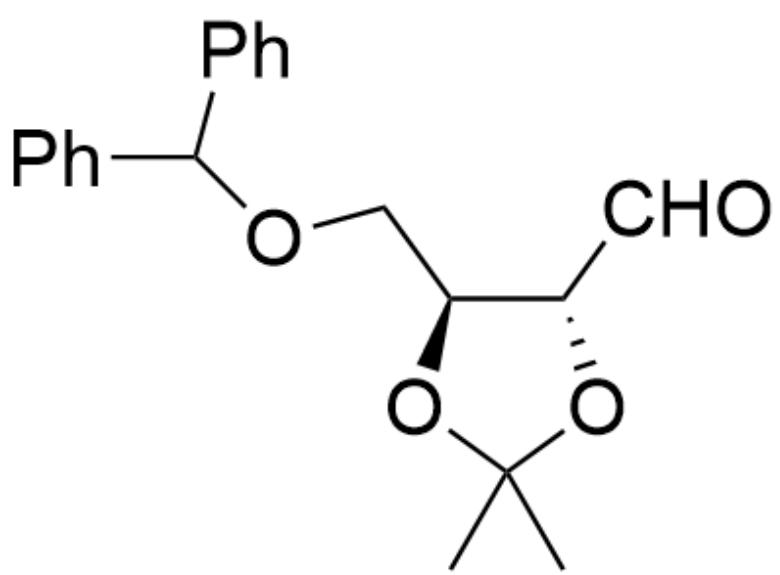
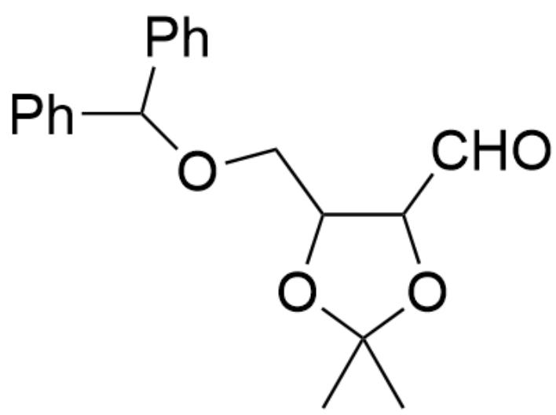
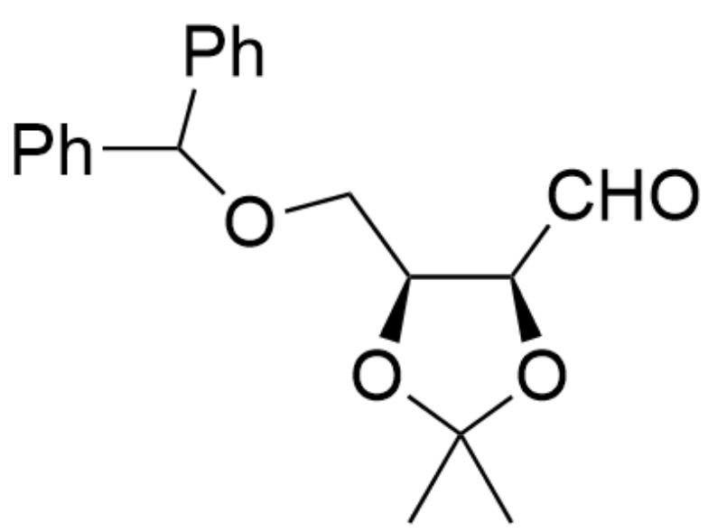
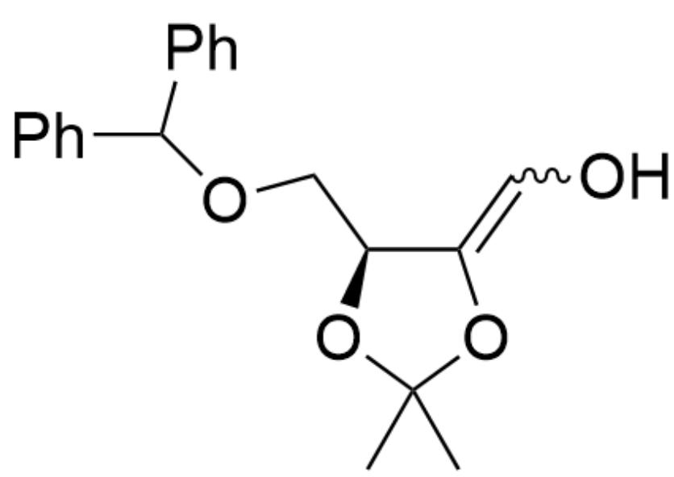

# Question

$$
C C 1 (C) O [ C @ @ H ] (C O C (C 2 = C C = C C = C 2) C 3 = C C = C C = C 3) [ C @ @ H ]
$$

$(C(OC(C) = O)SC4 = CC = CC = C4)O1 > CC(C)[Al]([H])C.CClCl, - 78^{\circ}C > [A],$  A is the product

$$
C C 1 (C) O [ C @ @ H ] (C O C (C 2 = C C = C C = C 2) C 3 = C C = C C = C 3) [ C @ @ H ] (C (O C (C) = O) S C 4 = C C = C C = C 4) O 1 >
$$

$\mathrm{K}_2\mathrm{CO}_3, \mathrm{CH}_3\mathrm{OH}, 25^{\circ}\mathrm{C} > [\mathbf{B}], \mathbf{B}$  is the product

Given that the molecular formulas of reaction products  $\mathbf{A}$  and  $\mathbf{B}$  are both  $\mathrm{C_{20}H_{22}O_4}$ , considering stereoisomers, predict the structural formulas of reaction products  $\mathbf{A}$  and  $\mathbf{B}$  respectively.

A. All other options are incorrect  
B.

CC1(C)O[C@@H](COC(C2=CC=CC=C2)C3=CC=CC=C3)[C@@H](C=O)O1

C.

CC1(C)O[C@@H](COC(C2=CC=CC=C2)C3=CC=CC=C3)[C@@H](C=O)O1

  
D.

CC1(C)O[C@@H](COC(C2=CC=CC=C2)C3=CC=CC=C3)[C@H](C=O)O1

CC1(C)O[C@@H](COC(C2=CC=CC=C2)C3=CC=CC=C3)[C@H](C=O)O1

CC1(C)O[C@@H](COC(C2=CC=CC=C2)C3=CC=CC=C3)[C@@H](C=O)O1

E.

CC1(C)O[C@@H](COC(C2=CC=CC=C2)C3=CC=CC=C3)[C@H](C=O)O1

CC1(C)O[C@@H](COC(C2=CC=CC=C2)C3=CC=CC=C3)[C@H](C=O)O1

# Answer

Correct Answer: C

# Detailed Explanation

Based on the molecular formula  $\mathrm{C_{20}H_{22}O_4}$  of the reaction products A and B, it can be inferred that the reaction is apparently the deprotection of the aldehyde group, yielding product 1.

  
Product 1: CC1(C)OC(COC(C2=CC=CC=C2)C3=CC=CC=C3)C(C=O)O1

CHECKPOINT

1 PTS

Product 1: CC1(C)OC(COC(C2=CC=CC=C2)C3=CC=CC=C3)C(C=O)O1

Next, consider stereoselectivity.

The first reaction is carried out in an aprotic solvent at low temperature, so no isomerization occurs after the protecting group is removed, and product A with retained configuration is obtained.

# CHECKPOINT

1 PTS

The first reaction is carried out in an aprotic solvent at low temperature, so no isomerization occurs after the protecting group is removed, and product A with retained configuration is obtained

Product A: CC1(C)O[C@@H](COC(C2=CC=CC=C2)C3=CC=CC=C3)[C@@H](C=O)O1

# CHECKPOINT

1 PTS

Product A: CC1(C)O[C@@H](COC(C2=CC=CC=C2)C3=CC=CC=C3)[C@@H](C=O)O1

The second reaction is carried out in a protic solvent at room temperature, which facilitates proton transfer reactions. At this time, the epimerization of the aldehyde group at the  $\alpha$  position can occur through the enol

intermediate 2.

# CHECKPOINT

1 PTS

The second reaction is carried out in a protic solvent at room temperature, which facilitates proton transfer reactions. At this time, the epimerization of the aldehyde group at the  $\alpha$  position can occur through the enol intermediate 2

Enol intermediate 2: CC(O/1)(C)O[C@@H](COC(C2=CC=CC=C2)C3=CC=CC=C3)C1=C\0

# CHECKPOINT

1 PTS

Enol intermediate 2: CC(O/1)(C)O[C@@H](COC(C2=CC=CC=C2)C3=CC=CC=C3)C1=C\0

Subsequently, the thermodynamically stable product  $\mathbf{B}$  with a greater distance between the aldehyde group and  $-\mathrm{CH}_2\mathrm{OCHPh}_2$  is obtained.

# CHECKPOINT

1 PTS

The thermodynamically stable product  $\mathbf{B}$  with a greater distance between the aldehyde group and  $-\mathrm{CH}_2\mathrm{OCHPh}_2$  is obtained

Product B: CC1(C)O[C@@H](COC(C2=CC=CC=C2)C3=CC=CC=C3)[C@H](C=O)O1

# CHECKPOINT

1 PTS

Product B: CC1(C)O[C@@H](COC(C2=CC=CC=C2)C3=CC=CC=C3)[C@H](C=O)O1