# 题目

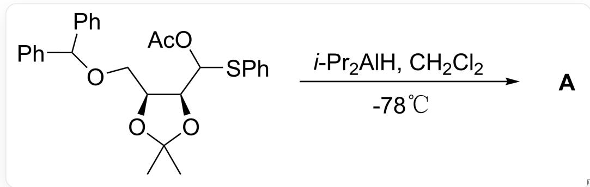

CC1(C)O[C@@H](COC(C2=CC=CC=C2)C3=CC=CC=C3)[C@@H] (C(OC(C)=O)SC4=CC=CC=C4)O1>CC(C)[AI]([H])C(C)C.CICCI,-78°C>[A],A为产物

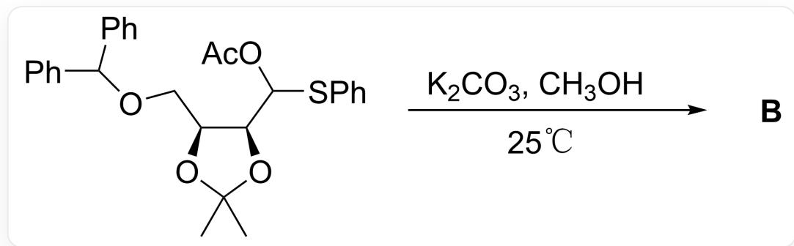

$$
C C 1 (C) O [ C @ @ H ] (C O C (C 2 = C C = C C = C 2) C 3 = C C = C C = C 3) [ C @ @ H ] (C (O C (C) = O) S C 4 = C C = C C = C 4) O 1 >
$$

$\mathrm{K}_2\mathrm{CO}_3,\mathrm{CH}_3\mathrm{OH},25^\circ \mathrm{C} > [\mathbf{B}],\mathbf{B}$  为产物

已知反应产物  $\mathrm{A}$  和  $\mathrm{B}$  的分子式均为  $\mathrm{C}_{20} \mathrm{H}_{22} \mathrm{O}_{4}$ , 考虑立体异构的条件下, 试分别预测反应产物  $\mathrm{A}$  和  $\mathrm{B}$ 的结构式

A. 其他选项均不正确  
B.

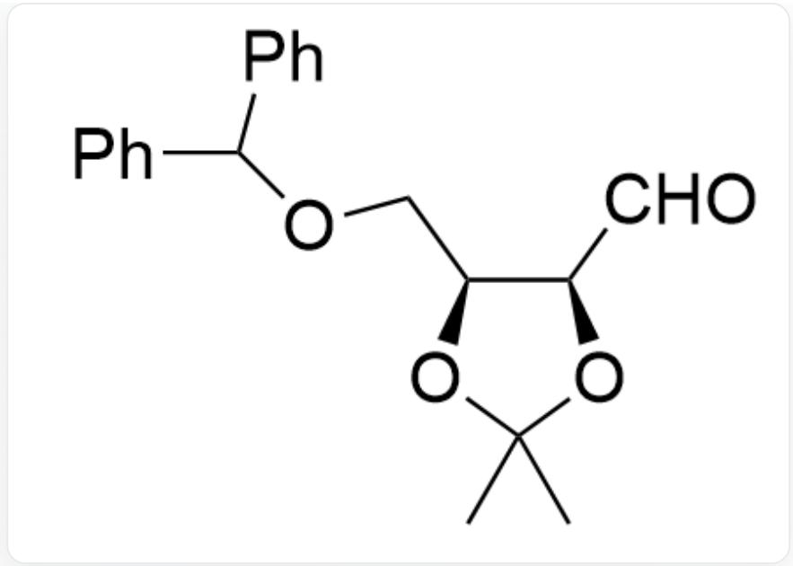

CC1(C)O[C@@H](COC(C2=CC=CC=C2)C3=CC=CC=C3)[C@@H](C=O)O1

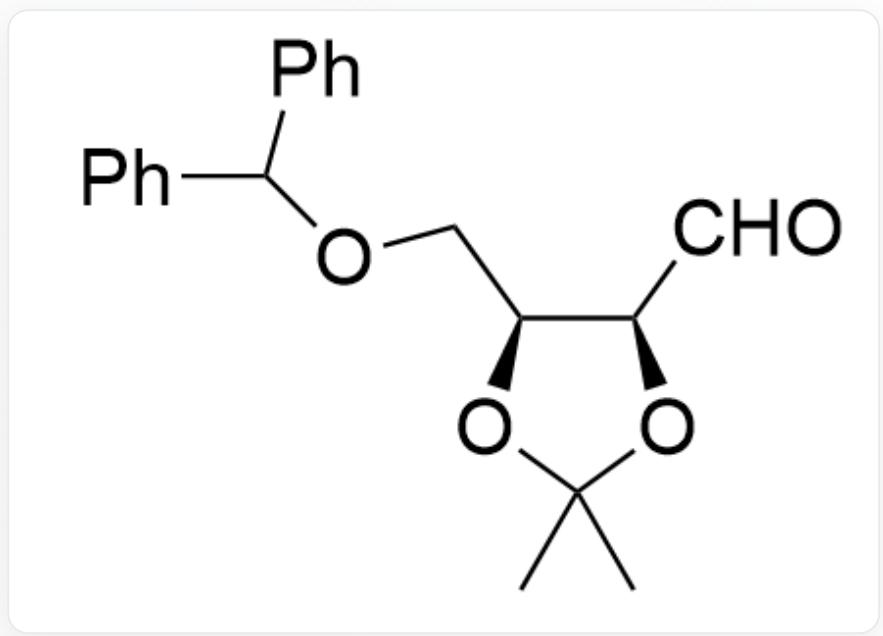

CC1(C)O[C@@H](COC(C2=CC=CC=C2)C3=CC=CC=C3)[C@@H](C=O)O1

C.

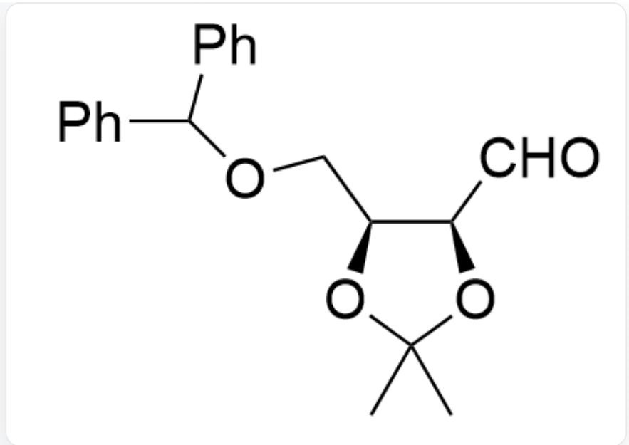

CC1(C)O[C@@H](COC(C2=CC=CC=C2)C3=CC=CC=C3)[C@@H](C=O)O1

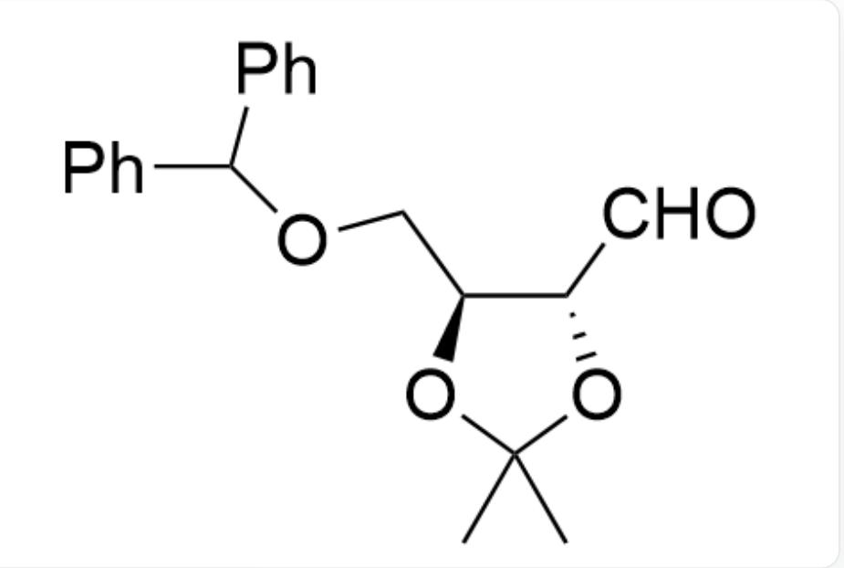

CC1(C)O[C@@H](COC(C2=CC=CC=C2)C3=CC=CC=C3)[C@H](C=O)O1

D.

CC1(C)O[C@@H](COC(C2=CC=CC=C2)C3=CC=CC=C3)[C@H](C=O)O1

CC1(C)O[C@@H](COC(C2=CC=CC=C2)C3=CC=CC=C3)[C@@H](C=O)O1

E.

CC1(C)O[C@@H](COC(C2=CC=CC=C2)C3=CC=CC=C3)[C@H](C=O)O1

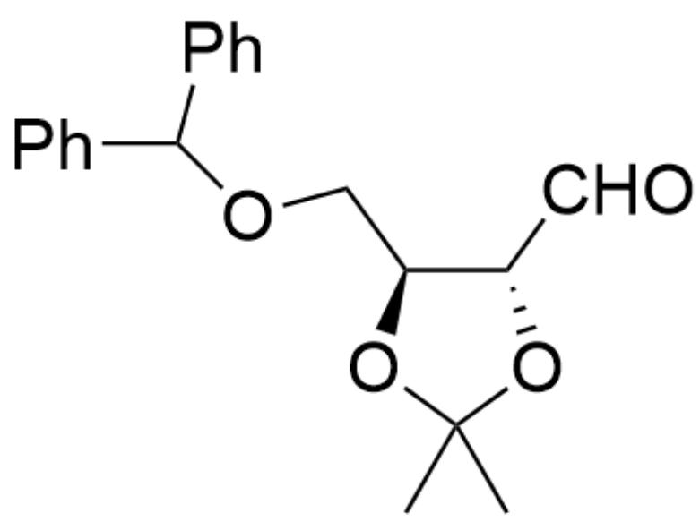

CC1(C)O[C@@H](COC(C2=CC=CC=C2)C3=CC=CC=C3)[C@H](C=O)O1

# 答案

正确答案: C

# 详细解析

根据反应产物A和B的分子式  $\mathrm{C_{20}H_{22}O_4}$  可以推断出，该反应表观上都是给醛基脱保护，得到产物1

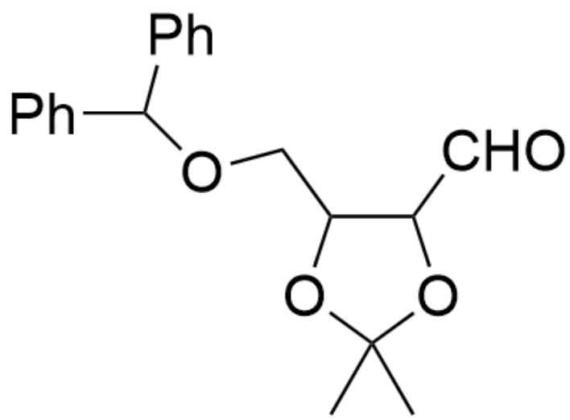  
产物1：CC1(C)OC(COC(C2=CC=CC=C2)C3=CC=CC=C3)C(C=O)O1

# CHECKPOINT

# 1 PTS

产物1：CC1(C)OC(COC(C2=CC=CC=C2)C3=CC=CC=C3)C(C=O)O1

接下来考虑立体选择性

第一个反应在低温下的非质子溶剂中进行，因此脱去保护基后不会发生异构化，得到构型保持的产物A

# CHECKPOINT

1 PTS

第一个反应在低温下的非质子溶剂中进行，因此脱去保护基后不会发生异构化，得到构型保持的产物A

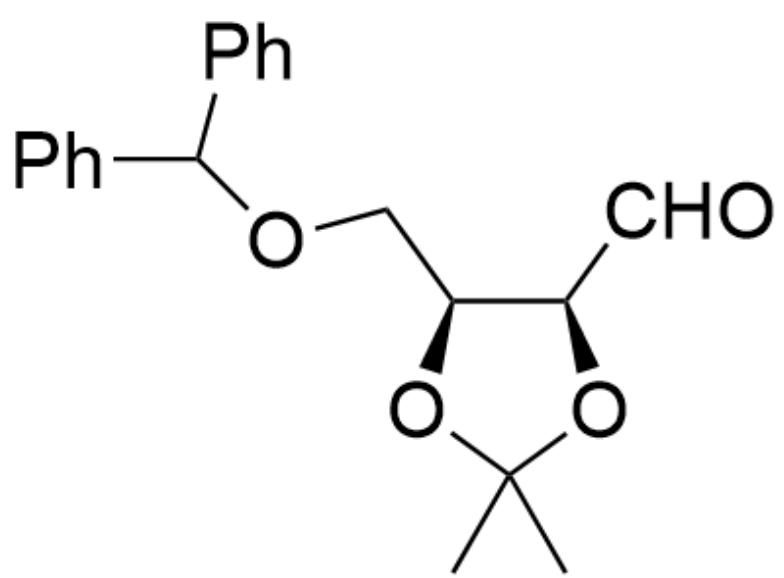  
产物A：CC1(C)O[C@@H](COC(C2=CC=CC=C2)C3=CC=CC=C3)[C@@H](C=O)O1

# CHECKPOINT

1 PTS

产物A：CC1(C)O[C@@H](COC(C2=CC=CC=C2)C3=CC=CC=C3)[C@@H](C=O)O1

而第二个反应在室温下的质子溶剂中进行，质子转移反应利于发生，此时可通过烯醇中间体2发生醛基  $\alpha$  位的差向异构化

# CHECKPOINT

1 PTS

而第二个反应在室温下的质子溶剂中进行，质子转移反应利于发生，此时可通过烯醇中间体2发生醛基  $\alpha$  位的差向异构化

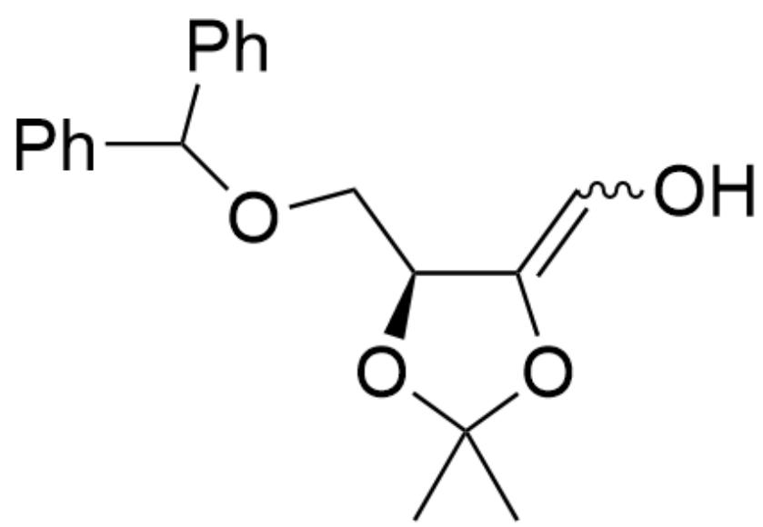

烯醇中间体2：CC(O/1)(C)O[C@@H](COC(C2=CC=CC=C2)C3=CC=CC=C3)C1=C\0

# CHECKPOINT

1 PTS

烯醇中间体2：CC(O/1)(C)O[C@@H](COC(C2=CC=CC=C2)C3=CC=CC=C3)C1=C\0

随后得到醛基和  $-\mathrm{CH}_{2} \mathrm{OCHPh}_{2}$  距离更远的热力学稳定产物B

# CHECKPOINT

1 PTS

得到醛基和  $-\mathrm{CH}_{2} \mathrm{OCHPh}_{2}$  距离更远的热力学稳定产物B

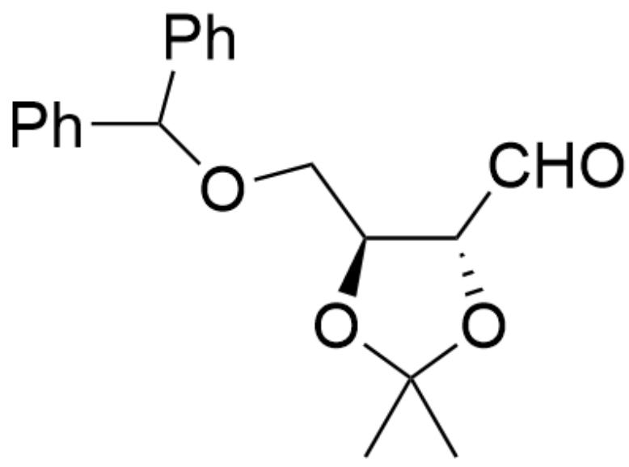

产物B：CC1(C)O[C@@H](COC(C2=CC=CC=C2)C3=CC=CC=C3)[C@H](C=O)O1

# CHECKPOINT

1 PTS

产物B：CC1(C)O[C@@H](COC(C2=CC=CC=C2)C3=CC=CC=C3)[C@H](C=O)O1