# Question

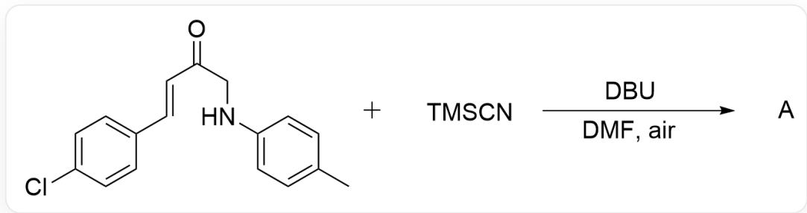  
$\mathrm{O = C(CNC1 = CC = C(C)C = C1) / C = C / C2 = CC = C(Cl)C = C2.C[Si](C)(C\# N)C > [DBU],[DMF] > [A],}$  A is the reaction product, the reaction is carried out in air.

Given that the reaction involves a free radical transformation process. Please try to predict the structural formula of the main product A and the side product B (molecular formula:  $\mathrm{C_{17}H_{14}ClNO_2}$ ) without a cyano group.

A. All other options are incorrect.

B.

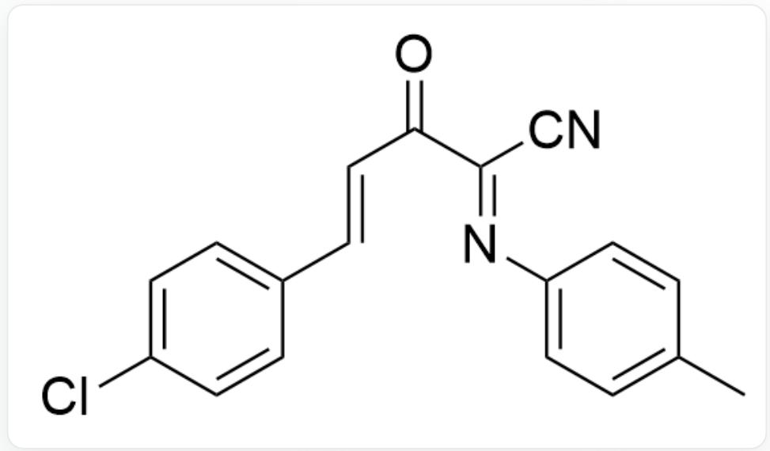  
O=C(/C(C#N)=N/C1=CC=C(C)C=C1)/C=C/C2=CC=C(Cl)C=C2, Main product A

Main product A

  
C.

$\mathrm{O = C(C(NC1 = CC = C(C)C = C1) = O) / C = C / C2 = CC = C(Cl)C = C2}$  Byproduct B

Byproduct B

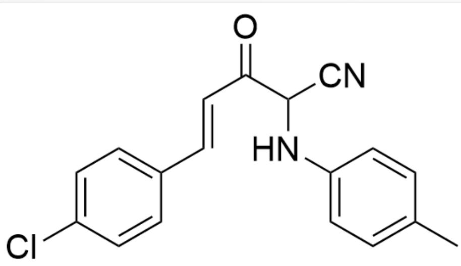

O=C(C(C#N)NC1=CC=C(C)C=C1)/C=C/C2=CC=C(Cl)C=C2, Main product A

Main product A

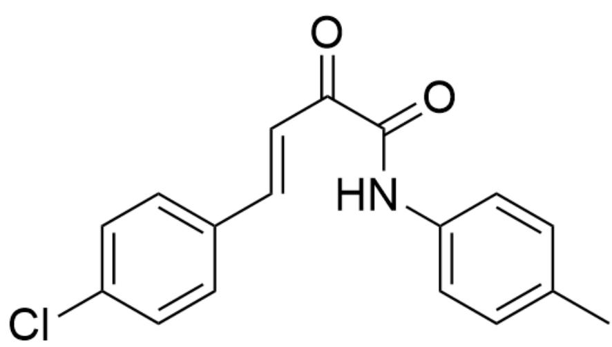  
D.

$\mathrm{O = C(C(NC1 = CC = C(C)C = C1) = O) / C = C / C2 = CC = C(Cl)C = C2}$  Byproduct B

Byproduct B

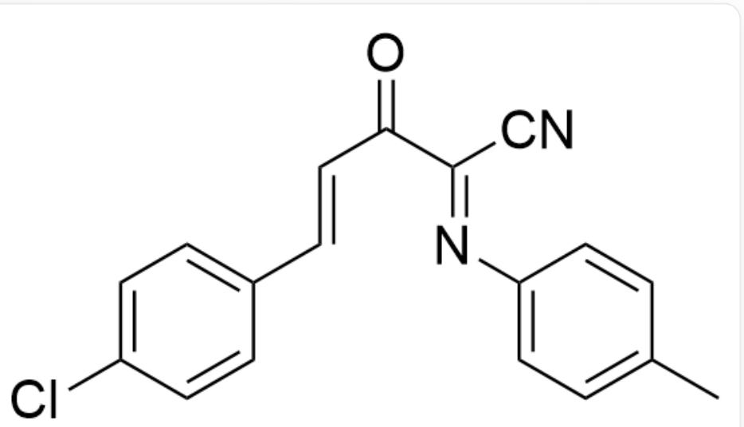

$\mathrm{O = C / C(C\#N) = N / C1 = CC = C(C)C = C1) / C = C / C2 = CC = C(Cl)C = C2}$  , Main product A

Main product A

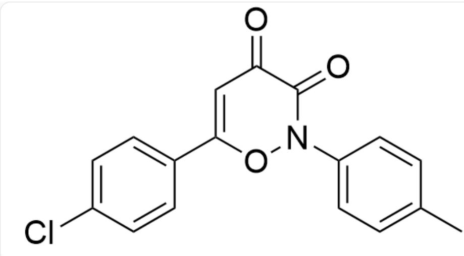

$\mathrm{O = C(C(N(O1)C2 = CC = C(C)C = C2) = O)C = C1C3 = CC = C(Cl)C = C3}$  Byproduct B

Byproduct B

E.

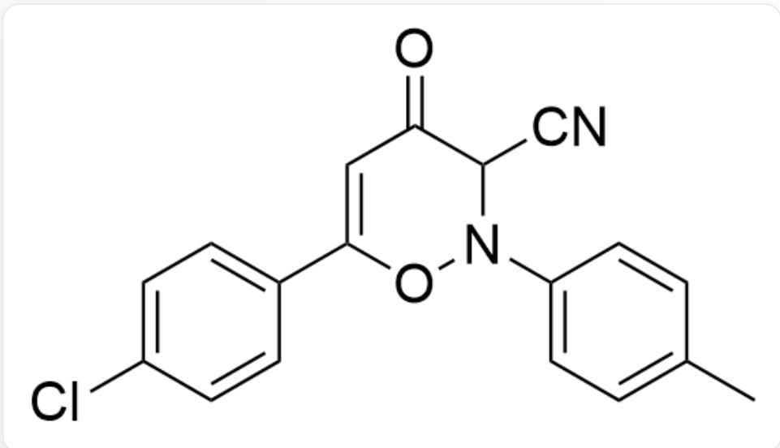

O=C(C(C#N)N(O1)C2=CC=C(C)C=C2)C=C1C3=CC=C(Cl)C=C3, Main product A

Main product A

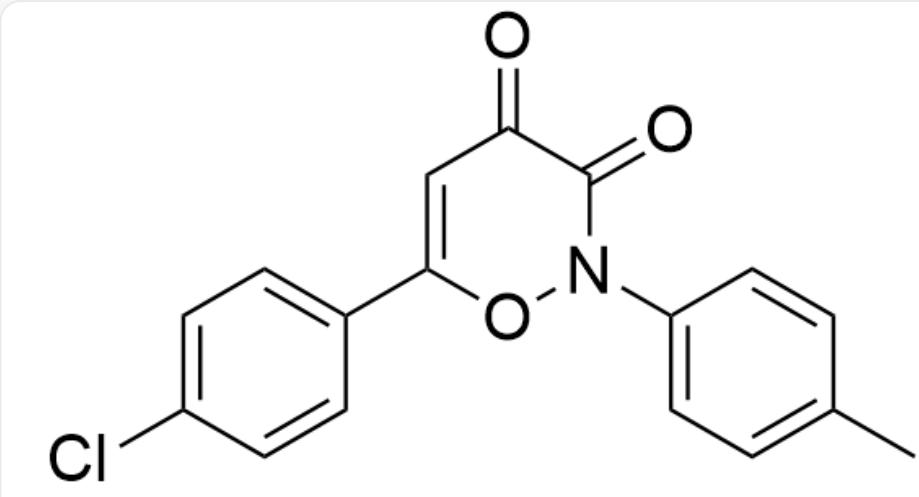  
F.

$\mathrm{O = C(C(N(O1)C2 = CC = C(C)C = C2) = O)C = C1C3 = CC = C(Cl)C = C3}$  Byproduct B

Byproduct B

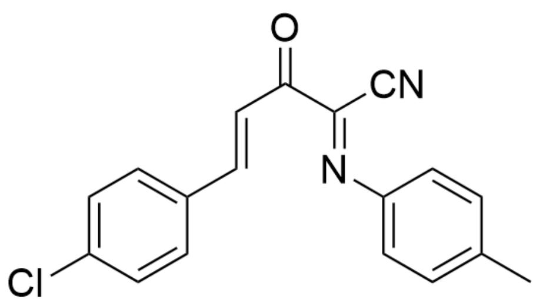

[ \mathrm{O} = \mathrm{C} / (\mathrm{C}(\mathrm{C}\# \mathrm{N}) = \mathrm{N} / \mathrm{C}1 = \mathrm{CC} = \mathrm{C}(\mathrm{C})\mathrm{C} = \mathrm{C}1) / \mathrm{C} = \mathrm{C} / \mathrm{C}2 = \mathrm{CC} = \mathrm{C}(\mathrm{Cl})\mathrm{C} = \mathrm{C}2, \text{main product A} ]

Main product A

  
G.

$\mathrm{O = C / (C = [N + ]([O - ]) / C1 = CC = C(C)C = C1) / C = C / C2 = CC = C(Cl)C = C2}$  byproduct B

Byproduct B

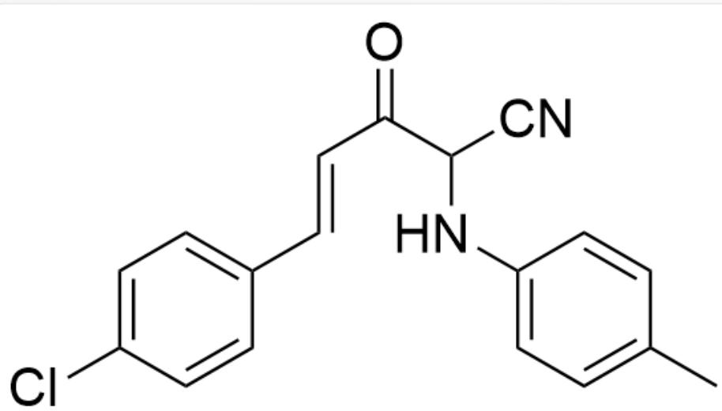

O=C(C(C#N)NC1=CC=C(C)C=C1)/C=C/C2=CC=C(Cl)C=C2, Main product A

Main product A

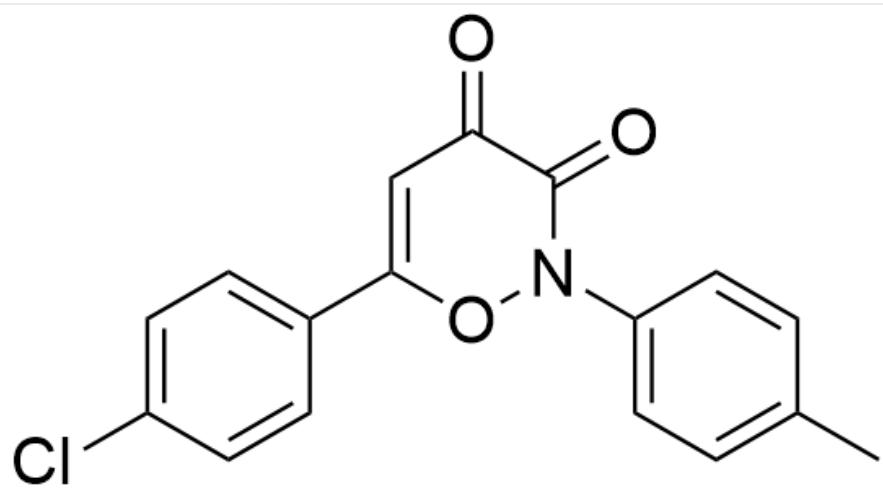

$\mathrm{O = C(C(N(O1)C2 = CC = C(C)C = C2) = O)C = C1C3 = CC = C(Cl)C = C3}$  Byproduct B

Byproduct B

# Answer

Correct Answer: B

# Detailed Explanation

According to the chemical formula of the byproduct, oxidation occurred during the formation of the byproduct; the number of carbon atoms remained unchanged, but one more oxygen atom was added. Combined with the reaction conditions, it can be concluded that the oxygen donor can only be oxygen from the air, and oxygen can be used as a free radical initiator to initiate the free radical transformation process mentioned in the question.

# CHECKPOINT

1 PTS

Oxygen as a free radical initiator

First, the substrate is deprotonated under the action of the base DBU to form intermediate 1.

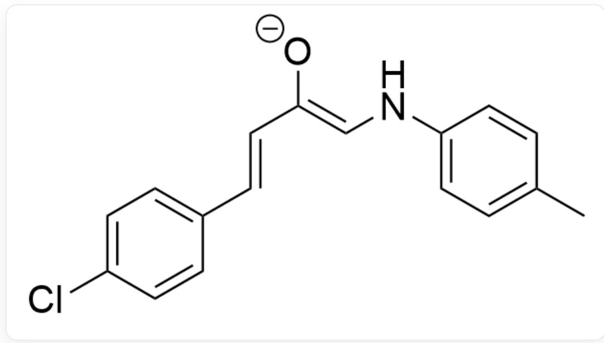

$$
[ O - ] C / / C = C / C 1 = C C = C (C l) C = C 1) = C \backslash N C 2 = C C = C (C) C = C 2
$$

# CHECKPOINT

1 PTS

$$
[ O - ] C / / C = C / C 1 = C C = C (C l) C = C 1) = C \backslash N C 2 = C C = C (C) C = C 2
$$

Then, it is deprived of an electron by oxygen to form a superoxide anion radical and a free radical intermediate 2.

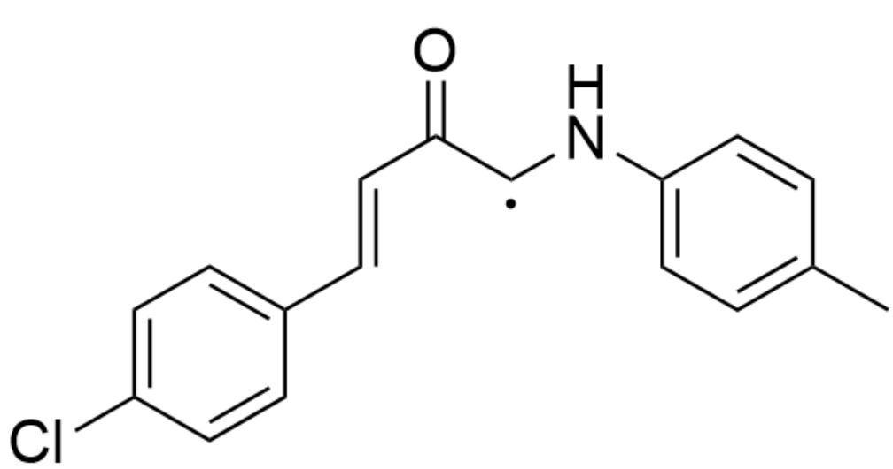

$\mathrm{O = C(C([X])NC1 = CC = C(C)C = C1) / C = C / C2 = CC = C(Cl)C = C2,X}$  is a single electron

# CHECKPOINT

1 PTS

$$
O = C (C ([ X ]) N C 1 = C C = C (C) C = C 1) / C = C / C 2 = C C = C (C l) C = C 2, X \text {i s a s i n g l e e l e c t r o n}
$$

The free radical combines with the superoxide anion radical to obtain intermediate 3.

  
[ \mathrm{O} = \mathrm{C}(\mathrm{C}(\mathrm{O}[\mathrm{O} - ])\mathrm{NC1} = \mathrm{CC} = \mathrm{C}(\mathrm{C})\mathrm{C} = \mathrm{C}1) / \mathrm{C} = \mathrm{C} / \mathrm{C}2 = \mathrm{CC} = \mathrm{C}(\mathrm{Cl})\mathrm{C} = \mathrm{C}2 ]

# CHECKPOINT

1 PTS

$$
\mathrm {O} = \mathrm {C} (\mathrm {C} (\mathrm {O} [ \mathrm {O} - ]) \mathrm {N C 1} = \mathrm {C C} = \mathrm {C} (\mathrm {C}) \mathrm {C} = \mathrm {C 1}) / \mathrm {C} = \mathrm {C} / \mathrm {C 2} = \mathrm {C C} = \mathrm {C} (\mathrm {C l}) \mathrm {C} = \mathrm {C 2}
$$

Subsequently, an elimination reaction occurs to obtain intermediate 4.

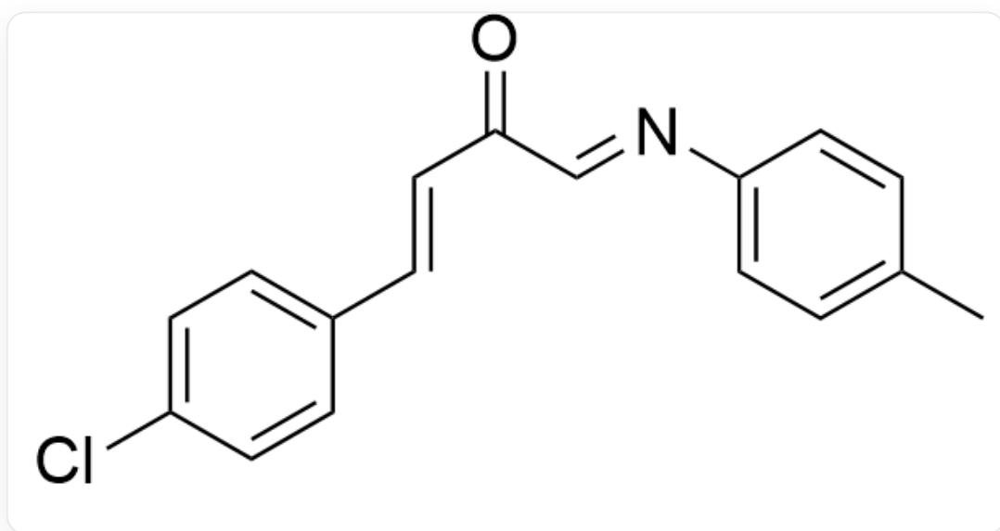  
[ \mathrm{O} = \mathrm{C} / \mathrm{C} = \mathrm{N} / \mathrm{C}1 = \mathrm{CC} = \mathrm{C}(\mathrm{C})\mathrm{C} = \mathrm{C}1) / \mathrm{C} = \mathrm{C} / \mathrm{C}2 = \mathrm{CC} = \mathrm{C}(\mathrm{Cl})\mathrm{C} = \mathrm{C}2 ]

# CHECKPOINT

1 PTS

$$
\mathrm {O} = \mathrm {C} / \mathrm {C} = \mathrm {N} / \mathrm {C} 1 = \mathrm {C C} = \mathrm {C} (\mathrm {C}) \mathrm {C} = \mathrm {C} 1) / \mathrm {C} = \mathrm {C} / \mathrm {C} 2 = \mathrm {C C} = \mathrm {C} (\mathrm {C l}) \mathrm {C} = \mathrm {C} 2
$$

If only one molecule of  $\mathrm{H}_2\mathrm{O}$  is eliminated here, byproduct  $\mathbf{B}$  will be obtained, which also matches the chemical formula given in the question.

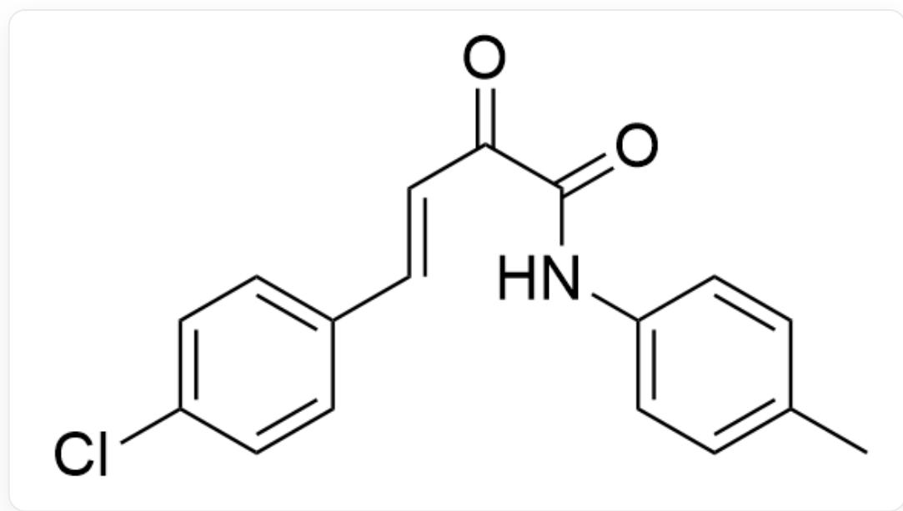  
$\mathrm{O = C(C(NC1 = CC = C(C)C = C1) = O) / C = C / C2 = CC = C(Cl)C = C2}$  ，副产物B

# CHECKPOINT

1 PTS

$$
\mathrm {O} = \mathrm {C} (\mathrm {C} (\mathrm {N C} 1 = \mathrm {C C} = \mathrm {C} (\mathrm {C}) \mathrm {C} = \mathrm {C} 1) = \mathrm {O}) / \mathrm {C} = \mathrm {C} / \mathrm {C} 2 = \mathrm {C C} = \mathrm {C} (\mathrm {C l}) \mathrm {C} = \mathrm {C} 2, \text {副 产 物} \mathbf {B}
$$

Intermediate 4 undergoes a rapid addition reaction with TMSCN to obtain intermediate 5.

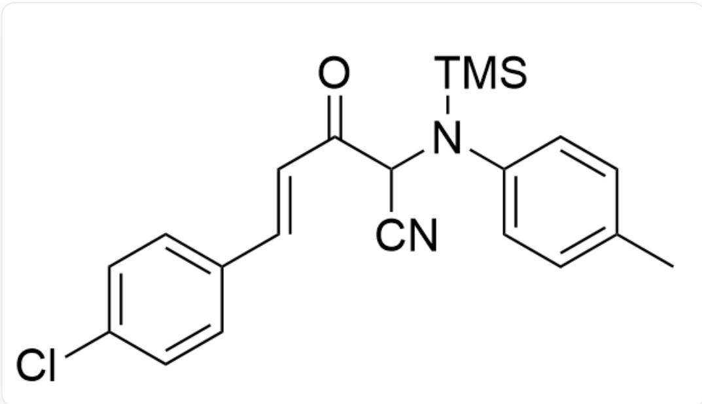  
[ \mathrm{O} = \mathrm{C}(\mathrm{C}(\mathrm{C}\# \mathrm{N})\mathrm{N}([\mathrm{Si}](\mathrm{C})(\mathrm{C})\mathrm{C})\mathrm{C}1 = \mathrm{CC} = \mathrm{C}(\mathrm{C})\mathrm{C} = \mathrm{C}1) / \mathrm{C} = \mathrm{C} / \mathrm{C}2 = \mathrm{CC} = \mathrm{C}(\mathrm{Cl})\mathrm{C} = \mathrm{C}2 ]

# CHECKPOINT

1 PTS

$$
O = C (C (C \# N) N ([ S i ] (C) (C) C) C 1 = C C = C (C) C = C 1) / C = C / C 2 = C C = C (C l) C = C 2
$$

This intermediate 5 is further deprived of 1 electron by oxygen to form a free radical intermediate 6.

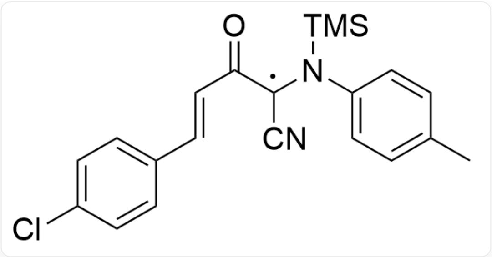

$\mathrm{O = C(C([X])(C\#N)N([Si](C)(C)C)C1 = CC = C(C)C = C1) / C = C / C2 = CC = C(Cl)C = C2,X}$  为单电子

# CHECKPOINT

1 PTS

$\mathrm{O = C(C([X])(C\#N)N([Si](C)(C)C)C1 = CC = C(C)C = C1) / C = C / C2 = CC = C(Cl)C = C2,X}$  为单电子

This free radical intermediate combines with the superoxide anion radical to obtain intermediate 7.

$\mathrm{O = C(C(N([Si](C)(C)C)C1 = CC = C(C)C = C1)(O[O - ])C\# N) / C = C / C2 = CC = C(Cl)C = C2}$

# CHECKPOINT

1 PTS

$$
O = C (C (N ([ S i ] (C) (C) C) C 1 = C C = C (C) C = C 1) (O [ O - ]) C \# N) / C = C / C 2 = C C = C (C l) C = C 2
$$

Finally, a molecule of TMS-superoxide anion is removed to obtain the main product A.

  
$O = C / C(C\# N) = N / C1 = CC = C(C)C = C1) / C = C / C2 = CC = C(Cl)C = C2$  ，主产物A

# CHECKPOINT

1 PTS

[ \mathrm{O} = \mathrm{C} / (\mathrm{C}(\mathrm{C}\# \mathrm{N}) = \mathrm{N} / \mathrm{C}1 = \mathrm{CC} = \mathrm{C}(\mathrm{C})\mathrm{C} = \mathrm{C}1) / \mathrm{C} = \mathrm{C} / \mathrm{C}2 = \mathrm{CC} = \mathrm{C}(\mathrm{Cl})\mathrm{C} = \mathrm{C}2, \text{主产物 }\mathrm{A} ]