# 题目

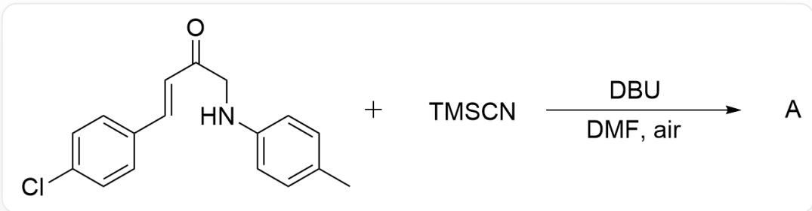  
$\mathrm{O = C(CNC1 = CC = C(C)C = C1) / C = C / C2 = CC = C(Cl)C = C2.C[Si](C)(C\# N)C > [DBU],[DMF] > [A],A}$  为反应产物，反应在空气中进行

已知该反应包含自由基转化过程。请尝试预测该反应的主产物 A 以及不含氰基的副产物 B（分子式： $\mathrm{C_{17}H_{14}ClNO_2}$ ）的结构式

A. 其他选项均不正确

B.

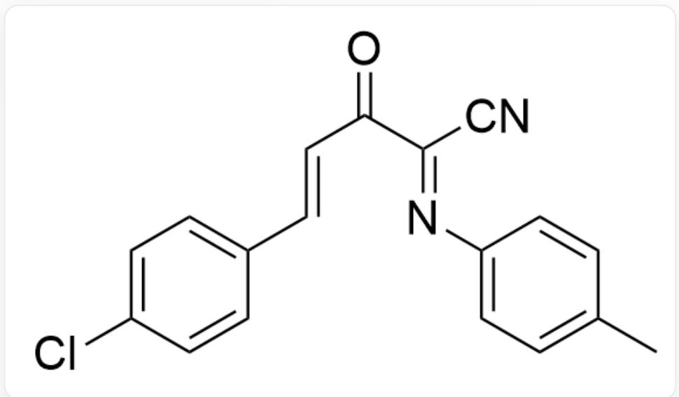  
$\mathrm{O = C / C(C\#N) = N / C1 = CC = C(C)C = C1) / C = C / C2 = CC = C(Cl)C = C2}$  ，主产物A

主产物A

[ \mathrm{O} = \mathrm{C}(\mathrm{C}(\mathrm{NC}1 = \mathrm{CC} = \mathrm{C}(\mathrm{C})\mathrm{C} = \mathrm{C}1) = \mathrm{O}) / \mathrm{C} = \mathrm{C} / \mathrm{C}2 = \mathrm{CC} = \mathrm{C}(\mathrm{Cl})\mathrm{C} = \mathrm{C}2, \text{副产物}\mathbf{B} ]

副产物B

C.

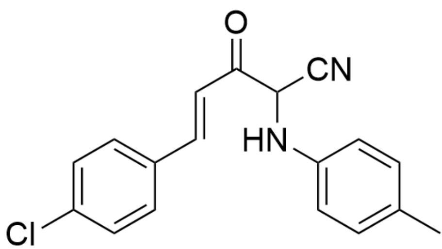

$\mathrm{O = C(C(C\#N)NC1 = CC = C(C)C = C1) / C = C / C2 = CC = C(Cl)C = C2}$  ，主产物A

主产物A

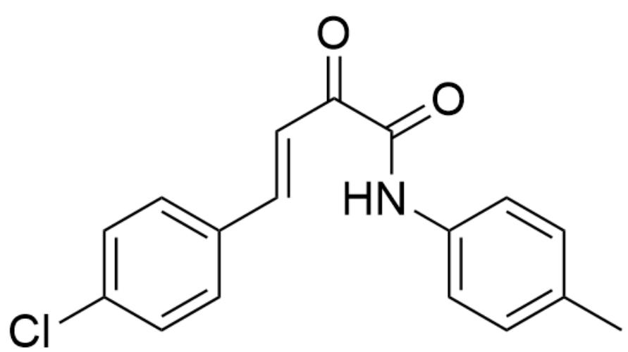  
D.

[ \mathrm{O} = \mathrm{C}(\mathrm{C}(\mathrm{NC}1 = \mathrm{CC} = \mathrm{C}(\mathrm{C})\mathrm{C} = \mathrm{C}1) = \mathrm{O}) / \mathrm{C} = \mathrm{C} / \mathrm{C}2 = \mathrm{CC} = \mathrm{C}(\mathrm{Cl})\mathrm{C} = \mathrm{C}2, \text{副产物}\mathbf{B} ]

副产物B

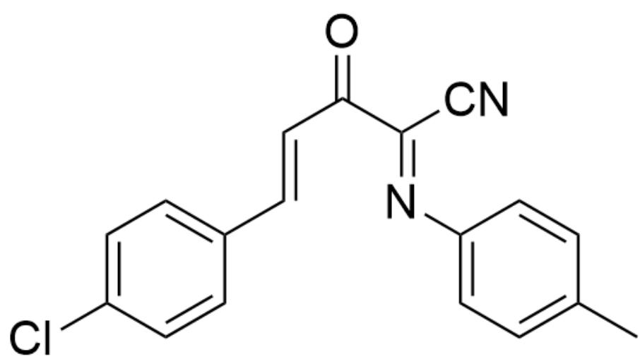

$\mathrm{O = C / (C(C\#N) = N / C1 = CC = C(C)C = C1) / C = C / C2 = CC = C(Cl)C = C2}$  ，主产物A

主产物A

$\mathrm{O = C(C(N(O1)C2 = CC = C(C)C = C2) = O)C = C1C3 = CC = C(Cl)C = C3}$  ，副产物B

副产物B

E.

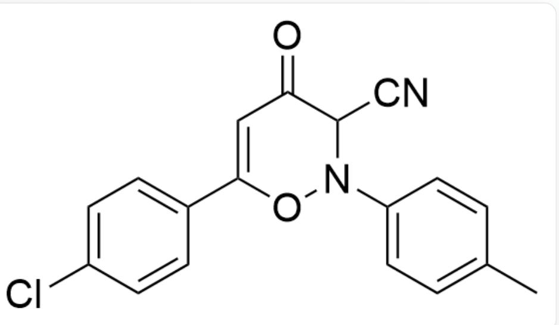

$\mathrm{O = C(C(C\#N)N(O1)C2 = CC = C(C)C = C2)C = C1C3 = CC = C(Cl)C = C3}$  ，主产物A

主产物A

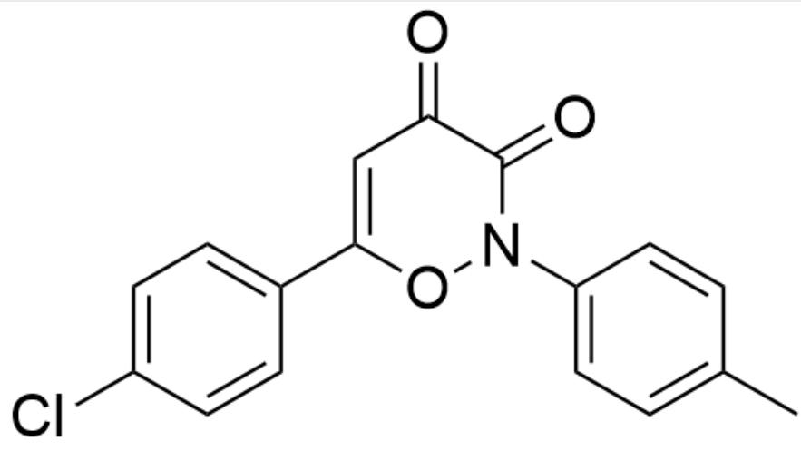  
F.

$\mathrm{O = C(C(N(O1)C2 = CC = C(C)C = C2) = O)C = C1C3 = CC = C(Cl)C = C3}$  ，副产物B

副产物B

$\mathrm{O} = \mathrm{C} / (\mathrm{C}(\mathrm{C}\# \mathrm{N}) = \mathrm{N} / \mathrm{C}1 = \mathrm{CC} = \mathrm{C}(\mathrm{C})\mathrm{C} = \mathrm{C}1) / \mathrm{C} = \mathrm{C} / \mathrm{C}2 = \mathrm{CC} = \mathrm{C}(\mathrm{Cl})\mathrm{C} = \mathrm{C}2$  ，主产物A

主产物A

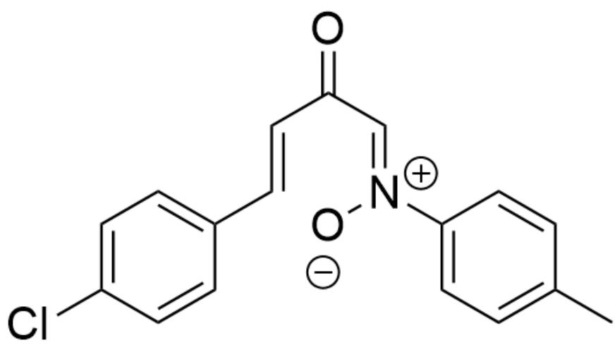  
G.

[ \mathrm{O} = \mathrm{C} / (\mathrm{C} = [\mathrm{N} + ]([\mathrm{O} - ]) / \mathrm{C}1 = \mathrm{CC} = \mathrm{C}(\mathrm{C})\mathrm{C} = \mathrm{C}1) / \mathrm{C} = \mathrm{C} / \mathrm{C}2 = \mathrm{CC} = \mathrm{C}(\mathrm{Cl})\mathrm{C} = \mathrm{C}2, \text{副产物}\mathbf{B} ]

副产物B

$O = C(C(C\# N)NC1 = CC = C(C)C = C1) / C = C / C2 = CC = C(Cl)C = C2$  ，主产物A

主产物A

$\mathrm{O = C(C(N(O1)C2 = CC = C(C)C = C2) = O)C = C1C3 = CC = C(Cl)C = C3}$  ，副产物B

副产物B

# 答案

正确答案: B

# 详细解析

根据副产物的化学式可知生成副产物的过程中发生了氧化，碳数不变而多了一个氧，结合反应条件可知氧供体只能是来自空气的氧气，而氧气便可作为自由基引发剂引发题干所说的自由基转化过程。

CHECKPOINT

1 PTS

氧气作为自由基引发剂

首先底物在碱DBU的作用下去质子形成中间体1

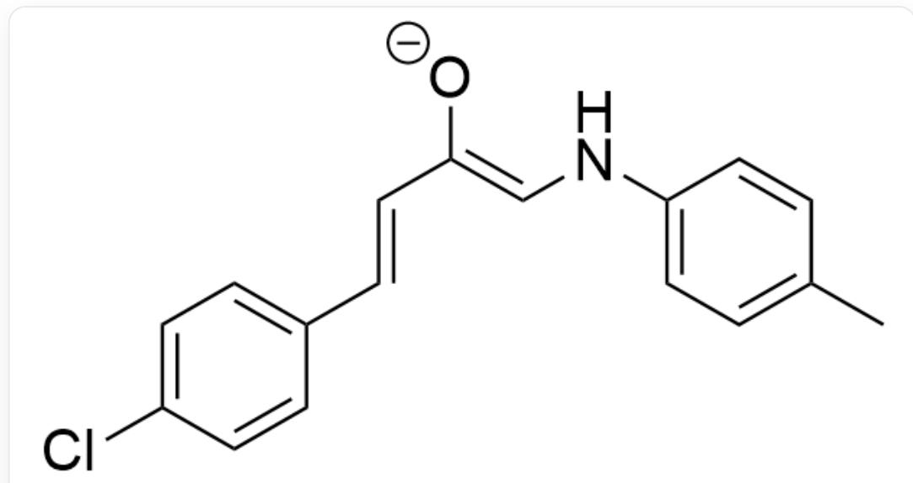

$$
[ O - ] C / / C = C / C 1 = C C = C (C l) C = C 1) = C \backslash N C 2 = C C = C (C) C = C 2
$$

# CHECKPOINT

1 PTS

$$
[ O - ] C (/ C = C / C 1 = C C = C (C l) C = C 1) = C \backslash N C 2 = C C = C (C) C = C 2
$$

随后被氧气夺取一个电子形成超氧阴离子自由基和自由基中间体2

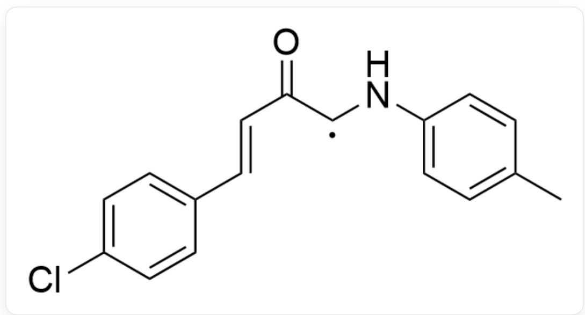  
$\mathrm{O = C(C([X])NC1 = CC = C(C)C = C1) / C = C / C2 = CC = C(Cl)C = C2,X}$  是单电子

# CHECKPOINT

1 PTS

$$
\mathrm {O} = \mathrm {C} (\mathrm {C} ([ \mathrm {X} ]) \mathrm {N C 1} = \mathrm {C C} = \mathrm {C} (\mathrm {C}) \mathrm {C} = \mathrm {C 1}) / \mathrm {C} = \mathrm {C} / \mathrm {C 2} = \mathrm {C C} = \mathrm {C} (\mathrm {C l}) \mathrm {C} = \mathrm {C 2}, \mathrm {X} \text {是 单 电 子}
$$

该自由基与超氧阴离子自由基结合得到中间体3

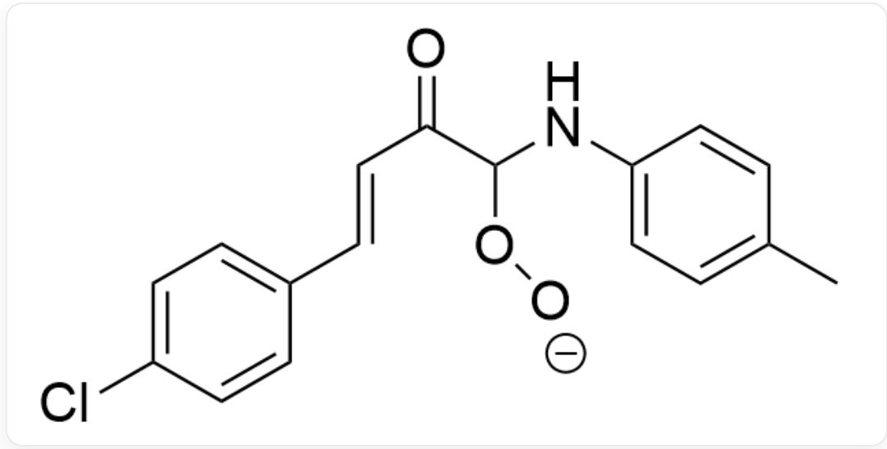  
[ \mathrm{O} = \mathrm{C}(\mathrm{C}(\mathrm{O}[\mathrm{O} - ])\mathrm{NC1} = \mathrm{CC} = \mathrm{C}(\mathrm{C})\mathrm{C} = \mathrm{C}1) / \mathrm{C} = \mathrm{C} / \mathrm{C}2 = \mathrm{CC} = \mathrm{C}(\mathrm{Cl})\mathrm{C} = \mathrm{C}2 ]

# CHECKPOINT

1 PTS

$$
\mathrm {O} = \mathrm {C} (\mathrm {C} (\mathrm {O} [ \mathrm {O} - ]) \mathrm {N C 1} = \mathrm {C C} = \mathrm {C} (\mathrm {C}) \mathrm {C} = \mathrm {C 1}) / \mathrm {C} = \mathrm {C} / \mathrm {C 2} = \mathrm {C C} = \mathrm {C} (\mathrm {C l}) \mathrm {C} = \mathrm {C 2}
$$

随后发生消除反应得到中间体4

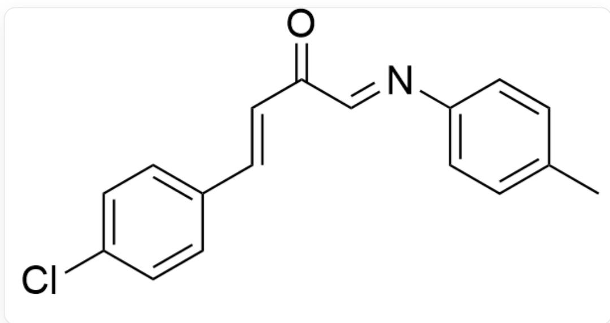  
[ \mathrm{O} = \mathrm{C} / \mathrm{C} = \mathrm{N} / \mathrm{C}1 = \mathrm{CC} = \mathrm{C}(\mathrm{C})\mathrm{C} = \mathrm{C}1) / \mathrm{C} = \mathrm{C} / \mathrm{C}2 = \mathrm{CC} = \mathrm{C}(\mathrm{Cl})\mathrm{C} = \mathrm{C}2 ]

# CHECKPOINT

1 PTS

$$
\mathrm {O} = \mathrm {C} / \mathrm {C} = \mathrm {N} / \mathrm {C} 1 = \mathrm {C C} = \mathrm {C} (\mathrm {C}) \mathrm {C} = \mathrm {C} 1) / \mathrm {C} = \mathrm {C} / \mathrm {C} 2 = \mathrm {C C} = \mathrm {C} (\mathrm {C l}) \mathrm {C} = \mathrm {C} 2
$$

此处如果只消除1分子  $\mathrm{H}_{2} \mathrm{O}$  的话，将得到副产物  $\mathrm{B}$ ，这也符合题目给出的化学式。

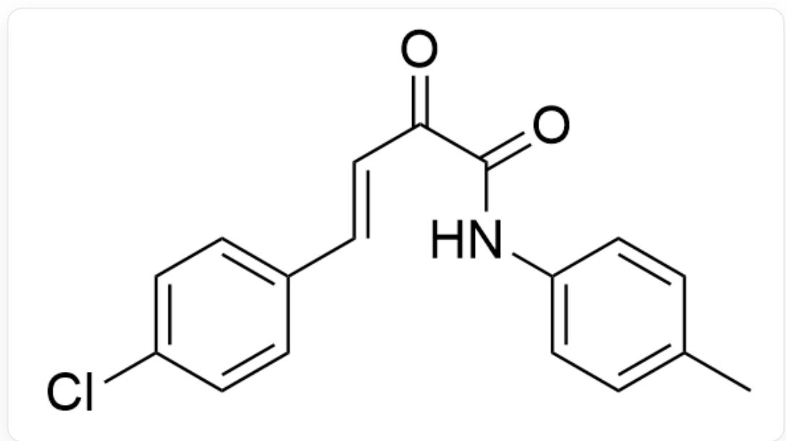  
$\mathrm{O = C(C(NC1 = CC = C(C)C = C1) = O) / C = C / C2 = CC = C(Cl)C = C2}$  ，副产物B

# CHECKPOINT

1 PTS

$$
\mathrm {O} = \mathrm {C} (\mathrm {C} (\mathrm {N C} 1 = \mathrm {C C} = \mathrm {C} (\mathrm {C}) \mathrm {C} = \mathrm {C} 1) = \mathrm {O}) / \mathrm {C} = \mathrm {C} / \mathrm {C} 2 = \mathrm {C C} = \mathrm {C} (\mathrm {C l}) \mathrm {C} = \mathrm {C} 2, \text {副 产 物} \\ \mathbb {\backslash m a t h b f} \{\mathrm {B} \}
$$

中间体4与TMSCN发生快速的加成反应得到中间体5

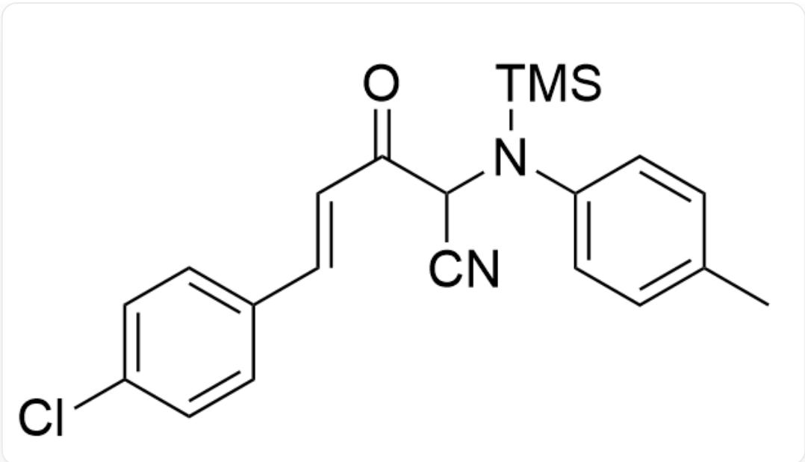  
[ \mathrm{O} = \mathrm{C}(\mathrm{C}(\mathrm{C}\# \mathrm{N})\mathrm{N}([\mathrm{Si}](\mathrm{C})(\mathrm{C})\mathrm{C})\mathrm{C}1 = \mathrm{CC} = \mathrm{C}(\mathrm{C})\mathrm{C} = \mathrm{C}1) / \mathrm{C} = \mathrm{C} / \mathrm{C}2 = \mathrm{CC} = \mathrm{C}(\mathrm{Cl})\mathrm{C} = \mathrm{C}2 ]

# CHECKPOINT

1 PTS

$$
O = C (C (C \# N) N ([ S i ] (C) (C) C) C 1 = C C = C (C) C = C 1) / C = C / C 2 = C C = C (C l) C = C 2
$$

该中间体5进一步被氧气夺去1个电子形成自由基中间体6

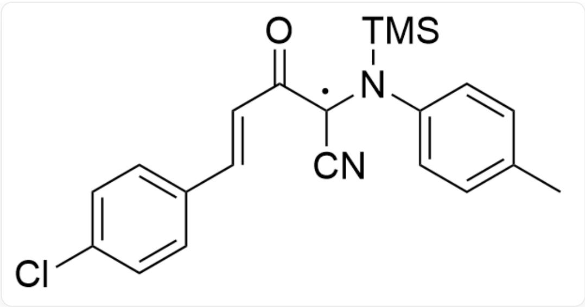

$O = C(C([X])(C\# N)N([Si](C)(C)C)C1 = CC = C(C)C = C1) / C = C / C2 = CC = C(Cl)C = C2,X$  为单电子

# CHECKPOINT

1 PTS

$\mathrm{O = C(C([X])(C\#N)N([Si](C)(C)C)C1 = CC = C(C)C = C1) / C = C / C2 = CC = C(Cl)C = C2,X}$  为单电子

该自由基中间体与超氧阴离子自由基结合得到中间体7

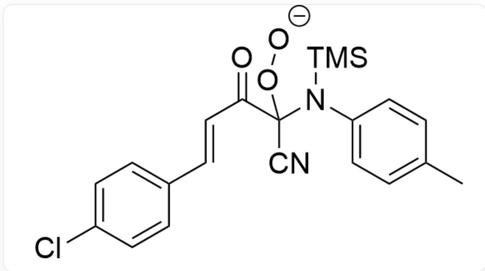

$\mathrm{O = C(C(N([Si](C)(C)C)C1 = CC = C(C)C = C1)(O[O - ])C\# N) / C = C / C2 = CC = C(Cl)C = C2}$

# CHECKPOINT

1 PTS

$$
O = C (C (N ([ S i ] (C) (C) C) C 1 = C C = C (C) C = C 1) (O [ O - ]) C \# N) / C = C / C 2 = C C = C (C l) C = C 2
$$

最后脱去一分子TMS- 超氧阴离子得到主产物A

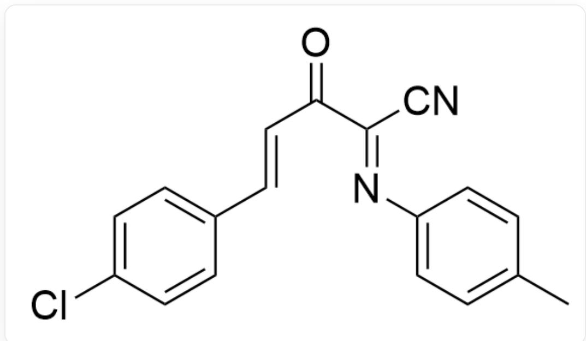  
$O = C(/C(C\# N) = N / C1 = CC = C(C)C = C1) / C = C / C2 = CC = C(Cl)C = C2$  ，主产物A

# CHECKPOINT

1 PTS

$\mathrm{O = C / C(C\#N) = N / C1 = CC = C(C)C = C1) / C = C / C2 = CC = C(Cl)C = C2}$  ，主产物A