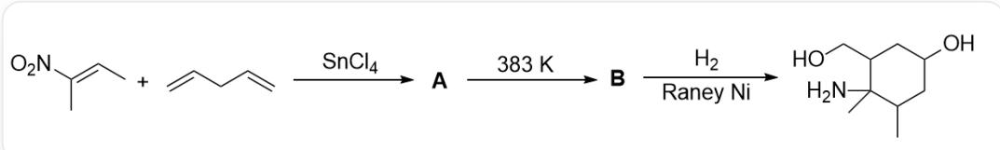
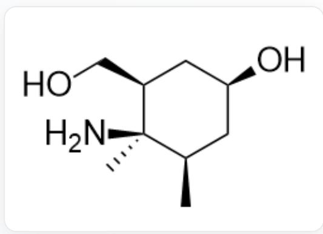
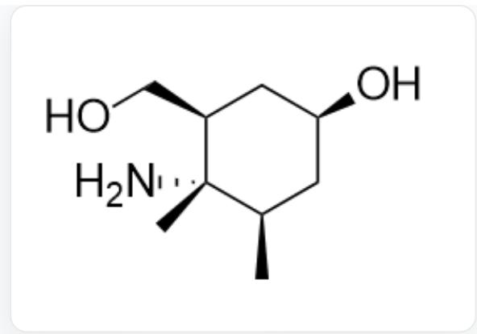
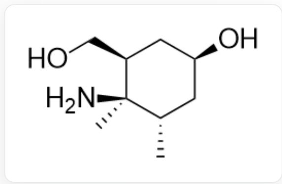
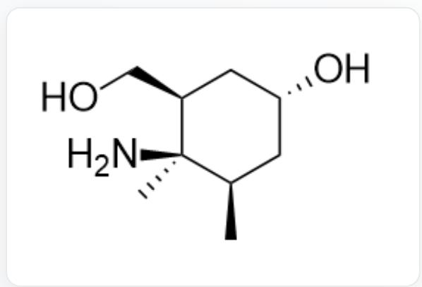
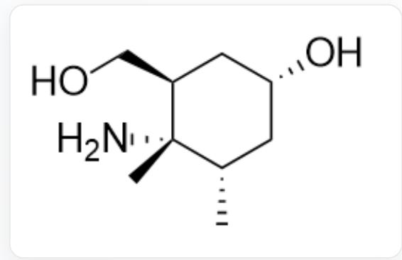
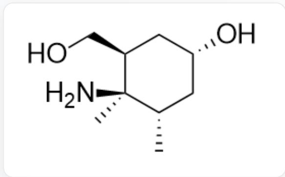

# Question

The image describes a one-pot organic cascade reaction. The substrates are C/C([N+]([O-])=O=C\C and C=CCC=C, reacting under the action of SnCl $_4$  to obtain A; A yields B at 383 K; B yields the final product OC1CC(C)C(N)(C)C(CO)C1 under H $_2$ , RaneyNi conditions.

In the reaction above, it is known that the process of generating the final product from  $\mathbf{B}$  does not involve changes in carbon-carbon bond formation.  $\mathbf{A}$  is the thermodynamically more stable product.

Which of the following options reflects the correct stereochemistry of the final product?

A. All other options are incorrect  
B.

O[C@H]1C[C@@H](C)[C@](N)(C)[C@@H](CO)C1

C.

  
D.

O[C@H]1C[C@@H](C)[C@@](N)(C)[C@@H](CO)C1

  
E.

O[C@H]1C[C@H](C)[C@](N)(C)[C@@H](CO)C1

O[C@@H]1C[C@@H](C)[C@](N)(C)[C@@H](CO)C1

F.  
  
O[C@@H]1C[C@H](C)[C@@](N)(C)[C@@H](CO)C1

G.  
  
O[C@@H]1C[C@H](C)[C@](N)(C)[C@@H](CO)C1

# Answer

Correct Answer: B

# Detailed Explanation

A  
  
A structure is [O-][N+]1=C(C)C(C)CC(CC=C)O1; the structure of B is CC1(C(CO2)C3)N2OC3CC1([H])C; the product structure is O[C@H]1C[C@@H](C)[C@](N)(C)[C@@H](CO)C1.

  
B

The substrate is obviously a dienophile and a diene, so it undergoes a D-A cycloaddition reaction under the catalysis of Lewis acid  $\mathrm{SnCl}_4$ , so the structure of A is  $[\mathrm{O}-][\mathrm{N}+]1=\mathrm{C}(\mathrm{C})\mathrm{C}(\mathrm{C})\mathrm{CC}(\mathrm{CC}=\mathrm{C})\mathrm{O}1$ .

# CHECKPOINT

1 PTS

The substrate undergoes a D-A cycloaddition reaction under the catalysis of Lewis acid  $\mathrm{SnCl}_4$

# CHECKPOINT

1 PTS

The structure of  $\mathbf{A}$  is [O-][N+]1=C(C)C(C)CC(CC=C)O1

A is heated to  $383\mathrm{K}$  and converted to B. The process of generating the final product from B does not involve changes in carbon-atom bonding, so it can only be the breaking of the  $\mathrm{N - O}$  bond; therefore, without considering stereochemistry, the structure of B is such that the nitrogen atom of the final product is connected to two hydroxyl groups, forming a bridged ring structure with the structural formula CC1(C(CO2)C3)N2OC3CC1([H])C.

# CHECKPOINT

1 PTS

The process of generating the final product from  $\mathbf{B}$  is the breaking of the  $\mathrm{N - O}$  bond

# CHECKPOINT

1 PTS

The structure of  $\mathbf{B}$  is such that the nitrogen atom of the final product is connected to two hydroxyl groups, forming a bridged ring structure

# CHECKPOINT

1 PTS

The structural formula of  $\mathbf{B}$  is CC1(C(CO2)C3)N2OC3CC1([H])C

From this, it can be judged that the reaction of  $\mathbf{A}$  heating to  $383\mathrm{K}$  to convert to  $\mathbf{B}$  is an intramolecular  $[3 + 2]$  cycloaddition reaction; the alkene in  $\mathbf{A}$  undergoes  $[3 + 2]$  cycloaddition with the  $C = N^{+} - O^{-}$  structure.

# CHECKPOINT

1 PTS

The reaction of  $\mathbf{A}$  converting to  $\mathbf{B}$  is an intramolecular  $[3 + 2]$  cycloaddition reaction

Considering stereochemistry, after the  $[3 + 2]$  cycloaddition, when the bridged ring structure breaks the N - O bond, the generated hydroxymethyl and hydroxyl group were originally on the same side of the bridged ring, so they are in the cis configuration in the final product;

# CHECKPOINT

2 PTS

Hydroxymethyl and hydroxyl are in the cis configuration

A is the thermodynamic product. Due to steric hindrance effects, the allyl and methyl groups in A should be in the trans conformation. After the  $[3 + 2]$  cycloaddition, the two methyl groups are therefore in the trans conformation; in the final product, they are also in the trans conformation;

# CHECKPOINT

1 PTS

In the thermodynamic product  $\mathbf{A}$ , the allyl and methyl groups should be in the trans conformation

# CHECKPOINT

2 PTS

The two methyl groups are in the trans conformation

The amino group and the hydroxymethyl group jointly form a five-membered ring of the bridged ring, located on the same side of the cyclohexane ring, so they should be in cis form in the final product.

# CHECKPOINT

2 PTS

The amino group and hydroxymethyl group are in the cis configuration

The product structure that satisfies these three stereochemical requirements is O[C@H]1C[C@@H](C)[C@](N)(C) [C@@H](CO)C1, so option B is correct.

# CHECKPOINT

1 PTS

The product structure is O[C@H]1C[C@@H](C)[C@](N)(C)[C@@H](CO)C1