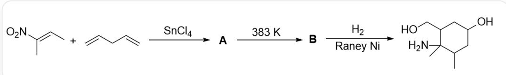
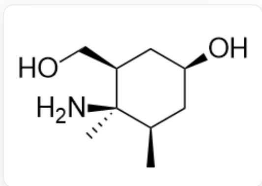
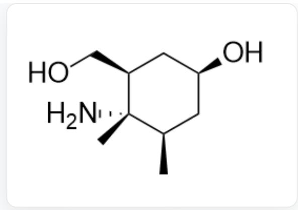
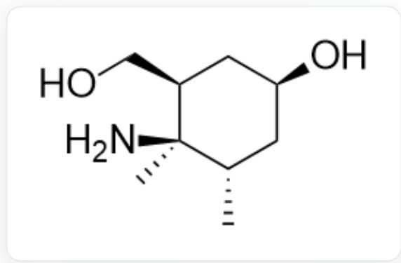
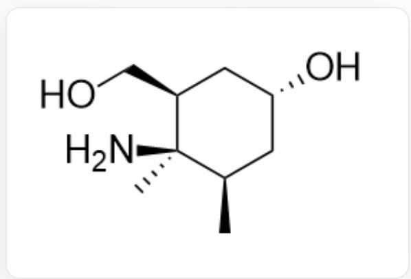
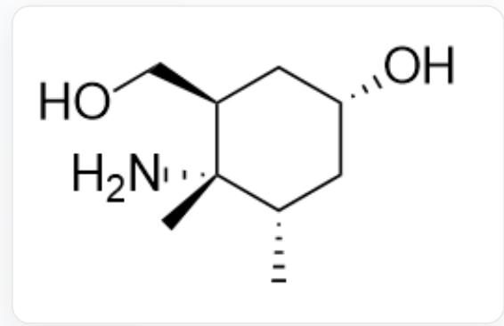
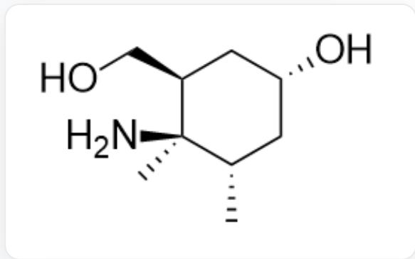
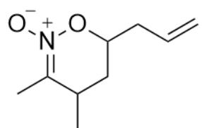
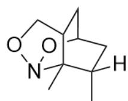
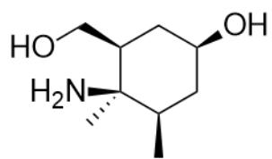

# 题目

该图片描述了一步有机串联反应。底物为C/C([N+]([O-]=O)=C\C和C=CCC=C，在  $\mathrm{SnCl}_4$  作用下反应得到A；A在383K下得到B；B在  $\mathrm{H}_{2}$  ,RaneyNi条件下得到最终产物OC1CC(C)C(N)(C)C(CO)C1。

上图的反应中，已知由  $\mathbf{B}$  生成最终产物的过程不涉及碳原子成键的变化。A 为热力学上更稳定的产物。

下列选项中，能反映最终产物正确的立体化学的选项为：

A. 其他选项均不正确

B.

O[C@H]1C[C@@H](C)[C@](N)(C)[C@@H](CO)C1

C.

  
D.

O[C@H]1C[C@@H](C)[C@@](N)(C)[C@@H](CO)C1

  
E.

O[C@H]1C[C@H](C)[C@](N)(C)[C@@H](CO)C1

O[C@@H]1C[C@@H](C)[C@](N)(C)[C@@H](CO)C1

F.  
  
O[C@@H]1C[C@H](C)[C@@](N)(C)[C@@H](CO)C1

G.  
  
O[C@@H]1C[C@H](C)[C@](N)(C)[C@@H](CO)C1

# 答案

正确答案: B

# 详细解析

  
A

  
B

A结构为  $[O-][N+]1 = C(C)C(C)CC(CC=C)O1$ ；B的结构为CC1(C(CO2)C3)N2OC3CC1([H])C；产物结构为 O[C@H]1C[C@@H](C)[C@](N)(C)[C@@H](CO)C1。

底物很明显为亲双烯体和双烯体，因而在lewis酸  $\mathrm{SnCl}_4$  催化下发生D-A环加成反应，故A结构为[O-][N+]1=C(C)C(C)CC(CC=C)O1。

# CHECKPOINT

1 PTS

底物在lewis酸  $\mathrm{SnCl}_4$  催化下发生D-A环加成反应

# CHECKPOINT

1 PTS

A 结构为  $[O-][N+]1 = C(C)C(C)CC(CC = C)O1$

A加热至  $383 \mathrm{~K}$  转化为  $\mathbf{B}$ , 由  $\mathbf{B}$  生成最终产物的过程不涉及碳原子成键的变化, 因此只能为  $\mathrm{N}-\mathrm{O}$  键的断裂; 从而不考虑立体化学,  $\mathbf{B}$  的结构为最终产物的氮原子与两个羟基相连, 为桥环结构, 结构式为 CC1(C(CO2)C3)N2OC3CC1([H])C。

# CHECKPOINT

1 PTS

B生成最终产物的过程为  $\mathrm{N} - \mathrm{O}$  键的断裂

# CHECKPOINT

1 PTS

B的结构为最终产物的氮原子与两个羟基相连，为桥环结构

# CHECKPOINT

1 PTS

B结构式为CC1(C(CO2)C3)N2OC3CC1([H])C

由此可判断，A加热至  $383\mathrm{K}$  转化为B的反应为分子内的  $[3 + 2]$  环加成反应；A中的烯烃与  $C = N^{+} - O^{-}$ 结构进行  $[3 + 2]$  环加成。

# CHECKPOINT

1 PTS

A转化为B的反应为分子内的  $[3 + 2]$  环加成反应

考虑立体化学，[3+2]环加成后的桥环结构断裂N-O键后，生成的羟甲基与羟基原本位于桥环的同一侧，因此最终产物中处于顺式；

# CHECKPOINT

2 PTS

羟甲基与羟基处于顺式

A 为热力学产物，由于空间位阻效应，A 中烯丙基和甲基应当处于反式构象。在  $[3 + 2]$  环加成后，两个甲基因此处于反式构象；最终产物中，同样处于反式构象；

# CHECKPOINT

1 PTS

热力学产物A中烯丙基和甲基应当处于反式构象

# CHECKPOINT

2 PTS

两个甲基处于反式构象

氨基与羟甲基共同构成桥环的五元环，位于环己环的同一侧，因此最终产物中应当处于顺式。

# CHECKPOINT

2 PTS

氨基与羟甲基处于顺式

满足这三个立体化学要求的产物结构为O[C@H]1C[C@@H](C)[C@](N)(C)[C@@H](CO)C1，因此选项B正确。

# CHECKPOINT

1 PTS

产物结构为O[C@H]1C[C@@H](C)[C@](N)(C)[C@@H](CO)C1