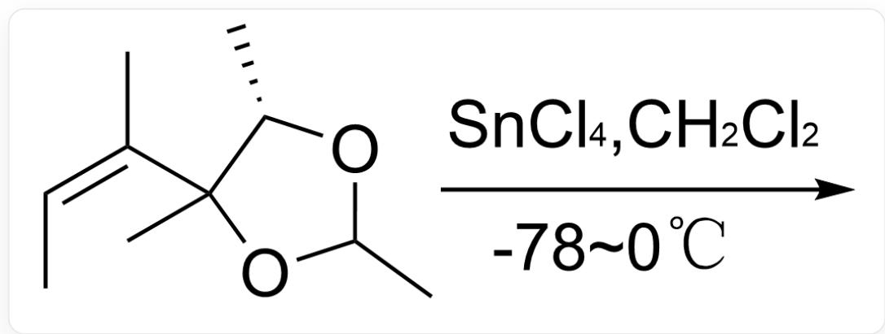
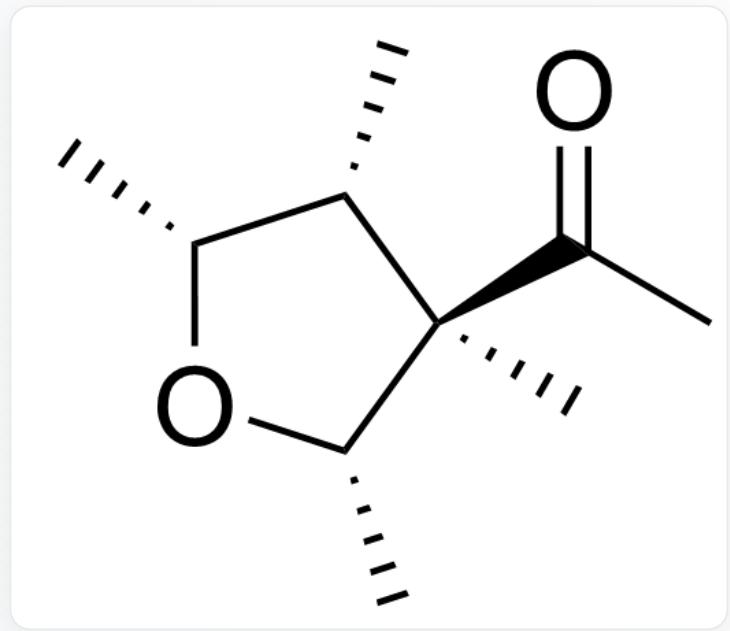
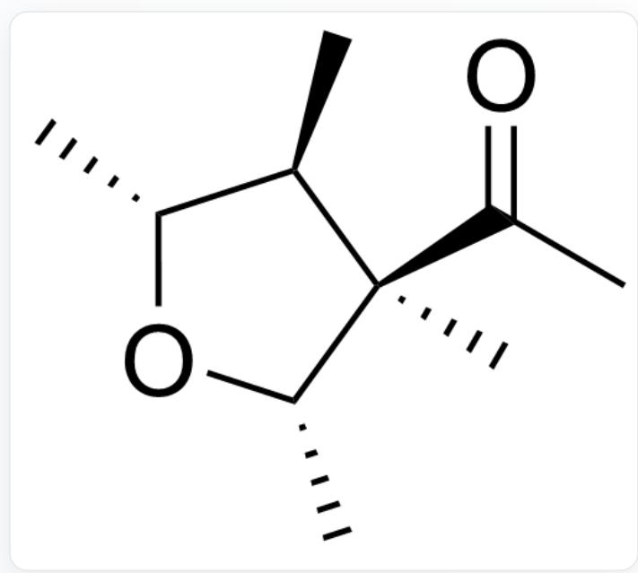
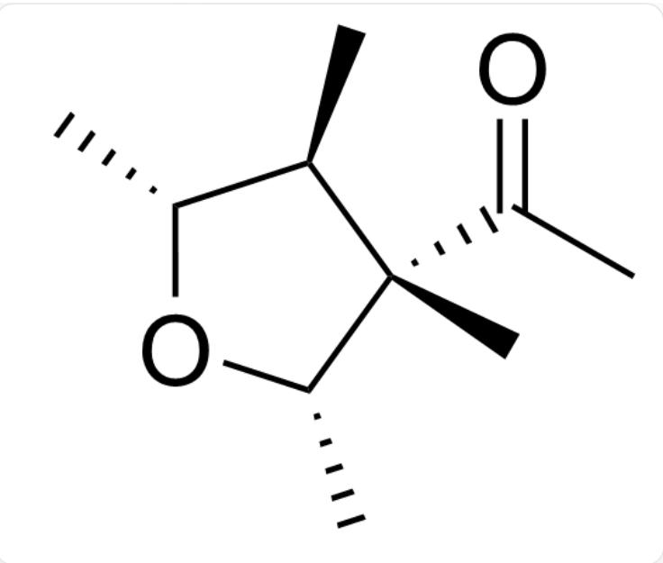
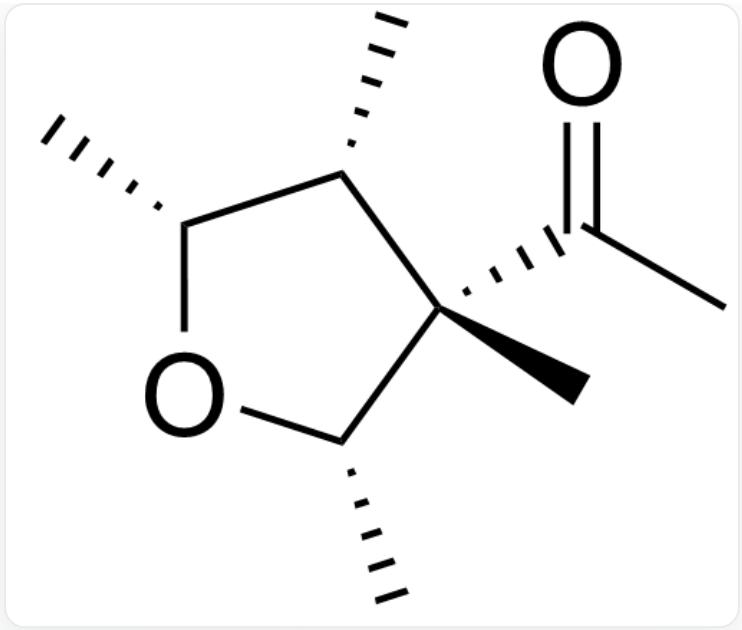
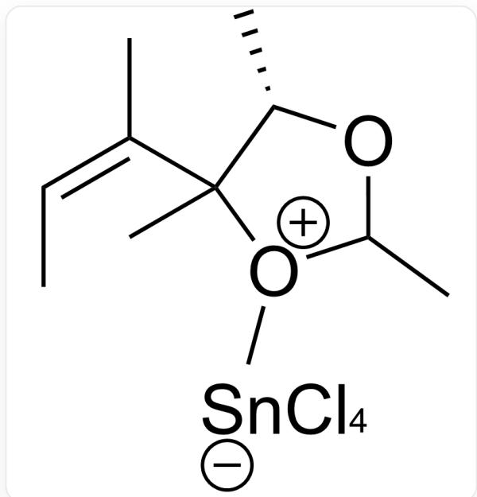
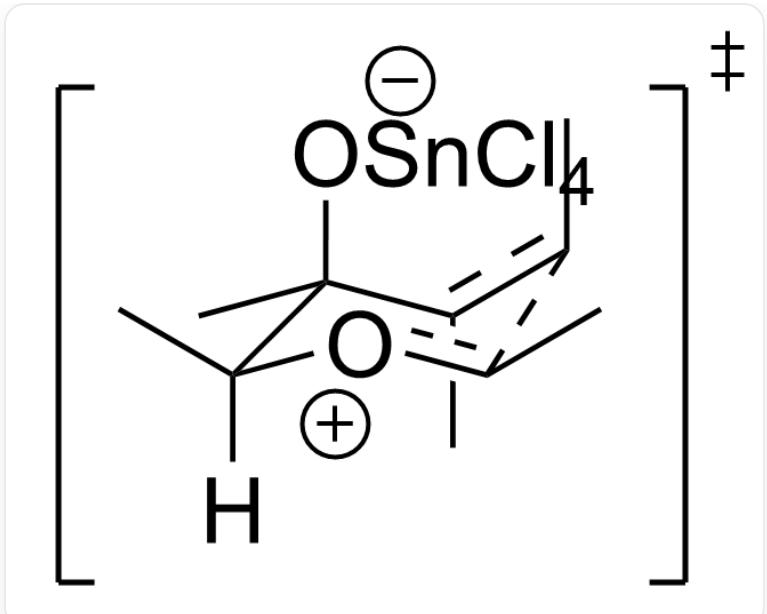
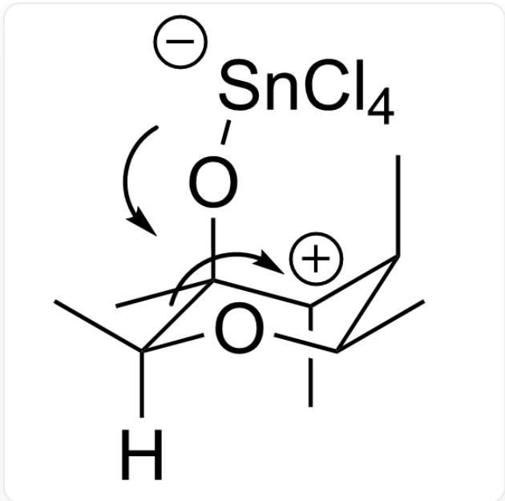

# Question

The substrate of the following organic reaction undergoes a transformation under Lewis acid catalysis, selectively yielding another five-membered ring product:

A.  
  
C/C=C(C1([C@@H](OC(O1)C)C)C)/C, the substrate reacts under  $-78^{\circ}\mathrm{C} \sim 0^{\circ}\mathrm{C}$  conditions in dichloromethane with  $SnCl_4$  as the catalyst

The options provide several possible product structures along with their corresponding absolute configurations. Select the correct one.

  
C[C@H]1[C@H](O[C@H]([C@@]1(C(C)=O)C)C

Carbon at position 1 on the five-membered ring is S, carbon at position 2 is R, carbon at position 3 is R, and carbon at position 4 is R.

B.  
C.  
  
C[C@@H]1[C@H](O[C@H]([C@@]1(C(C)=O)C)C

The carbon at position 1 on the five-membered ring is S, the carbon at position 2 is R, the carbon at position 3 is S, and the carbon at position 4 is R

  
C[C@@H]1[C@H](O[C@H]([C@]1(C(C)=O)C)C

The carbon at position 1 on the five-membered ring is S, the carbon at position 2 is S, the carbon at position 3 is S, and the carbon at position 4 is R.

  
D.  
C[C@H]1[C@H](O[C@H]([C@]1(C(C)=O)C)C

The carbon at position 1 on the five-membered ring is S, the carbon at position 2 is S, the carbon at position 3 is R, and the carbon at position 4 is R.

E.  
  
C[C@H]1[C@H](O[C@H]([C@]1(C(C)=O)C)C)C

The carbon at position 1 on the five-membered ring is R, the carbon at position 2 is S, the carbon at position 3 is R, and the carbon at position 4 is R

F.  
  
C[C@H]1[C@H](O[C@H](([C@]1(C(C)=O)C)C)

The carbon at position 1 on the five-membered ring is S, the carbon at position 2 is R, the carbon at position 3 is R, and the carbon at position 4 is R.

  
G.  
C[C@H]1[C@H](O[C@H]([C@]1(C(C)=O)C)C)  
H.

The carbon at position 1 on the five-membered ring is S, the carbon at position 2 is S, the carbon at position 3 is S, and the carbon at position 4 is R.

  
C[C@H]1[C@H](O[C@H]([C@]1(C(C)=O)C)C

The carbon at position 1 on the five-membered ring is S, the carbon at position 2 is S, the carbon at position 3 is R, and the carbon at position 4 is S.

  
1.  
C[C@@H]1[C@H](O[C@H]([C@]1(C(C)=O)C)C

The carbon at position 1 on the five-membered ring is R, the carbon at position 2 is S, the carbon at position 3 is S, and the carbon at position 4 is R.

# Answer

Correct Answer: D

# Detailed Explanation

The five-membered ring of the substrate undergoes ring-opening under Lewis acid catalysis

C/C=C(C1([C@@H](OC([O+]1C)C)C)C)/C

# CHECKPOINT

1 PTS

The five-membered ring of the substrate undergoes ring-opening under Lewis acid catalysis

Through a chair-like transition state, a six-membered ring intermediate is formed via the Prins cyclization process

Cc([C@](C)(O[Sn-](Cl)(Cl)(Cl)Cl)[C@]([H])([o+]c1C)C)c1C

# CHECKPOINT

1 PTS

Through a chair-like transition state, a six-membered ring intermediate is formed via the Prins cyclization process

Finally, a five-membered ring is re-formed through a one-step pinacol rearrangement

C[C+]([C@H]1C)[C@](C)(O[Sn-](Cl)(Cl)(Cl)Cl)[C@@]([H])(O[C@@H]1C)C

# CHECKPOINT

1 PTS

Finally, a five-membered ring is re-formed through a one-step pinacol rearrangement