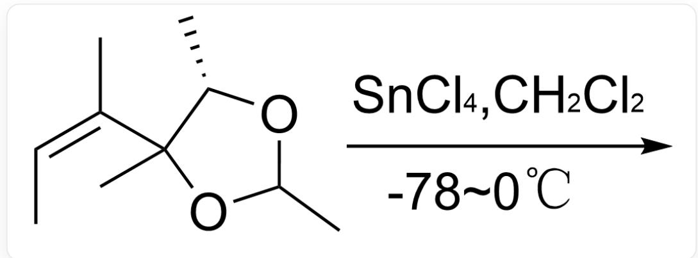
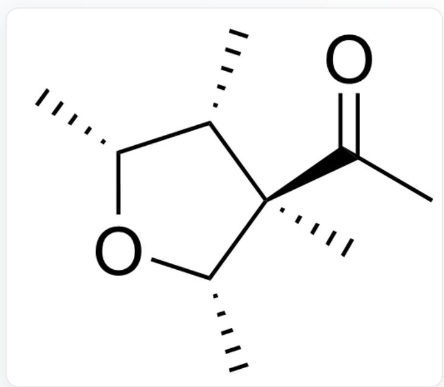
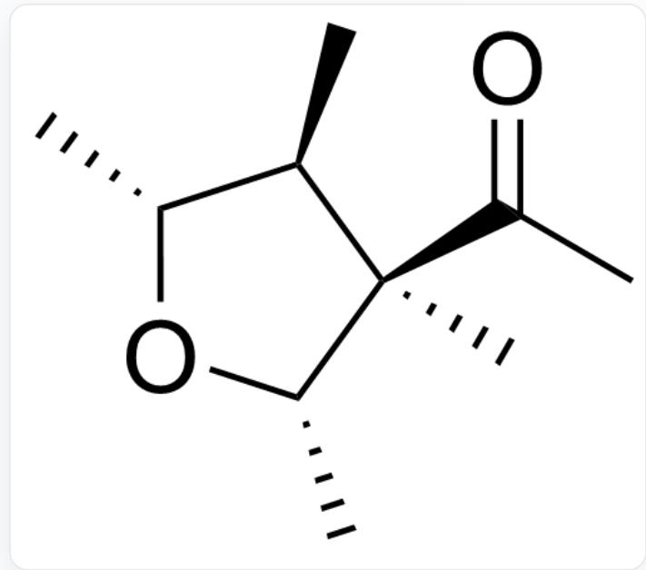
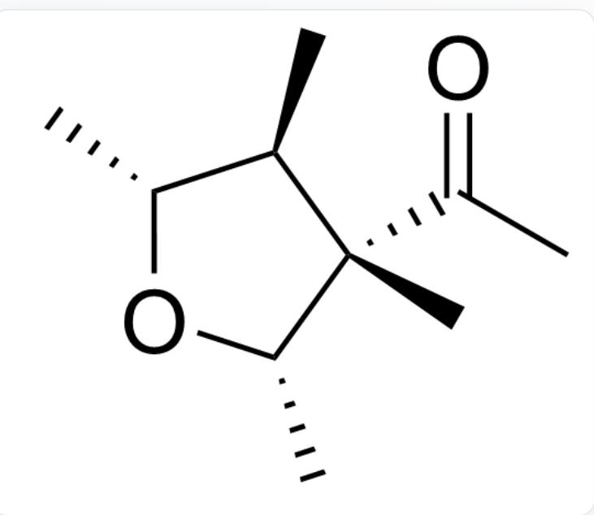
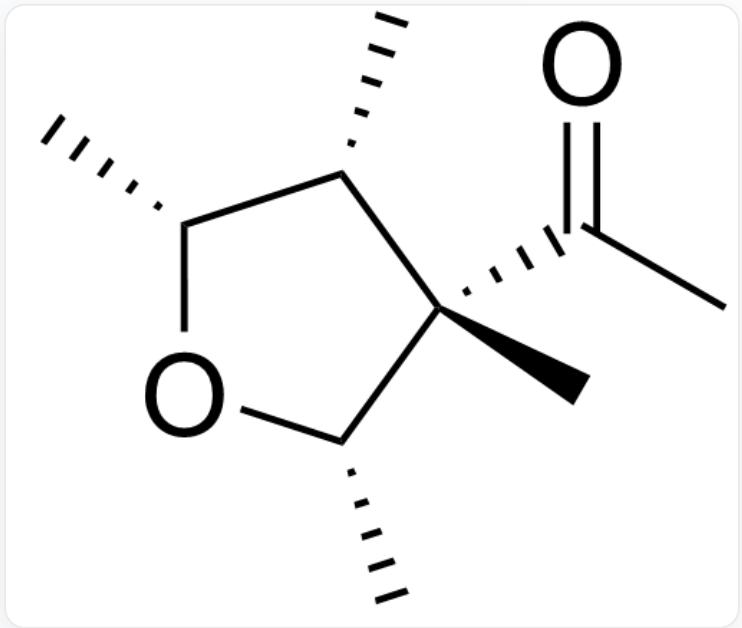
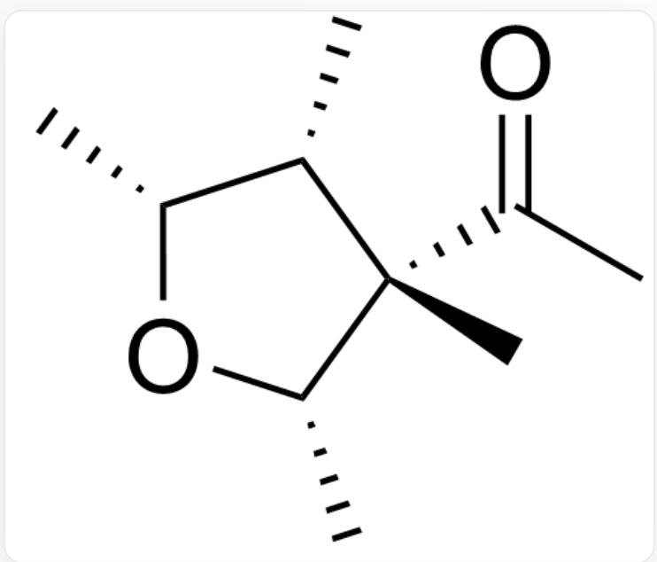
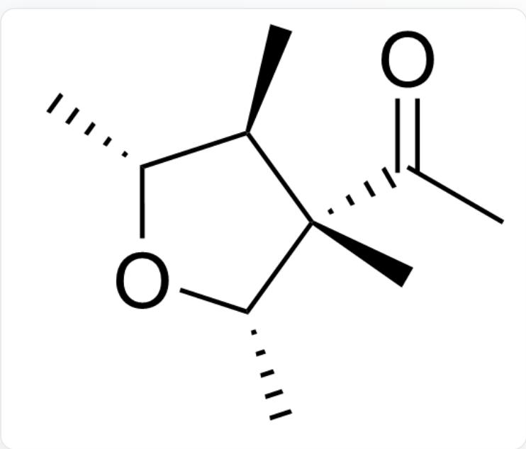
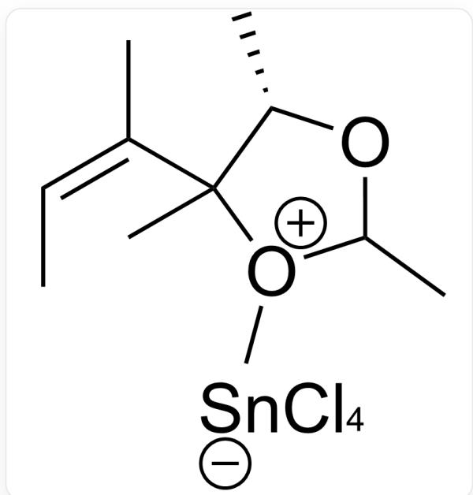
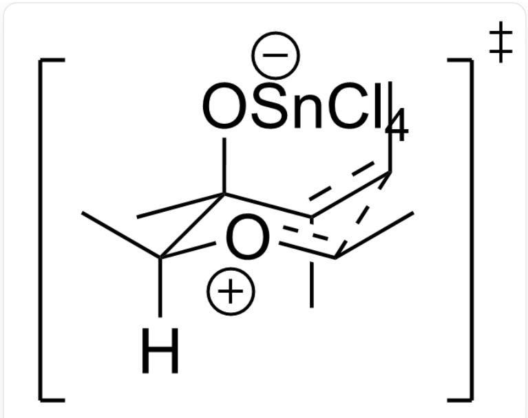

# 题目

下列有机反应的底物在路易斯酸催化下发生反应，选择性地生成另外一种五元环产物：

A.  
  
C/C=C(C1([C@@H](OC(O1)C)C)C)/C,该底物在  $-78^{\circ}\mathrm{C} \sim 0^{\circ}\mathrm{C}$  条件下，在二氯甲烷中及  $SnCl_{4}$  的催化下发生反应

选项给出了几个产物的结构和对应的绝对构型，选择正确的一项。

  
C[C@H]1[C@H](O[C@H]([C@@]1(C(C)=O)C)C

五元环上1号位的碳为S,2号位的碳为R,3号位的碳为R,4号位的碳为R

B.  
  
C[C@@H]1[C@H](O[C@H]([C@@]1(C(C)=O)C)C)C

五元环上1号位的碳为S,2号位的碳为R,3号位的碳为S,4号位的碳为R

C.  
  
C[C@@H]1[C@H](O[C@H]([C@]1(C(C)=O)C)C

五元环上1号位的碳为S,2号位的碳为S,3号位的碳为S,4号位的碳为R

D.  
  
C[C@H]1[C@H](O[C@H]([C@]1(C(C)=O)C)C)

五元环上1号位的碳为S,2号位的碳为S,3号位的碳为R,4号位的碳为R

E.  
  
C[C@H]1[C@H](O[C@H]([C@]1(C(C)=O)C)C

五元环上1号位的碳为R,2号位的碳为S,3号位的碳为R,4号位的碳为R

F.  
  
C[C@H]1[C@H](O[C@H]([C@]1(C(C)=O)C)C)C

五元环上1号位的碳为S,2号位的碳为R,3号位的碳为R,4号位的碳为R

G.  
  
C[C@H]1[C@H](O[C@H]([C@]1(C(C)=O)C)C

五元环上1号位的碳为S,2号位的碳为S,3号位的碳为S,4号位的碳为R

H.  
  
C[C@H]1[C@H](O[C@H]([C@]1(C(C)=O)C)C)

五元环上1号位的碳为S,2号位的碳为S,3号位的碳为R,4号位的碳为S

1.  
  
C[C@@H]1[C@H](O[C@H](([C@]1(C(C)=O)C)C)

五元环上1号位的碳为R,2号位的碳为S,3号位的碳为S,4号位的碳为R

# 答案

正确答案: D

# 详细解析

路易斯酸催化下底物的五元环发生开环

C/C=C(C1([C@@H](OC([O+]1C)C)C)C)/C

CHECKPOINT

1 PTS

路易斯酸催化下底物的五元环发生开环

通过椅式过渡态，经历Prins环化过程形成六元环中间体

Cc([C@](C)(O[Sn-](Cl)(Cl)(Cl)Cl)[C@]([H])([o+]c1C)C)c1C

# CHECKPOINT

1 PTS

通过椅式过渡态，经历prins环化过程形成六元环中间体

最后通过一步pinacol重排，重新形成五元环

C[C+]([C@H]1C)[C@](C)(O[Sn-](Cl)(Cl)(Cl)Cl)[C@@]([H])(O[C@@H]1C)C

# CHECKPOINT

1 PTS

最后通过一步pinacol重排，重新形成五元环