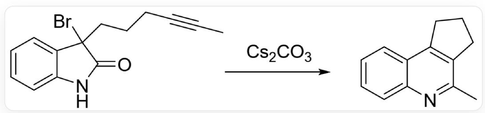
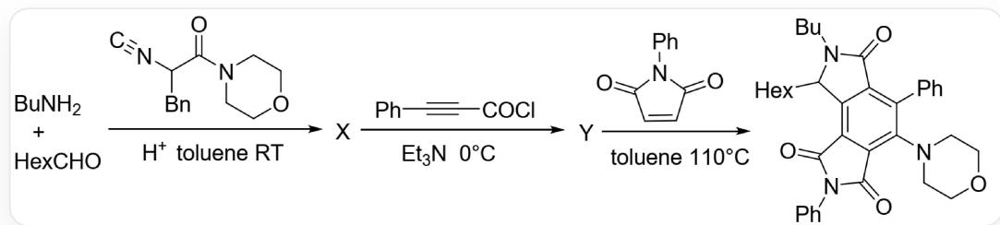
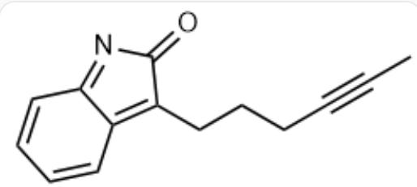
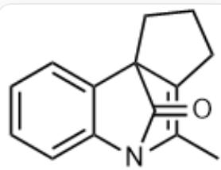
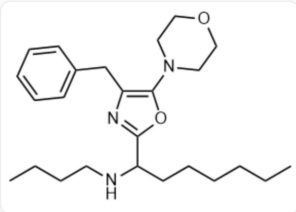
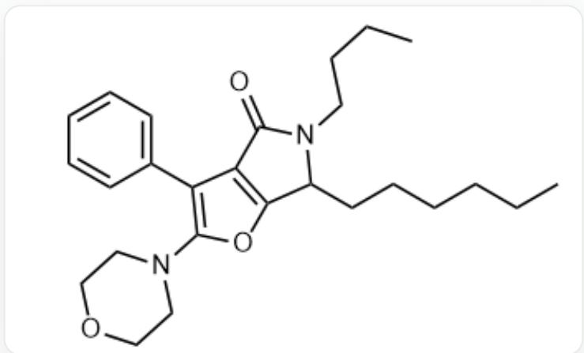

# Question

Pericyclic reactions are a class of reactions with extremely high application value. Two reactions are given. The first reaction is

CC#CCCCC1(Br)C2=CC=CC=C2NC1=O reacts in the presence of  $\mathrm{Cs_2CO_3}$  to yield

CC1=NC2=CC=CC=C2C3=C1CCC3

, in which two intermediates  $\mathbf{A}$  and  $\mathbf{B}$  exist during this transformation.

The second reaction is

n-Butylamine, n-heptanal, and  $[C-]\#[N+]C(CC1=CC=CC=C1)C(N2CCOCC2)=O$  react at room temperature in acidic toluene solvent to obtain intermediate  $\mathbf{X}$ . Intermediate  $\mathbf{X}$  and  $O=C(C\#CC1=CC=CC=C1)Cl$  react in the presence of triethylamine at 0 degrees Celsius to obtain intermediate  $\mathbf{Y}$ . Intermediate  $\mathbf{Y}$  and  $O=C(N1C2=CC=CC=C2)C=CC1=O$  react in toluene solvent at 110 degrees Celsius to obtain the productCCCCCCC1C2=C3C(C(N(C4=CC=CC=C4)C3=O)=O)=C(N5CCOCC5)C(C6=CC=CC=C6)=C2C(N1CCCC)=O

Which of the following statements is correct?

A. Intermediate A contains 3 rings  
B. The intermediate A has a chiral carbon.

C. The intermediate B has  $13 \mathrm{C}$  atoms  
D. There is a carbon-carbon triple bond in the intermediate B.  
E. There is 1 carbonyl group in the intermediate  $\mathbf{X}$  
F. Intermediate  $\mathbf{X}$  contains two N atoms with different nucleophilicities.  
G. The intermediate  $\mathbf{Y}$  contains a  $\gamma$ -lactam structure.  
H. During the process of obtaining the intermediate  $\mathbf{Y}$ , CO is produced.  
1. None of the above options are correct.

# Answer

Correct Answer: G

# Detailed Explanation

In the first reaction, the electrons from product N are donated to the benzene ring, Br departs, and the carbonate neutralizes the H on  $\mathbf{N}^{+}$ .

# CHECKPOINT

1 PTS

The diene intermediate A is obtained, with the structure

CC#CCCCC1=C2C=CC=CC2=NC1=O

Thus, intermediate  $\mathbf{A}$  has only two rings and no chiral carbon.

# CHECKPOINT

1 PTS

Intermediate A has only two rings and no chiral carbon

The alkyne undergoes a DA reaction with the conjugated diene on the five-membered ring of intermediate A ,

# CHECKPOINT

1 PTS

Intermediate  $\mathbf{B}$  is obtained, with the structure

CC1=C2CCCCC23C4=CC=CC=C4N1C3=O

# CHECKPOINT

1 PTS

Intermediate B has 14 C atoms and no carbon-carbon triple bond

In the second reaction,

# CHECKPOINT

1 PTS

n-Butylamine reacts with n-heptanal to form an imine by dehydration

The imine is nucleophilically attacked by the C atom of isocyanide,

# CHECKPOINT

1 PTS

The imine is nucleophilically attacked by the C atom of isocyanide

Subsequently, the O atom on the carbonyl group of the isocyanide molecule attacks the carbon of the nitrilium ion, and the keto form transforms into the enol form, yielding an intramolecular cyclization product.

# CHECKPOINT

1 PTS

The O atom attacks the carbon of the nitrilium ion, undergoing an enolization transformation

# CHECKPOINT

1 PTS

Intermediate  $\mathbf{X}$  is obtained, with the structural formula

CCCCCC(C1=NC(=C(N2CCOCC2)O1)CC3=CC=CC=C3)NCCCC

# CHECKPOINT

1 PTS

Intermediate  $\mathbf{X}$  lacks a carbonyl group and has  $3\mathrm{N}$  atoms with different nucleophilicities

The  $\mathbf{N}$  atom of the butylamino group in intermediate  $\mathbf{X}$  nucleophilically attacks the acyl chloride group of phenylpropynoyl chloride, resulting in the departure of Cl,

# CHECKPOINT

1 PTS

The N atom of the butylamino group in intermediate  $\mathbf{X}$  nucleophilically attacks the acyl chloride group of phenylpropynoyl chloride

Afterward, the  $\mathrm{C} = \mathrm{N} - \mathrm{O} - \mathrm{C} = \mathrm{C}$  moiety of the oxazole ring undergoes a DA pericyclic reaction with the alkyne, followed by a retro-DA reaction, eliminating aniline.

# CHECKPOINT

1 PTS

The oxazole ring undergoes a DA pericyclic reaction with the alkyne

# CHECKPOINT

1 PTS

A retro-DA reaction occurs, eliminating aniline and yielding intermediate  $\mathbf{Y}$ , with the structural formula

CCCCCCC1C2=C(C(N1CCCC)=O)C(C3=CC=CC=C3)=C(O2)N4CCCOCC4

# CHECKPOINT

1 PTS

Intermediate  $\mathbf{Y}$  contains an amide structure, eliminating aniline rather than carbon monoxide

The final product is G.