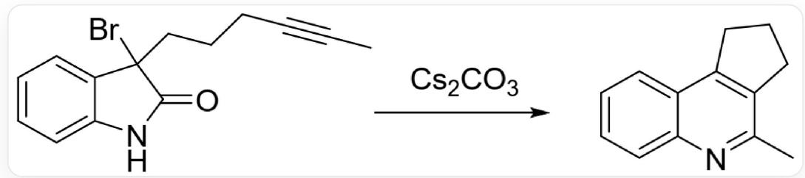
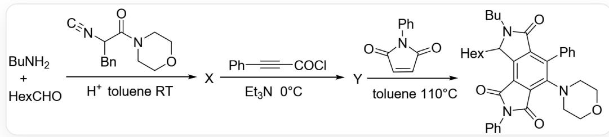
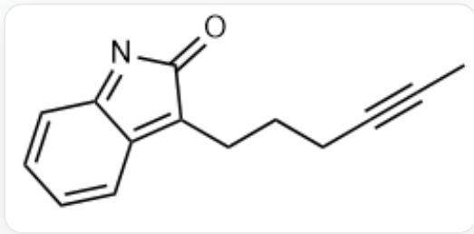
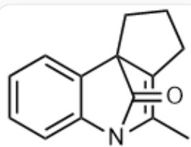
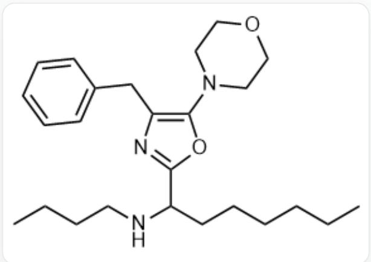
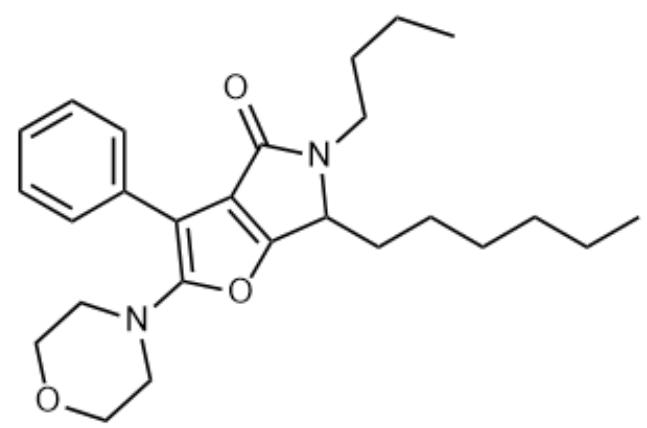

# 题目

周环反应是一类具有极高应用价值的反应。给出了两个反应，第一个反应为

  
CC#CCCCC1(Br)C2=CC=CC=C2NC1=O在Cs2CO3存在的条件下反应得到

，该转化过程中存在两个中间体A和B。

# 第二个反应为

  
CC1=NC2=CC=CC=C2C3=C1CCC3

正丁基胺、正庚醛和  $[C-] \#[N+] C(C C_{1}=C C=C C=C_{1}) C(N2CCOCC_{2})=O$  在酸性甲苯溶剂中常温反应得到中间体  $\mathbf{X}$ , 中间体  $\mathbf{X}$  和  $O=C(C \# C C_{1}=C C=C C=C_{1}) C$  在三乙胺、0 摄氏度的条件下反应得到中间体  $\mathbf{Y}$ , 中间体  $\mathbf{Y}$

和  $O = C(N1C2 = CC = CC = C2)C = CC1 = O$  在甲苯溶剂中、110摄氏度条件下反应得到产物

CCCCCCC1C2=C3C(C(N(C4=CC=CC=C4)C3=O)=O)=C(N5CCOCCC5)C(C6=CC=CC=C6)=C2C(N1CCCC)=O

# 以下说法正确的是

A. 中间体  $\mathrm{A}$  包含 3 个环  
B. 中间体  $\mathrm{A}$  有手性碳

C. 中间体  $\mathrm{B}$  有13个  $\mathrm{C}$  
D. 中间体  $\mathrm{B}$  中存在碳碳三键  
E. 中间体  $\mathrm{X}$  中有 1 个羰基  
F. 中间体  $\mathrm{X}$  中有两个不同亲核性的  $\mathrm{N}$  原子  
G. 中间体  $\mathrm{Y}$  中存在  $\gamma$ -内酰胺结构  
H. 得到中间体  $\mathrm{Y}$  的过程中产生了  $\mathrm{CO}$  
I. 以上选项均不正确

# 答案

正确答案: G

# 详细解析

在第一个反应中，产物N的电子给到苯环，Br离去，碳酸根中和  $\mathrm{N}^{+}$  上的H，

CHECKPOINT

1 PTS

得到二烯中间体A，结构为

CC#CCCCC1=C2C=CC=CC2=NC1=O

因此中间体  $\mathbf{A}$  只有两个环, 没有手性碳

CHECKPOINT

1 PTS

中间体  $\mathrm{A}$  只有两个环, 没有手性碳

炔基和中间体A五元环上的共轭双烯发生DA反应，

# CHECKPOINT

1 PTS

得到中间体  $\mathbf{B}$ , 结构为

CC1=C2CCCCC23C4=CC=CC=C4N1C3=O

# CHECKPOINT

1 PTS

中间体  $\mathrm{B}$  有 14 个  $\mathrm{C}$  原子, 没有碳碳三键

在第二个反应中，

# CHECKPOINT

1 PTS

正丁基胺和正庚醛反应脱去水得到亚胺

亚胺被异氰化物的C原子亲核攻击，

# CHECKPOINT

1 PTS

亚胺被异氰化物的C原子亲核攻击

之后异氰化物分子内羰基上的O原子进攻腈鎘离子的碳，酮式转变为烯醇式，得到分子内环化产物

# CHECKPOINT

1 PTS

O原子进攻腈离子的碳，发生烯醇式转变

# CHECKPOINT

1 PTS

得到中间体  $\mathbf{X}$ ，结构式为

CCCCCCC(C1=NC(=C(N2CCOCC2)O1)CC3=CC=CC=C3)NCCCC

# CHECKPOINT

1 PTS

中间体  $\mathbf{X}$  没有羰基，有3个不同亲核性的N原子

中间体X中的丁基氨基的N原子亲核进攻苯丙炔酰氯中的酰氯基团，脱去Cl,

# CHECKPOINT

1 PTS

中间体X中的丁基氨基的N原子亲核进攻苯丙炔酰氯中的酰氯基团

之后，噁唑环的  $\mathrm{C} = \mathrm{N} - \mathrm{O} - \mathrm{C} = \mathrm{C}$  部分与炔基发生DA周环反应，再发生逆DA反应，脱去苄基腈

# CHECKPOINT

1 PTS

噁唑环与炔基发生DA周环反应

# CHECKPOINT

1 PTS

再发生逆DA反应，脱去苄基腈，得到中间体Y，中间体Y的结构式为

CCCCCCC1C2=C(C(N1CCCC)=O)C(C3=CC=CC=C3)=C(O2)N4CCCOCC4

# CHECKPOINT

1 PTS

中间体  $\mathrm{Y}$  中存在酰胺结构, 脱去苄基腈而不是一氧化碳

最终结果为G