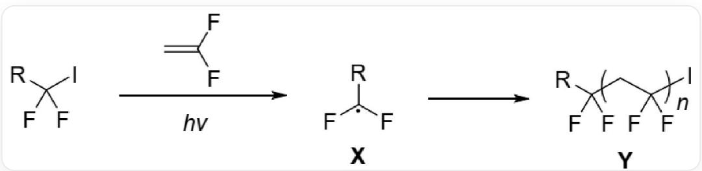
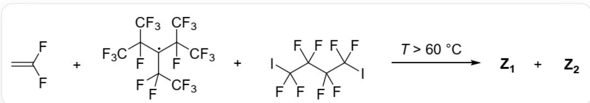
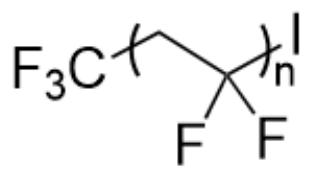
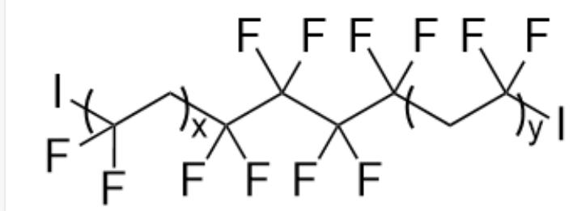

# Question

Alkyl iodides  $(RCF_{2}I)$  can undergo polymerization with 1,1-difluoroethylene, as shown in the figure below:

In this process, alkyl iodides act as free radical initiating species, undergoing homolytic cleavage of the C-I bond under light conditions to generate the carbon radical  $\mathbf{X}$ .  $\mathbf{X}$  initiates the polymerization of 1,1-difluoroethylene, resulting in the polymeric compound  $\mathbf{Y}$ .

  
FC(F)(I)[R] undergoes polymerization with C=C(F)F under light conditions, first producing the radical X: F[C](F)[R], and then obtaining the polymer Y: The basic structure is  $\mathsf{FC}(\mathsf{F})(\mathsf{CC}(\mathsf{F})(\mathsf{F})\mathsf{I})[\mathsf{R}]^{\prime}$  (when there is only one repeating unit), where  $\mathsf{[^{*}]CC(F)(F)[^{*}]}$  is the repeating unit

PPFR (structure  $\mathrm{FC}(\mathrm{C}(\mathrm{F})(\mathrm{F})\mathrm{F})(\mathrm{C}(\mathrm{F})(\mathrm{F})\mathrm{F})[\mathrm{C}](\mathrm{C}(\mathrm{F})(\mathrm{C}(\mathrm{F})(\mathrm{F})\mathrm{F})\mathrm{C}(\mathrm{F})(\mathrm{C}(\mathrm{F})(\mathrm{F})\mathrm{F})\mathrm{C}(\mathrm{F})(\mathrm{F})\mathrm{F}$  with the central carbon atom being a radical) is a reagent that can generate trifluoromethyl radicals upon heating. The free radical polymerization shown in the figure below yields two polymers, Z1 and Z2, in the presence of a catalytic amount of PPFR. It is known that Z1 and Z2 have different end groups and the number average molecular weight of Z1 is approximately twice that of Z2.

  
1,1-Difluoroethylene and PPFR and  $\cdot^{\backprime} \mathrm{IC}(F)(F) C(F)(F) C(F)(F) C(F)(F) I$  undergo polymerization at temperatures above 60 degrees Celsius to produce two polymers Z1 and Z2

The following statements are made:

1. In the chain transfer step of the polymer  $\mathbf{Y}$  reaction, the polymer chain can abstract an iodine atom from the alkyl iodide to generate a new  $\mathbf{X}$ .  
2. Z1 has the same end groups on both ends.  
3. Z1 may have a center of symmetry.  
4. Z2 does not contain iodine.

Select the sum of the coefficients of all correct statements:

A. No correct statement  
B. 1  
C. 2  
D. 3  
E. 4  
F. 5  
G. 6  
H. 7  
1. 8  
J. 9

K. 10

# Answer

Correct Answer: G

# Detailed Explanation

Under illumination, the C-I bond of alkyl iodides undergoes homolytic cleavage, generating initiating radicals  $RCF_{2}$  (i.e.,  $\mathbf{X}$ ) and an iodine radical.  $\mathbf{X}$  attacks 1,1-difluoroethylene to initiate polymerization. Subsequently, chain transfer can occur, where the polymer radical attacks  $RCF_{2}I$  to abstract an iodine atom, generating new  $\mathbf{X}$ ; or the polymer radical reacts with a molecule of iodine radical, terminating the reaction.

# CHECKPOINT

1 PTS

The polymer radical can abstract the iodine atom of alkyl iodide to generate new  $\mathbf{X}$ , statement 1 is correct.

In the reactions producing Z1 and Z2, because the free radical polymerization has a narrow molecular weight distribution, and the number-average molecular weight of Z1 is approximately twice that of Z2, then Z1 likely has two polymer segments. First, PPFR is heated to generate trifluoromethyl radicals, which then attack 1,1-difluoroethylene, generating a new radical  $\mathrm{F}[\mathrm{C}](\mathrm{F})\mathrm{CC}(\mathrm{F})(\mathrm{F})\mathrm{F}$ , initiating polymerization until the polymer radical abstracts an iodine atom from  $\mathrm{IC}(\mathrm{F})(\mathrm{F})\mathrm{C}(\mathrm{F})(\mathrm{F})\mathrm{C}(\mathrm{F})(\mathrm{F})\mathrm{C}(\mathrm{F})(\mathrm{F})\mathrm{I}$ , generating a new radical  $\mathrm{IC}(\mathrm{F})(\mathrm{C}(\mathrm{F})(\mathrm{C}(\mathrm{F})(\mathrm{C}(\mathrm{F})(\mathrm{C}(\mathrm{F})(\mathrm{C}(\mathrm{F})(\mathrm{C}(\mathrm{F})(\mathrm{C}(\mathrm{F})(\mathrm{C}(\mathrm{F})(\mathrm{C}(\mathrm{F})(\mathrm{C}(\mathrm{F})(\mathrm{F})\mathrm{F})\mathrm{F}$ '. At this point, the polymerization of the original polymer terminates, resulting in a basic polymer structure of  $\mathrm{FC}(\mathrm{F})(\mathrm{I})\mathrm{CC}(\mathrm{F})(\mathrm{F})\mathrm{F}$  (when there is only one repeating unit), where the repeating unit is:  $\mathrm{FC}(\mathrm{F})$  ([J]C[], which should be Z2, containing an iodine atom.

The figure shows the structure of Z2, the basic structure is `FC(F)(I)CC(F)(F)F` (when there is only one repeating unit), the repeating unit is: `FC(F)([*])C[*]`

# CHECKPOINT

1 PTS

Z2 needs to abstract an iodine atom during chain termination, therefore it contains iodine, statement 4 is incorrect

The newly generated radical then reacts with 1,1-difluoroethylene to generate the radical  $\mathrm{IC}(\mathrm{F})(\mathrm{C}(\mathrm{F})(\mathrm{C}(\mathrm{F})(\mathrm{C}(\mathrm{F})(\mathrm{C}(\mathrm{C}(\mathrm{F})(\mathrm{F})\mathrm{F})\mathrm{F})\mathrm{F})}$ , initiating polymerization. Polymerization terminates when another iodine atom is abstracted from  $\mathrm{IC}(\mathrm{F})(\mathrm{F})\mathrm{C}(\mathrm{F})(\mathrm{F})\mathrm{C}(\mathrm{F})(\mathrm{F})\mathrm{C}(\mathrm{F})(\mathrm{F})\mathrm{I}$ . Since  $\mathrm{IC}(\mathrm{F})(\mathrm{F})\mathrm{C}(\mathrm{F})(\mathrm{F})\mathrm{C}(\mathrm{F})(\mathrm{F})\mathrm{C}(\mathrm{F})(\mathrm{F})\mathrm{I}$  has two iodine atoms, it can be abstracted twice to initiate two segments of polymerization. Then the final basic structure of the polymer is  $\mathrm{FC}(\mathrm{F})$ $(\mathrm{C}(\mathrm{F})(\mathrm{C}(\mathrm{F})(\mathrm{C}(\mathrm{F})(\mathrm{CC}(\mathrm{F})(\mathrm{I})\mathrm{F})\mathrm{F})\mathrm{F})\mathrm{CC}(\mathrm{F})(\mathrm{F})\mathrm{I}$  (when there is only one repeating unit), with two repeating units  $\mathrm{FC}(\mathrm{F})([\mathbf{\Pi}]C[\mathbf{\Pi}]^{\prime}$ . Because it has two polymerization segments, the number-average molecular weight is approximately twice that of Z2, which is Z1, and the structure is shown in the figure below:

The basic structure of Z1 is `FC(F)(C(F)(C(F)(C(F)(CC(F)(I)F)F)F)F)CC(F)(F)I` (when there is only one repeating unit), with two repeating units `FC(F)([*])C[*]`

Since the end groups of  $\mathbf{Z1}$  are all iodine atoms, the end groups are the same.

# CHECKPOINT

1 PTS

The end groups of Z1 are all iodine atoms, the end groups are the same, statement 2 is correct.

The center of Z1 is  $\mathrm{FC(C(F)(C(F)(C(F)[J)F)F)([J]F)}$  (the asterisk part connects to other parts of the polymer), which has a center of symmetry. If the degrees of polymerization of the two polymer segments are the same, then Z1 can have a center of symmetry.

# CHECKPOINT

1 PTS

If the degrees of polymerization of the two polymer segments are the same, then Z1 can have a center of symmetry, statement 3 is correct

The correct statements are 1, 2, and 3, the sum is 6, choose G.

In this question, why is the species that initiates polymerization  $\mathrm{F}[\mathrm{C}](\mathrm{F})\mathrm{CC}([\mathrm{R}])(\mathrm{F})\mathrm{F}$  (the radical is the carbon atom of the original difluoroethylene connected to two fluorine atoms, R represents other groups) instead of  $\mathrm{FC(F)}$  ( $\mathrm{C(F)(F)[R]}$ ) $\mathrm{C}([\mathrm{H}])[\mathrm{H}]$  where the radical is the carbon atom of the original difluoroethylene connected to two hydrogen atoms, R represents other groups: These two radicals do not have particularly large differences in stability, but when a carbon atom is connected to two fluorine atoms, the C-I bond is weakened. Therefore, if it is the  $\mathrm{FC(F)(C(F)(F)[R])}$  [C]([H][H] radical, it can abstract an iodine atom to generate a relatively stable C-I bond instead of further generating new radicals, which will terminate the polymerization. Only the C-I bond generated by the  $\mathrm{F}[\mathrm{C}](\mathrm{F})\mathrm{CC}([\mathrm{R}])(\mathrm{F})\mathrm{F}$  radical is relatively weak, which can allow the polymerization to continue by further generating new radicals.

# CHECKPOINT

1 PTS

In this question, the species that initiates polymerization is the  $\mathrm{F}[\mathrm{C}](\mathrm{F})\mathrm{CC}([\mathrm{R}])(\mathrm{F})\mathrm{F}$  radical