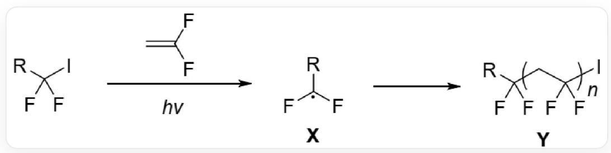
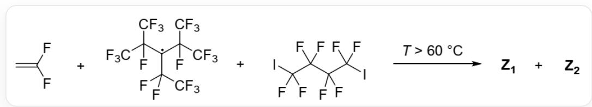
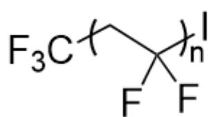
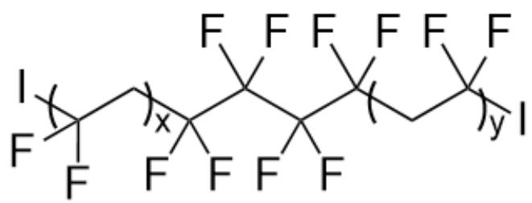

# 题目

烷基碘化物（ $RCF_{2}I$ ）可以与1,1-二氟乙烯发生聚合反应，如下图所示：

在该过程中，烷基碘化物作为自由基引发物种，在光照条件下发生C-I键的均裂得到碳自由基X，X引发1,1-二氟乙烯的聚合，得到高分子化合物Y

  
FC(F)(I)[R]在光照条件下与C=C(F)F发生聚合反应，首先在光照下产生自由基X：F[C](F)[R]，随后得到聚合物Y：基本结构为`FC(F)(CC(F)(F)I)[R]`（当只有一个重复单元时），其中`[*]CC(F)(F)[*]`为重复单元

PPFR（结构为  $\mathrm{FC}(\mathrm{C}(\mathrm{F})(\mathrm{F})\mathrm{F})(\mathrm{C}(\mathrm{F})(\mathrm{F})\mathrm{F})[\mathrm{C}](\mathrm{C}(\mathrm{F})(\mathrm{C}(\mathrm{F})(\mathrm{F})\mathrm{F})\mathrm{C}(\mathrm{F})(\mathrm{C}(\mathrm{F})(\mathrm{F})\mathrm{F})\mathrm{C}(\mathrm{F})(\mathrm{F})\mathrm{F}^{\prime}$  ，中心碳原子为自由基）是一种加热能产生三氟甲基自由基的试剂。下图所示的自由基聚合在催化量PPFR作用下得到了两种聚合物Z1和Z2。已知Z1和Z2端基有所不同且Z1数均分子量约为Z2的2倍。

  
1,1-二氟乙烯和PPFR和 $\mathrm{IC}(F)(F)\mathrm{C}(F)(F)\mathrm{C}(F)(F)\mathrm{C}(F)(F)$ 在温度高于60摄氏度时产生聚合，得到两种聚合物 Z1和Z2

有以下说法：

1.聚合物Y反应的链转移步骤中，聚合物链可以攫取烷基碘化物的碘原子产生新的X  
2.Z1两端封端基团相同

3.Z1可能具有对称中心  
4.Z2中不含碘

选出所有正确说法系数的和：

A. 无正确说法  
B. 1  
C. 2  
D. 3  
E. 4  
F. 5  
G. 6  
H. 7  
1. 8  
J. 9  
K. 10

# 答案

正确答案: G

# 详细解析

在光照下, 烷基碘化物的  $\mathrm{C}-\mathrm{I}$  键均裂, 产生引发自由基  $R C F_{2} .$  (即  $\mathbf{X}$  ) 和一个碘自由基,  $\mathbf{X}$  进攻1,1-二氟乙烯引发聚合反应。随后可发生链转移, 聚合物自由基进攻  $R C F_{2} I$  攫取碘原子, 产生新的  $\mathbf{X}$ ; 或聚合物自由基与一分子碘自由基反应, 终止反应。

# CHECKPOINT

1 PTS

聚合物自由基可以攫取烷基碘化物的碘原子产生新的X，说法1正确

在产生Z1和Z2的反应中，由于自由基聚合分子量分布较窄，而Z1数均分子量约为Z2的2倍，则Z1中很可能具有两段聚合物结构。首先PPFR加热产生三氟甲基自由基，随后自由基进攻1,1-二氟乙烯，产生新的自由基`F[C](F)CC(F)(F)F`，引发聚合直到聚合物自由基攫取`IC(F)(F)C(F)(F)C(F)(F)C(F)(F)I`的一个碘原子，产生新的自由基`IC(F)(C(F)(C(F)[C](F)F)F)F`，此时原先聚合物的聚合终止，得到聚合物的基本结构为`FC(F)(I)CC(F)(F)F`（当只有一个重复单元时)，其中重复单元为：`FC(F)([J)C[J]`，应为Z2，含有碘原子。

图中展示出Z2的结构，基本结构为`FC(F)(I)CC(F)(F)F`（当只有一个重复单元时），重复单元为：`FC(F)([*])C[*]`

# CHECKPOINT

1 PTS

Z2链终止时需要攫取碘原子，因此其中含有碘，说法4错误

产生的新自由基随后与1,1-二氟乙烯反应产生自由基  $\mathrm{IC}(\mathrm{F})(\mathrm{C}(\mathrm{F})(\mathrm{C}(\mathrm{F})(\mathrm{C}(\mathrm{F})(\mathrm{C}[\mathrm{C}](\mathrm{F})\mathrm{F})\mathrm{F})\mathrm{F})$  引发聚合。聚合终止时需要攫取另一  $\mathrm{IC}(\mathrm{F})(\mathrm{F})\mathrm{C}(\mathrm{F})(\mathrm{F})\mathrm{C}(\mathrm{F})(\mathrm{F})\mathrm{C}(\mathrm{F})(\mathrm{F})\mathrm{I}$  的一个碘原子。而  $\mathrm{IC}(\mathrm{F})(\mathrm{F})\mathrm{C}(\mathrm{F})(\mathrm{F})\mathrm{C}(\mathrm{F})(\mathrm{F})\mathrm{C}(\mathrm{F})(\mathrm{F})\mathrm{I}$  中具有两个碘原子，可被攫取两次引发两段聚合，则最终聚合物的基本结构为  $\mathrm{FC}(\mathrm{F})(\mathrm{C}(\mathrm{F})(\mathrm{C}(\mathrm{F})(\mathrm{C}(\mathrm{F})(\mathrm{CC}(\mathrm{F})(\mathrm{I})\mathrm{F})\mathrm{F})\mathrm{CC}(\mathrm{F})(\mathrm{F})\mathrm{I}$  （当只有一个重复单元时)，具有两段重复单元  $\mathrm{FC}(\mathrm{F})([J]\mathrm{C}[J]$  ，由于具有两段聚合结构，数均分子量约为Z2的2倍，是为Z1，结构如下图所示：

Z1基本结构为`FC(F)(C(F)(C(F)(C(F)(CC(F)(I)F)F)F)CC(F)(F)I`（当只有一个重复单元时），具有两段重复单元`FC(F)([*])C[*]`

由于Z1封端均为碘原子，封端基团相同。

# CHECKPOINT

1 PTS

Z1封端均为碘原子，封端基团相同，说法2正确

Z1的中心为  $\mathrm{FC}(\mathrm{C}(\mathrm{F})(\mathrm{C}(\mathrm{F})(\mathrm{C}(\mathrm{F})([J]F)F)F)([J])F^{\prime}}$  （星号部分连接聚合物其他部分），具有对称中心，若两段聚合物部分聚合度相同，则Z1可以具有对称中心。

# CHECKPOINT

1 PTS

若两段聚合物部分聚合度相同，则Z1可以具有对称中心，说法3正确

正确的说法为1,2,3，和为6，选G

本题中为何引发聚合的物种为  $\mathrm{F}[\mathrm{C}](\mathrm{F})\mathrm{CC}([\mathrm{R}])(\mathrm{F})\mathrm{F}$  （自由基为原二氟乙烯连接两个氟原子的碳，R表示其他基团）而非  $\mathrm{FC}(\mathrm{F})(\mathrm{C}(\mathrm{F})(\mathrm{F})[\mathrm{R}])[\mathrm{C}][[\mathrm{H}][\mathrm{H}]^{\prime}$  自由基为原二氟乙烯连接两个氢原子的碳，R表示其他基团）：这两个自由基在稳定性上不具有特别大的区别，但是当碳原子上连接有两个氟原子时C-I键会被削弱。因此若是  $\mathrm{FC}(\mathrm{F})(\mathrm{C}(\mathrm{F})(\mathrm{F})[\mathrm{R}])[\mathrm{C}][[\mathrm{H}][\mathrm{H}]^{\prime}$  自由基，可以攫取碘原子后产生相对稳定的C-I键而不是进一步产生新的自由基，会终止聚合。只有  $\mathrm{F}[\mathrm{C}](\mathrm{F})\mathrm{CC}([\mathrm{R}])[\mathrm{F})\mathrm{F}$  自由基产生的C-I键相对较弱，可以通过进一步产生新的自由基使聚合进行下去。

# CHECKPOINT

1 PTS

本题中引发聚合的物种为  $\mathrm{F}[\mathrm{C}](\mathrm{F})\mathrm{CC}([\mathrm{R}])(\mathrm{F})\mathrm{F}$  自由基