# Question

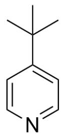

Tf $_2$ O (1.2 equiv.)

EtOAc, -78°C, 30mins then (1.2 equiv.)

$\mathrm{NEt}_{3}$  (3.0 equiv.),  $-78^{\circ} \mathrm{C}$  then rt, overnight

  
1:1

CC(C)(C)C1=CC=NC=C1>Tf2O(1.2 equiv),EtOAc, reaction at  $-78^{\circ}\mathrm{C}$  for 30 mins; then CC(CC(OCC)=O)=O(1.2 equiv),NEt3(3.0 equiv), at  $-78^{\circ}\mathrm{C}$ ; then rt, overnight>[B].[C], the ratio of products B and C is approximately 1:1

Given that the reaction yields products  $\mathbf{B}$  and  $\mathbf{C}$  in an approximate ratio of 1:1 and their molecular formulas are different, and the molecular formula of product  $\mathbf{C}$  is  $\mathrm{C_{16}H_{22}F_3NO_5S}$ , without considering enantiomers, provide the structural formula of product  $\mathbf{C}$ .

A. All other options are incorrect  
B.

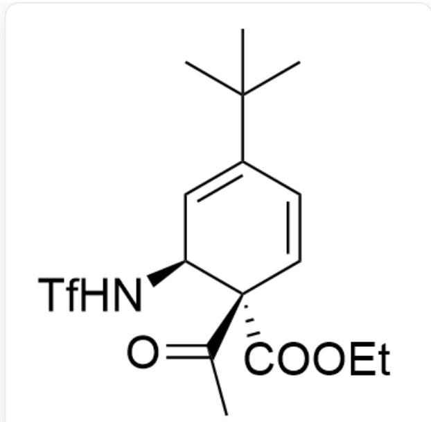  
CC(C)(C)C1=C[C@H](NS(=O)(C(F)(F)F)=O)[C@@](C(C)=O)(C(OCC)=O)C=C1

C.

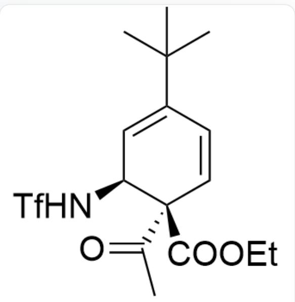  
CC(C)(C)C1=C[C@H](NS(=O)(C(F)(F)F)=O)[C@](C(C)=O)(C(OCC)=O)C=C1

D.

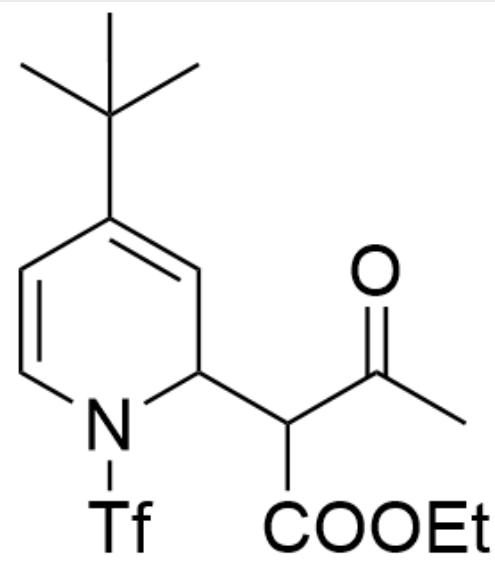

CC(C)(C)C1=CC(C(C(OCC)=O)C(C)=O)N(S(=O)(C(F)(F)F)=O)C=C1

E.

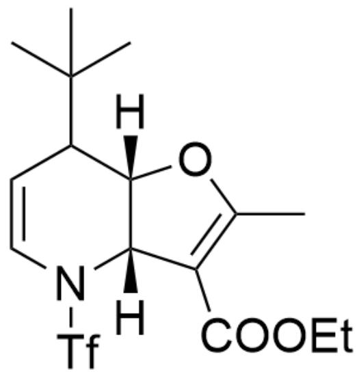

CC(C)(C)C1[C@@]2([H])[C@@](C(C(OCC)=O)=C(C)O2) ([H])N(S(=O)(C(F)(F)F)=O)C=C1

F.

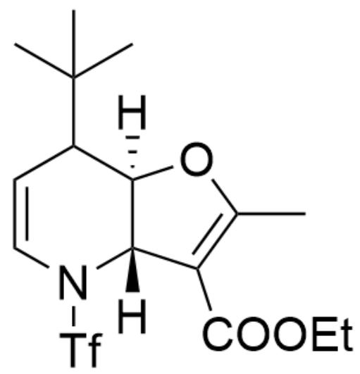

CC(C)(C)C1[C@]2([H])[C@@](C(C(OCC)=O)=C(C)O2)([H])N(S(=O)(C(F)(F)F)=O)C=C1

G.

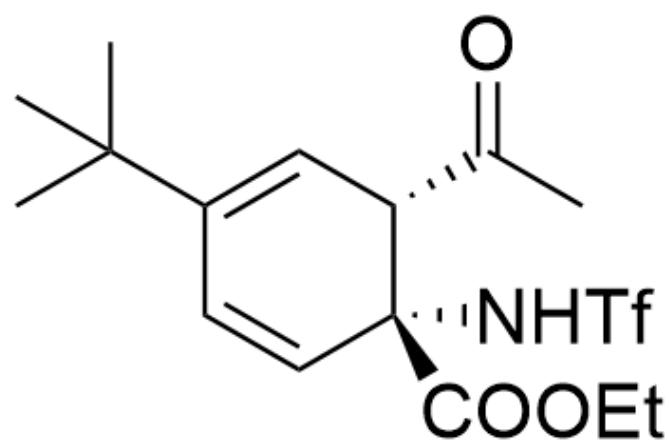

CC(C)(C)C1=C[C@H](C(C)=O)[C@](C(OCC)=O)(NS(=O)(C(F)(F)F)=O)C=C1

H.

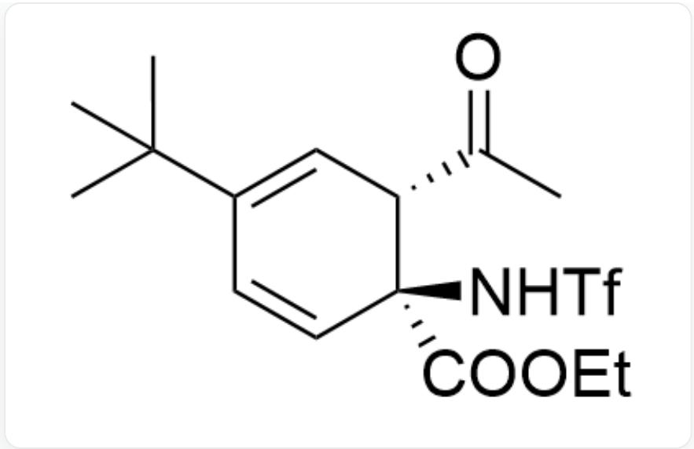  
CC(C)(C)C1=C[C@H](C(C)=O)[C@@](C(OCC)=O)(NS(=O)(C(F)(F)F)=O)C=C1

1.

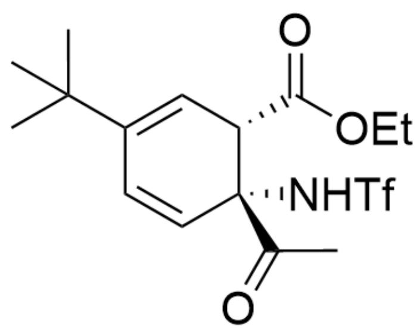  
CC(C)(C)C1=C[C@H](C(OCC)=O)[C@](C(C)=O)(NS(=O)(C(F)(F)F)=O)C=C1

J.

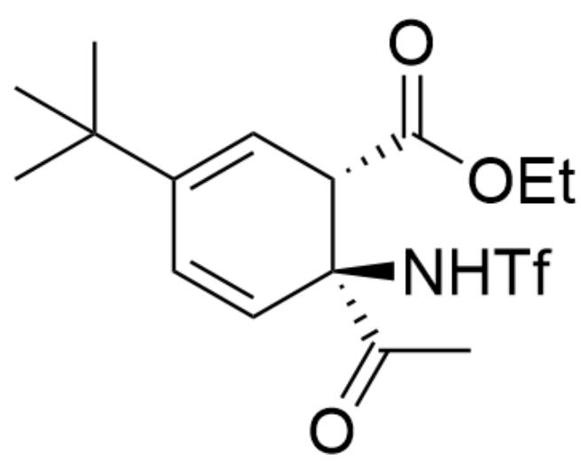

CC(C)(C)C1=C[C@H](C(OCC)=O)[C@@](C(C)=O)(NS(=O)(C(F)(F)F)=O)C=C1

# Answer

Correct Answer: C

# Detailed Explanation

First, observe the first reaction. It is obvious that the substrate reacts with  $\mathrm{Tf}_2\mathrm{O}$  to obtain intermediate 1

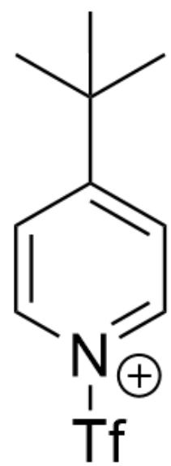

Intermediate 1: CC(C)(C)C1=CC=[N+](S(=O)(C(F)(F)F)=O)C=C1

CHECKPOINT

1 PTS

Intermediate 1: CC(C)(C)C1 = CC = [N+](S == O)(C(F)(F)F) = O)C = C1

Then, the second step is an addition reaction to obtain intermediate 2

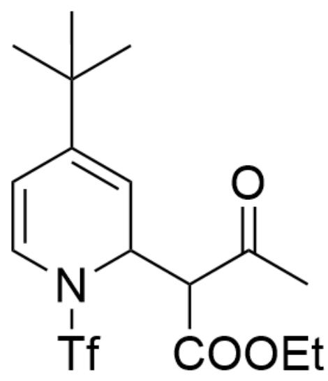

Intermediate 2: CC(C)(C)C1=CC(C(C(OCC)=O)C(C)=O)N(S(=O)(C(F)(F)F)=O)C=C1

# CHECKPOINT

1 PTS

Intermediate 2: CC(C)(C)C1=CC(C(C(OCC)=O)C(C)=O)N(S(=O)(C(F)(F)F)=O)C=C1

Under the catalysis of excess base, further elimination reaction occurs to obtain intermediate 3

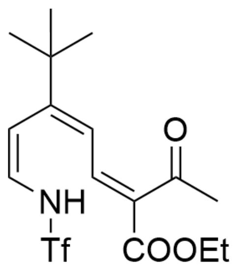

Intermediate 3: CC(C)(C)C(/C=C\NS(=O)(C(F)(F)F)=O)=C/C=C(C(OCC)=O)\C(C)=O

# CHECKPOINT

1 PTS

Intermediate 3: CC(C)(C)C(/C=C\NS(=O)(C(F)(F)F)=O)=C/C=C(C(OCC)=O)\C(C)=O (The cis/trans configuration of the double bond is not important)

Then, a six-electron electrocyclic reaction occurs to generate a pair of diastereomers. At this time, the ratio of products is approximately 1:1, but the molecular formulas of the two are still the same.

# CHECKPOINT

1 PTS

Then, a six-electron electrocyclic reaction occurs to generate a pair of diastereomers. At this time, the ratio of the obtained products is approximately 1:1, but the molecular formulas of the two are still the same.

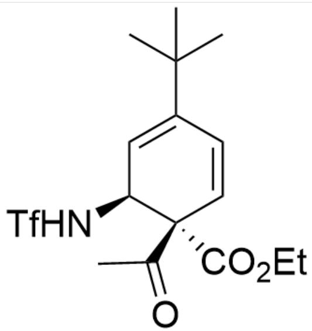

Intermediate 4: CC(C)(C)C1=C[C@H](NS(=O)(C(F)(F)F)=O)[C@@](C(C)=O)(C(OCC)=O)C=C1

# CHECKPOINT

1 PTS

Intermediate 4: CC(C)(C)C1=C[C@H](NS(=O)(C(F)(F)F)=O)[C@@](C(C)=O)(C(OCC)=O)C=C1

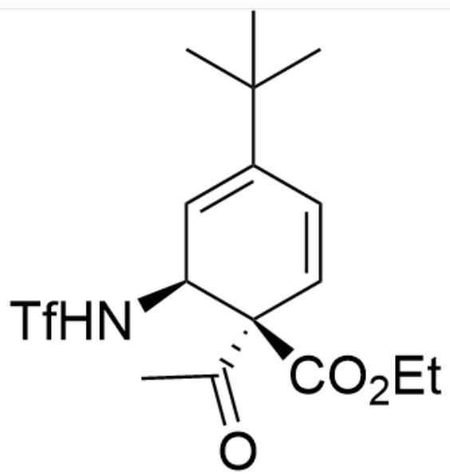

Intermediate 5: CC(C)(C)C1=C[C@H](NS(=O)(C(F)(F)F)=O)[C@](C(C)=O)(C(OCC)=O)C=C1

# CHECKPOINT

1 PTS

Intermediate 5: CC(C)(C)C1 = C[C@H](NS(=O)(C(F)(F)F) = O)[C@](C(C) = O)(C(OCC) = O)C = C1

At this time, because the electrophilicity of the ketone is stronger than that of the ester, only intermediate 4 can further undergo a nucleophilic-elimination reaction to obtain product B

# CHECKPOINT

1 PTS

At this time, because the electrophilicity of the ketone is stronger than that of the ester, only intermediate 4 can further undergo a nucleophilic-elimination reaction to obtain product B

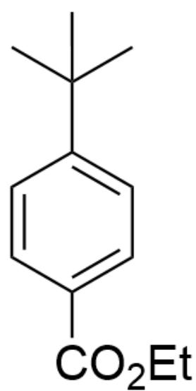

Product B: CC(C)(C)C1=CC=C(C(OCC)=O)C=C1

# CHECKPOINT

1 PTS

Product B: CC(C)(C)C1=CC=C(C(OCC)=O)C=C1

Product C is intermediate 5