# 题目

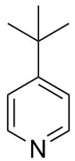

Tf $_2$ O (1.2 equiv.)

EtOAc, -78°C, 30mins then (1.2 equiv.)

$\mathrm{NEt}_{3}$  (3.0 equiv.),  $-78^{\circ} \mathrm{C}$  then rt, overnight

  
1:1

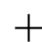

CC(C)(C)C1=CC=NC=C1>Tf2O(1.2 equiv),EtOAc,在-78°C反应30 mins; then CC(CC(OCC)=O)=O(1.2

equiv),  $\mathrm{NEt}_3(3.0$  equiv),在  $-78^{\circ}\mathrm{C}$  ；then rt,overnight>[B].[C],产物B和C的比例约为1:1

已知该反应得到产物  $\mathbf{B}$  和  $\mathbf{C}$  的比例大致为 1:1 且二者分子式不同, 产物  $\mathbf{C}$  的分子式为  $\mathrm{C}_{16} \mathrm{H}_{22} \mathrm{~F}_{3} \mathrm{NO}_{5} \mathrm{~S}$ ,不考虑对映异构的条件下, 试给出产物  $\mathbf{C}$  的结构式

A. 其他选项均不正确

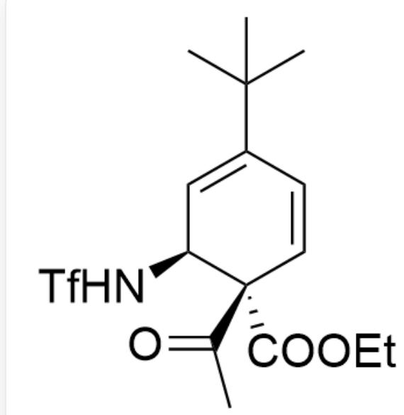  
B.

$$
C C (C) (C) C 1 = C [ C @ H ] (N S (= O) (C (F) (F) F) = O) [ C @ @ ] (C (C) = O) (C (O C C) = O) C = C 1
$$

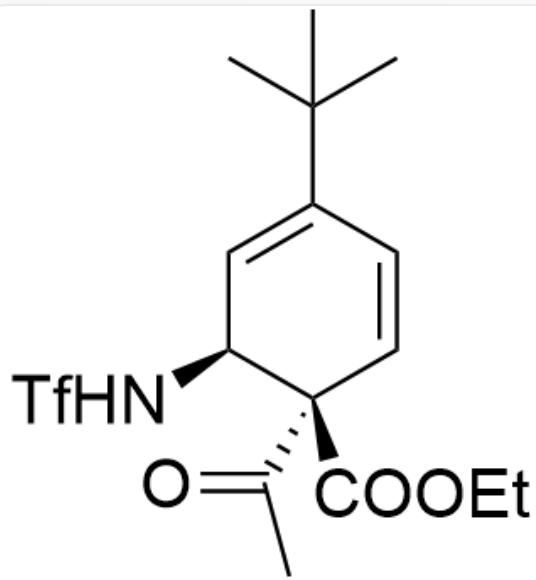  
C.  
D.

$$
C C (C) (C) C 1 = C [ C @ H ] (N S (= O) (C (F) (F) F) = O) [ C @ ] (C (C) = O) (C (O C C) = O) C = C 1
$$

  
E.

CC(C)(C)C1=CC(C(C(OCC)=O)C(C)=O)N(S(=O)(C(F)(F)F)=O)C=C1

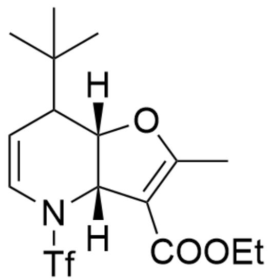  
F.

CC(C)(C)C1[C@@]2([H])[C@@](C(C(OCC)=O)=C(C)O2)([H])N(S(=O)(C(F)(F)F)=O)C=C1

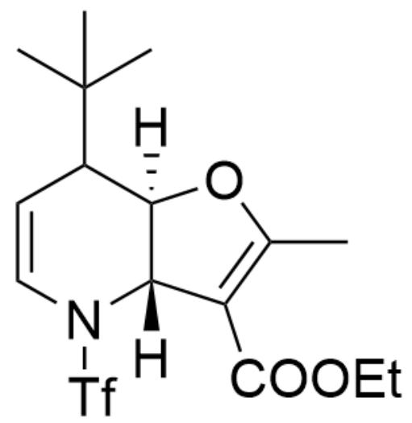  
G.

CC(C)(C)C1[C@]2([H])[C@@](C(C(OCC)=O)=C(C)O2)([H])N(S(=O)(C(F)(F)F)=O)C=C1

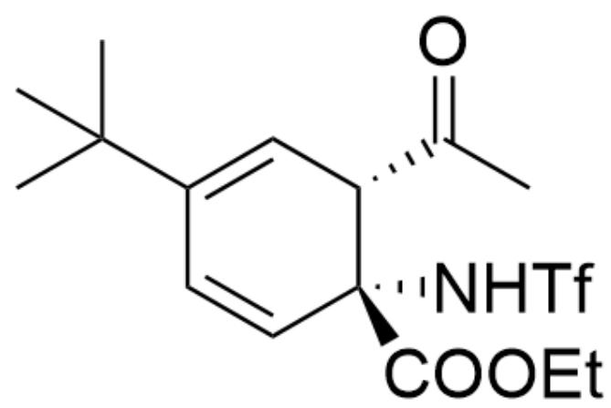  
H.

CC(C)(C)C1=C[C@H](C(C)=O)[C@](C(OCC)=O)(NS(=O)(C(F)(F)F)=O)C=C1

1.  
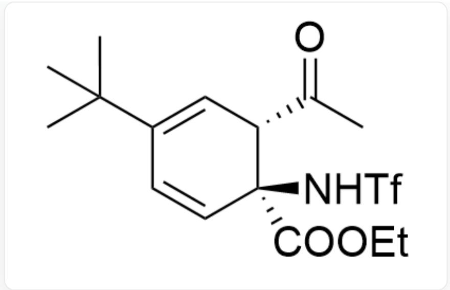  
CC(C)(C)C1=C[C@H](C(C)=O)[C@@](C(OCC)=O)(NS(=O)(C(F)(F)F)=O)C=C1

J.  
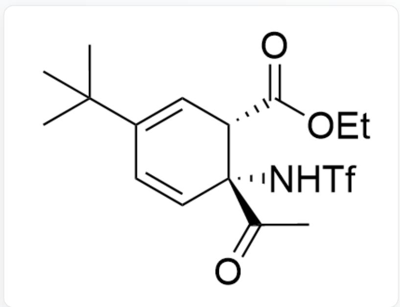  
CC(C)(C)C1=C[C@H](C(OCC)=O)[C@](C(C)=O)(NS(=O)(C(F)(F)F)=O)C=C1

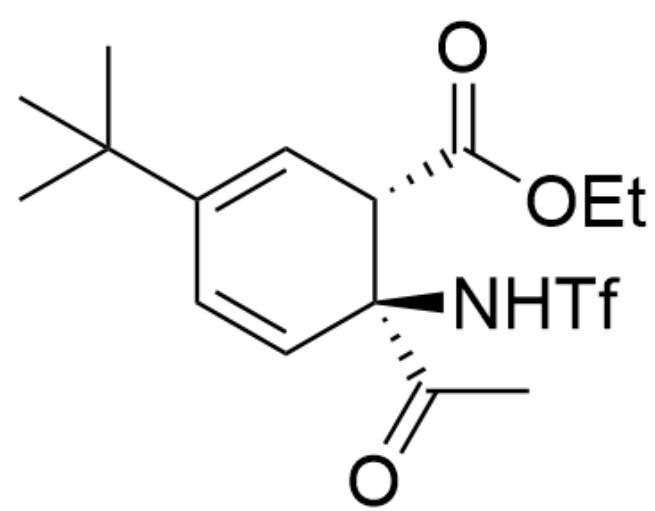

CC(C)(C)C1=C[C@H](C(OCC)=O)[C@@](C(C)=O)(NS(=O)(C(F)(F)F)=O)C=C1

# 答案

正确答案: C

# 详细解析

首先观察第一步反应，显然是底物与  $\mathrm{Tf}_2\mathrm{O}$  发生反应得到中间体1

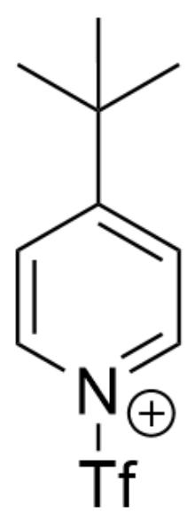  
中间体1：CC(C)(C)C1=CC=[N+](S(=O)(C(F)(F)F)=O)C=C1

CHECKPOINT

1 PTS

中间体1：CC(C)(C)C1=CC=[N+](S(=O)(C(F)(F)F)=O)C=C1

接着第二步发生加成反应得到中间体2

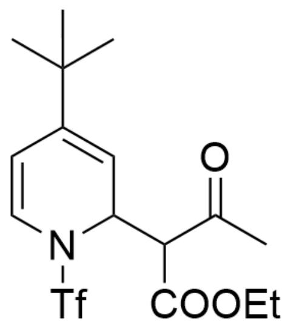

中间体2：CC(C)(C)C1=CC(C(OCC)=O)C(C)=O)N(S(=O)(C(F)(F)F)=O)C=C1

# CHECKPOINT

1 PTS

中间体2：CC(C)(C)C1=CC(C(C(OCC)=O)C(C)=O)N(S(=O)(C(F)(F)F)=O)C=C1

在过量碱催化作用下，进一步发生消除反应得到中间体3

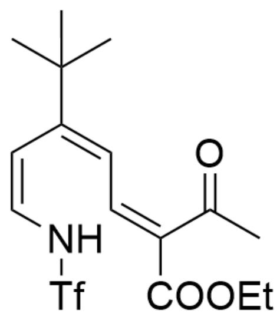

中间体3：CC(C)(C)C(/C=C\NS(=O)(C(F)(F)F)=O)=C/C=C(C(OCC)=O)\C(C)=O

# CHECKPOINT

1 PTS

中间体3：CC(C)(C)C(/C=C\NS(=O)(C(F)(F)F)=O)=C/C=C(C(OCC)=O)\C(C)=O（其中双键顺反不要紧）

接着发生六电子电环化生成一对非对映异构体，此时产物比例恰好大致约为1:1，但是两者分子式依然相同

# CHECKPOINT

1 PTS

接着发生六电子电环化生成一对非对映异构体，此时得到产物比例恰好大致约为1:1，但是两者分子式依然相同

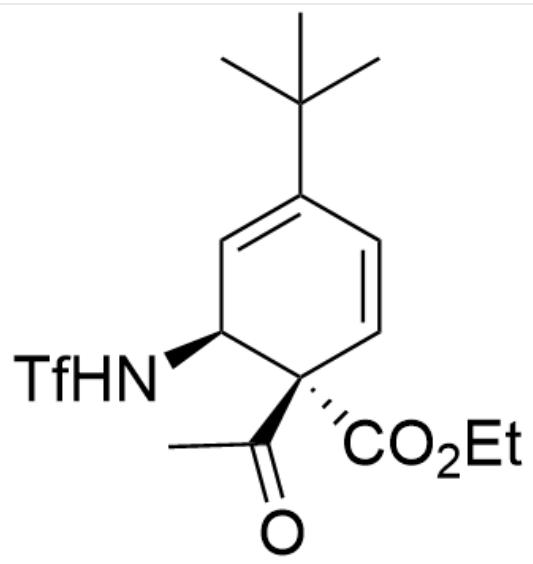  
中间体4：CC(C)(C)C1=C[C@H](NS(=O)(C(F)(F)F)=O)[C@@](C(C)=O)(C(OCC)=O)C=C1

# CHECKPOINT

1 PTS

中间体4：CC(C)(C)C1=C[C@H](NS(=O)(C(F)(F)F)=O)[C@@](C(C)=O)(C(OCC)=O)C=C1

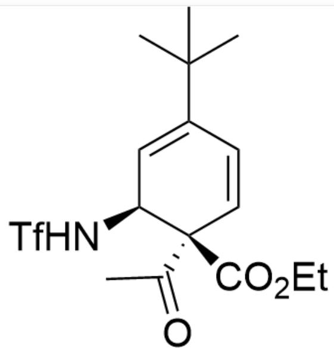  
中间体5：CC(C)(C)C1=C[C@H](NS(=O)(C(F)(F)F)=O)[C@](C(C)=O)(C(OCC)=O)C=C1

# CHECKPOINT

1 PTS

中间体5：CC(C)(C)C1=C[C@H](NS(=O)(C(F)(F)F)=O)[C@](C(C)=O)(C(OCC)=O)C=C1

此时由于酮相对于酯的亲电性更强，因此只有中间体4能进一步发生亲核-消除反应得到产物B

# CHECKPOINT

1 PTS

此时由于酮相对于酯的亲电性更强，因此只有中间体4能进一步发生亲核-消除反应得到产物B

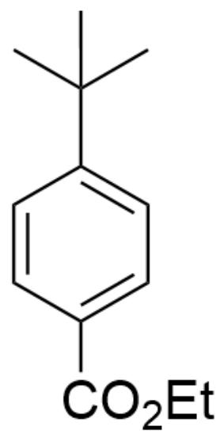

产物B：CC(C)(C)C1=CC=C(C(OCC)=O)C=C1

# CHECKPOINT

1 PTS

产物B：CC(C)(C)C1=CC=C(C(OCC)=O)C=C1

产物C即为中间体5