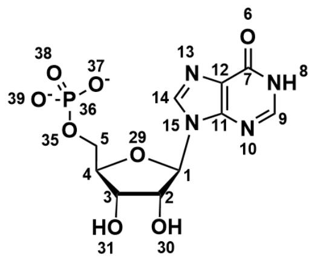
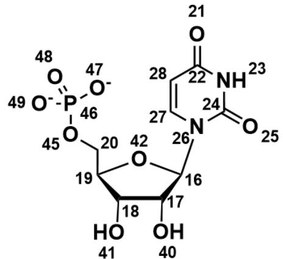
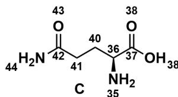
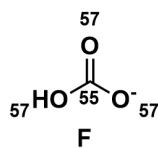
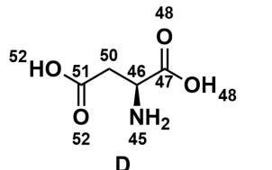
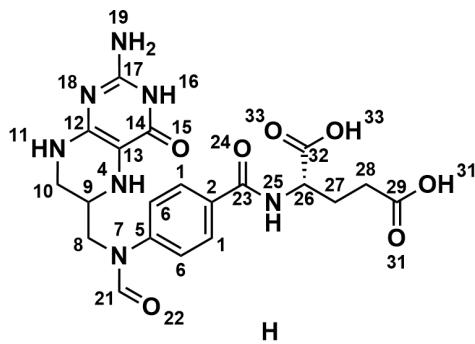
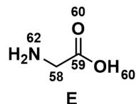

# 题目

A  
  
([CH2:5][O:35][P:36]([O:-37])([O:-38])=[O:39])[O:29]3)=[C:11]2[N:10]=[CH:9][NH:8]1；B的SMILES：[OH:40]

B  
图中，A的SMILES：[O:6]=[C:7]1[C:12]([N:13]=[CH:14][N:15]2[C@H:1]3[C@H:2][[OH:30]][[OH:H:3]][[OH:H:4]]  
  
[C@@H:17]1[C@@H:18]([OH:41])[C@@H:19]([C:20][O:45][P:46][[O:-47])([O:-49])=[O:48])[O:42][C@H:16]1[N:26]2[C:24](=

以上两个核苷酸 A (1) 和 B (2) 可以由以下物种  $\mathbf{C} \sim \mathbf{H}$  在生物体中合成:

  
[ \text{[O:25][NH:23][C:22]([O:21][C:28] = [C:27]2} ]

  
([C:23]([NH:25][C@H:26]([C:32][[OH:33])=[O:33])[CH2:27][CH2:28][C:29]([OH:31])=[O:31])=[O:24])[C:1]=[C:6]3

  
SMILES: [NH2:45][C@@H:46]([CH2:50][C:51]([OH:52])=[O:52])[C:47]([OH:48])=[O:48]; E 的 SMILES: [O:60]=[C:59]

图中，C的SMILES：[NH2:35][C@@H:36]([CH2:40][CH2:41][C:42](=[O:43])[NH2:44])[C:37](=[O:38])[OH:38]; D的  
  
([NH2:19])=[N:18]1)[C:13][(NH:4]2)=[C:12]1[NH:11][CH2:10][CH:9]2[CH2:8][N:7]([CH:21]=[O:22])[C:5]3=[C:6][C:1]=[C:2]

  
([OH:60][CH2:58][NH2:62];  $\mathbf{F}$  的SMILES:[OH:57][C:55]([O:-57])=[O:57];  $\mathbf{H}$  的SMILES：[O:15]=[C:14]([NH:16][C:17]

在  $\mathbf{C} \sim \mathbf{H}$  中相同化学环境的原子使用了相同的编号，以便进行原子对应。

请你根据核苷酸代谢途径，找出核苷酸中碱基的原子与生物体中原料物种的原子间的对应关系，记为：

$$
(b _ {i}, a _ {i})
$$

其中， $b_{i}$  是指对应关系中核苷酸中的原子编号， $a_{i}$  是指生物体中合成的原料物种中，该碱基原子对应的原料原子的编号，不同的  $b_{i}$  可能对应相同的  $a_{i}$ 。

对于每个核苷酸  $j$  中的对应关系，定义  $x_{j}$  的计算方式为：

$$
x _ {j} = \sum_ {i} (a _ {i} \times b _ {i}), \quad a _ {i} \in j
$$

请你计算  $\frac{x_1}{x_2}$  的值，结果保留四位有效数字，从以下选项中选择正确的结果，要求计算的结果与选项偏差在  $1\%$  以内，否则选择选项A：其他选项均不正确。

A. 其他选项均不正确  
B. 2.029  
C. 0.6164  
D. 0.2729  
E. 0.4434  
F. 0.4928  
G. 0.5357

H. 1.165  
1. 0.4711  
J. 1.000  
K. 0.7500

# 答案

正确答案: F

# 详细解析

要解决这道题目，首先需要识别核苷酸的种类，核苷酸 A 是次黄嘌呤核苷酸（肌苷酸） IMP，核苷酸 B 是尿嘧啶核苷酸 UMP。

# CHECKPOINT

2 PTS

核苷酸 A 是次黄嘌呤核苷酸（肌苷酸） IMP，核苷酸 B 是尿嘧啶核苷酸 UMP

其次，要确定每种原料的种类，C为谷氨酰胺，D为天冬氨酸，E为甘氨酸，F为碳酸氢根，H为甲酰四氢叶酸。

# CHECKPOINT

3 PTS

C 为谷氨酰胺, D 为天冬氨酸, E 为甘氨酸, F 为碳酸氢根, H 为甲酰四氢叶酸

接下来，找出核苷酸中碱基的原子与生物体中原料物种的原子间的对应关系。

对于 IMP/UMP 而言，可以先将传统的编号方式与题目中给出的原子编号相关联，根据传统定义的编号，结合核苷酸的生物合成知识，找出其对应的原料中对应原子的编号，可以得到如下表格：

<table><tr><td>核苷酸</td><td>题目中原子编号</td><td>传统原子编号</td><td>对应原料</td><td>对应原料原子编号</td></tr><tr><td>IMP</td><td>6</td><td>(6号碳的氧)</td><td>F中的氧</td><td>57</td></tr><tr><td>IMP</td><td>7</td><td>6</td><td>F中的碳</td><td>55</td></tr><tr><td>IMP</td><td>8</td><td>1</td><td>D中的氨基</td><td>45</td></tr><tr><td>IMP</td><td>9</td><td>2</td><td>H中的甲酰基的碳</td><td>21</td></tr><tr><td>IMP</td><td>10</td><td>3</td><td>C中酰胺的氨基</td><td>44</td></tr><tr><td>IMP</td><td>11</td><td>4</td><td>E中羧酸碳</td><td>59</td></tr><tr><td>IMP</td><td>12</td><td>5</td><td>E中羧基α-碳</td><td>58</td></tr><tr><td>IMP</td><td>13</td><td>7</td><td>E中氨基</td><td>62</td></tr><tr><td>IMP</td><td>14</td><td>8</td><td>H中的甲酰基的碳</td><td>21</td></tr><tr><td>IMP</td><td>15</td><td>9</td><td>C中酰胺的氨基</td><td>44</td></tr><tr><td>UMP</td><td>21</td><td>(4号碳的氧)</td><td>D中侧链羧基的氧</td><td>52</td></tr><tr><td>UMP</td><td>22</td><td>4</td><td>D中侧链羧基的碳</td><td>51</td></tr><tr><td>UMP</td><td>23</td><td>5</td><td>C中酰胺的氨基</td><td>44</td></tr><tr><td>UMP</td><td>24</td><td>6</td><td>F中的碳</td><td>55</td></tr><tr><td>UMP</td><td>25</td><td>(6号碳的氧)</td><td>F中的氧</td><td>57</td></tr><tr><td>UMP</td><td>26</td><td>1</td><td>D中的氨基</td><td>45</td></tr><tr><td>UMP</td><td>27</td><td>2</td><td>D中与氨基相连的碳</td><td>46</td></tr><tr><td>UMP</td><td>28</td><td>3</td><td>D中与侧链羧基的α-碳</td><td>50</td></tr></table>

# CHECKPOINT

3 PTS

IMP

中

的

对

应

关

系

$$
(b _ {6}, a _ {5 7}) / (b _ {7}, a _ {5 5}) / (b _ {8}, a _ {4 5}) / (b _ {9}, a _ {2 1}) / (b _ {1 0}, a _ {4 4}) / (b _ {1 1}, a _ {5 9}) / (b _ {1 2}, a _ {5 8}) / (b _ {1 2}, a _ {5 8}) / (b _ {1 3}, a _ {6 2}) / (b _ {1 4}, a _ {2 1}) / (b _ {1 5}, a _ {4 4})
$$

# CHECKPOINT

3 PTS

UMP 中的对应关系  $(b_{21}, a_{52}) / (b_{22}, a_{51}) / (b_{23}, a_{44}) / (b_{24}, a_{55}) / (b_{25}, a_{57}) / (b_{26}, a_{45}) / (b_{27}, a_{46}) / (b_{28}, a_{50})$

最后，根据题目中定义的  $x_{j}$  的计算方式，分别计算IMP和UMP对应的  $x_{1}$  与  $x_{2}$  的值，并求出它们的比值。

先计算  $x_{1}$  (IMP)，根据公式  $x_{j} = \sum_{i}(a_{i}\times b_{i})$  和IMP的原子对应关系表，我们有：

$$
x _ {1} = (6 \times 5 7) + (7 \times 5 5) + (8 \times 4 5) + (9 \times 2 1) + (1 0 \times 4 4) + (1 1 \times 5 9) + (1 2 \times 5 8) + (1 3 \times 6 2) + (1 4 \times 2 1) + (1 5 \times 4 4)
$$

计算每一项的乘积：

\*  $6\times 57 = 342$  
$^{*}7\times 55 = 385$  
\*  $8\times 45 = 360$  
$* 9 \times 21 = 189$  
*  ${10} \times  {44} = {440}$  
*  ${11} \times  {59} = {649}$  
*  ${12} \times  {58} = {696}$  
*  ${13} \times  {62} = {806}$  
*  ${14} \times  {21} = {294}$  
*  ${15} \times  {44} = {660}$

将所有乘积相加：

$$
x _ {1} = 3 4 2 + 3 8 5 + 3 6 0 + 1 8 9 + 4 4 0 + 6 4 9 + 6 9 6 + 8 0 6 + 2 9 4 + 6 6 0 = 4 8 2 1
$$

# CHECKPOINT

1 PTS

IMP 对应的  $x_{1} = 4821$

再计算  $x_{2}$  (UMP)，同样地，根据UMP的原子对应关系表：

$$
x _ {2} = (2 1 \times 5 2) + (2 2 \times 5 1) + (2 3 \times 4 4) + (2 4 \times 5 5) + (2 5 \times 5 7) + (2 6 \times 4 5) + (2 7 \times 4 6) + (2 8 \times 5 0)
$$

计算每一项的乘积：

*  ${21} \times  {52} = {1092}$  
*  ${22} \times  {51} = {1122}$  
*  ${23} \times  {44} = {1012}$  
*  ${24} \times  {55} = {1320}$  
*  ${25} \times  {57} = {1425}$  
*  ${26} \times  {45} = {1170}$  
$\ast 27\times 46 = 1242$  
*  ${28} \times  {50} = {1400}$

将所有乘积相加：

$$
x _ {2} = 1 0 9 2 + 1 1 2 2 + 1 0 1 2 + 1 3 2 0 + 1 4 2 5 + 1 1 7 0 + 1 2 4 2 + 1 4 0 0 = 9 7 8 3
$$

# CHECKPOINT

1 PTS

UMP对应的  $x_{2} = 9783$

计算  $\frac{x_1}{x_2}$  的值：

$$
{\frac {x _ {1}}{x _ {2}}} = {\frac {4 8 2 1}{9 7 8 3}} \approx 0. 4 9 2 7 9 \approx 0. 4 9 2 8
$$

# CHECKPOINT

1 PTS

$$
\frac {x _ {1}}{x _ {2}} = 0. 4 9 2 8
$$