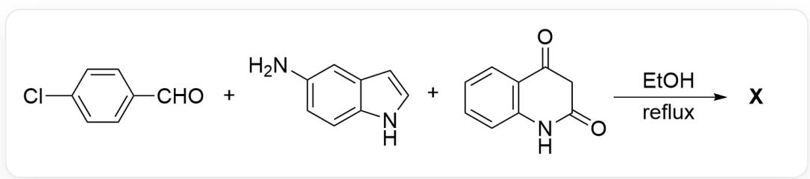
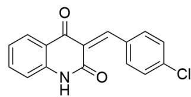
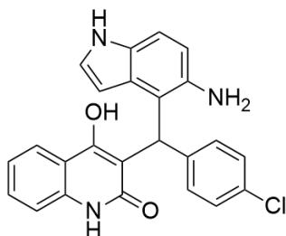
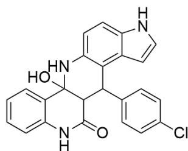
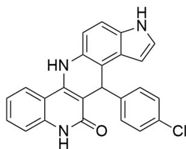

# Question

This image depicts a multicomponent organic chemical reaction:

CIC1=CC=C(C=O)C=C1.NC2=CC=C(NC=C3)C3=C2.O=C(C4=C(N5)C=CC=C4)CC5=O>CC0>[X], with the reaction condition being reflux.

The above multicomponent reaction produces product  $\mathbf{X}$  through intermediates  $\mathbf{P},\mathbf{Q},\mathbf{R}$  in sequence.

It is known that: the formation of  $\mathbf{P}$  involves a Knoevenagel condensation reaction, the formation of  $\mathbf{Q}$  involves a Michael addition reaction with the newly formed bond not containing nitrogen atoms, the reaction from  $\mathbf{R}$  to  $\mathbf{X}$  eliminates one molecule of water, and the five-membered ring of the indole moiety in product  $\mathbf{X}$  has no substituents.

Which of the following statements about intermediates  $\mathbf{P},\mathbf{Q},\mathbf{R}$  and product  $\mathbf{X}$  is correct:

A. The intermediate  $\mathbf{Q}$  has 18 hydrogen atoms in the  ${}^{1}\mathrm{H}$  NMR spectrum measured in deuterated chloroform containing acidic impurities.  
B. The intermediate  $\mathbf{R}$  features adjacent  $\mathrm{N} - \mathrm{C} - \mathrm{N}$  bonding.  
C. The product  $\mathbf{X}$  has five rings  
D. The conjugated system of product  $\mathbf{X}$  can extend over at least 12 non-hydrogen atoms.  
E. None of the above statements are correct

F. There are 2 correct answers among options A to D

# Answer

Correct Answer: D

# Detailed Explanation

The Knoevenagel condensation occurs between an aldehyde/ketone and an active methylene compound. The substrate  $\mathbf{p}$ -chlorobenzaldehyde is an aldehyde, and the C3 position of quinoline-2,4(1H,3H)-dione is an active methylene site, leading to the condensation reaction to form intermediate  $\mathbf{P}$ , with the structural formula  $\mathrm{ClC(C = C1) = CC = C1 / C = C2C(C3 = CC = CC = C3NC / 2 = O) = O}$ .

# CHECKPOINT

1 PTS

The Knoevenagel condensation occurs between an aldehyde/ketone and an active methylene compound

# CHECKPOINT

1 PTS

The structural formula of  $\mathbf{P}$  is  $\mathrm{ClC(C = C1) = CC = C1 / C = C2C(C3 = CC = CC = C3NC / 2 = O) = O}$

$\mathbf{P}$  possesses an  $\alpha-\beta$  unsaturated bond structure, which is a typical Michael acceptor, enabling nucleophilic addition by 5-aminoindole. Given the problem's hint that no new nitrogen-containing chemical bonds are formed and the indole five-membered ring in the final product lacks substituents, neither the amino group nor the 3-position of the indole acts as the nucleophilic site. In this case, the 4-position adjacent to the amino group is the most nucleophilic site, undergoing Michael addition with the substrate to yield intermediate  $\mathbf{Q}$ , with the structure  $\mathrm{ClC(C=C1)=CC=C1C(C2=C3C=CNC3=CC=C2N)C4=C(O)C5=CC=CC=C5NC4=O}$ .

# CHECKPOINT

1 PTS

Neither the amino group nor the 3-position of the indole acts as the nucleophilic site; the 4-position adjacent to the amino group is the most nucleophilic site

# CHECKPOINT

1 PTS

The structure of  $\mathbf{Q}$  is  $\mathrm{ClC(C = C1)} = \mathrm{CC} = \mathrm{C1C(C2 = C3C = CNC3 = CC = C2N)C4 = C(O)C5 = CC = CC = C5NC4 = O}$

At this stage,  $\mathbf{Q}$  primarily exists in the enol form to satisfy aromaticity. The hydroxyl hydrogen of the enol form undergoes hydrogen-deuterium exchange in deuterated chloroform containing acidic impurities (thoroughly dried and purified deuterated chloroform can reveal the labile hydrogen), causing the peak to disappear in the NMR spectrum. Thus, only 17 hydrogens are observed in the NMR, making option A incorrect.

# CHECKPOINT

1 PTS

$\mathbf{Q}$  primarily exists in the enol form to satisfy aromaticity

# CHECKPOINT

1 PTS

The hydroxyl hydrogen of the enol form undergoes hydrogen-deuterium exchange in deuterated chloroform

$\mathbf{Q}$  contains both an amino group and a carbonyl group, enabling an intramolecular nucleophilic substitution reaction to form  $\mathbf{R}$ . The reactivity of amides is inferior to that of ketones, so the structural formula of  $\mathbf{R}$  is

$\mathrm{ClC(C = C1) = CC = C1C(C2 = C3C = CNC3 = CC = C2N4)C5C4(O)C6 = CC = CC = C6NC5 = O.}$  This structure lacks adjacent N-C-N bonding, making option B incorrect.

# CHECKPOINT

1 PTS

Q contains both an amino group and a carbonyl group, enabling an intramolecular nucleophilic substitution reaction

# CHECKPOINT

1 PTS

The

structural

formula

of

R

is

$\mathrm{ClC(C = C1) = CC = C1C(C2 = C3C = CNC3 = CC = C2N4)C5C4(O)C6 = CC = CC = C6NC5 = O}$

$\mathbf{R}$  undergoes dehydration and aromatization to yield the final product  $\mathbf{X}$ , whose structural formula is  $\mathrm{ClC(C = C1) = CC = C1C(C2 = C3C = CNC3 = CC = C2N4)C5 = C4C6 = CC = CC = C6NC5 = O.}$

# CHECKPOINT

1 PTS

The

structural

formula

of

X

is

$\mathrm{CIC(C = C1) = CC = C1C(C2 = C3C = CNC3 = CC = C2N4)C5 = C4C6 = CC = CC = C6NC5 = O}$

X contains six rings, making option C incorrect. The quinoline conjugated system in X includes at least 12 atoms, including the imine nitrogen atom, making option D correct.

# CHECKPOINT

1 PTS

X contains six rings

# CHECKPOINT

1 PTS

The quinoline conjugated system in  $\mathbf{X}$  includes at least 12 atoms, including the imine nitrogen atom

In conclusion, option D is correct.

  
P

  
Q

  
R

  
X

This figure depicts the structural formulas of the four unknown compounds involved in the problem. The structural

formula of  $\mathbf{\Pi}^{**}\mathbf{P}^{**}$  is CIC(C=C1)=CC=C1/C=C2C(C3=CC=CC=C3NC/2=O)=O,  $\mathbf{\Pi}^{**}\mathbf{Q}^{**}$  is

CIC(C=C1)=CC=C1C(C2=C3C=CNC3=CC=C2N)C4=C(O)C5=CC=CC=C5NC4=O, **R** is

CIC(C=C1)=CC=C1C(C2=C3C=CNC3=CC=C2N4)C5C4(O)C6=CC=CC=C6NC5=O, and \*\*X\*\* is

CIC(C=C1)=CC=C1C(C2=C3C=CNC3=CC=C2N4)C5=C4C6=CC=CC=C6NC5=O.