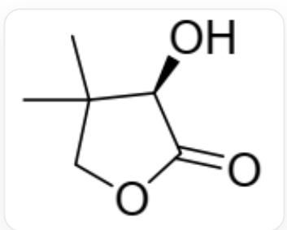
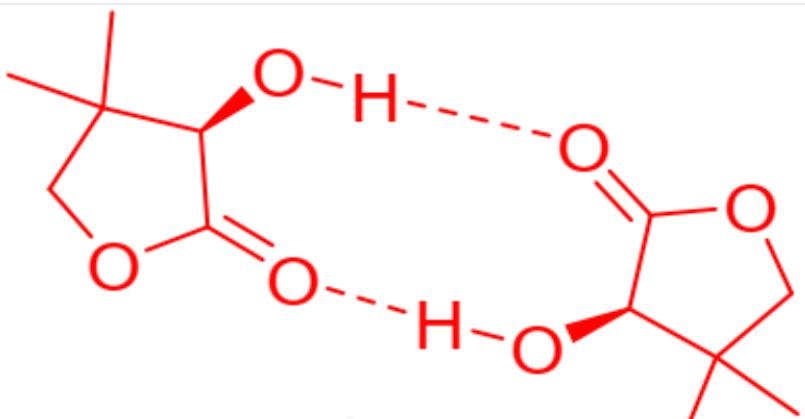

# 题目

化合物A可发生二聚形成  $\mathrm{A}_2$  ，该二聚反应构成如下平衡：

$$
2 \mathbf {A} \rightleftarrows \mathbf {A} _ {2} \quad K _ {c} ^ {\theta}
$$

反应的平衡常数可通过偏振法测得, 其原理是测定溶液中反应达到平衡时的比旋光度  $[\alpha]_{\mathrm{D}}$

以此计算得到反应平衡常数  $K_{c}^{\circ}$  。已知反应达到平衡时  $[\alpha]_{\mathrm{D}}$  满足如下关系式:

$$
[ \alpha ] _ {\mathrm {D}} = x _ {1} ^ {2} [ \alpha ] _ {1} + x _ {2} ^ {2} [ \alpha ] _ {2}
$$

其中  $x_{1}$  和  $x_{2}$  为对应物种的摩尔分数,  $[\alpha]_{1}$  和  $[\alpha]_{2}$  为对应物种单独存在时的比旋光度。

1.化合物A的结构如图1所示，本题需要推测其二聚体  $\mathbf{A}_2$  的结构。

  
Fig. 1, 该分子以SMILES描述为: CC1(C)COC(=O)[C@@H]1O

2.在室温下, 总浓度为  $8.0 \mathrm{mmol} / \mathrm{L}$  的化合物  $\mathrm{A}$  在  $\mathrm{CCl}_{4}$  溶剂中达到

平衡, 测得体系的比旋光度

$$
[ \alpha ] _ {\mathrm {D}} = - 6 \deg \mathrm {d m} ^ {- 1} \mathrm {g} ^ {- 1} \mathrm {m L} 。
$$

化合物A和二聚

体  $\mathbf{A}_{2}$  单独存在时的比旋光度分别为

$$
[ \alpha ] _ {1} = - 1 \deg \mathrm {d m} ^ {- 1} \mathrm {g} ^ {- 1} \mathrm {m L}
$$

$$
[ \alpha ] _ {2} = - 2 0 3
$$

$$
\mathrm {d e g} \mathrm {d m} ^ {- 1} \mathrm {g} ^ {- 1} \mathrm {m L}
$$

忽略体系中可能存在的其他物种, 计算该二聚反应的平衡常数  $K_{c}^{\circ}$  。

有以下几种说法：

1. A二聚时形成了共价键  
2. 二聚体  $\mathbf{A}_2$  中不包含  $C_2$  对称轴  
3.二聚反应的平衡常数  $K_{c}^{\circ} = 33.5$  
4. 二聚反应的平衡常数  $K_{c}^{\circ} = 3.33$  
5.二聚反应的平衡常数  $K_{c}^{\circ} = 28.7$

选项中说法均正确的是？

A. 1  
B. 2  
C. 3  
D. 4  
E. 5

F. 1,3  
G. 1,4  
H. 1,5  
1. 2,3  
J. 2,4  
K. 2,5  
L. 1,2  
M. 1,2,3  
N. 1,2,4  
O. 1,2,5  
P. 2,3,4  
Q. 2,3,5  
R. 3,4,5  
S. 1,2,3,4

T. 1,2,4,5  
U. 2,3,4,5  
V. 1,3,4,5  
W. 1,2,3,4,5  
X. 以上选项均不正确

# 答案

正确答案: C

# 详细解析

观察化合物A的结构，它含有：

羟基  $(-OH)$

炭基  $(\mathrm{C} = 0)$

这两个官能团可以通过氢键相互作用。二聚体  $\mathrm{A}_2$  最可能通过分子间氢键形成，即一个分子的  $(-OH)$  与另一个分子的  $(\mathrm{C} = \mathrm{O})$  形成氢键，形成环状二聚体结构如下图，二聚过程未形成共价键，说法1错误。这两个单体由氢键连接，共形成两个  $\mathrm{C} = \mathrm{O}\dots \mathrm{H} - \mathrm{O}$  氢键，该结构具有  $C_2$  对称性，因此2错误。（另外一种形式是发生分子间酯交换形成六元环，产物结构以SMILES表示为：CC(CO)([C@@H](OC([C@H](O1)C(CO)(C)C)=O)C1=O)C，但是该过程与分子内形成五元环酯键相比熵不利。）

# CHECKPOINT

1 PTS

分子间酯交换形成六元环二聚是熵不利的

图片为二聚体  $\mathbf{A}_{2}$  的结构，其中化合物  $\mathbf{A}$  单体不变，  $\mathbf{A}$  以SMILES描述为：CC1(C)COC(=O)[C@@H]1O，两个单体间通过羟基(-OH)羰基  $(\mathrm{C} = \mathrm{O})$  这两个单体由氢键连接，共形成两个  $\mathrm{C} = \mathrm{O}\dots \mathrm{H} - \mathrm{O}$  氢键。这张图片是一张化学结构示意图，其中包含两个互为镜像的分子结构，它们通过两条虚线相互作用。每个分子结构的核心是一个五元环，环内包含两个氧原子，以字母“O”表示。其中一个环内氧原子与一个羰基（碳氧双键）相邻，形成了内酯结构，该羰基的氧原子也用字母“O”表示。在每个五元环上，都有一个碳原子通过实心楔形键连接着一个羟基，该羟基由一个氧原子“O”和一个氢原子“H”组成。环上的另一个碳原子连接着两个甲基基团，由短线段表示。图像中心的相互作用由两条虚线表示：左侧分子的羟基氢原子“H”与右侧分子的羰基氧原子“O”之间有一条虚线；同时，右侧分子的羟基氢原子“H”与左侧分子的羰基氧原子“O”之间也有一条虚线。图中所有的化学键均由实线表示，除了表示分子间相互作用的虚线、表示立体化学的楔形键以及表示碳氧双键的双线。

# CHECKPOINT

1 PTS

A 通过氢键二聚

# CHECKPOINT

1 PTS

二聚体具有  $C_2$  对称性。

设  $\mathbf{A}$  和  $\mathbf{A}_2$  的摩尔分数分别为  $x_{1}$  和  $x_{2}$ ，其中  $x_{1} + x_{2} = 1$ 。

将已知的比旋光度数据带入  $[\alpha]_{\mathrm{D}} = x_1^2 [\alpha]_1 + x_2^2 [\alpha]_2$  得:  $-x_1^2 - 203x_2^2 = -6$

联立上述二式, 解得  $x_{1} = 0.838, x_{2} = 0.161$

# CHECKPOINT

1 PTS

A的摩尔分数  $= 0.838$  ，  $\mathbf{A}_2$  的摩尔分数  $= 0.161$

又  $c(\mathbf{A}) + 2c(\mathbf{A}_2) = 0.0080\mathrm{mol / L}$ , 联立解得  $c(\mathbf{A}) = 5.78\times 10^{-3}\mathrm{mol / L}$

故  $K_{c}^{\theta} = c(\mathbf{A}_{2}) \times c^{\theta} / [c(\mathbf{A})]^{2} = (1.12 \times 10^{-3}) / (5.78 \times 10^{-3})^{2} = 33.5$

说法3正确，4，5均错误，从而选项C正确。

# CHECKPOINT

1 PTS

平衡常数  $K_{c}^{\circ} = 33.5$