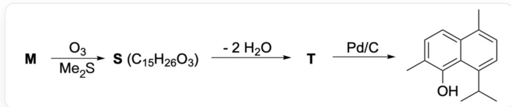
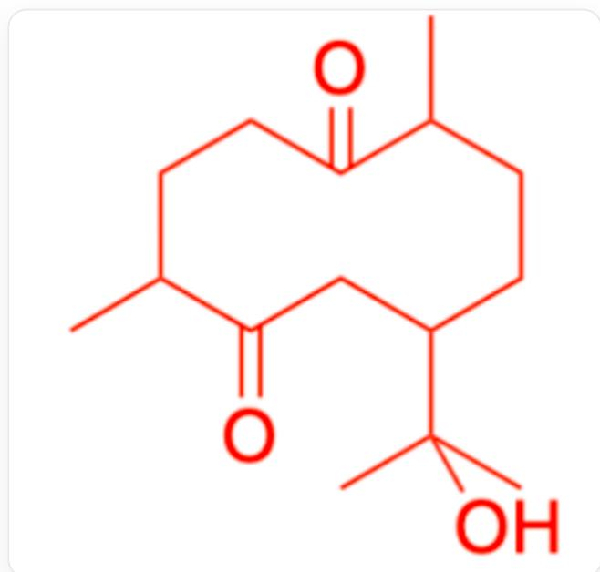
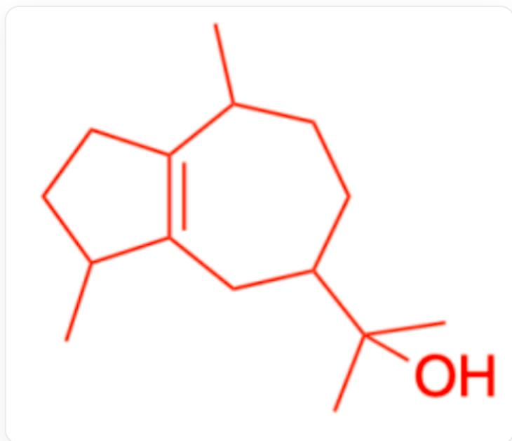
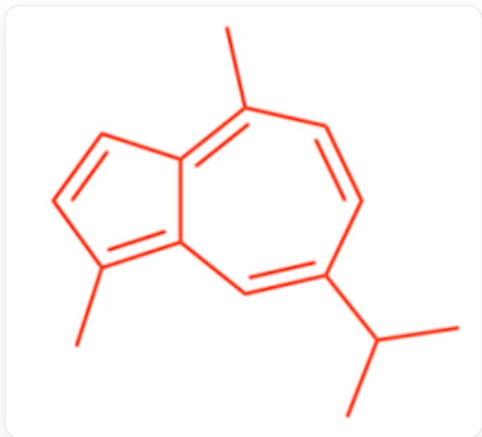

# Question

Ozonolysis is often used for the determination of organic structures. Compound  $\mathbf{M}$  ( $\mathrm{C_{15}H_{26}O}$ ) is an alcohol that is difficult to hydrogenate catalytically. When  $\mathbf{M}$  is treated with sulfur, an aromatic compound  $\mathbf{R}$  ( $\mathrm{C_{15}H_{18}}$ ) is ultimately obtained. Ozonolysis of  $\mathbf{M}$  followed by additional treatments yields a naphthalene derivative, as shown in the following reaction:

  
The reaction is represented by SMILES:  $[\mathsf{M}][\mathsf{O} - ][\mathsf{O} + ] = \mathsf{O}.\mathsf{C}\mathsf{s}\mathsf{C} > [\mathsf{S}]$  
[T]>Pd/C>CC(C)C1=CC=C(C)C2=CC=C(C)C(=C21)O, where [S] and [T] are compound designations rather than elemental symbols. The chemical formula of [S] is  $\mathrm{C_{15}H_{26}O_3}$ , and the conversion from [S] to [T] involves the elimination of two molecules of water

It is known that the hydroxyl group in  $\mathbf{M}$  is located on a tertiary carbon outside the ring. Based on this, determine which of the following options are correct:

1.  $\mathbf{M}$  has 3 chiral carbons.  
2.  $\mathbf{M}$  has 4 chiral carbons.  
3. M contains two six-membered rings, and the double bond is in the cis configuration.  
4. M contains two six-membered rings, and the double bond is in the trans configuration.  
5. M contains one five-membered ring and one seven-membered ring, and the double bond is in the cis configuration.  
6. M contains one five-membered ring and one seven-membered ring, and the double bond is in the trans configuration.  
7. M contains one six-membered ring and two double bonds.

8. In  $\mathbf{R}$ , a maximum of 12 carbons lie in the same plane.  
9. In  $\mathbf{R}$ , a maximum of 13 carbons lie in the same plane.  
10. The conversion from  $\mathbf{T}$  to the product involves the elimination of 1 molecule of  $\mathrm{H}_{2}$ .  
11. The conversion from  $\mathbf{T}$  to the product involves the elimination of 2 molecules of  $\mathrm{H}_{2}$ .  
12. The conversion from  $\mathbf{T}$  to the product involves the elimination of 3 molecules of  $\mathrm{H}_{2}$ .

A. 1,3,8,10  
B. 1,4,9,11  
C. 1, 7, 10  
D. 1,6,11  
E. 1,5,9  
F. 1,6,9,11  
G. 1,4,8,11  
H. 1, 7, 12  
I. 2,6,9,11  
J. 2,6,11  
K. 2,5,12

L. 2,3,8,10  
M. 2,7,12  
N. 3,9,10  
O. 6,8,11  
P. 7, 11  
Q. 5, 12  
R. None of the above options is correct

# Answer

Correct Answer: D

# Detailed Explanation

$\mathbf{M}$  is converted to  $\mathbf{S}$  via ozonolysis with unchanged carbon count, indicating the cleavage of an internal double bond in the ring.

# CHECKPOINT

1 PTS

The cleavage from  $\mathbf{M}$  to  $\mathbf{S}$  involves an internal double bond in the ring

Ozonolysis does not alter hydroxyl groups, so S still retains a hydroxyl group. It can be inferred that the two dehydration steps from S to T consist of one aldol condensation + elimination and one elimination reaction.

# CHECKPOINT

1 PTS

The two dehydration steps from  $\mathbf{S}$  to  $\mathbf{T}$  consist of one aldol condensation + elimination and one elimination reaction

From the chemical formula of  $\mathbf{S}$ , it is known that  $\mathbf{T}$  has the formula  $\mathrm{C_{15}H_{22}O}$ , while the product formula is  $\mathrm{C_{15}H_{18}O}$ , indicating the loss of 2 molecules of  $\mathrm{H}_{2}$ . Thus, option 11 is correct, while options 10 and 12 are incorrect.

# CHECKPOINT

1 PTS

The conversion from  $\mathbf{T}$  to the product involves the loss of 2 molecules of  $\mathrm{H}_{2}$

It is evident that the ring skeleton of  $\mathbf{T}$  remains unchanged in the product. According to the question, the hydroxyl group in  $\mathbf{M}$  is located on a tertiary carbon outside the ring. Therefore, the hydroxyl group in  $\mathbf{M}$  and  $\mathbf{S}$  can only reside on the carbon corresponding to the sole tertiary carbon in the product.

# CHECKPOINT

1 PTS

The hydroxyl group in  $\mathbf{M}$  and  $\mathbf{S}$  can only reside on the carbon corresponding to the sole tertiary carbon in the product

The product is a fused ring system formed via aldol condensation. The shared C-C bond between the two rings can be cleaved, and the carbonyl oxygen is connected to the end farther from the -OH group. Based on the chemical formula and degree of unsaturation of S, its structure is determined as:

$$
\mathrm {C C 1 C C C} (\mathrm {C C} (= \mathrm {O}) \mathrm {C} (\mathrm {C}) \mathrm {C C C} 1 = \mathrm {O}) \mathrm {C} (\mathrm {C}) (\mathrm {C}) \mathrm {O}
$$

# CHECKPOINT

1 PTS

S is CC1CCC(CC(=O)C(C)CCC1=O)C(C)(C)O

Ozonolysis cleaves double bonds into two carbonyl groups, so the structure of  $\mathbf{M}$  can be deduced from S:

  
CC1CCC(CC2=C1CCC2C)C(C)(C)O

# CHECKPOINT

1 PTS

M is CC1CCC(CC2=C1CCC2C)C(C)(C)O

The difficulty in catalytic hydrogenation is due to the double bond in  $\mathbf{M}$  being tetrasubstituted, with bulky groups hindering its interaction with the catalyst surface.

Evidently, after sulfur treatment,  $\mathbf{M}$  transforms into the aromatic  $\mathbf{R}$ :

  
CC(C)C1=CC2=C(C)C=CC2=C(C)C=C1

# CHECKPOINT

1 PTS

R is CC(C)C1=CC2=C(C)C=CC2=C(C)C=C1

The correctness of the options can now be determined:

From  $\mathbf{M}$  being CC1CCC(CC2=C1CCC2C)C(C)(C)O, it is clear that  $\mathbf{M}$  has 3 chiral carbons, making option 1 correct and 2 incorrect.  $\mathbf{M}$  contains one five-membered ring and one seven-membered ring, with the double bond in a trans configuration, so option 6 is correct, while options 3, 4, 5, and 7 are incorrect.

# CHECKPOINT

1 PTS

M has 3 chiral carbons

# CHECKPOINT

1 PTS

M contains one five-membered ring and one seven-membered ring, with the double bond in a trans configuration

From  $\mathbf{R}$  being CC(C)C1=CC2=C(C)C=CC2=C(C)C=C1 and the tetrahedral geometry of  $sp^3$  carbons, it follows that a maximum of 14 carbons in  $\mathbf{R}$  can lie in the same plane. Thus, options 8 and 9 are incorrect.

# CHECKPOINT

1 PTS

A maximum of 14 carbons in  $\mathbf{R}$  can lie in the same plane

In summary, options 1, 6, and 11 are correct, and the answer is D.