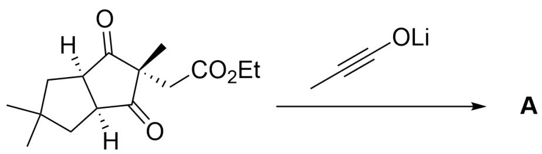
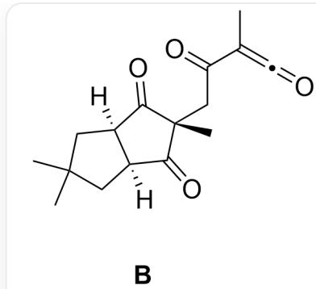
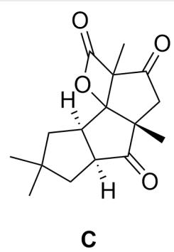
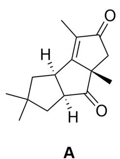

# Question

$\mathrm{O = C1[C@](C)(CC(OCC) = O)C([C@@]2([H])CC(C)(C)[C@]21[H]) = O > CC\# CO[Li] > [^* ]}$

The product  $\mathbf{A}$  generated by the above reaction contains three five-membered rings. The formation of this product sequentially goes through two key electroneutral intermediates  $\mathbf{B}$  and  $\mathbf{C}$ .

It is known that LiOEt is produced simultaneously with the generation of  $\mathbf{B}$ .

Which of the following statements is correct:

A. All other options are incorrect  
B. B contains three rings  
C. C contains three rings  
D. A produces only one small molecule, LiOEt , simultaneously.  
E. The degree of unsaturation of the product of the reaction of A with  $\mathrm{O}_{3}, \mathrm{Zn} / \mathrm{MeOH}$  is 6  
F. A contains four chiral carbon atoms

# Answer

Correct Answer: E

# Detailed Explanation

Lithium acetyllide is similar to an enolate anion and has strong nucleophilicity. Because LiOEt is produced, it can be determined that the ethyl ester group in the substrate is nucleophilically attacked by the acetylride anion to form a ketene structure. Therefore, intermediate B is O=C1[C@](C)(CC(C(C)=C=O)=O)C([C@@]2([H])CC(C) (C)C[C@]21[H])=O.

# CHECKPOINT

1 PTS

Lithium acetylide is similar to an enolate anion and has strong nucleophilicity

# CHECKPOINT

1 PTS

The ethyl ester group in the substrate is nucleophilically attacked by the acetylride anion to form a ketene structure

# CHECKPOINT

1 PTS

B is  $O = C1[C@](C)(CC(C(C) = C = O) = O)C([C@@]2([H])CC(C)(C)C[C@]21[H]) = O$

Ketene has strong electrophilicity. According to the hint that product A has three five-membered rings, B is highly likely to undergo ring formation; considering an intramolecular reaction, the intramolecular carbonyl oxygen atom nucleophilically attacks ketene to form an enolate anion, and the enolate anion then nucleophilically attacks the carbonyl group, which is positively charged at this time, to form a five-membered ring and a four-membered ring structure. Therefore, C is O=C1[C@@]2([H])CC(C)(C)C[C@@]2([H])C3(O4)[C@]1(C)CC(C3(C)C4=O)=O.

# CHECKPOINT

2 PTS

C is  $O = C1[C@@]2([H])CC(C)(C)C[C@@]2([H])C3(O4)[C@]1(C)CC(C3(C)C4 = O) = 0$

According to the structural formula,  $\mathbf{C}$  contains four rings and  $\mathbf{B}$  contains two rings, so options B and C are incorrect.

# CHECKPOINT

1 PTS

C contains four rings and B contains two rings

The four-membered fused lactone structure is extremely unstable and easily loses carbon dioxide to form a double bond. Combined with the hint of three five-membered rings, the final product A structure is O=C([C@@]1(C)C2) [C@@]3([H])CC(C)(C)C[C@@]3([H])C1=C(C)C2=O. A has three chiral carbons, so option F is incorrect.

# CHECKPOINT

1 PTS

The four-membered fused lactone structure is extremely unstable and easily loses carbon dioxide to form a double bond

# CHECKPOINT

1 PTS

A structure is  $\mathrm{O = C([C@]1(C)C2)[C@]3([H])CC(C)(C)C[C@]3([H])C1 = C(C)C2 = 0}$

The reaction produces two small molecules,  $\mathrm{CO}_{2}$ , LiOEt, so option D is incorrect.

# CHECKPOINT

1 PTS

The reaction produces two small molecules,  $\mathrm{CO}_{2}$ , LiOEt

The final product A undergoes ozonolysis, and the five-membered ring opens to give two carbonyl groups. The product contains four carbonyl groups and two five-membered rings, and the degree of unsaturation is 6, so option E is correct.

# CHECKPOINT

1 PTS

A undergoes ozonolysis, the product unsaturation degree is 6

  
B is  $O = C1[C@](C)(CC(C(C) = C = O) = O)C([C@@]2([H])CC(C)(C)C[C@]21[H]) = O$  ; C is  $O = C1[C@@]2([H])CC(C)(C)C[C@@]2([H])C3(O4)[C@@]1(C)CC(C3(C)C4 = O) = O$  ; A structure is  $O = C([C@@]1(C)C2)[C@@]3([H])CC(C)(C)C[C@@]3([H])C1 = C(C)C2 = O$  。

