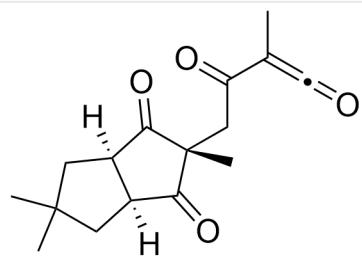
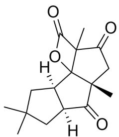
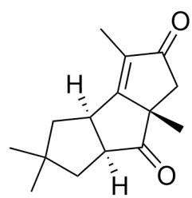

# 题目

$\mathrm{O = C1[C@](C)(CC(OCC) = O)C([C@]2([H])CC(C)(C)[C@]21[H]) = O > CC\# CO[Li] > [^* ]}$

如上反应产生的产物 A 含有三个五元环。该产物的形成依次经过了两个关键的电中性中间体 B 和 C 。

已知产生B的同时产生了LiOEt。

下列说法正确的是：

A. 其他选项均不正确  
B. B 含有三个环  
C. C含有三个环  
D. A 产生同时只产生了 LiOEt 一种小分子  
E. A 与  $\mathrm{O}_{3}, \mathrm{Zn} / \mathrm{MeOH}$  反应的产物的不饱和度为  $6$  
F. A 含有四个手性碳原子

# 答案

正确答案: E

# 详细解析

炔醇锂类似于烯醇负离子，具有强亲核性，由于产生了LiOEt，所以可以判断底物中乙酯基被炔醇负离子亲核，生成烯酮结构。因此中间体B为  $\mathrm{O = C1[C@](C)(CC(C(C) = C = O) = O)C([C@@]2([H])CC(C)}$  (C)C[C@]21[H])=O。

# CHECKPOINT

1 PTS

炔醇锂类似于烯醇负离子，具有强亲核性

# CHECKPOINT

1 PTS

底物中乙酯基被炔醇负离子亲核，生成烯酮结构

# CHECKPOINT

1 PTS

B 为  $O = C1[C@](C)(CC(C(C) = C = O) = O)C([C@@]2([H])CC(C)(C)C[C@]21[H]) = O$

烯酮具有强亲电性，根据产物A有三个五元环的提示，B很大概率需要成环；考虑分子内反应，分子内羰基氧原子亲核烯酮形成烯醇负离子，烯醇负离子再去亲核此时具有正电性的羰基，可形成五元环并四元环的结构。因此C为O=C1[C@@]2([H])CC(C)(C)C[C@@]2([H])C3(O4)[C@]1(C)CC(C3(C)C4=O)=O。

# CHECKPOINT

2 PTS

C为O=C1[C@@]2([H])CC(C)(C)C[C@@]2([H])C3(O4)[C@]1(C)CC(C3(C)C4=O)=O

根据结构式可知C含有四个环，B含有两个环，选项B,C错误。

# CHECKPOINT

1 PTS

C 含有四个环，B 含有两个环

四元并环内酯结构极其不稳定，容易脱去二氧化碳形成双键，结合三个五元环提示，最终产物A结构为O=C([C@@]1(C)C2)[C@@]3([H])CC(C)(C)C[C@@]3([H])C1=C(C)C2=O。A具有三个手性碳，选项F错误。

# CHECKPOINT

1 PTS

四元并环内酯结构极其不稳定，容易脱去二氧化碳形成双键

# CHECKPOINT

1 PTS

A 结构为  $O = C([C@@]1(C)C2)[C@@]3([H])CC(C)(C)C[C@@]3([H])C1 = C(C)C2 = O$

反应产生了  $\mathrm{CO}_{2}, \mathrm{LiOEt}$  两种小分子，选项D错误。

# CHECKPOINT

1 PTS

反应产生了  $\mathrm{CO}_{2}, \mathrm{LiOEt}$  两种小分子

最终产物A发生臭氧化反应，五元环开环得到两个羰基，产物含有四个羰基和两个五元环，不饱和度为6，选项E正确。

# CHECKPOINT

1 PTS

A 发生臭氧化反应，产物不饱和度为6

  
B

  
C

  
A

B为O=C1[C@](C)(CC(C(C)=C=O)=O)C([C@@]2([H])CC(C)(C)C[C@]21[H])=O；C为O=C1[C@@]2([H])CC(C)

(C)C[C@@]2([H])C3(O4)[C@]1(C)CC(C3(C)C4=O)=O; A结构为O=C([C@@]1(C)C2)[C@@]3([H])CC(C)

(C)C[C@@]3([H])C1=C(C)C2=O。