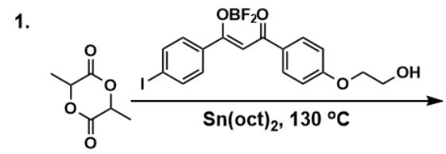
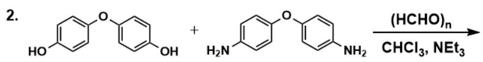
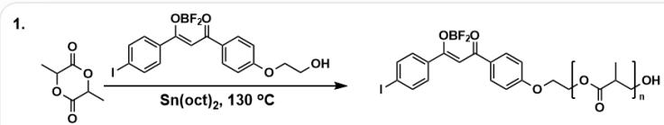
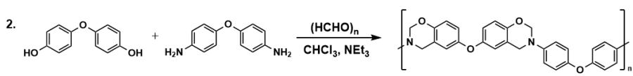
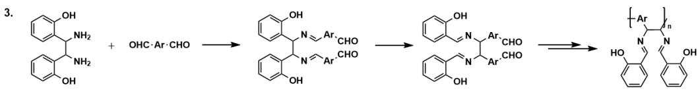

# 题目

对于以下聚合反应，有如下信息：

  
图中有三个化学反应。1为

$$
\begin{array}{r l} & \text {O = C (C (C) O 1) O C (C) C 1 = O > I C 2 = C C = C / C (O B (F) F) = C / C (C 3 = C C = C (O C C O) C = C 3) = O) C = C 2 > ,} \\ & \text {条 件 为} \\ & \mathrm {S n (o c t)} _ {2}, 1 3 0 ^ {\circ} \mathrm {C}; 2 \text {为} \end{array}
$$

$$
O C 1 = C C = C (O C 2 = C C = C (O) C = C 2) C = C 1. N C 3 = C C = C (O C 4 = C C = C (N) C = C 4) C = C 3 > >, \text {条 件 为}
$$

$$
\text {E x t r a c l o s e b r a c e o r m i s s i n g o p e n b r a c e ; 3 为 O C 1 = C C = C C = C 1 C (C (C 2 = C C = C C = C 2 O) N) N . O = C [ A r ] C = O > >}
$$

$$
[ ^ {*} ], \text {随 后 产 物} \mathbf {A} \text {一 步 生 成} \mathbf {B} \text {后 多 步 生 成} \mathbf {C}
$$

1. 反应2中两种底物和甲醛以1:1:4反应，得到链状聚合物。产物的  ${ }^{1} \mathrm{H}$  NMR显示结构中不含活泼氢。注：该比例按照甲醛单体计算。  
2. 反应3通过缩合和周环反应得到了一个侧基为经典salen配体的聚合物。

下列说法中错误的是（若均正确，选择A）

A. 其他选项均不正确

B. 反应1中, 高分子产物1个重复单元含有9个原子  
C. 反应1为加聚反应  
D. 反应2中, 高分子产物1个重复单元含有6个环  
E. 反应3中, 周环反应具体为  $[3,3] \sigma$  迁移反应  
F. 反应3为缩聚反应

# 答案

正确答案: A

# 详细解析

以下解析中的高分子重复单元利用SMILES表示时，R1和R2代表高分子重复单元的端基。

对于反应1， $\mathrm{IC2 = CC = C / (C(OB(F)F) = C / C(C3 = CC = C(OCCO)C = C3) = O)C = C2}$  为引发剂，作为端基，引发了 $\mathrm{O = C(C(C)O1)OC(C)C1 = O}$  的加聚，产物中重复单元为[R1]OC(C([R2])C)=O，端基R1和R2分别为羟基和 $\mathrm{IC1 = CC = C / (C(OB(F)F) = C / C(C2 = CC = C(OCCO[R])C = C2) = O)C = C1}$  。因此，重复单元含有9个原子，B正确；加聚反应，C正确。

# CHECKPOINT

1 PTS

反应1产物中重复单元为[R1]OC(C([R2])C)=O

# CHECKPOINT

1 PTS

端基R1和R2分别为羟基和IC1=CC=C(/C(OB(F)F)=C/C(C2=CC=C(OCCO[R])C=C2)=O)C=C1

对于反应2，由于反应比例为1:1:4，可以判断1分子底物会和4分子甲醛反应，发生4步Mannich反应，形成聚合物中，重复复单元为CC1=CC=C(OC2=CC=C(N3CC4=CC(OC5=CC6=C(OCN(C6)C)=C5)=CC=C4OC3)C=C2)C=C1，含有6个环，D正确。

# CHECKPOINT

1 PTS

反应 2 产 物 重 复 单 元 为

CC1=CC=C(OC2=CC=C(N3CC4=CC(OC5=CC6=C(OCN(C6)C)=C5)=CC=C4OC3)C=C2)C=C1

对于反应3，根据提示发生了缩合和周环反应。A为缩合产物 $\mathrm{OC1 = C(C / N = C / [Ar]C = O)C / N = C / [Ar]C = O)C2 = C(O)C = CC = C2)C = CC = C1}$

# CHECKPOINT

1 PTS

A 为OC1=C(C(/N=C/[Ar]C=O)C(/N=C/[Ar]C=O)C2=C(O)C=CC=C2)C=CC=C1

$\mathbf{A} \rightarrow \mathbf{B}$  为周环反应，此时  $\mathbf{A}$  的结构中发生cope重排，可以形成salen配体类似物，E正确。  $\mathbf{B}$  为OC1=C(/C=N/C([Ar]C=O)C(/N=C/C2=CC=CC=C2O)[Ar]C=O)C=CC=C1。

# CHECKPOINT

1 PTS

A的结构中发生cope重排

# CHECKPOINT

1 PTS

B 为OC1=C(/C=N/C([Ar]C=O)C(/N=C/C2=CC=CC=C2O)[Ar]C=O)C=CC=C1

随后  $\mathbf{B}\rightarrow \mathbf{C}$  通过羟醛缩合聚合，为缩合反应，F正确。产物的重复单元为[R2][Ar]C(/N=C/C1=C(O)C=CC=C1)C(/N=C/C2=C(O)C=CC=C2)[R1]。

# CHECKPOINT

1 PTS

反应3产物的重复单元为 [R2][Ar]C(/N=C/C1=C(O)C=CC=C1)C(/N=C/C2=C(O)C=CC=C2)[R1]

因此，说法均正确，选择A。

三个反应过程及产物如本图所示。反应1产物中重复单元为[R1]OC(C([R2])C)=O，端基R1和R2分别为羟基和IC1=CC=C(/C(OB(F)F)=C/C(C2=CC=C(OCCO[R])C=C2)=O)C=C1；反应2产物重复单元为

$$
C C 1 = C C = C (O C 2 = C C = C (N 3 C C 4 = C C (O C 5 = C C 6 = C (O C N (C 6) C) C = C 5) = C C = C 4 O C 3) C = C 2) C = C 1; \text {反 应} 3 \text {中 ，} A
$$

为OC1=C(C(/N=C/[Ar]C=O)C(/N=C/[Ar]C=O)C2=C(O)C=CC=C2)C=CC=C1；B为

OC1=C(/C=N/C([Ar]C=O)C(/N=C/C2=CC=CC=C2O)[Ar]C=O)C=CC=C1；产物的重复单元为 [R2]

$$
[ \mathrm {A r} ] \mathrm {C} / (\mathrm {N} = \mathrm {C} / \mathrm {C} 1 = \mathrm {C} (\mathrm {O}) \mathrm {C} = \mathrm {C C} = \mathrm {C} 1) \mathrm {C} / (\mathrm {N} = \mathrm {C} / \mathrm {C} 2 = \mathrm {C} (\mathrm {O}) \mathrm {C} = \mathrm {C C} = \mathrm {C} 2) [ \mathrm {R} 1 ]
$$