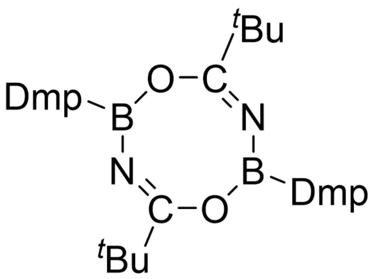
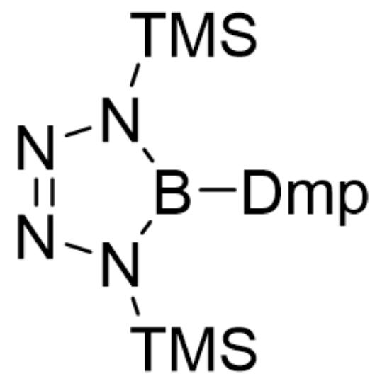

# Question

Ininoboranes  $(\mathrm{RB} \equiv \mathrm{NR}^{\prime})$  are isoelectronic with alkynes and also readily undergo addition, polymerization, and other reactions. However, the methods for synthesizing iminoboranes are very limited, which to some extent restricts their applications. In 2021, research teams from Southern University of Science and Technology and Nankai University jointly developed an efficient iminoborane transfer reagent X.

Heating  $4.84\mathrm{g}$  DmpBBr $_2$  and  $0.25\mathrm{g}$  LiNH $_2$  to  $100^{\circ}\mathrm{C}$ , followed by solvent evaporation, yields A. A peak in its mass spectrum (corresponding to  $[\mathbf{A}]^{+})$ $m/z = 420.1$ . Reacting  $0.420\mathrm{g}$  A with  $0.335\mathrm{g}$  LiHMDS in benzene at room temperature for half an hour allows the isolation of  $0.236\mathrm{g}$  of white powder X, with a yield of approximately  $45\%$ . The theoretical mass fraction of Br is  $30.80\%$ .

[Dmp: 2,6-bis(2,4,6-trimethylphenyl)phenyl; LiHMDS: lithium bis(trimethylsilyl)amide]

X can exhibit the properties of iminoboranes and be used to synthesize heterocycles. Reacting  $0.048g$  of pivaloyl chloride with  $0.210g\mathrm{X}$  yields  $0.092g$  of an eight-membered ring compound B; when X reacts with an excess of trimethylsilyl azide, C is obtained.

Which of the following statements are correct?

1. A contains 2 Br atoms;  
2. The sum of atoms in the chemical formula of X is 56;  
3. The yield of B is  $55\%$ ;  
4. C contains a six-membered ring;  
5. C has a  $C_2$  axis.

A. 1,2,3  
B. 1,2,4

C. 1,2,5  
D. 2,3,4  
E. 2,3,5  
F. 1,3,5  
G. 1,3,4  
H. 3,4,5  
1,4,5  
J. 2,4,5  
K. 1,2,3,4  
L. 2,3,4,5  
M. 1,3,4,5  
N. 1,2,4,5  
0. 1,2,3,5  
P. None of the above options are correct

# Answer

Correct Answer: E

# Detailed Explanation

The amount of substance of  $DmpBBr_{2}$  is:  $4.48g / 484.1g\cdot mol^{-1} = 1.00\times 10^{-2}mol$

The amount of substance of  $LiNH_{2}$  is:  $0.25g / 23.0g \cdot mol^{-1} = 1.09 \times 10^{-2}mol$

Thus,  $DmpBBr_{2}$  and  $LiNH_{2}$  react in a 1:1 ratio. Combined with mass spectrometry data, it can be inferred that  $\mathbf{A}$  is  $DmpB(Br)NH_{2}$ . Since  $\mathbf{A}$  contains only one  $Br$ , statement 1 is incorrect.

# CHECKPOINT

# 1 PTS

$\mathbf{A} = DmpB(Br)NH_{2}$ , 1 incorrect

The amount of substance of  $LiHMDS$  is:  $0.335g / 167.3g \cdot mol^{-1} = 2.00 \times 10^{-3}mol$

The amount of substance of  $\mathbf{A}$  is:  $0.420g / 420.2g\cdot mol^{-1} = 1.00\times 10^{-3}mol$

Thus,  $\mathbf{A}$  and LiHMDS react in a 1:2 ratio.

If fully converted, the mass of  $\mathbf{X}$  would be  $0.236g / 45\% = 0.524g$

Assuming the amount of substance of  $\mathbf{X}$  is  $1.00\times 10^{-3}mol$ , its molar mass would be  $524g\cdot mol^{-1}$ .

From the theoretical mass fraction of  $Br$ , it can be deduced that  $\mathbf{X}$  contains  $524 \times 0.308 / 79.9 = 2Br$  atoms. Substituting back with  $2Br$  atoms, the precise molar mass of  $\mathbf{X}$  is  $518.8g \cdot mol^{-1}$ . After subtracting the mass of  $2Br$  atoms and one  $DmpBN$  structure, the remaining mass is 20.7, corresponding to 3 Li atoms. Therefore, the chemical formula of  $\mathbf{X}$  is  $DmpBNLi_{3}Br_{2}$ , i.e.,  $C_{24}H_{25}Li_{3}BNBr_{2}$ .  $\mathbf{X}$  has 56 atoms, so statement 2 is correct.

# CHECKPOINT

2 PTS

$$
\mathbf {X} = C _ {2 4} H _ {2 5} L i _ {3} B N B r _ {2}, 2 \text {c o r r e c t}
$$

Considering the reactivity of  $\mathbf{X}$  as an iminoborane, and given that  $\mathbf{B}$  contains an eight-membered ring, it can be concluded that  $\mathbf{B}$  is the dimer of the addition product of  $\mathbf{X}$  with pivaloyl chloride. The chemical formula of  $\mathbf{B}$  is  $(DmpBNCO^{t}Bu)_{2}$ , with the following structure:

  
[Dmp]B1O/C(C(C)(C)C)=N\B([Dmp])O/C(C(C)(C)C)=N\1

# CHECKPOINT

1 PTS

$$
\mathbf {B} = (D m p B N C O ^ {t} B u) _ {2}
$$

The amount of substance of pivaloyl chloride is:  $0.048g / 120.6g\cdot mol^{-1} = 3.98\times 10^{-4}mol$

The amount of substance of  $\mathbf{X}$  is:  $0.210g / 1037.8g\cdot mol^{-1} = 2.02\times 10^{-4}mol$

The amount of substance of  $\mathbf{B}$  obtained from the reaction is:  $0.092g / 846.8g\cdot mol^{-1} = 1.09\times 10^{-4}mol$

The yield is  $2 \times 1.09 \times 10^{-4} / 3.98 \times 10^{-4} = 55\%$ , so statement 3 is correct.

# CHECKPOINT

# 1 PTS

Yield of B is  $55\%$ , 3 correct

The structure of  $\mathbf{C}$ , obtained from the reaction of  $\mathbf{X}$  with excess trimethylsilyl azide, is as follows:

[Dmp]B1N([Si](C)(C)C)N=NN1[Si](C)(C)C

The five-membered ring structure of  $\mathbf{C}$  is symmetric and possesses a  $C_2$  axis, so statement 4 is incorrect, and statement 5 is correct.

# CHECKPOINT

2 PTS

C has a symmetric five-membered ring structure, 4 incorrect, 5 correct