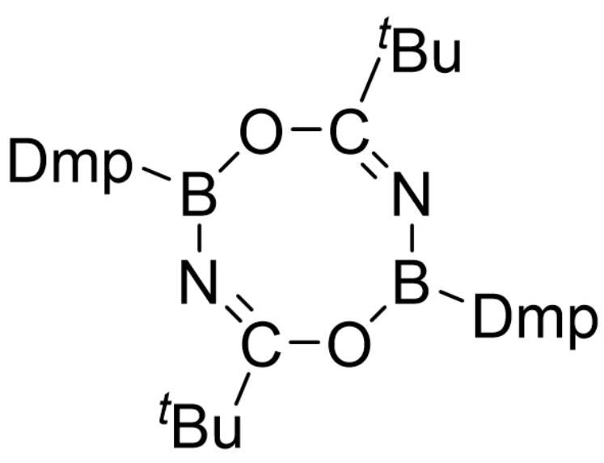
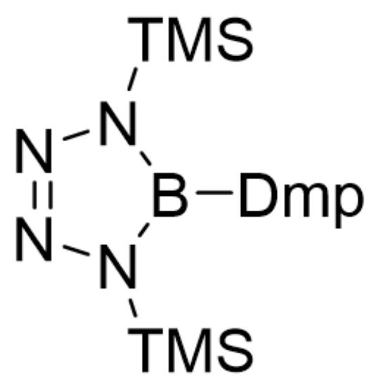

# 题目

亚氨基硼烷  $(\mathrm{RB} \equiv \mathrm{NR}^{\prime})$  和炔是等电子体，它们也很容易发生加成、聚合等反应。然而合成亚氨基硼烷的方法非常有限，这在一定程度上限制了它的应用。2021年，南方科技大学和南开大学的研究小组共同发展了一种高效的转亚氨基硼烷试剂X。

将  $4.84 \mathrm{~g} \mathrm{DmpBBr}_{2}$  和  $0.25 \mathrm{~g} \mathrm{LiNH}_{2}$  加热至  $100^{\circ} \mathrm{C}$ , 蒸发溶剂后得到 A, 其质谱中的一个峰 (对应  $[\mathbf{A}]^{+}) m / z = 420.1$  。取  $0.420 \mathrm{~g} \mathrm{A}$  和  $0.335 \mathrm{~g} \mathrm{LiHMDS}$  在苯中室温反应半小时, 可以分离出  $0.236 \mathrm{~g}$  白色粉末 X, 产率约为  $45 \%$ , Br 的理论质量分数为  $30.80 \%$  。

[Dmp: 2,6-双（2,4,6-三甲基苯基）苯基；LiHMDS：双（三甲基硅基）氨基锂]

X可以体现亚氨基硼烷的性质，用来合成杂环。取  $0.048g$  特戊酰氯与  $0.210g$  X反应，可以分离得到  $0.092g$  含八元环的B；X与过量的叠氮三甲基硅基反应，则得到C。

以下说法正确的有：

1. A中含有2个  $Br$ ；  
2. X的化学式中原子数之和为56;  
3. B的产率为  $55\%$  
4. C 含有六元环；  
5. C有  $C_2$  轴。

A. 1,2,3  
B. 1,2,4  
C. 1,2,5  
D. 2,3,4

E. 2,3,5  
F. 1,3,5  
G. 1,3,4  
H. 3,4,5  
1,4,5  
J. 2,4,5  
K. 1,2,3,4  
L. 2,3,4,5  
M. 1,3,4,5  
N. 1,2,4,5  
0. 1,2,3,5  
P. 以上选项均不正确

# 答案

# 正确答案: E

# 详细解析

DmpBBr2的物质的量为：  $4.84g / 484.1g\cdot mol^{-1} = 1.00\times 10^{-2}mol$

$LiNH_{2}$  的物质的量为：  $0.25g / 23.0g\cdot mol^{-1} = 1.09\times 10^{-2}mol$

因此  $DmpBBr_{2}$  和  $LiNH_{2}$  按照1:1反应，结合质谱数据，可以推测  $\mathbf{A}$  为  $DmpB(Br)NH_{2}$  。  $\mathbf{A}$  只含有一个  $Br$  ，说法1错误。

# CHECKPOINT

# 1 PTS

$\mathbf{A} = DmpB(Br)NH_{2}$ ，1错误

LiHMDS的物质的量为：  $0.335g / 167.3g\cdot mol^{-1} = 2.00\times 10^{-3}mol$

A 的物质的量为:  $0.420 \mathrm{~g} / 420.2 \mathrm{~g} \cdot \mathrm{mol}^{-1} = 1.00 \times 10^{-3} \mathrm{~mol}$

因此A和LiHMDS按照1:2反应。

若完全转化，则  $\mathbf{X}$  的质量为  $0.236g / 45\% = 0.524g$

假设  $\mathbf{X}$  的物质的量为  $1.00 \times 10^{-3} mol$ ，那么其摩尔质量为  $524 g \cdot mol^{-1}$ 。

由  $Br$  的理论质量分数，可以推断出  $\mathbf{X}$  含有  $524 \times 0.308 / 79.9 = 2$  个  $Br$ ，反代入2个  $Br$ ，可得  $\mathbf{X}$  的精确摩尔质量为  $518.8g \cdot mol^{-1}$  。  $\mathbf{X}$  的摩尔质量除去2个  $Br$  、一个  $DmpBN$  的结构，还剩20.7，对应3个  $Li$ ，因此  $\mathbf{X}$  的化学式为  $DmpBNLi_{3}Br_{2}$ ，即  $C_{24}H_{25}Li_{3}BNBr_{2}$  。  $\mathbf{X}$  有56个原子，因此说法2正确。

# CHECKPOINT

2 PTS

$\mathbf{X} = C_{24}H_{25}Li_{3}BNBr_{2}$ ，2正确

考虑  $\mathbf{X}$  作为亚氨基硼烷的反应性, 结合  $\mathbf{B}$  含有八元环, 可知  $\mathbf{B}$  是  $\mathbf{X}$  与特戊酰氯加成产物的二聚体,  $\mathbf{B}$  的化学式为  $(DmpBNCO^{t}Bu)_{2}$ , 结构如下:

  
[Dmp]B1O/C(C(C)(C)C)=N\B([Dmp])O/C(C(C)(C)C)=N\1

# CHECKPOINT

1 PTS

$$
\mathbf {B} = (D m p B N C O ^ {t} B u) _ {2}
$$

特戊酰氯的物质的量为：  $0.048g / 120.6g\cdot mol^{-1} = 3.98\times 10^{-4}mol$

X的物质的量为：  $0.210g / 1037.8g\cdot mol^{-1} = 2.02\times 10^{-4}mol$

反应得到的B的物质的量为：  $0.092g / 846.8g\cdot mol^{-1} = 1.09\times 10^{-4}mol$

产率为  $2 \times 1.09 \times 10^{-4} / 3.98 \times 10^{-4} = 55\%$  ，说法3正确

# CHECKPOINT

1 PTS

B的产率为  $55\%$  ，3正确

X与过量叠氮三甲基硅反应得到的C结构如下：

[Dmp]B1N([Si](C)(C)C)N=NN1[Si](C)(C)C

C的五元环结构对称，具有  $C_2$  轴，因此说法4错误，说法5正确。

# CHECKPOINT

2 PTS

C有对称的五元环结构，4错误，5正确