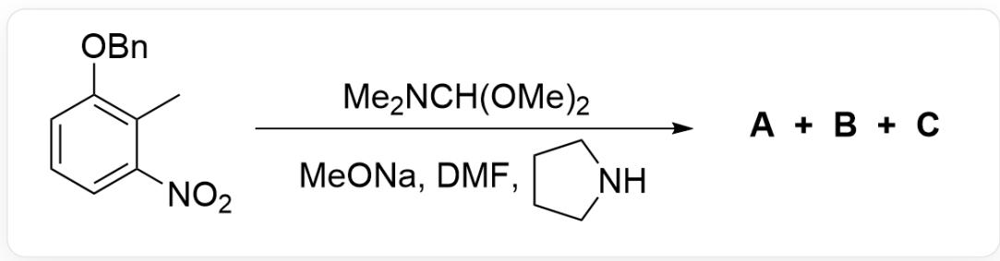
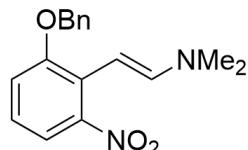
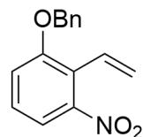

# Question

This figure shows an organic reaction. The substrate is CC1=C(OCC2=CC=CC=C2)C=CC=C1[N+]([O-])=O, and the reaction conditions are CN(C)C(OC)OC.CO[Na].CN(C([H])=O)C.C3CCNC3; the products are A, B, C.

The organic reaction in the figure above produced two products  $\mathbf{A},\mathbf{B}$  and one byproduct C.

# Known:

1. The ratio of the two products is  $\mathbf{A}:\mathbf{B} = 15:1$  
2. The generation of the byproduct involves an intermolecular hydride transfer reaction.  
3. The chemical formula of byproduct  $\mathbf{C}$  is  $\mathrm{C_{15}H_{13}NO_3}$ .  
4. The reaction producing the products is a condensation reaction.  
5. The reaction temperature is  $383\mathrm{K}$

Regarding this reaction, the following statements are made:

1. The number of atoms in  $\mathbf{A}$  is greater than that in  $\mathbf{B}$ .  
2. The number of atoms in  $\mathbf{A}$  is less than that in  $\mathbf{B}$ .  
3. The number of atoms in  $\mathbf{A}$  is equal to that in  $\mathbf{B}$ .  
4. B contains a methyl group.  
5. C contains a methyl group.  
6. A contains a methyl group.

7. If the reaction temperature is lowered to  $273\mathrm{K}$ , the ratio of reaction products will change to  $\mathbf{B}$  being more than  $\mathbf{A}$ .  
8. If the reaction temperature is lowered to  $273\mathrm{K}$ , the ratio of reaction products will still be  $\mathbf{B}$  being less than  $\mathbf{A}$ .  
9. If all the hydrogen atoms on the methyl group of the substrate are labeled with  ${}^{2}\mathrm{H}$ , then the byproduct C contains two  ${}^{2}\mathrm{H}$ .

The following option contains the most correct statement numbers and no incorrect statement numbers:

A. 1,4,9  
B. 1,4,7  
C. 1,4,8  
D. 2,5,7  
E. 3, 6, 7  
F. 1, 4, 5, 7  
G. 2, 5, 6, 8  
H. 1, 5, 6, 7  
1,4，5，8  
J. 2, 4, 6, 7

K. 3, 4, 5, 8, 9  
L. 3, 6, 8, 9  
M. 1, 5, 7, 9  
N. 2, 4, 6, 8  
O. 1, 4, 5, 7, 9  
P. 1, 4, 5, 8, 9  
Q. 2, 4, 5, 7, 9  
R. 3, 5, 7, 9  
S. 1, 4, 7, 9  
T. 1, 5, 6, 9

# Answer

Correct Answer: B

# Detailed Explanation

  
A

  
B

  
C

This figure shows the structure of the unknown species involved in this question. A is  $O = [N + ]$

$$
(C 1 = C C = C C (O C C 2 = C C = C C = C 2) = C 1 / C = C / N 3 C C C C 3) [ O - ], \quad B i s O = [ N + ]
$$

$$
(C 1 = C C = C C (O C C 2 = C C = C C = C 2) = C 1 / C = C / N (C) C) [ O - ], \quad C i s C = C C 1 = C (O C C 2 = C C = C C = C 2) C = C C = C 1 [ N + ]
$$

$$
([ O - ]) = O, \text {t h e i m i n e i n t e r m a d i e}
$$

This reaction is a simple condensation reaction; the benzylic position of the substrate is acidic under the influence of the strong electron-withdrawing nitro group in the ortho position and can be deprotonated by the strong base MeONa to form a carbanion;

# CHECKPOINT

1 PTS

The benzylic position is acidic under the influence of the strong electron-withdrawing nitro group in the ortho position and can be deprotonated by the strong base MeONa to form a carbanion

Another substrate molecule is an acetal structure, which is electrophilic. The generated carbanion undergoes nucleophilic attack on the acetal, leading to condensation, followed by the elimination of two molecules of methoxide ion to form the key imine intermediate, which has a structure of  $\mathrm{O} = [\mathrm{N} + ]$  (C1=CC=CC(OCC2=CC=CC=C2)=C1CC=[N+]C)C)[O-].

# CHECKPOINT

1 PTS

Carbanion undergoes nucleophilic attack on the acetal, leading to condensation

# CHECKPOINT

1 PTS

Formation of imine intermediate, which has a structure of  $\mathrm{O} = [\mathrm{N} + ]$ $(\mathrm{C}1 = \mathrm{CC} = \mathrm{CC}(\mathrm{OCC}2 = \mathrm{CC} = \mathrm{CC} = \mathrm{C}2) = \mathrm{C}1\mathrm{CC} = [\mathrm{N} + ](\mathrm{C})\mathrm{C})(\mathrm{O} - ]$

Elimination of a molecule of hydrogen ion from this intermediate can form an enamine structure, which is one of the products. Its structure is  $\mathrm{O} = [\mathrm{N} + ](\mathrm{C}1 = \mathrm{CC} = \mathrm{CC}(\mathrm{O}\mathrm{CC}2 = \mathrm{CC} = \mathrm{CC} = \mathrm{C}2) = \mathrm{C}1 / \mathrm{C} = \mathrm{C} / \mathrm{N}(\mathrm{C})\mathrm{C})[\mathrm{O} - ]$ .

# CHECKPOINT

1 PTS

One of the products is  $\mathrm{O} = [\mathrm{N} + ](\mathrm{C}1 = \mathrm{CC} = \mathrm{CC}(\mathrm{O}\mathrm{CC}2 = \mathrm{CC} = \mathrm{CC} = \mathrm{C}2) = \mathrm{C}1 / \mathrm{C} = \mathrm{C} / \mathrm{N}(\mathrm{C})\mathrm{C})[\mathrm{O} - ]$

However, tetrahydro pyrrole exists in the reaction system; Since the above condensation reactions are all reversible, tetrahydro pyrrole can nucleophilically attack the imine intermediate, eliminating dimethylamine to form a similar imine intermediate, followed by elimination of a molecule of hydrogen ion to form an enamine structure. Therefore, the structure of the other product is  $\mathrm{O} = [\mathrm{N} + ](\mathrm{C1} = \mathrm{CC} = \mathrm{CC}(\mathrm{OCC2} = \mathrm{CC} = \mathrm{CC} = \mathrm{C2}) = \mathrm{C1} / \mathrm{C} = \mathrm{C} / \mathrm{N3}\mathrm{CCCC3})[\mathrm{O}-]$ ; this reaction is transamination.

# CHECKPOINT

1 PTS

The other product is a transamination product, with a structure of  $\mathrm{O} = [\mathrm{N} + ]$

$$
(\mathrm {C} 1 = \mathrm {C C} = \mathrm {C C} (\mathrm {O C C} 2 = \mathrm {C C} = \mathrm {C C} = \mathrm {C} 2) = \mathrm {C} 1 / \mathrm {C} = \mathrm {C} / \mathrm {N} 3 \mathrm {C C C C} 3) [ \mathrm {O} - ]
$$

Considering the ratio of the two products, since the reaction temperature is  $383\mathrm{K}$ , which is much higher than the boiling point of dimethylamine but has not reached the boiling point of tetrahydro pyrrole, dimethylamine will be distilled out of the system, thereby driving the equilibrium; therefore, the product with the larger proportion,  $\mathbf{A}$ , is the transamination product  $\mathrm{O} = [\mathrm{N} + ](\mathrm{C}1 = \mathrm{CC} = \mathrm{CC}(\mathrm{OCC}2 = \mathrm{CC} = \mathrm{C}2) = \mathrm{C}1 / \mathrm{C} = \mathrm{C} / \mathrm{N}3\mathrm{CCCC}3)[\mathrm{O}-]$ , and  $\mathbf{B}$  is  $\mathrm{O} = [\mathrm{N} + ](\mathrm{C}1 = \mathrm{CC} = \mathrm{CC}(\mathrm{OCC}2 = \mathrm{CC} = \mathrm{CC} = \mathrm{C}2) = \mathrm{C}1 / \mathrm{C} = \mathrm{C} / \mathrm{N}(\mathrm{C})\mathrm{C})[\mathrm{O}-]$ .

# CHECKPOINT

1 PTS

The reaction temperature is  $383\mathrm{K}$ , which is much higher than the boiling point of dimethylamine but has not reached the boiling point of tetrahydro pyrrole, thereby dimethylamine will be distilled out of the system, thereby driving the equilibrium

# CHECKPOINT

1 PTS

A is the transamination product  $\mathrm{O} = [\mathrm{N} + ](\mathrm{C}1 = \mathrm{CC} = \mathrm{CC}(\mathrm{OCC}2 = \mathrm{CC} = \mathrm{CC} = \mathrm{C}2) = \mathrm{C}1 / \mathrm{C} = \mathrm{C} / \mathrm{N}3\mathrm{CCCC}3)[\mathrm{O} - ]$

# CHECKPOINT

1 PTS

B is  $\mathrm{O} = [\mathrm{N} + ](\mathrm{C}1 = \mathrm{CC} = \mathrm{CC}(\mathrm{OCC}2 = \mathrm{CC} = \mathrm{CC} = \mathrm{C}2) = \mathrm{C}1 / \mathrm{C} = \mathrm{C} / \mathrm{N}(\mathrm{C})\mathrm{C})[\mathrm{O} - ]$

A has more atoms, statement 1 is correct, 2 and 3 are incorrect; A does not contain a methyl group while B contains a methyl group, statement 4 is correct, 6 is incorrect.

If the reaction temperature is lowered to  $273\mathrm{K}$ , which is lower than the boiling point of dimethylamine, the transamination reaction is a side reaction at this time, and dimethylamine has a stronger nucleophilicity, so the product ratio  $\mathbf{B}$  will be higher, statement 7 is correct, 8 is incorrect.

# CHECKPOINT

1 PTS

If the reaction temperature is lowered to  $273\mathrm{K}$ , which is lower than the boiling point of dimethylamine, dimethylamine has a stronger nucleophilicity, so the product ratio  $\mathbf{B}$  will be higher

Considering the byproduct C; according to the chemical formula, C only has one more carbon atom than the substrate. Since only the benzylic position can react, the structure of the byproduct C can only be C=CC1=C(OCC2=CC=CC=C2)C=CC=C1[N+]([O-])=O. C does not have a methyl group, statement 5 is incorrect.

# CHECKPOINT

1 PTS

The structure of  $\mathbf{C}$  can only be  $C = C C 1 = C (O C C 2 = C C = C C = C 2) C = C C = C 1 [ N + ] ([ O - ]) = O$

The formation mechanism of this product involves intermolecular hydride transfer, and can only be that the imine intermediate is reduced by the hydride of the substrate acetal. This hydrogen is not isotopically labeled; then  $\beta$ -elimination occurs to obtain an alkene, so the methyl group labeled with  $^2\mathrm{H}$  will only have one  $^2\mathrm{H}$  left after becoming an alkene, statement 9 is incorrect.

# CHECKPOINT

1 PTS

The imine intermediate is reduced by the hydride of the substrate acetal, and this hydrogen is not isotopically labeled

In summary, statements 1, 4, and 7 are correct, so option B is correct.

# CHECKPOINT

1 PTS

Statements 1, 4, and 7 are correct