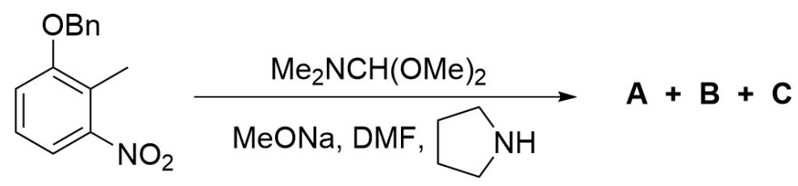
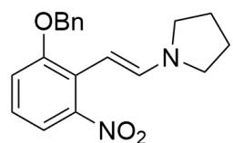
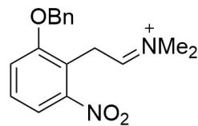

# 题目

该图为一有机反应，底物为CC1=C(OCC2=CC=CC=C2)C=CC=C1[N+]([O-])=O，反应条件为CN(C)C(OC)OC.CO[Na].CN(C([H])=O)C.C3CCNC3；产物为A,B,C。

上图的有机反应产生了两种产物A，B和一种副产物C。

已知：

1. 两种产物的比例为  $\mathbf{A}:\mathbf{B} = 15:1$  。  
2.副产物的产生经过了分子间负氢转移反应  
3.副产物C的化学式为  $\mathrm{C_{15}H_{13}NO_3}$  
4. 产生产物的反应为缩合反应。  
5. 反应温度为  $383 \mathrm{~K}$

关于该反应，有下列说法：

1. A 的原子数大于 B。  
2.  $\mathbf{A}$  的原子数小于  $\mathbf{B}$  。  
3. A 的原子数等于 B。  
4. B 含有甲基。  
5. C 含有甲基。  
6. A 含有甲基。

7. 降低反应温度至  $273 \mathrm{~K}$ , 反应产物的比例会变化至  $\mathrm{B}$  多于  $\mathrm{A}$  。  
8. 降低反应温度至  $273 \mathrm{~K}$ , 反应产物的比例仍旧是  $\mathbf{B}$  少于  $\mathbf{A}$  。  
9. 若将底物的甲基上的氢均采用  ${ }^{2} \mathrm{H}$  标记, 则副产物  $\mathrm{C}$  含有两个  ${ }^{2} \mathrm{H}$  。

下列选项中包含了最多正确的说法序号，且无错误的说法序号的选项是：

A. 1,4,9  
B. 1,4，7  
C. 1,4,8  
D. 2, 5, 7  
E. 3, 6, 7  
F. 1, 4, 5, 7  
G. 2, 5, 6, 8  
H. 1, 5, 6, 7  
1,4，5，8  
J. 2, 4, 6, 7  
K. 3, 4, 5, 8, 9

L. 3, 6, 8, 9  
M. 1, 5, 7, 9  
N. 2, 4, 6, 8  
O. 1, 4, 5, 7, 9  
P. 1, 4, 5, 8, 9  
Q. 2, 4, 5, 7, 9  
R. 3,5，7，9  
S. 1, 4, 7, 9  
T. 1, 5, 6, 9

# 答案

正确答案: B

# 详细解析

  
A

  
B

  
C

该图展示了本题涉及到的未知物种结构。A为O=[N+](C1=CC=CC(OCC2=CC=CC=C2)=C1/C=C/N3CCCC3)

[ \text{[O-]} ]，B为  $O = [N + ](C1 = CC = CC(OCC2 = CC = CC = C2) = C1 / C = C / N(C)C)[O - ]$ ，C为

C=CC1=C(OCC2=CC=CC=C2)C=CC=C1[N+]([O-])=O，亚胺中间体结构为O=[N+]

$(C1 = CC = CC(OCC2 = CC = CC = C2) = C1CC = [N + ](C)C)[O - ]$

该反应为简单的缩合反应；底物的苄位在邻位的强吸电子基团硝基的作用下具有酸性，可以被强碱MeONa拔出质子形成碳负离子；

# CHECKPOINT

1 PTS

苄位在邻位的强吸电子基团硝基的作用下具有酸性，可以被强碱MeONa拔出质子形成碳负离子

另一分子底物为缩醛结构，具有亲电性，生成的碳负离子亲核进攻缩醛发生缩合，之后脱去两分子甲醇负离子形成关键的亚胺中间体，其结构为  $\mathrm{O} = [\mathrm{N} + ](\mathrm{C}1 = \mathrm{CC} = \mathrm{CC}(\mathrm{OCC}2 = \mathrm{CC} = \mathrm{CC} = \mathrm{C}2) = \mathrm{C}1\mathrm{CC} = [\mathrm{N} + ](\mathrm{C})\mathrm{C})[\mathrm{O} - ]$ 。

# CHECKPOINT

1 PTS

碳负离子亲核进攻缩醛发生缩合

# CHECKPOINT

1 PTS

生成亚胺中间体，其结构为  $\mathrm{O} = [\mathrm{N} + ](\mathrm{C}1 = \mathrm{CC} = \mathrm{CC}(\mathrm{OCC}2 = \mathrm{CC} = \mathrm{CC} = \mathrm{C}2) = \mathrm{C}1\mathrm{CC} = [\mathrm{N} + ](\mathrm{C})\mathrm{C})[\mathrm{O} - ]$

该中间体消除一分子氢离子即可形成烯胺结构，即某一种产物。其结构为  $\mathrm{O} = [\mathrm{N} + ]$ $(\mathrm{C1 = CC = CC(OCC2 = CC = CC = C2) = C1 / C = C / N(C)C})[\mathrm{O - }].$

# CHECKPOINT

1 PTS

某一种产物为  $\mathrm{O} = \left\lbrack  {\mathrm{N} + }\right\rbrack  \left( {\mathrm{C}1 = \mathrm{{CC}} = \mathrm{{CC}}\left( {\mathrm{{OCC}}2}\right.  = \mathrm{{CC}} = \mathrm{{CC}} = \mathrm{C}2}\right)  = \mathrm{C}1/\mathrm{C} = \mathrm{C}/\mathrm{N}\left( \mathrm{C}\right) \mathrm{C}\left\lbrack  {\mathrm{O} - }\right\rbrack$

但反应体系中存在四氢吡咯；由于上述缩合反应均为可逆进行，四氢吡咯可以亲核亚胺中间体，脱去二甲胺形成类似的亚胺中间体，之后消除一分子氢离子形成烯胺结构。所以另一种产物结构为  $O = [N + ]$ $(C1 = CC = CC(OCC2 = CC = CC = C2) = C1 / C = C / N3CCCC3)[O - ]$  ；该反应即转氨基反应。

# CHECKPOINT

1 PTS

另一种产物为转氨基产物，结构为O=[N+](C1=CC=CC(OCC2=CC=CC=C2)=C1/C=C/N3CCCC3)[O-]

考虑两种产物的比例，由于反应温度为  $383\mathrm{K}$ ，远超过二甲胺的沸点但没有达到四氢吡咯的沸点，因此二甲胺会被蒸出体系，从而拉动平衡；因此比例大的产物A为转氨基产物  $\mathrm{O} = [\mathrm{N} + ]$

$$
\begin{array}{l} (\mathrm {C} 1 = \mathrm {C C} = \mathrm {C C} (\mathrm {O C C} 2 = \mathrm {C C} = \mathrm {C C} = \mathrm {C} 2) = \mathrm {C} 1 / \mathrm {C} = \mathrm {C} / \mathrm {N} 3 \mathrm {C C C C} 3) [ \mathrm {O} - ] \\ (\mathrm {C} 1 = \mathrm {C C} = \mathrm {C C} (\mathrm {O C C} 2 = \mathrm {C C} = \mathrm {C C} = \mathrm {C} 2) = \mathrm {C} 1 / \mathrm {C} = \mathrm {C} / \mathrm {N} (\mathrm {C}) \mathrm {C}) [ \mathrm {O} - ] _ {\circ} \\ \end{array}
$$

B 为  $\mathrm{O} = [\mathrm{N} + ]$

# CHECKPOINT

1 PTS

反应温度为  $383 \mathrm{~K}$ , 远超过二甲胺的沸点但没有达到四氢吡咯的沸点, 因此二甲胺会被蒸出体系,从而拉动平衡

# CHECKPOINT

1 PTS

A 为转氨基产物  $O = [N + ](C1 = CC = CC(OCC2 = CC = CC = C2) = C1 / C = C / N3CCCC3)[O - ]$

# CHECKPOINT

1 PTS

B 为  $O = [N + ](C1 = CC = CC(OCC2 = CC = CC = C2) = C1 / C = C / N(C)C)[O - ]$

A原子数更多，说法1正确，2，3均错误；A不含甲基而B含有甲基，说法4正确，6错误。

反应温度若降低至  $273 \mathrm{~K}$ , 小于二甲胺的沸点, 此时转氨基反应为副反应, 二甲胺亲核性更强, 故产物比例  $\mathrm{B}$  会更多, 说法7正确, 8错误。

# CHECKPOINT

1 PTS

反应温度若降低至  $273 \mathrm{~K}$ , 小于二甲胺的沸点, 二甲胺亲核性更强, 故产物比例  $\mathrm{B}$  会更多

考虑副产物C；根据化学式可知C只比底物多出一个碳原子，由于只有苄位可以发生反应，副产物C结构只能为  $\mathrm{C = CC1 = C(OCC2 = CC = CC = C2)C = CC = C1[N + ]([O - ]) = O}$  。C没有甲基，说法5错误。

# CHECKPOINT

1 PTS

C结构只能为  $\mathrm{C} = \mathrm{CC}1 = \mathrm{C}(\mathrm{OCC}2 = \mathrm{CC} = \mathrm{CC} = \mathrm{C}2) \mathrm{C} = \mathrm{CC} = \mathrm{C}1[\mathrm{N} + ]([\mathrm{O} - ]) = 0$

该产物的生成机理经过分子间负氢转移，只能为亚胺中间体被底物缩醛的负氢还原，该氢没有被同位素标记；之后发生β消除得到烯烃，从而被  ${ }^{2} \mathrm{H}$  标记的甲基变成烯烃后只会剩下一个  ${ }^{2} \mathrm{H}$ ，说法9错误。

# CHECKPOINT

1 PTS

亚胺中间体被底物缩醛的负氢还原, 该氢没有被同位素标记

综上，说法1，4，7正确，故选项B正确。

# CHECKPOINT

1 PTS

说法1，4，7正确