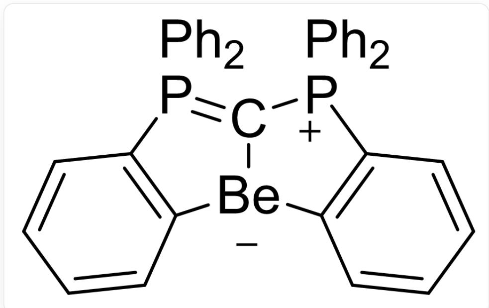
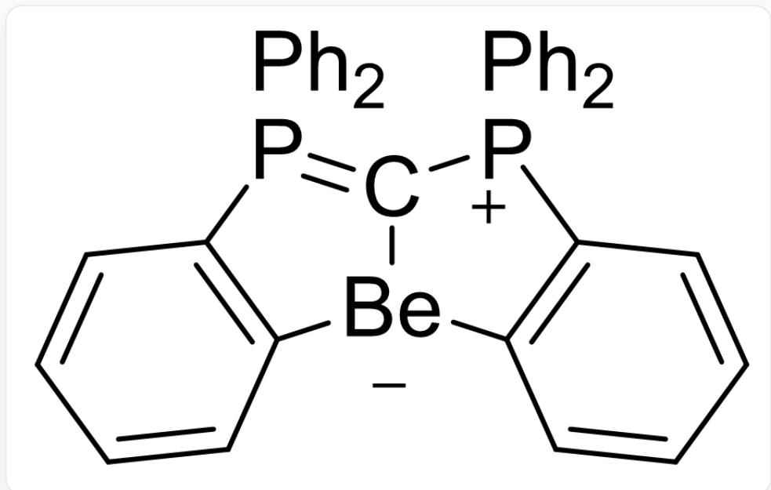

# Question

Under anhydrous conditions,  $PPh_{3}$  and  $CCl_{4}$  are reacted in a certain proportion to obtain an ionic compound A. The mass fraction of  $Cl$  in A is  $11.7\%$ . A is treated with  $P(NMe_{2})_{3}$  to obtain compound B. B does not contain nitrogen and the mass fraction of  $P$  is  $11.6\%$ . In the structure of B, all bond angles centered on carbon atoms are close to  $120^{\circ}$ . B reacts with an equimolar amount of  $AuCl$  to obtain complex C, and C reacts further with an equimolar amount of  $AuCl$  to obtain D. The mass fraction of  $Au$  in D is  $39.3\%$ . B is treated with 2 equivalents of n-butyllithium at low temperature and then reacted with  $BeCl_{2}$  to obtain E, which contains 2 rings containing  $Be$ . In addition, B can also be used as a catalyst for certain organic reactions.

Regarding the above content, there are the following statements:

1. All carbon atoms in  $\mathbf{A}$  have the same hybridization.  
2. Theoretically, there are 4 sets of peaks in the  $^{13}CNMR$  spectrum of B.  
3. B can be stored normally in air.  
4. C does not contain chlorine.  
5. The coordination number of  $Au$  in  $\mathbf{D}$  is 3.  
6. When  $\mathbf{B}$  is used as a catalyst, its function is more likely to be a Lewis acid than a Lewis base.  
7. The coordination number of  $Be$  in  $\mathbf{E}$  is 4.  
8. The theoretical molar ratio of  $PPh_{3}$  to  $CCl_{4}$  when preparing A is  $2:1$ .

Which of the following options corresponds to a set of completely incorrect statements?

A. All other options are incorrect  
B. 1,3,5,7  
C. 1,3,6,8

D. 3,4,5,6  
E. 1,2,7,8  
F. 2,3,5,8  
G. 2, 4, 6, 8  
H. 2,3,4,5

# Answer

Correct Answer: G

# Detailed Explanation

According to organic chemistry knowledge,  $PPh_{3}$  and  $CCl_{4}$  easily react to yield  $Ph_{3}P = CCl_{2}$  and  $Ph_{3}PCl_{2}$ . The latter is obviously not consistent, and the mass fraction of  $Cl$  in the former is too high. Considering its further addition with  $PPh_{3}$ , the chemical formula of  $\mathbf{A}$  can be obtained as  $(Ph_{3}P)_{2}CCl_{2}$ , and the mass fraction is also consistent with the question. Since it is an ionic compound, considering the electron-donating property of  $PPh_{3}$ , its actual structure is  $[(Ph_{3}P)_{2}CCl]^{+}Cl^{-}$ .

# CHECKPOINT

2 PTS

The structure of  $\mathbf{A}$  is  $[(Ph_3P)_2CCl]^+Cl^-$

$P(NMe_2)_3$  is a reducing agent and should reduce the central carbon atom of  $\mathbf{A}$ . Therefore,  $\mathbf{B}$  is  $Ph_3P = C = PPh_3$ , which also matches the mass fraction in the question.

# CHECKPOINT

2 PTS

B is  $Ph_{3}P = C = PPh_{3}$

$\mathbf{C}$  is  $(Ph_{3}P)_{2}CAuCl$ . According to the mass fraction,  $\mathbf{D}$  is  $(Ph_{3}P)_{2}C(AuCl)_{2}$ .

# CHECKPOINT

1 PTS

C is  $(Ph_{3}P)_{2}CAuCl$

# CHECKPOINT

1 PTS

D is  $(Ph_{3}P)_{2}C(AuCl)_{2}$

n-Butyllithium abstracts one hydrogen each from the  $PPh_{3}$  on both sides of  $\mathbf{B}$ . Also note that the central carbon atom of  $\mathbf{B}$  has a strong coordination ability. Therefore,  $\mathbf{E}$  is

$$
C 1 ([ B e - ] 2 C (C = C C = C 3) = C 3 [ P + ] (C 4 = C C = C C = C 4) 1 C 5 = C C = C C = C 5) = P (C 6 = C 2 C = C C = C 6)
$$

$$
(C 7 = C C = C C = C 7) C 8 = C C = C C = C 8
$$

# CHECKPOINT

3 PTS

E is

$$
C 1 ([ B e - ] 2 C (C = C C = C 3) = C 3 [ P + ] (C 4 = C C = C C = C 4) 1 C 5 = C C = C C = C 5) = P (C 6 = C 2 C = C C = C 6)
$$

$$
(C 7 = C C = C C = C 7) C 8 = C C = C C = C 8
$$

All carbons in  $\mathbf{A}$  are  $sp^2$  hybridized. Statement 1 is correct.

There are 5 types of carbon in B. B is a strong Lewis base and is obviously sensitive to water and oxygen. Statements 2, 3, and 6 are incorrect.

C contains chlorine element. Statement 4 is incorrect.

In  $\mathbf{D}$ , due to the presence of  $Au - Au$  interaction,  $Au$  is 3-coordinate. Statement 5 is correct.

In  $\mathbf{E}$ ,  $Be$  is 3-coordinate. Statement 7 is incorrect.

The theoretical molar ratio of  $PPh_{3}$  and  $CCl_{4}$  in the preparation of A is 3:1. Statement 8 is incorrect.

# CHECKPOINT

2 PTS

Statements 1 and 5 are correct, the rest are incorrect

Only the statement in option G is completely incorrect. Choose G.