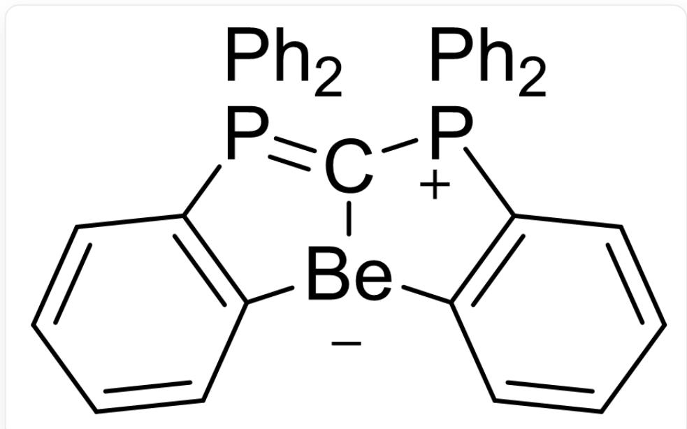

# 题目

无水条件下，将  $PPh_{3}$  和  $CCl_{4}$  按一定比例反应，得到离子化合物A，A中  $Cl$  的质量分数为  $11.7\%$  。将A用  $P(NMe_{2})_{3}$  处理，得到化合物B，B不含氮元素，且  $P$  的质量分数为  $11.6\%$  。B的结构中，所有以碳原子为中心的键角均接近  $120^{\circ}$  。将B与等当量AuCl反应可得配合物C，C再与等当量的AuCl反应得到D。D中Au的质量分数是  $39.3\%$  。低温下将B用2当量的正丁基锂处理，再与BeCl2反应，得到E，E中有2个含Be的环。此外，B也可以用作某些有机反应的催化剂。

关于以上内容，有以下几个陈述：

1. A中所有碳原子的杂化形式相同。  
2. B 的  $^{13}CNMR$  谱中理论上有4组峰。  
3. B可以正常保存在空气中。  
4. C中不含氯元素。  
5. D 中  $A u$  的配位数为 3。  
6. B 在作为催化剂时, 其功能更可能是Lewis酸而非Lewis碱。  
7.  $\mathbf{E}$  中  $Be$  的配位数为4。  
8. 制备A时  $PPh_{3}$  和  $CCl_{4}$  的理论摩尔比是  $2:1$  。

以下各选项中对应的陈述，哪一组是完全错误的？

A. 其他选项均不正确  
B. 1, 3, 5, 7  
C. 1, 3, 6, 8  
D. 3, 4, 5, 6

E. 1, 2, 7, 8  
F. 2,3，5，8  
G. 2, 4, 6, 8  
H. 2,3，4，5

# 答案

正确答案: G

# 详细解析

根据有机化学知识， $PPh_{3}$  和  $CCl_{4}$  容易反应得到  $Ph_{3}P = CCl_{2}$  和  $Ph_{3}PCl_{2}$ ，后者显然不符合，前者中  $Cl$  的质量分数过高，考虑其与  $PPh_{3}$  的进一步加成，可得  $\mathbf{A}$  的化学式是  $(Ph_{3}P)_{2}CCl_{2}$ ，且质量分数也与题目一致。由于是离子化合物，考虑到  $PPh_{3}$  的给电子性，所以其实际结构是  $[(Ph_{3}P)_{2}CCl]^{+}Cl^{-}$ 。

# CHECKPOINT

2 PTS

A的结构是  $[(Ph_{3}P)_{2}CCl]^{+}Cl^{-}$

$P(N M e_{2})_{3}$  是还原剂, 应当还原  $\mathbf{A}$  中心的碳原子, 因而  $\mathbf{B}$  是  $P h_{3} P = C = P P h_{3}$ , 也符合题干的质量分数。

# CHECKPOINT

2 PTS

$\mathbf{B}$  是  $Ph_{3}P = C = PPh_{3}$

C是  $(Ph_{3}P)_{2}CAuCl$  ，根据质量分数可知D是  $(Ph_{3}P)_{2}C(AuCl)_{2}$  。

# CHECKPOINT

1 PTS

C是  $(Ph_{3}P)_{2}CAuCl$

# CHECKPOINT

1 PTS

D是  $(Ph_{3}P)_{2}C(AuCl)_{2}$

正丁基锂在 B 两边的  $P P h_{3}$  上各攫取一个氢，同时注意到 B 的中心碳原子具有很强的配位能力，因此 E 是

  
C1([Be-]2C(C=CC=C3)=C3[P+](C4=CC=CC=C4)1C5=CC=CC=C5)=P(C6=C2C=CC=C6) (C7=CC=CC=C7)C8=CC=CC=C8

# CHECKPOINT

3 PTS

E是

$$
C 1 ([ B e - ] 2 C (C = C C = C 3) = C 3 [ P + ] (C 4 = C C = C C = C 4) 1 C 5 = C C = C C = C 5) = P (C 6 = C 2 C = C C = C 6)
$$

$$
(C 7 = C C = C C = C 7) C 8 = C C = C C = C 8
$$

A 中所有碳都是  $sp^2$  杂化，陈述1正确。

B中有5种碳，B是强Lewis碱，显然对水氧敏感，陈述2，3，6错误。

C中含氯元素，陈述4错误。

D中因含  $Au - Au$  作用，  $Au$  为3配位，陈述5正确。

E 中  $B e$  为3配位，陈述7错误。

制备A时  $PPh_{3}$  和  $CCl_{4}$  的理论摩尔比是  $3:1$  ，陈述8错误。

# CHECKPOINT

2 PTS

陈述1，5正确，其余错误

只有选项G中的陈述完全错误。选G。