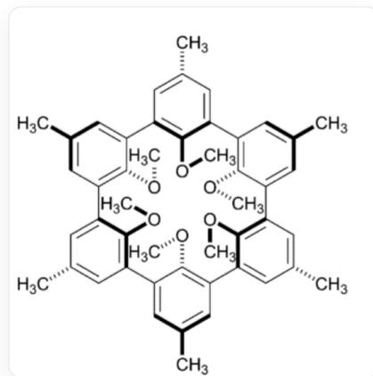

# 题目

在主-客体化学中，为提高主体分子与客体分子之间形成的复合物的稳定性，在主体分子与客体分子结合之前，需对主体分子的结构进行预先的组织和设计，这一过程被称为主体分子的预组织(pre-organization)。例如，冠醚(如18-冠-6)即可看做是将配位氧原子预组织所得到的结构,这样的预组织结构使得18-冠-6能与钾离子形成非常稳定的络合物。

Missing open brace for superscript  $K^{+}$  in water溶液中的溶剂化焓  $\Delta_{sov}H_m$

$= -76\mathrm{kJ / mol}$  ，但溶剂化自由能只有  $\Delta_{sov}G_m^{\circ} = -48~kJ / mol$  。

科学家们合成了一种叫球醚(spherand)的分子，其结构如下图所示。

下文是该分子的结构  
  
CC1=CC2=C(C(=C1)CC3=CC(=CC(=C3OC)CC4=CC(=CC(=C4OC)CC5=CC(=CC(=C5OC)CC6=C(C(=CC(=C6)C)CC7=C(C(=CC(=C7)C)CC8=C(C(=CC(=C8)C)C2)图中在6个甲氧基上标出了实楔与虚楔，意味着它们相对于大环平均面（可以理解成6个芳环中心点的最小二乘平面）呈现交替的上/下取向。因而全分子近似具备  $S_{6}$  （或  $C_3$  ）对称的“交替构象”：三个位点“上”（实楔）+三个位点“下”（虚楔），沿环交替排布。

对于下列说法，所有的正确选项是：

a:  $25^{\circ}C, 100 \mathrm{kPa}$  下， $\Delta_{\text{sov}} S_{m}^{\circ} = -94 \mathrm{~J} \cdot \mathrm{mol}^{-1} \cdot K^{-1}$ ，熵减的原因是与钾离子结合的水分子的运动受到限制，其中主要是振动自由度降低。  
b:  $25^{\circ}C, 100 \mathrm{kPa}$  下， $\Delta_{sov} S_m^\circ = 94 \mathrm{~J} \cdot \mathrm{mol}^{-1} \cdot K^{-1}$ ，熵增的原因是与钾离子结合的水分子的运动受到限制，其中主要是平动和转动自由度降低。  
c：水溶液中经过预组织的18-冠-6相对于水分子更易与  $K^{+}$  结合，这一现象主要是熵的作用。  
d：水溶液中经过预组织的18-冠-6相对于水分子更难与  $K^{+}$  结合，这一现象主要是焓的作用。  
e：水溶液中经过预组织的18-冠-6相对于水分子更易与  $K^{+}$  结合，这一现象主要是焓的作用。  
f：水溶液中经过预组织的18-冠-6相对于水分子更难与  $K^{+}$  结合，这一现象主要是熵的作用。  
g：相较于18-冠-6，球醚更易与  $Li^{+}$  结合，因为球醚结合  $Li^{+}$  的熵减的绝对值比18-冠-6更小。  
h：相较于18-冠-6，球醚更易与  $Li^{+}$  结合，因为球醚结合  $Li^{+}$  的焓变的绝对值比18-冠-6更大。  
i：相较于18-冠-6，球醚更难与  $Li^{+}$  结合，因为球醚结合  $Li^{+}$  的熵减的绝对值比18-冠-6更大。  
j：相较于18-冠-6，球醚更难与  $Li^{+}$  结合，因为球醚结合  $Li^{+}$  的焓变的绝对值比18-冠-6更小。  
k：相较于18-冠-6，球醚更易与  $Li^{+}$  结合，因为球醚结合  $Li^{+}$  的熵增的绝对值比18-冠-6更大。

1：相较于18-冠-6，球醚更难与  $Li^{+}$  结合，因为球醚结合  $Li^{+}$  的熵增的绝对值比18-冠-6更小。

A. c, g, h  
B. a, c, g, h  
C. c, g  
D. a, b, c  
E. c, e, i, j  
F. d, f, j, k  
G. a, e, j, i  
H. a, f, g, h  
1. a, g, h

# 答案

正确答案: A

# 详细解析

由  $\Delta_{sov}G_m^\circ = \Delta_{sov}H_m^\circ -T\Delta_{sov}S_m^\circ$  求得：  $\Delta_{sov}S_m^\circ = -94J\cdot mol^{-1}\cdot K^{-1}$  。与钾离子结合的水分子的运动受到限制，导致了反应的熵变为负。钾离子水合层的多个水分子平动和转动自由度降低，会导致严重的熵减。

# CHECKPOINT

1 PTS

钾离子水合层的多个水分子平动和转动自由度降低，会导致严重的熵减。

# a,b错误

因为18-冠-6的结构可看做是预先将络合位点结合起来的结构，即预先进行了一个熵减的过程，这导致18-冠-6络合  $K^{+}$  步骤中的熵减比水合的熵减更小，因此18-冠-6比水分子更易与  $K^{+}$  结合。更广泛地，成环反应中可以看作将两个反应位点预先组合在一个分子里，可以有效地减少反应的熵减。

# CHECKPOINT

1 PTS

预先进行了一个熵减的过程，这导致18-冠-6络合  $K^{+}$  步骤中的熵减比水合的熵减更小

经过预组织的18-冠-6相对于水分子更易与  $K^{+}$  结合

# CHECKPOINT

1 PTS

经过预组织的18-冠-6相对于水分子更易与  $K^{+}$  结合

# c正确

冠醚与钾离子络合的过程和钾离子水合的过程均是氧原子和金属离子产生静电作用的过程，且金属离子的配位数也相近，所以这两个过程的焓变相差不大，因此不是焓的作用。

# CHECKPOINT

1 PTS

冠醚与钾离子络合的过程和钾离子水合的过程均是氧原子和金属离子产生静电作用的过程，且金属离子的配位数相近，这两个过程的焓变相差不大

# d,e,f错误

冠醚是柔性的大环化合物，其碳碳键和碳氧键可以自由旋转；但与  $Li^{+}$ 络合后，其环结构变得刚性，也导致了熵减。球醚分子中，由于苯环的位阻作用，导致其结构非常刚性；因此，球醚结合金属离子前后，其熵减更小。球醚比冠醚在络合之前预支了更多的熵。

# CHECKPOINT

1 PTS

球醚结合金属离子前后，其熵减更小。球醚比冠醚在络合之前预支了更多的熵。

另一方面，由于球醚刚性环系的限制，球醚中六个氧原子间距离较近，排斥力较大；球醚络合了  $Li^{+}$  之后，缓解了氧原子间的排斥力；因此，相对于冠醚而言，球醚络合  $Li^{+}$  是个焓变更负的反应。球醚比冠醚在络合之前预支了更多的焓。

# CHECKPOINT

1 PTS

球醚中六个氧原子间距离较近，排斥力较大；球醚络合了  $Li^{+}$  之后，缓解了氧原子间的排斥力；相对于冠醚而言，球醚络合  $Li^{+}$  是个焓变更负的反应

球醚更易与  $Ll^{+}$ 络合

g,h正确，i,j,k,l错误

答案A正确