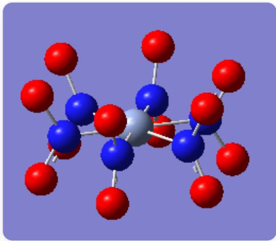
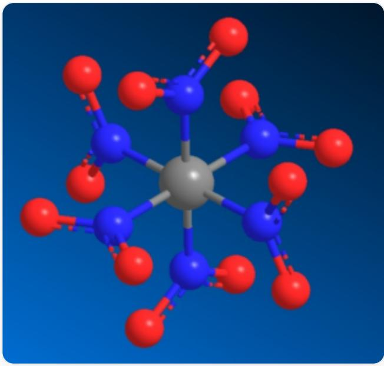

# 题目

位于d区或ds区的过渡金属中心A可形成形如  $\left[\mathbf{AB}_6\mathbf{C}_{12}\right]$  的配合物结构，其点群阶数是24，且不存在任何  $C_4$  或  $S_{4}$  轴，其中A,B,C是原子，可视为点。该配合物的所有键角中不存在锐角，且在对称性上无关的C一C原子对的距离两两不同。求该配合物分子中，最外层原子为顶点构成的凸多面体的面数。

A. 2  
B. 3  
C. 4  
D. 6  
E. 8  
F. 9  
G. 10  
H. 12  
14  
J. 15  
K. 18

L. 20  
M. 24  
N. 30  
O. 45  
P. 48  
Q. 55  
R. 60  
S. 66  
T. 72

# 答案

正确答案: L

# 详细解析

阶数为24的点群有

$$
C _ {2 4}, C _ {1 2 \mathrm {v}}, C _ {1 2 \mathrm {h}}, D _ {1 2}, D _ {6 \mathrm {h}}, D _ {6 \mathrm {d}}, S _ {2 4}, T _ {\mathrm {h}}, T _ {\mathrm {d}}, O
$$

等。其中，只有  $D_{6\mathrm{h}}$  和  $T_{\mathrm{h}}$  两个点群满足不存在  $C_4$  或  $S_{4}$  轴的条件。

# CHECKPOINT

1 PTS

满足条件的点群只有  $D_{6\mathrm{h}}$  和  $T_{\mathrm{h}}$

若为  $D_{6\mathrm{h}}$  点群，则以  $\mathbf{A}$  为中心，6个B原子构成平面正六边形，每个B原子连接两个C原子，且C原子对称地分布在平面的上下两侧，构成的凸多面体为六棱柱。

# CHECKPOINT

1 PTS

若为  $D_{6h}$  点群，其结构为六棱柱

  
D_{\{6h\}}的分子结构，其中1个银色球位于中心，6个蓝色球与银色球相连构成平面六边形，每个蓝色球连接两个红色球，红色球对称得分布在平面两侧

但是由于d区和ds区元素没有可用于成键的f轨道，无法形成平面正六边形配位，故该配合物的点群不是  $D_{6\mathrm{h}}$ 。

# CHECKPOINT

1 PTS

d区和ds区元素没有可用于成键的f轨道

另一方面，若为  $T_{\mathrm{h}}$  点群，则以  $\mathbf{A}$  为中心，6个  $\mathbf{B}$  构成正八面体，每个  $\mathbf{B}$  上连接两个  $\mathbf{C}$ ，且  $\mathbf{BC}_2$  位于八面体的截面  $\mathbf{AB}_4$  内，邻位的  $\mathbf{BC}_2$  平面相互垂直。最外层的12个  $\mathbf{C}$  原子构成三角二十面体的形状。

# CHECKPOINT

2 PTS

若为  $T_{h}$  点群, 其结构为三角二十面体

T_h的分子结构，其中1个银色球位于中心，6个蓝色球与红色球相连构成正八面体，每个蓝色球上连接2个红色球，相连接的红-蓝-红组合位于由1个银色球和4个蓝色球构成的平面内，邻位的蓝色球所在的红-蓝-红组合的平面相互垂直

三角二十面体上有20个三角形面。

# CHECKPOINT

1 PTS

有20个三角形面