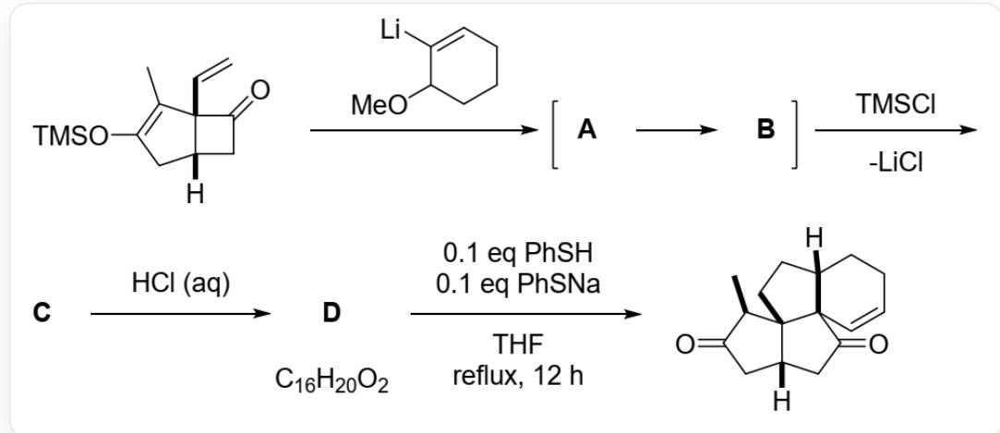
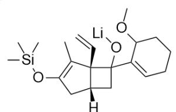
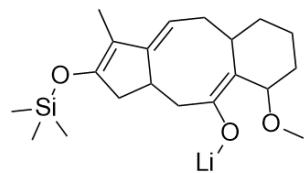
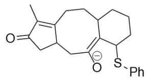
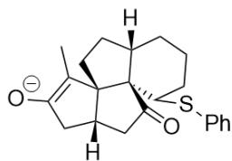

# 题目

分析  $\mathbf{A} \sim \mathbf{D}$  的结构简式以及由  $\mathbf{D}$  生成最终产物的2个带电含硫中间体E1和E2。

`CC1=C(C[C@@]2([H])CC([C@]21C=C)=O)O[Si](C)(C)C`与`COC1CCCCC=C1[Li]`反应得到A, 随后很快转化为B, 在TMSCl作用下离去一分子LiCl得到C, 随后在盐酸作用下得到化学式为  $C_{16}H_{20}O_{2}$  的D, 最后和0.1当量苯硫酚和0.1当量苯硫酚钠作用下在THF中回流12h得到

`C[C@@H]1C(C[C@@]2([H])CC([C@@]34C=CCC[C@@]3([H])CC[C@@]124)=O)=O`

以下选项中正确的一项是:

A. 其他选项均不正确  
B. B具有两个环  
C. B中存在反式双键  
D. D中存在两个  $\alpha, \beta$ -不饱和酮结构  
E. E1中有五个环

F. E2中存在八元环

# 答案

正确答案: D

# 详细解析

`COC1CCCCC=C1[Li]` 对羰基进行加成，得到一个锂醇盐中间体 A：`CC1=C(C[C@@]2([H])CC([C@@]21C=C)(C3=CCCCCC3OC)O[Li])O[Si](C)(C)C`，A 中具有高张力的四元环，很快发生  $[3,3]-\sigma$  迁移开环形成八元环，得到 B：`CC1=C(O[Si](C)(C)C)CC2C/C(O[Li])/C3C(C/C=C1\2)CCCCCC\3OC`。

# CHECKPOINT

2 PTS

B 的结构为  $\mathrm{CC} 1 = \mathrm{C} (\mathrm{O}[\mathrm{Si}](\mathrm{C})(\mathrm{C}) \mathrm{C}) \mathrm{CC} 2 \mathrm{C} / \mathrm{C} (\mathrm{O}[\mathrm{Li}]) = \mathrm{C} 3 \mathrm{C} (\mathrm{C} / \mathrm{C} = \mathrm{C} 1 \backslash 2) \mathrm{CCCC} \backslash 3 \mathrm{OC}$ , 有三个环且全部双键为顺式, 选项BC错误

加入TMSCl后，烯醇盐转化为烯醇硅醚，得到C：CC1=C(O[Si](C)(C)C)CC2C/C(O[Si](C)(C)C)=C3C(C/C=C1\2)CCCC\3OC^。

在盐酸作用下，TMS基团被脱除，烯醇硅醚转化为酮。观察化学式，其中仅有两个氧，则甲氧基也被消除，产生α,β-不饱和酮。此外，在酸性条件下，双键可以发生位移与羰基共轭，则D的结构为： $\mathrm{CC(C(CC1CC2 = O) = O) = C1CCC3C2 = CCCC3}$ 。

# CHECKPOINT

1 PTS

D 的结构为: `CC(C(CC1CC2=O)=O)=C1CCC3C2=CCCC3`，存在两个  $\alpha, \beta$ -不饱和酮结构，选项D正确

在苯硫酚存在下，α,β-不饱和酮被亲核进攻，被进攻的双键位阻较小，因此E1： $\mathrm{CC}1 = \mathrm{C}2\mathrm{CCC}(\mathrm{CCCC} / 3\mathrm{SC}4 = \mathrm{CC} = \mathrm{CC} = \mathrm{C}4)\mathrm{C}3 = \mathrm{C}([0 - ]) / \mathrm{CC}2\mathrm{CC}1 = \mathrm{O}$

# CHECKPOINT

1 PTS

E1的结构为 $\mathrm{CC}1=\mathrm{C}2 \mathrm{CCC}(\mathrm{CCCC} / 3 \mathrm{SC}4=\mathrm{CC}=\mathrm{CC}=4) \mathrm{C}3=\mathrm{C}([\mathrm{O}-]) / \mathrm{CC} 2 \mathrm{CC} 1=\mathrm{O}^{-}$ ,有4个环,选项E错误

随后烯醇负离子进攻另一个α,β-不饱和酮，构建环系主要结构，得到E2：`[H][C@@]1(C2)CC([O-])=C(C)[C@@]13CC[C@]4([H])CCC[C@@H](SC5=CC=CC=C5)[C@@]43C2=O`，随后消除苯硫酚负离子，烯醇转化为酮得到产物。

# CHECKPOINT

1 PTS

E2的结构为`[H][C@@]1(C2)CC([O-])=C(C)[C@@]13CC[C@]4([H])CCC[C@@H](SC5=CC=CC=C5)[C@@]43C2=O`，不含八元环，选项F错误

  
A

  
B

  
C

  
D

  
E1

  
E2

A:  $\mathrm{CC1 = C(C[}$  C@@]2([H])CC([C@]21C=C)(C3=CCCCC3OC)O[Li])O[Si](C)(C)C\`; B:  $\mathrm{CC1 = C(O[Si](C)}$

(C)C)CC2C/C(O[Li])=C3C(C/C=C1\2)CCCC\3OC`; C: `CC1=C(O[Si](C)(C)C)CC2C/C(O[Si](C)

(C)C=C3C(C/C=C1\2)CCCCCC\3OC`; D的结构为：`CC(C(CC1CC2=O)=O)=C1CCC3C2=CCCC3`; E1:

`CC1=C2CCC(CCCCC/3SC4=CC=CC=C4)C3=C([O-])/CC2CC1=O`; E2: `[H][C@@]1(C2)CC([O-])=C(C)

[C@@]13CC[C@@]4([H])CCC[C@@H](SC5=CC=CC=C5)[C@@]43C2=O