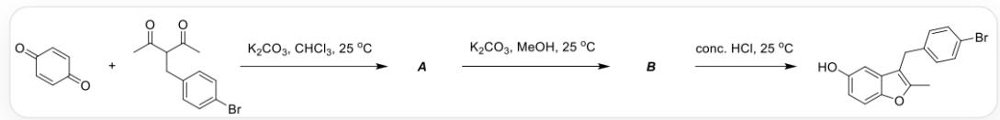
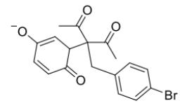
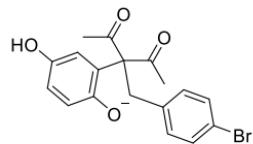
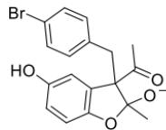
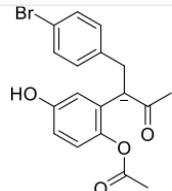
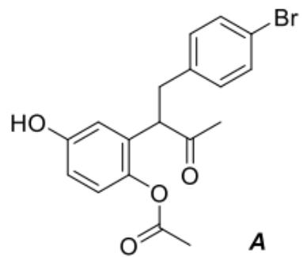
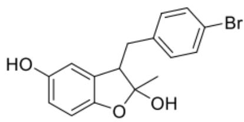
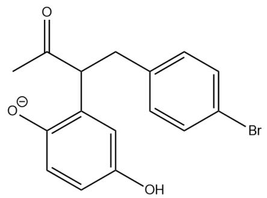
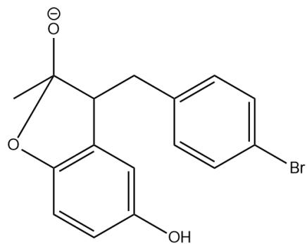

# Question

In recent years, various one-pot multi-step reactions have been developed to construct aromatic heterocycles. Benzofuran, an important oxygen-containing heterocycle, is a key pharmacophoric scaffold for many bioactive compounds. The following reaction can construct 2,3-dialkyl-5-hydroxybenzofuran.

The reaction is represented by SMILES as, the first step

$\mathrm{O = C(C = C1)C = CC1 = O. CC(C(C = O)CC2 = CC = C(Br)C = C2) = O > > [^* ]}$ , with conditions  $K_{2}CO_{3},CHCl_{3}$ , 25°C, the second step of the reaction is the generation of  ${}^{**}\mathrm{B}^{**}$  from  ${}^{**}\mathrm{A}^{**}$ , with conditions  $K_{2}CO_{3},MeOH$ ,  $25^{\circ}C$ , the third step of the reaction is  $[\mathsf{B}] >> \mathsf{CC1} = \mathsf{C}(\mathsf{C2} = \mathsf{CC}(\mathsf{O}) = \mathsf{CC} = \mathsf{C2O1})\mathsf{CC3} = \mathsf{CC} = \mathsf{C}(\mathsf{Br})\mathsf{C} = \mathsf{C3}$ , with conditions conc.,  $HCl$ ,  $25^{\circ}C$

Deduce the structures of intermediates  $\mathbf{A}$  and  $\mathbf{B}$ . Regarding  $\mathbf{A}$  and  $\mathbf{B}$ , the following statements are made:

1. A has three rings.  
2. The generation of  $\mathbf{A}$  involves a tricyclic intermediate.  
3. A contains four oxygen atoms.  
4. The generation of  $\mathbf{B}$  from  $\mathbf{A}$  involves an enolate intermediate.  
5. The generation of the product from  $\mathbf{B}$  involves a hemiketal intermediate.  
6. The driving force of the entire reaction lies in aromatization.

Let  $a$  be the sum of the squares of the serial numbers of the correct statements, and  $b$  be the square of the sum of the incorrect statements. Find  $a / b$ , rounded to three significant figures.

A. All other options are incorrect

B. 0.285  
C. 0.380  
D. 0.490  
E. 0.313  
F. 0.953  
G. 0.194  
H. 0.610

# Answer

Correct Answer: D

# Detailed Explanation

First, in chloroform, the common  $\alpha$ -hydrogen of the diketone is removed by a base, forming an enolate anion. The carbon end attacks the  $\beta$ -position carbon of the carbonyl group on the benzoquinone, forming an enolate anion on the benzoquinone, followed by rearomatization to form a hydroquinone anion structure. Subsequently, the phenoxide anion attacks the carbonyl carbon in the  $\beta$ -diketone, forming a five-membered ring and a hemiketal anion structure, followed by ring-opening, forming an enolate anion, and A is obtained after workup.

The intermediates for the formation of  $\mathbf{A}$  are shown below.

Intermediates for the formation of  $\mathbf{A}^{\star \star}$  . The first intermediate is represented by SMILES as

CC(=O)C(CC1=CC=C(C=C1)Br)(C(=O)C)C2C=C(C=CC2=O)[O-]; The second intermediate is represented by

SMILES as CC(=O)C(CC1=CC=C(C=C1)Br)(C(=O)C)C2=CC(=CC=C2[O-])O; The third intermediate is

represented by SMILES as CC(=O)C1(CC2=CC=C(C=C2)Br)C3=CC(=CC=C3OC1(C)[O-])O; The fourth

intermediate is represented by SMILES as CC([C-](C1=C(OC(C)=O)C=CC(O)=C1)CC2=CC=C(Br)C=C2)=O.

# CHECKPOINT

1 PTS

The first intermediate for the formation of  $\mathbf{A}$  is represented by SMILES as CC(=O)C(CC1=CC=C(C=C1)Br)

$$
(\mathrm {C} (= \mathrm {O}) \mathrm {C}) \mathrm {C} 2 \mathrm {C} = \mathrm {C} (\mathrm {C} = \mathrm {C C} 2 = \mathrm {O}) [ \mathrm {O} - ]
$$

# CHECKPOINT

1 PTS

[The second intermediate for the formation of  $\mathbf{A}$  is represented by SMILES as CC(=O)C(CC1=CC=C(C=C1)Br)(C(=O)C)C2=CC(=CC=C2[O-])O

# CHECKPOINT

1 PTS

The third intermediate for the formation of A is represented by SMILES as CC(=O)C1(CC2=CC=C(C=C2)Br)C3=CC(=CC=C3OC1(C)[O-])O

# CHECKPOINT

1 PTS

The fourth intermediate for the formation of  $\mathbf{A}$  is represented by SMILES as CC([C-]  $(\mathrm{C}1 = \mathrm{C}(\mathrm{OC}(\mathrm{C}) = \mathrm{O})\mathrm{C} = \mathrm{CC}(\mathrm{O}) = \mathrm{C}1)\mathrm{CC}2 = \mathrm{CC} = \mathrm{C}(\mathrm{Br})\mathrm{C} = \mathrm{C}2) = \mathrm{O}$

In protic solvents,  $\mathbf{A}$  loses an acetyl group to form a phenoide anion, and then the phenoide anion attacks the ketone carbon to generate a hemiketal anion, and hemiketal  $\mathbf{B}$  is obtained after workup.

The structures of A and B are represented by SMILES as

CC(C(CC1=CC=C(C=C1)Br)C2=C(C=CC(O)=C2)OC(C)=O) = O and

CC1(O)C(CC2=CC=C(C=C2)Br)C3=C(C=CC(O)=C3)O1, respectively, as shown in the figure below.

  
B

The structures of  $\mathbf{\Pi}^{**}\mathbf{A}^{\mathbf{\Pi}^{**}}$  and  $\mathbf{\Pi}^{**}\mathbf{B}^{\mathbf{\Pi}^{**}}$  are represented by SMILES as

$$
C C (C (C C 1 = C C = C (C = C 1) B r) C 2 = C (C = C C (O) = C 2) O C (C) = O) = O a n d
$$

$$
C C 1 (O) C (C C 2 = C C = C (C = C 2) B r) C 3 = C (C = C C (O) = C 3) O 1
$$

# CHECKPOINT

2 PTS

The

structure

of

A is

represented

by

SMILES

as

$$
\mathrm {C C} (\mathrm {C} (\mathrm {C C} 1 = \mathrm {C C} = \mathrm {C} (\mathrm {C} = \mathrm {C} 1) \mathrm {B r}) \mathrm {C} 2 = \mathrm {C} (\mathrm {C} = \mathrm {C C} (\mathrm {O}) = \mathrm {C} 2) \mathrm {O C} (\mathrm {C}) = \mathrm {O}) = \mathrm {O}
$$

# CHECKPOINT

2 PTS

The structure of  $\mathbf{B}$  is represented by SMILES as CC1(O)C(CC2=CC=C(C=C2)Br)C3=C(C=CC(O)=C3)O1

The transformation from  $\mathbf{A}$  to  $\mathbf{B}$  involves two intermediates as shown in the figure below.

Two intermediates for the formation of  $\mathbf{^{**}B^{**}}$  from  $\mathbf{^{**}A^{**}}$ . The first intermediate is represented by SMILES as CC(C(CC1=CC=C(C=C1)Br)C2=C(C=CC(O)=C2)[O-])=O; The second intermediate is represented by SMILES as CC1([O-])C(CC2=CC=C(C=C2)Br)C3=C(C=CC(O)=C3)O1.

# CHECKPOINT

1 PTS

The first intermediate for the formation of B from A is represented by SMILES as CC(C(CC1=CC=C(C=C1)Br)C2=C(C=CC(O)=C2)[O-])=O

# CHECKPOINT

1 PTS

The second intermediate for the formation of  $\mathbf{B}$  from  $\mathbf{A}$  is represented by SMILES as CC1([O-])C(CC2=CC=C(C=C2)Br)C3=C(C=CC(O)=C3)O1

Subsequently, B undergoes dehydration under concentrated, acidified conditions to form a benzofuran product.

# CHECKPOINT

1 PTS

Dehydration of  $\mathbf{B}$  to generate the product

Now, determine whether each statement is correct or not. A has two rings, statement 1 is incorrect. The third intermediate for the formation of A has 3 rings, statement 2 is correct. A has 4 oxygen atoms, statement 3 is correct. The formation of B from A does not involve an enolate anion, statement 4 is incorrect. The formation of the product from B only involves an oxonium ion intermediate, statement 5 is incorrect. A benzene ring is formed during the formation of A, and a furan ring is formed during the formation of B. Aromatization is an important driving force for the reaction, statement 6 is correct.

The sum of the squares of the correct statement numbers is a, and the sum of the squares of the incorrect statement numbers is b.  $a = 4 + 9 + 36 = 49$ ,  $b = (1 + 4 + 5)^2 = 100$ ,  $a / b = 0.490$ , choose D.