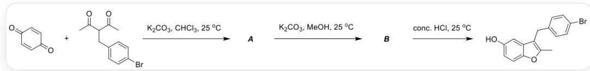
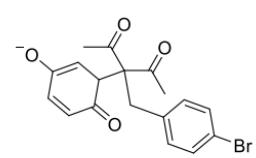
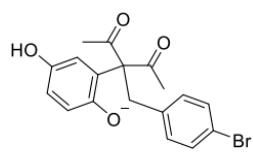
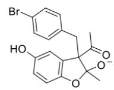
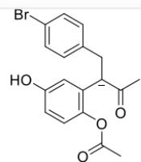
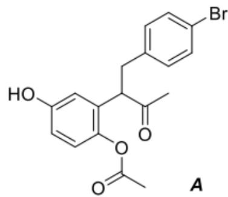
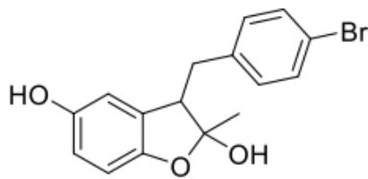
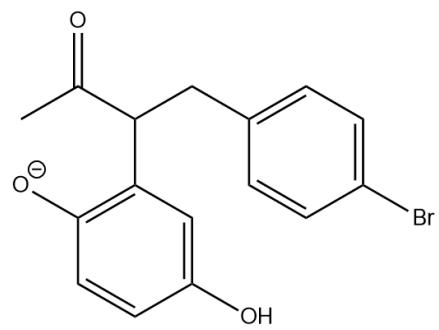
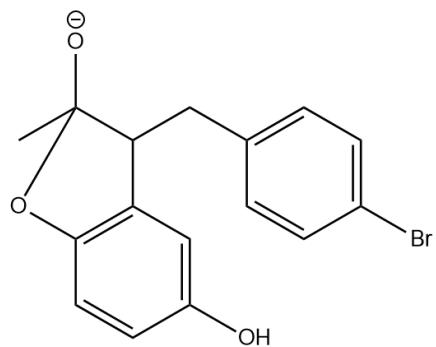

# 题目

近年来，开发了多种一锅法多步反应构建芳香杂环的方法。苯并呋喃是一种重要的含氧杂环，是多种生物活性化合物的关键药效学框架。以下反应可以构筑2,3-二烷基-5-羟基苯并呋喃。

以SMILES表示反应为，第一步  $O = C(C = C1)C = CC1 = O.CC(C(C = O)CC2 = CC = C(Br)C = C2) = O > > [^* ]$  ，条件为  $K_{2}CO_{3},CHCl_{3},25^{\circ}C$  ，第二步反应为由  $\text{水水}$  生成  $\text{水水}$  ，条件为  $K_{2}CO_{3},MeOH,25^{\circ}C$  ，第三步反应为[B]>>CC1=C(C2=CC(O)=CC=C2O1)CC3=CC=C(Br)C=C3，条件为conc.,HCl,  $25^{\circ}C$

推断中间产物A和B的结构，关于A,B有以下说法

1.A有三个环  
2.生成A的过程中经历了三环中间体  
3.A含四个氧原子  
4.A生成B的过程中经历烯醇负离子中间体  
5.B生成产物的过程中经历半缩酮中间体  
6. 整个反应的驱动力在于芳构化

设正确的说法序号的平方和为a，错误的说法的和的平方为b，求a/b，保留三位有效数字

A. 其他选项均不正确  
B. 0.285

C. 0.380  
D. 0.490  
E. 0.313  
F. 0.953  
G. 0.194  
H. 0.610

# 答案

# 正确答案: D

# 详细解析

首先，在三氯甲烷中，二酮共同的α氢被碱去除，形成烯醇负离子，碳端进攻苯醌上羰基的β位碳，在苯醌上形成烯醇负离子，随后重新芳构化形成对苯二酚负离子结构，随后酚氧负离子进攻β-二酮中的羰基碳，形成五元环和半缩酮负离子结构，随后开环，形成烯醇负离子，后处理后得到A。

形成A的中间体见下图

生成\*\*A\*\*的中间体。第一个中间体以SMILES表示为CC(=O)C(CC1=CC=C(C=C1)Br)

(C(=O)C)C2C=C(C=CC2=O)[O-]; 第二个中间体以SMILES表示为CC(=O)C(CC1=CC=C(C=C1)Br)

(C(=O)C)C2=CC(=CC=C2[O-])O；第三个中间体以SMILES表示为

CC(=O)C1(CC2=CC=C(C=C2)Br)C3=CC(=CC=C3OC1(C)[O-])O；第四个中间体以SMILES表示为CC([C-]

$(C1 = C(OC(C) = O)C = CC(O) = C1)CC2 = CC = C(Br)C = C2) = O_{\circ}$

# CHECKPOINT

1 PTS

生成A的第一个中间体以SMILES表示为CC(=O)C(CC1=CC=C(C=C1)Br)(C(=O)C)C2C=C(C=CC2=O)[O-]

# CHECKPOINT

1 PTS

[生成A的第二个中间体以SMILES表示为  $\mathrm{CC(=O)C(CC1 = CC = C(C = C1)Br)}$

$$
(\mathrm {C} (= \mathrm {O}) \mathrm {C}) \mathrm {C} 2 = \mathrm {C C} (= \mathrm {C C} = \mathrm {C} 2 [ \mathrm {O} - ]) \mathrm {O}
$$

# CHECKPOINT

1 PTS

生成A的第三个中间体以SMILES表示为CC(=O)C1(CC2=CC=C(C=C2)Br)C3=CC(=CC=C3OC1(C)

$$
[ \mathrm {O} - ]) \mathrm {O}
$$

# CHECKPOINT

1 PTS

生成A的第四个中间体以SMILES表示为CC([C-]

$$
(\mathrm {C} 1 = \mathrm {C} (\mathrm {O C} (\mathrm {C}) = \mathrm {O}) \mathrm {C} = \mathrm {C C} (\mathrm {O}) = \mathrm {C} 1) \mathrm {C C} 2 = \mathrm {C C} = \mathrm {C} (\mathrm {B r}) \mathrm {C} = \mathrm {C} 2) = \mathrm {O}
$$

A在质子溶剂中，脱去乙酰基形成酚负离子后，酚负离子进攻酮碳生成半缩酮负离子，后处理得到半缩酮B。

A和B的结构以SMILES表示分别为CC(C(CC1=CC=C(C=C1)Br)C2=C(C=CC(O)=C2)OC(C)=O)=O，CC1(O)C(CC2=CC=C(C=C2)Br)C3=C(C=CC(O)=C3)O1，结构如下图所示

  
B

**A**和**B**的结构以SMILES表示分别为CC(C(CC1=CC=C(C=C1)Br)C2=C(C=CC(O)=C2)OC(C)=O)，

CC1(O)C(CC2=CC=C(C=C2)Br)C3=C(C=CC(O)=C3)O1

# CHECKPOINT

2 PTS

A的结构以SMILES表示为CC(C(CC1=CC=C(C=C1)Br)C2=C(C=CC(O)=C2)OC(C)=O)=O

# CHECKPOINT

2 PTS

B的结构以SMILES表示为CC1(O)C(CC2=CC=C(C=C2)Br)C3=C(C=CC(O)=C3)O1

A到B经历两个中间体如下图所示

由\*\*A\*\*生成\*\*B\*\*的两个中间体。第一个中间体以SMILES表示为

CC(C(CC1=CC=C(C=C1)Br)C2=C(C=CC(O)=C2)[O-])=O；第二个中间体以SMILES表示为

CC1([O-])C(CC2=CC=C(C=C2)Br)C3=C(C=CC(O)=C3)O1。

# CHECKPOINT

1 PTS

A生成B的第一个中间体以SMILES表示为CC(C(CC1=CC=C(C=C1)Br)C2=C(C=CC(O)=C2)[O-])=O

# CHECKPOINT

1 PTS

A生成B的第二个中间体以SMILES表示为CC1([O-])C(CC2=CC=C(C=C2)Br)C3=C(C=CC(O)=C3)O1

随后B在浓缩，酸化的条件下脱水形成苯并呋喃产物。

# CHECKPOINT

1 PTS

B脱水生成产物

现判断各说法正确与否，A有两个环，说法1错误，生成A的第三个中间体有3个环，说法2正确，A有4个氧原子，说法3正确，A生成B不经历烯醇负离子，说法4错误，B生成产物只经历氧钌正离子中间体，说法5错误，生成A时生成了苯环，生成B时生成了呋喃环，芳构化是反应进行的重要动力，说法6正确。

正确的说法序号的平方和为a，错误的说法的和的平方为b。  $a = 4 + 9 + 36 = 49$ ，  $b = (1 + 4 + 5)^2 = 100$ ，  $a / b = 0.490$ ，选择D。