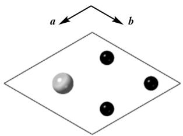
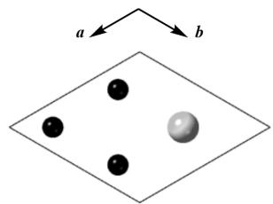
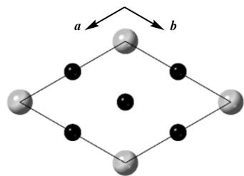

# Question

Perovskite is one of the classic structures. The perovskite with a common structure  $(\mathbf{ABO}_3)$  can be described as follows: the A-site atoms and oxygen atoms form a cubic close-packed structure together, and the B-site atoms fill all the octahedral voids formed only by oxygen atoms. In addition, if the A-site atoms and oxygen atoms form other forms of close-packed structures, perovskite can also form a variety of other structures (hexagonal perovskite). For example, in  $5H - \mathrm{BaCrO}_3$  (denoted as  $\mathbf{X}$ ) obtained at high temperature, Ba atoms and O atoms together form a ...ABABCABABC... type close-packed structure (where the structures of layers A, B, and C are shown in the figure below; the large spheres are Ba atoms, and the small spheres are O atoms); Cr atoms fill all the octahedral voids formed only by O atoms.

  
A层

  
B层

  
C层

The figure shows the structures of layers A, B, and C. In layer A, the coordinates of the large spheres are (2/3, 1/3), and the coordinates of the small spheres are (1/6, 1/3), (1/6, 5/6), and (2/3, 5/6); in layer B, the coordinates of the large spheres are (1/3, 2/3), and the coordinates of the small spheres are (1/3, 1/6), (5/6, 1/6), and (5/6, 2/3); in layer C, the coordinates of the large spheres are (0, 0), and the coordinates of the small spheres are (1/2, 0), (0, 1/2), and (0, 0).

$\mathbf{X}$  can be reduced by hydrogen at  $350^{\circ}\mathrm{C}$  to obtain  $\mathbf{Y}$ . Crystal structure determination shows that the main structural difference between  $\mathbf{Y}$  and  $\mathbf{X}$  is that the number and position of O atoms in layer C in  $\mathbf{Y}$  are different from those in  $\mathbf{X}$ , which makes the two layers of Cr atoms originally connected to the O atoms in layer C in  $\mathbf{Y}$  transformed into tetrahedral coordination; except for the O atoms in layer C, the positions of other atoms have no obvious changes; and the cell parameters of  $\mathbf{Y}$  and  $\mathbf{X}$  are not significantly different.

The chemical formula of  $\mathbf{Y}$  can be determined by thermogravimetric analysis. When  $\mathbf{X}$  and  $\mathbf{Y}$  are heated to  $720^{\circ}\mathrm{C}$  in an oxygen atmosphere, both generate  $\mathbf{Z}$ ; the conversion of  $\mathbf{X}$  to  $\mathbf{Z}$  increases the weight by  $6.74\%$ , while the conversion of  $\mathbf{Y}$  to  $\mathbf{Z}$  increases the weight by  $8.20\%$ .

Assume that  $\left[\mathrm{CrO}_6\right]$  in  $\mathbf{X}$  is a regular octahedron, and the  $\mathrm{Cr - O}$  bond length is  $202~\mathrm{pm}$ .

Let  $a, b$  be the mass fractions of oxygen in  $\mathbf{Y}, \mathbf{Z}$  respectively; let  $h$  be the height of a stacking layer (unit: pm), and  $\rho$  be the density of  $\mathbf{X}$  (unit:  $g / cm^3$ ).

And there are the following statements about  $\mathbf{X}$ :

(1) The connection mode between  $\left[\mathrm{CrO}_6\right]$  octahedra in  $\mathbf{X}$  has vertex sharing;  
(2) The connection mode between  $\left[\mathrm{CrO}_6\right]$  octahedra in  $\mathbf{X}$  has edge sharing;  
(3) The connection mode between  $\left[\mathrm{CrO}_6\right]$  octahedra in  $\mathbf{X}$  has face sharing;  
(4) There is no connection between  $\left[\mathrm{CrO}_6\right]$  octahedra in  $\mathbf{X}$ ;

Let  $c$  be the sum of the serial numbers of all the correct statements above.

Then the value of  $\log_{\rho}\frac{\lfloor abh\rfloor}{c}$  is (where  $\lfloor \rfloor$  is the floor function, and the final result with an error within 0.01 is considered correct):

A. All other options are incorrect  
B. -0.89  
C. -0.73  
D. -0.52  
E. -0.38  
F. -0.11

G. 0.14  
H. 0.39  
1. 0.57  
J. 0.66  
K. 0.89  
L. 1.05

# Answer

Correct Answer: I

# Detailed Explanation

The molecular weight of  $\mathbf{X}$  is  $M(\mathbf{X}) = 137.3 + 52 + 3 \times 16 = 237.3$

Therefore, the molecular weight of  $\mathbf{Z}$  is  $M(\mathbf{Z}) = 237.3 \times (1 + 6.74\%) = 253.3$ , which is 16 more than  $\mathbf{X}$ , which is one oxygen atom, so  $\mathbf{Z}$  is  $\mathrm{BaCrO}_4$

# CHECKPOINT

0.5 PTS

The molecular weight of  $\mathbf{Z}$  is 253.3

# CHECKPOINT

1 PTS

Z is  $\mathrm{BaCrO_4}$

The molecular weight of  $\mathbf{Y}$  is  $M(\mathbf{Y}) = 253.3 / (1 + 8.20\%) = 234.1$ , so  $\mathbf{Y}$  is  $\mathrm{BaCrO}_{2.8}$

# CHECKPOINT

0.5 PTS

The molecular weight of  $\mathbf{Y}$  is 234.1

# CHECKPOINT

2 PTS

Y is  $\mathrm{BaCrO_{2.8}}$

Therefore,  $a = 19.14\%$ ,  $b = 25.26\%$ .

# CHECKPOINT

1 PTS

$$
a = 19.14\%, b = 25.26\%
$$

First, calculate the edge length of the  $\left[\mathrm{CrO}_6\right]$  octahedron:  $d = 202~pm\times \sqrt{2} = 285.7~pm$

The height of a stacking layer is the distance between opposite faces of the octahedron:  $h = 202 \, \text{pm} \times \frac{2}{3} \sqrt{3} = 233.3 \, \text{pm}$

# CHECKPOINT

1 PTS

The height of a stacking layer  $h = 233.3 \, \text{pm}$

Therefore, the unit cell parameters  $\mathbf{a} = 2d = 571\text{pm},\mathbf{c} = 5h = 1166\text{pm}$

Therefore, the density  $\rho = \frac{ZM}{N_A V} = 5.98 g / cm^3$

# CHECKPOINT

2 PTS

Density  $\rho = 5.98\mathrm{g / cm^3}$

According to the given layered structure, it can be seen that in ABA stacking, the octahedra formed by AB and BA are connected by sharing faces, while in BCA, the octahedra formed by BC and CA are connected by sharing vertices, so (1) and (3) are correct.

# CHECKPOINT

1 PTS

The connection mode between  $\left[\mathrm{CrO}_6\right]$  octahedra in  $\mathbf{X}$  includes vertex-sharing and face-sharing

Therefore,  $c = 4$

# CHECKPOINT

1 PTS

$$
c = 4
$$

In summary,  $a = 19.14\%$ ,  $b = 25.26\%$ ,  $c = 4$ ,  $h = 233.3$ ,  $\rho = 5.98$

$$
\log_ {\rho} \frac {\lfloor a b h \rfloor}{c} = 0. 5 7
$$

# CHECKPOINT

1 PTS

$$
\log_ {\rho} \frac {\lfloor a b h \rfloor}{c} = 0. 5 7
$$