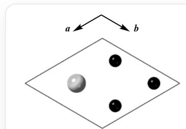
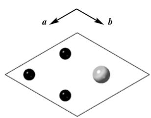
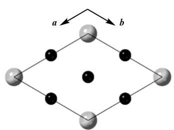

# 题目

钙钛矿是经典结构之一，常见结构的钙钛矿（ $\mathrm{ABO}_3$ ）可描述为：A位原子和氧原子共同作立方最密堆积，B位原子填入所有仅有氧原子形成的八面体空隙中。除此之外，若A位原子和氧原子做其他形式的最密堆积，则钙钛矿还可形成多种多样的其他结构(六方钙钛矿)。例如，在高温制得的 $5H - BaCrO_3$ （记为X）中，Ba原子与O原子共同作...ABABCABABC...型最密堆积（其中A、B、C层的结构均如下图所示；大球为Ba原子，小球为O原子）；Cr原子填入所有仅由O原子形成的八面体空隙中。

  
A层

  
B层

  
C层  
图中展示了A、B、C层的结构，A层中大球的坐标为（2/3，1/3)，小球的坐标为（1/6，1/3)，(1/6，5/6)和（2/3，5/6)；B层中大球的坐标为（1/3，2/3)，小球的坐标为（1/3，1/6)，(5/6，1/6）和（5/6，2/3)；C层中大球的坐标为（0，0)，小球的坐标为（1/2，0)，(0，1/2）和（0，0）。

X在  $350^{\circ} \mathrm{C}$  下经氢气还原可得到Y，晶体结构测定表明：Y与X的主要结构差别在于，Y中位于C层中的O原子的数目和位置与X中不同，使得Y中原本与C层O原子相连的两层Cr原子转变为四面体配位；除C层的O原子之外，其他原子的位置无明显变化；且Y与X的晶胞参数差别并不显著。

通过热重分析，可以确定Y的化学式。X和Y在氧气气氛中加热至  $720^{\circ}\mathrm{C}$ ，均生成Z；X转变为Z增重  $6.74\%$  ，而Y转变为Z则增重  $8.20\%$  。

假设  $\mathbf{X}$  中的  $[\mathrm{CrO}_6]$  为正八面体，设  $\mathrm{Cr - O}$  键长均为  $202\mathrm{pm}$  。

记  $\mathbf{Y}$ ,  $\mathbf{Z}$  中氧元素的质量分数分别为  $a, b$ ; 记一层堆积层的高度为  $h$  (单位:  $\mathrm{pm}$ ),  $\mathbf{X}$  的密度为  $\rho$  (单位:  $g/cm^3$ )。

以及有下列关于  $\mathbf{X}$  的说法：

(1)  $\mathbf{X}$  中  $[\mathrm{CrO}_6]$  八面体之间的连接方式存在共顶点连接;  
(2)  $\mathbf{X}$  中  $[\mathrm{CrO}_6]$  八面体之间的连接方式存在共棱连接;  
(3)  $\mathbf{X}$  中  $[\mathrm{CrO}_6]$  八面体之间的连接方式存在共面连接;  
(4)  $\mathbf{X}$  中  $[\mathrm{CrO}_6]$  八面体之间无任何连接;

记上述说法中所有正确的说法的序号之和为  $c$  。

则  $\log_{\rho}\frac{\lfloor abh\rfloor}{c}$  的值为（  $\lfloor \rfloor$  为向下取整函数，最终结果误差在0.01之内视为正确）：

A. 其他选项均不正确  
B. -0.89  
C. -0.73  
D. -0.52  
E. -0.38  
F. -0.11  
G. 0.14  
H. 0.39  
1. 0.57

J. 0.66  
K. 0.89  
L. 1.05

# 答案

正确答案: I

# 详细解析

$\mathbf{X}$  的分子量为  $M(\mathbf{X}) = 137.3 + 52 + 3 \times 16 = 237.3$

因此  $\mathbf{Z}$  的分子量为  $M(\mathbf{Z}) = 237.3 \times (1 + 6.74\%) = 253.3$  ，相对于  $\mathbf{X}$  多出16，为一个氧原子，因此  $\mathbf{Z}$  为  $\mathrm{BaCrO_4}$

# CHECKPOINT

0.5 PTS

$\mathbf{Z}$  的分子量为253.3

# CHECKPOINT

1 PTS

Z为  $\mathrm{BaCrO_4}$

$\mathbf{Y}$  的分子量为  $M(\mathbf{Y}) = 253.3 / (1 + 8.20\%) = 234.1$  ，因此  $\mathbf{Y}$  为  $\mathrm{BaCrO}_{2.8}$

# CHECKPOINT

0.5 PTS

$\mathbf{Y}$  的分子量为234.1

# CHECKPOINT

2 PTS

Y为  $\mathrm{BaCrO}_{2.8}$

因此  $a = 19.14\% ,b = 25.26\%$

# CHECKPOINT

1 PTS

$$
a = 19.14\%, b = 25.26\%
$$

首先计算  $\left[\mathrm{CrO}_{6}\right]$  八面体的棱长:  $d = 202 \mathrm{pm} \times \sqrt{2} = 285.7 \mathrm{pm}$

一层堆积层的高为八面体相对面的距离：  $h = 202pm\times \frac{2}{3}\sqrt{3} = 233.3pm$

# CHECKPOINT

1 PTS

一层堆积层的高  $h = 233.3 \, \text{pm}$

因此晶胞参数  $\mathbf{a} = 2d = 571\,pm,\mathbf{c} = 5h = 1166\,pm$

因此密度  $\rho = \frac{Z M}{N_{A} V} = 5.98 g / c m^{3}$

# CHECKPOINT

2 PTS

密度  $\rho = 5.98 g / c m^{3}$

根据所给的层状结构可以看出在ABA堆积中AB和BA形成的八面体为共面连接，而BCA中BC和CA形成的八面体为共顶点连接，因此（1）（3）为正确的。

# CHECKPOINT

1 PTS

X中  $\left[\mathrm{CrO}_6\right]$  八面体之间的连接方式存在共顶点连接和共面连接

因此  $c = 4$

# CHECKPOINT

1 PTS

$$
c = 4
$$

综上，  $a = 19.14\% ,b = 25.26\% ,c = 4,h = 233.3,\rho = 5.98$

$$
\log_ {\rho} \frac {| a b h |}{c} = 0. 5 7
$$

# CHECKPOINT

1 PTS

$$
\log_ {\rho} \frac {\lfloor a b h \rfloor}{c} = 0. 5 7
$$