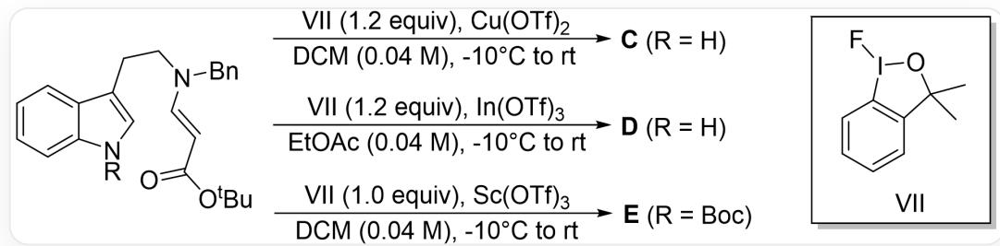
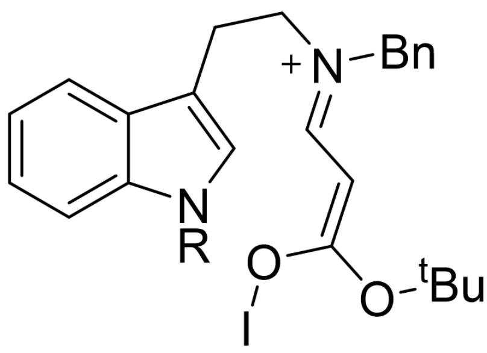
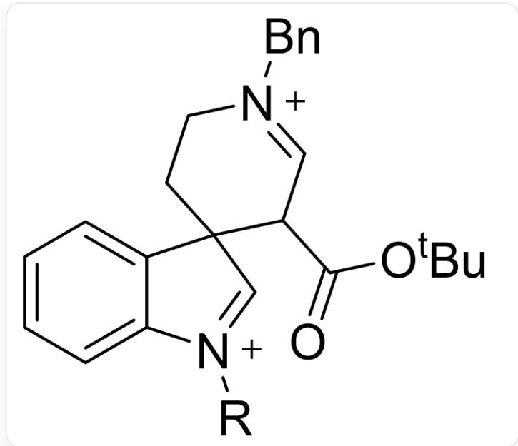
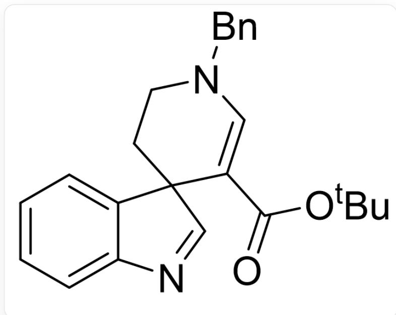
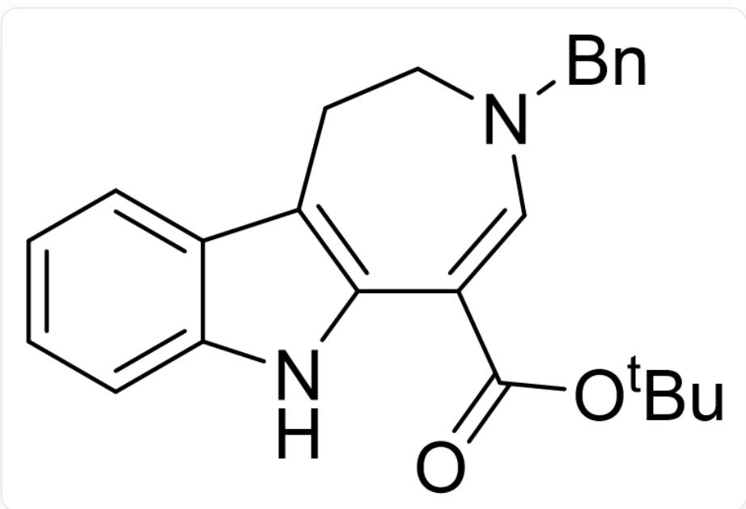
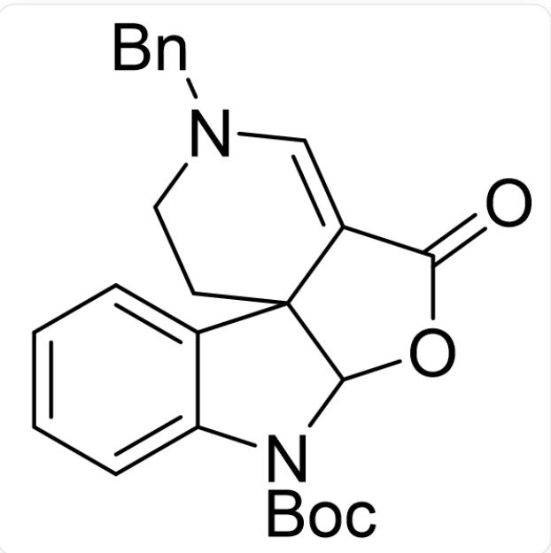

# Question

Using  $\beta$ -aminocrotonate as a substrate, different alkaloid skeletons can be constructed under the catalysis of different Lewis acids:

Substrate is O=C(OC(C)(C)C)/C=C/N(CC1=CC=CC=C1)CCC2=CN(C3=CC=CC=C32)[R], reaction conditions are: 1.2 equivalents of VII (structure is FI1OC(C)(C)C2=C1C=CC=C2), LA, solvent, -10 degrees Celsius gradually increased to room temperature, substrate concentration is 0.04 M. When LA=Cu(OTf)₂, R=H, solvent=DCM, the product is C; when LA=In(OTf)₃, R=H, solvent=EtOAc, the product is D; when LA=Sc(OTf)₃, R=Boc, solvent=DCM, the product is E

It is known that  $\mathbf{C}$  has a six-fused-five-spiro-six structure,  $\mathbf{D}$  has a six-fused-five-fused-seven structure, and the molecular formula of  $\mathbf{E}$  is  $\mathrm{C_{25}H_{25}N_2O_4}$ .  $\mathbf{C}$ ,  $\mathbf{D}$ , and  $\mathbf{E}$  do not contain fluorine, and their formation all involves a key intermediate  $\mathbf{X}^{2+}$  that does not contain iodine. The  $\mathrm{C}-\mathrm{I}$  bond has never been formed during the reaction. Which of the following statements are correct:

1. C has  $10 \, \text{sp}^2 \text{C} - \text{H}$  bonds  
2. If benzene rings are not considered,  $\mathbf{D}$  has 2 carbon-carbon double bonds  
3.  $\mathbf{E}$  has 4 rings  
4. If  $\mathrm{R} = \mathrm{H}$ , the key intermediate  $\mathbf{X}^{2+}$  has  $16\mathrm{sp}^3\mathrm{C}-\mathrm{H}$  bonds

A. All other options are incorrect  
B. 1

C. 2  
D. 3  
E. 4  
F. 1,2  
G. 1,3  
H. 1,4  
1. 2,3  
J. 2,4  
K. 3,4  
L. 1,2,3  
M. 1,2,4  
N. 1,3,4  
O. 2,3,4  
P. 1,2,3,4

# Answer

Correct Answer: J

# Detailed Explanation

VII is an oxidant. According to the information in the question, oxidation can only be completed by forming I - O bonds. Therefore, the following intermediate is formed first (where "I" represents the iodine atom and its connected groups):

  
IO/C(OC(C)(C)C) = C\C = [N+](CC1=CC=CC=C1)\CCC2=CN(C3=CC=CC=C32)[R]

C has a hexacyclopenta[6,5]spiro[6] structure. Only the C3 carbon of indole can undergo nucleophilic attack, then the key intermediate  $\mathbf{X}^{2+}$  is obtained (it is not yet certain that it is  $\mathbf{X}^{2+}$  at this time; this is written this way for convenience):

  
[ \mathrm{O} = \mathrm{C}(\mathrm{OC}(\mathrm{C})(\mathrm{C})\mathrm{C})\mathrm{C}(\mathrm{C} = [\mathrm{N} + ](\mathrm{CC}1 = \mathrm{CC} = \mathrm{CC} = \mathrm{C}1)\mathrm{CC}2)\mathrm{C}32\mathrm{C} = [\mathrm{N} + ]([\mathrm{R}])\mathrm{C}4 = \mathrm{CC} = \mathrm{CC} = \mathrm{C}43 ]

After losing 2 protons,  $\mathbf{C}$  can be obtained:

  
$\mathrm{O = C(OC(C)(C)C)C1 = CN(CC2 = CC = CC = C2)CCC31C = NC4 = CC = CC = C43}$

# CHECKPOINT

1 PTS

C is  $O = C(OC(C)(C)C)C1 = CN(CC2 = CC = CC = C2)CCC31C = NC4 = CC = CC = C43$

There are  $5 + 4 + 1 + 1 = 11\mathrm{sp}^2\mathrm{C} - \mathrm{H}$  bonds in  $\mathbf{C}$ , statement 1 is incorrect.

To obtain the hexacyclopentahepta[6,5,7]  $\mathbf{D}$ , alkyl migration is required, and after losing 2 protons,  $\mathbf{D}$  can be obtained:

$\mathrm{O = C(OC(C)(C)C)C1 = CN(CC2 = CC = CC = C2)CCC3 = C1NC4 = CC = CC = C43}$

# CHECKPOINT

1 PTS

D is  $O = C(OC(C)(C)C)C1 = CN(CC2 = CC = CC = C2)CCC3 = C1NC4 = CC = CC = C43$

Ignoring the benzene ring,  $\mathbf{D}$  has 2 carbon-carbon double bonds, statement 2 is correct.

It can be basically determined that  $\mathbf{X}^{2+}$  is  $O = C(OC(C)(C)C)C(C = [N + ])$  ( $CC1 = CC = CC = C1$ ) ( $CC2$ ) ( $C32C = [N + ]$ ) ( $[R])C4 = CC = CC = C43$ ). Considering the benzyl and tert-butyl groups, there are a total of  $2 + 2 + 2 + 1 + 9 = 16$ $\mathrm{sp}^3\mathrm{C}-\mathrm{H}$  bonds, statement 4 is correct.

# CHECKPOINT

1 PTS

$$
\mathbf {X} ^ {2 +} \text {i s} O = C (O C (C) (C) C) C (C = [ N + ] (C C 1 = C C = C C = C 1) C C 2) C 3 2 C = [ N + ] ([ R ]) C 4 = C C = C C = C 4 3
$$

From the molecular formula of  $\mathbf{E}$ , it can be seen that the tert-butyl group connected to the ester group is removed. Then, the carbonyl oxygen will undergo nucleophilic attack, that is, the carboxyl oxygen in  $\mathbf{X}^{2+}$  attacks the imine cation to form a five-membered ring, and after losing a proton,  $\mathbf{E}$  is obtained:

$$
O = C 1 O C 2 N (C 3 = C C = C C = C 3 C 2 4 C 1 = C N (C C 5 = C C = C C = C 5) C C 4) C (O C (C) (C) C) = O
$$

# CHECKPOINT

1 PTS

$$
\mathbf {E} \text {i s} O = C 1 O C 2 N (C 3 = C C = C C = C 3 C 2 4 C 1 = C N (C C 5 = C C = C C = C 5) C C 4) C (O C (C) (C) C) = O
$$

$\mathbf{E}$  contains 5 rings, statement 3 is incorrect.

Statements 2 and 4 are correct, choose J.