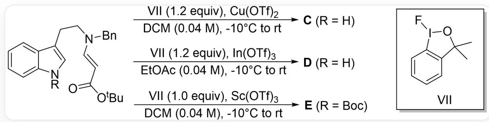
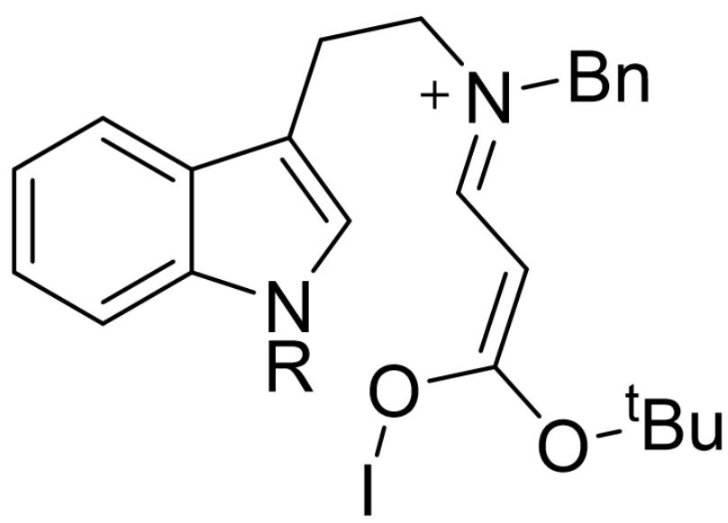
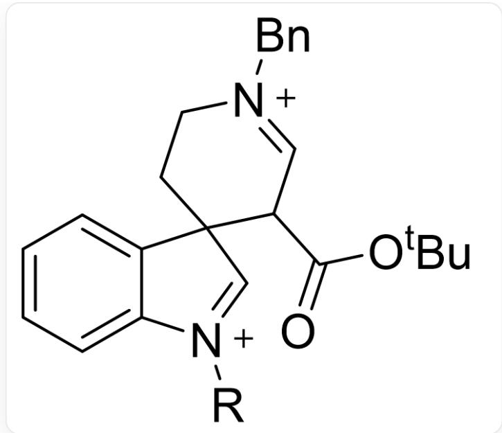
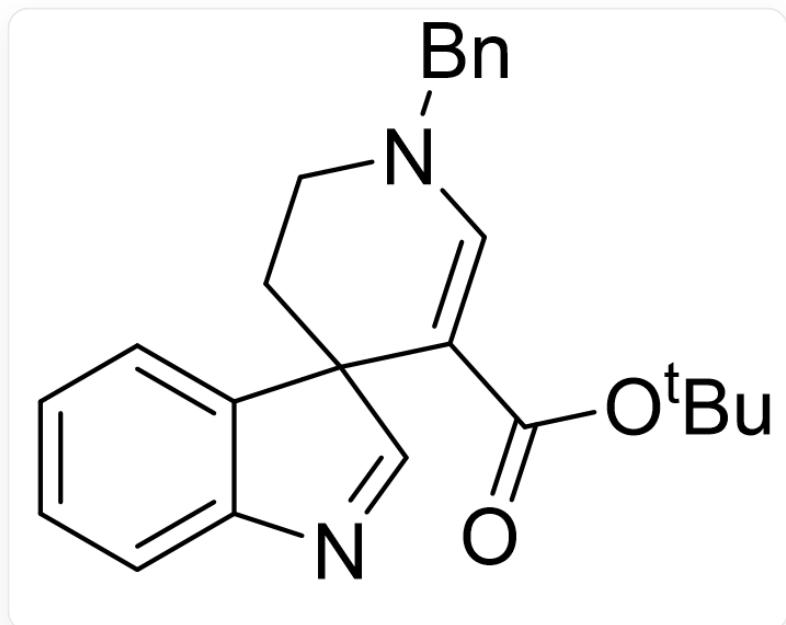
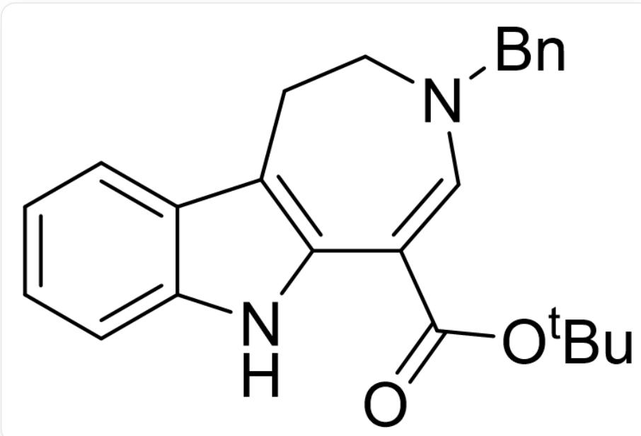
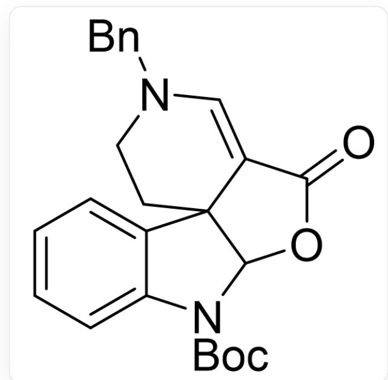

# 题目

以  $\beta$ -氨基丙烯酸酯为底物，在不同的Lewis酸催化下可以构筑不同的生物碱骨架：

底物为O=C(OC(C)(C)C)/C=C/N(CC1=CC=CC=C1)CCC2=CN(C3=CC=CC=C32)[R]，反应条件为：1.2当量的VII(结构为FI1OC(C)(C)C2=C1C=CC=C2)、LA、solvent、-10摄氏度逐渐升至室温，底物浓度为0.04M。当LA=Cu(OTf)₂，R=H，solvent=DCM时产物为C；当LA=In(OTf)₃，R=H，solvent=EtOAc时产物为D；当LA=Sc(OTf)₃，R=Boc，solvent=DCM时产物为E

已知C具有六并五螺六结构，D具有六并五并七结构，E的分子式为  $\mathrm{C}_{25}\mathrm{H}_{25}\mathrm{N}_{2}\mathrm{O}_{4}$  。C、D、E均不含氟，它们的形成均经历了不含碘的关键中间体  $\mathbf{X}^{2+}$  。反应过程中C-I键没有形成过，下列说法正确的有：

1. C中有10根  $\mathrm{sp}^{2} \mathrm{C}-\mathrm{H}$  键  
2. 如果不考虑苯环，D中有2根碳碳双键  
3.  $\mathbf{E}$  中有4个环  
4.  $\mathrm{R} = \mathrm{H}$  时, 关键中间体  $\mathrm{X}^{2 + }$  中有  $16$  根  $\mathrm{sp}^{3} \mathrm{C}-\mathrm{H}$  键

A. 其他选项均不正确  
B. 1  
C. 2

D. 3  
E. 4  
F. 1,2  
G. 1,3  
H. 1,4  
1. 2,3  
J. 2,4  
K. 3,4  
L. 1,2,3  
M. 1,2,4  
N. 1,3,4  
O. 2,3,4  
P.  $1,2,3,4$

# 答案

正确答案: J

# 详细解析

VII是一种氧化剂，根据题目信息，只能通过形成I-O键来完成氧化，故先形成下面的中间体（此处的“I”表示碘原子及其连接的基团）：

IO/C(OC(C)(C)C) = C\C = [N+](CC1=CC=CC=C1)\CCC2=CN(C3=CC=CC=C32)[R]

C有六并五螺六的结构，只能是吲哚3号碳进行亲核进攻，得到关键中间体  $\mathbf{X}^{2+}$  （此时还不能确定是  $\mathbf{X}^{2+}$ ，这里为了书写方便才这样写）：

  
[ \mathrm{O} = \mathrm{C}(\mathrm{OC}(\mathrm{C})(\mathrm{C})\mathrm{C})\mathrm{C}(\mathrm{C} = [\mathrm{N} + ](\mathrm{CC}1 = \mathrm{CC} = \mathrm{CC} = \mathrm{C}1)\mathrm{CC}2)\mathrm{C}32\mathrm{C} = [\mathrm{N} + ]([\mathrm{R}])\mathrm{C}4 = \mathrm{CC} = \mathrm{CC} = \mathrm{C}43 ]

失去2个质子后可以得到C：

  
$\mathrm{O = C(OC(C)(C)C)C1 = CN(CC2 = CC = CC = C2)CCC31C = NC4 = CC = CC = C43}$

# CHECKPOINT

1 PTS

C为O=C(OC(C)(C)C)C1=CN(CC2=CC=CC=C2)CCC31C=NC4=CC=CC=C43

C中有  $5 + 4 + 1 + 1 = 11$  根  $\mathrm{sp}^2\mathrm{C}-\mathrm{H}$  键，说法1错误

要得到六并五并七的D，需要经历烷基迁移，之后失去2个质子后可以得到D：

$\mathrm{O = C(OC(C)(C)C)C1 = CN(CC2 = CC = CC = C2)CCC3 = C1NC4 = CC = CC = C43}$

# CHECKPOINT

1 PTS

D 为  $O = C(OC(C)(C)C)C1 = CN(CC2 = CC = CC = C2)CCC3 = C1NC4 = CC = CC = C43$

不考虑苯环D有2根碳碳双键，说法2正确

由此基本可以确定  $\mathbf{X}^{2+}$  为  $O = C(OC(C)(C)C)C(C = [N + ]) (CC1 = CC = CC = C1)CC2)C32C = [N + ]$  ([R])  $C4 = CC = CC = C43$  ，考虑苄基和叔丁基，共  $2 + 2 + 2 + 1 + 9 = 16$  根  $\mathrm{sp}^3\mathrm{C}-\mathrm{H}$  键，说法4正确

# CHECKPOINT

1 PTS

$$
\mathbf {X} ^ {2 +} \text {为} O = C (O C (C) (C) C) C (C = [ N + ]) (C C 1 = C C = C C = C 1) C C 2) C 3 2 C = [ N + ] ([ R ]) C 4 = C C = C C = C 4 3
$$

由  $\mathbf{E}$  的分子式可知酯基连接的叔丁基脱去了，那么羰基氧会进行亲核进攻，即  $\mathbf{X}^{2+}$  中羧基氧进攻亚胺正离子形成五元环，失去质子后得到  $\mathbf{E}$  ：

$$
O = C 1 O C 2 N (C 3 = C C = C C = C 3 C 2 4 C 1 = C N (C C 5 = C C = C C = C 5) C C 4) C (O C (C) (C) C) = O
$$

# CHECKPOINT

1 PTS

$$
\mathbf {E} \text {为} O = C 1 O C 2 N (C 3 = C C = C C = C 3 C 2 4 C 1 = C N (C C 5 = C C = C C = C 5) C C 4) C (O C (C) (C) C) = O
$$

E 含5个环，说法3错误

说法2和4正确，选J