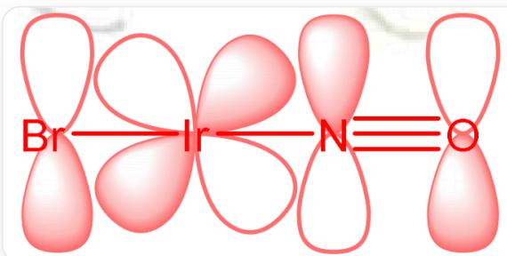
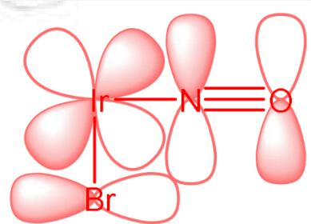

# Question

Adding  $\mathrm{NaNO}_2$  to a concentrated aqueous solution of  $\mathrm{K}_3\mathrm{IrBr}_6$  and heating it, the color of the system gradually changes from green to yellow; then concentrated hydrobromic acid is added to the system, after sufficient reaction and cooling, it is stored at  $5^{\circ}\mathrm{C}$  for several days, and a red solid  $\mathbf{X}$  is obtained. Further studies have shown that  $\mathbf{X}$  is a diamagnetic potassium salt, its anion is a mononuclear coordination anion of Ir with an integral number of crystal water molecules (and located outside the coordination anion); low-temperature drying can completely remove all crystal water molecules from  $\mathbf{X}$ , with a weight loss of  $2.65\%$ ; the content (mass fraction) of some elements in  $\mathbf{X}$  is: N,  $2.06\%$ ; Br,  $58.85\%$ . The Ir - Br bond lengths in  $\mathbf{X}$  are 242 pm and 248 pm.

Which of the following statements are correct:

1. The hybridization mode of Ir in the complex is  $d^2 sp^3$  
2.Only one Ir - Br bond has a bond length of  $248~\mathrm{pm}$  
3. When  $\mathbf{X}$  reacts with concentrated ammonia water, gas is released, and the difference in stoichiometric numbers between the left and right sides of the ionic equation for this reaction is 1

Studies have shown that when  $\mathbf{X}$  is dissolved in water, if the system is strongly acidic, the anionic structure of  $\mathbf{X}$  does not change; while when the system is weakly acidic ( $c(\mathrm{H}^{+}) < 0.5\mathrm{mol / L}$ ), the anion of  $\mathbf{X}$  will be converted into a diamagnetic anion  $\mathbf{A}^{3-}$  with 3 negative charges; when the acidity of the system is increased, the reaction proceeds in the reverse direction, and  $\mathbf{A}^{3-}$  is converted back to the anion of  $\mathbf{X}$ .

4. The molar mass of  $\mathbf{A}^{3-}$  is approximately  $2.6\%$  greater than that of the anion of  $\mathbf{X}$  (error not exceeding  $1.5\%$ )

A. All other options are incorrect  
B. 1

C. 2  
D. 3  
E. 4  
F. 1,2  
G. 1,3  
H. 1,4  
1. 2,3  
J. 2,4  
K. 3,4  
L. 1,2,3  
M. 1,2,4  
N. 1,3,4  
O. 2,3,4  
P. 1,2,3,4

# Answer

Correct Answer: H

# Detailed Explanation

The number ratio of crystal water, N atoms, and Br atoms in the complex is:

$$
(2. 6 5 \div 1 8. 0 2): (2. 0 6 \div 1 4. 0 1): (5 8. 8 5 \div 7 9. 9 0) = 1: 1: 5
$$

# CHECKPOINT

1 PTS

The number ratio of crystal water, N atoms, and Br atoms in the complex is  $1:1:5$

Assuming there is 1 Ir atom and 5 Br atoms in the coordination ion, then the formula weight of  $\mathbf{X}$  is:

$$
7 9. 9 0 \times 5 \div 0. 5 8 8 5 = 6 7 8. 8
$$

The formula weight of the undetermined part is:

$$
6 7 8. 8 - 7 9. 9 0 \times 5 - 1 9 2. 2 2 - 1 4. 0 1 - 1 8. 0 2 = 5 5. 0 5
$$

$\mathbf{X}$  is a potassium salt, containing at least one  $\mathrm{K}^+$ , and the remaining part can only be one oxygen atom; therefore, the chemical formula of  $\mathbf{X}$  is:  $\mathrm{K[Ir(NO)Br_5] \cdot H_2O}$

# CHECKPOINT

2 PTS

The chemical formula of  $\mathbf{X}$  is:  $\mathrm{K[Ir(NO)Br_5]}\cdot \mathrm{H}_2\mathrm{O}$

In  $\mathbf{X}$ , Ir has a  $+3$  valence, at which point  $\mathrm{NO}^{+}$  is linearly coordinated, satisfying the 18-electron rule.  $\mathbf{X}$  also has 6 d electrons and is a post-transition metal with a strong-field ligand  $\mathrm{NO}^{+}$  present, so there are 2 remaining empty d orbitals, resulting in  $d^{2}sp^{3}$  hybridization. Statement 1 is correct.

# CHECKPOINT

1 PTS

The hybridization mode of Ir in the complex is  $d^2 sp^3$

As shown in the figure below, the  $\mathrm{NO}^+$  ligand and the Br ligand in the para position can form two sets of vertical, linearly oriented conjugated systems through the donor-acceptor synergistic effect of  $\pi$  electrons, shortening the Ir - Br bond length, while the ligands in the ortho position have only one set of similar effects, so the Ir - Br bond length is not significantly shortened. Therefore, there are 4 Ir - Br bonds of  $248~\mathrm{pm}$ , and statement 2 is incorrect.

This image is a schematic diagram of orbital overlap, showing two independent molecular orbital structures side-by-side on a pure white background. All atomic labels and connecting lines in the figure are red. The structure on the left shows 4 atoms arranged horizontally (from left to right: Br, Ir, N, and O), where Br - Ir and Ir - N are connected by single bonds, and N - O is connected by a triple bond. The vertical  $p$  orbitals of Br, N, and O match the wave phase of the  $d$  orbital of Ir at a 45-degree angle to form  $d-p \pi$  bonds. The structure on the right shows Ir, N, and O arranged horizontally with Br located directly below Ir, where Br - Ir and Ir - N are connected by single bonds, and N - O is connected by a triple bond. The horizontal  $p$  orbital of Br matches the wave phase of the vertical  $p$  orbitals of N and O and the  $d$  orbital of Ir at a 45-degree angle to form  $d-p \pi$  bonds.

# CHECKPOINT

2 PTS

The  $\mathrm{NO}^{+}$  ligand and the Br ligand in the para position can form two sets of vertical, linearly oriented conjugated systems, while the Br ligand in the ortho position has only one set of similar effects

When  $\mathbf{X}$  reacts with concentrated ammonia, gas is released, and the gas can only be  $\mathrm{N}_2$ . This can be regarded as the reaction of  $\mathrm{NH}_3$  with  $\mathrm{NO}^+$  to obtain  $\mathrm{N}_2$ ,  $\mathrm{H}_2\mathrm{O}$ , and  $\mathrm{H}^+$ .  $\mathrm{H}^+$  reacts with  $\mathrm{NH}_3$  in the system to obtain  $\mathrm{NH}_4^+:\left[\mathrm{Ir}(\mathrm{NO})\mathrm{Br}_5\right]^- + 3\mathrm{NH}_3 \rightarrow \left[\mathrm{Ir}(\mathrm{NH}_3)\mathrm{Br}_5\right]^{2-} + \mathrm{H}_2\mathrm{O} + \mathrm{NH}_4^+ + \mathrm{N}_2$

# CHECKPOINT

1 PTS

The reaction equation of X with concentrated ammonia is:

$$
\mathrm {[ I r (N O) B r _ {5} ] ^ {-} + 3 N H _ {3} \rightarrow [ I r (N H _ {3}) B r _ {5} ] ^ {2 -} + H _ {2} O + N H _ {4} ^ {+} + N _ {2}}
$$

The sum of the stoichiometric numbers on the left and right sides are equal, so statement 3 is incorrect.

The reaction that occurs in statement 4 should be a non-redox reaction, so  $\mathrm{NO^{+}}$  in the coordination ion becomes an anion with a single negative charge. According to Le Chatelier's principle, it can be seen from the reaction conditions that the conversion of the anion of  $\mathbf{X}$  to  $\mathbf{A}^{3-}$  may produce  $\mathrm{H^{+}}$ , then it can only be:  $[\mathrm{Ir}(\mathrm{NO})\mathrm{Br}_{5}]^{-} + \mathrm{H}_{2}\mathrm{O} \rightarrow [\mathrm{Ir}(\mathrm{NO}_{2})\mathrm{Br}_{5}]^{3-} + 2\mathrm{H}^{+}$ , statement 4 is correct.

# CHECKPOINT

1 PTS

$$
\mathbf {A} ^ {3 -} \mathrm {i s} [ \mathrm {I r (N O _ {2}) B r _ {5}} ] ^ {3 -}
$$

Choose H