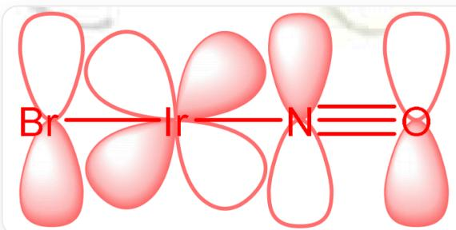
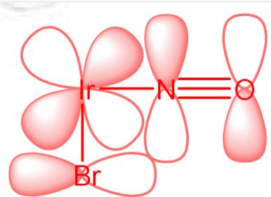

# 题目

向  $\mathrm{K}_{3} \mathrm{IrBr}_{6}$  的浓水溶液加入  $\mathrm{NaNO}_{2}$  并加热，体系颜色逐渐由绿色变为黄色；然后向体系中加入浓氢溴酸，充分反应后冷却，在  $5^{\circ} \mathrm{C}$  下保存数日，得到红色固体  $\mathbf{X}$  。进一步研究表明， $\mathbf{X}$  是抗磁性钾盐，其阴离子是 Ir 的单核配离子，带有整数个结晶水（且处于配离子的外界）；通过低温干燥可使得  $\mathbf{X}$  的所有结晶水完全脱除，失重  $2.65 \%$  ； $\mathbf{X}$  中部分元素的含量（质量分数）为：N， $2.06 \%$  ； $\mathrm{Br}$ ， $58.85 \%$  。 $\mathbf{X}$  中的 Ir - Br 键长为  $242 \mathrm{pm}$  和  $248 \mathrm{pm}$  。

下列说法正确的有:

1.配合物中Ir的杂化方式为  $d^{2}sp^{3}$  
2.仅有一根Ir - Br键键长为  $248\mathrm{pm}$  
3. X 与浓氨水反应时放出气体, 该反应的离子方程式左右两侧化学计量数之差为  $1$

研究表明，将  $\mathbf{X}$  溶于水时，若体系酸性较强，则  $\mathbf{X}$  的阴离子结构不发生变化；而当体系为弱酸性体系（ $\mathrm{c(H^{+}) < 0.5mol / L}$ ）时， $\mathbf{X}$  的阴离子则会转化为带3个负电的抗磁性阴离子  $\mathbf{A}^{3-}$ ；增强体系酸性时，反应逆向进行， $\mathbf{A}^{3-}$ 重新转化为  $\mathbf{X}$  的阴离子。

4.  $\mathbf{A}^{3-}$  比  $\mathbf{X}$  的阴离子的摩尔质量大了约  $2.6\%$  （误差不超过  $1.5\%$ ）

A. 其他选项均不正确  
B. 1  
C. 2  
D. 3  
E. 4

F. 1,2  
G. 1,3  
H. 1,4  
1. 2,3  
J. 2,4  
K. 3,4  
L. 1,2,3  
M. 1,2,4  
N. 1,3,4  
O. 2,3,4  
P. 1,2,3,4

# 答案

正确答案: H

# 详细解析

配合物中结晶水、N原子、Br原子的数目比为：

$$
(2. 6 5 \div 1 8. 0 2): (2. 0 6 \div 1 4. 0 1): (5 8. 8 5 \div 7 9. 9 0) = 1: 1: 5
$$

# CHECKPOINT

1 PTS

配合物中结晶水、N原子、Br原子的数目比为  $1: 1: 5$

设配离子中有1个Ir原子和5个Br原子，则X的式量为：

$$
7 9. 9 0 \times 5 \div 0. 5 8 8 5 = 6 7 8. 8
$$

未确定部分的式量为：

$$
6 7 8. 8 - 7 9. 9 0 \times 5 - 1 9 2. 2 2 - 1 4. 0 1 - 1 8. 0 2 = 5 5. 0 5
$$

X为钾盐，至少含有1个  $\mathbf{K}^{+}$  ，剩余部分只能为1个氧原子；因此X的化学式为：  $\mathrm{K[Ir(NO)Br_5]}\cdot \mathrm{H}_2\mathrm{O}$

# CHECKPOINT

2 PTS

$\mathbf{X}$  的化学式为：  $\mathrm{K[Ir(NO)Br_5]}\cdot \mathrm{H}_2\mathrm{O}$

X中Ir为  $+3$  价，此时  $\mathrm{NO}^+$  直线型配位，满足18电子规则。X还有6个d电子，自身为后过渡金属，且有强场配体  $\mathrm{NO}^+$  存在，故剩余2个空的d轨道，为  $d^{2}sp^{3}$  杂化，说法1正确

# CHECKPOINT

1 PTS

配合物中Ir的杂化方式为  $d^{2}sp^{3}$

如下图所示， $\mathrm{NO}^{+}$ 配体与其对位的  $\mathrm{Br}$  配体能通过  $\pi$  电子的给体-受体协同作用形成2套垂直的、沿直线方向的共轭体系，使Ir - Br键长缩短，而与其邻位的配体只有一组类似的作用，因此Ir - Br键长缩短不明显。故有4根248pm的Ir - Br键，说法2错误

这张图片是一幅轨道重叠示意图，在纯白背景上并列展示了两个独立的分子轨道结构，图中所有原子标签和连接线均为红色。左侧结构为4个原子水平排布（从左到右依次为Br、Ir、N和O），其中Br－Ir和Ir－N以单键连接、N-O以三键连接，Br、N、O的竖直p轨道与Ir的45度夹角d轨道波相匹配形成d-  $\mathcal{P}$  π键；右侧结构为Ir、N、O水平排布且Br位于Ir正下方，其中Br－Ir和Ir－N以单键连接、N－O以三键连接，Br的水平p轨道与N、O的竖直p轨道及Ir的45度夹角d轨道波相匹配形成d-  $\mathcal{P}$  π键。

# CHECKPOINT

2 PTS

$\mathrm{NO}^{+}$ 配体与其对位的  $\mathrm{Br}$  配体能形成2套垂直的、沿直线方向的共轭体系，而与其邻位的  $\mathrm{Br}$  配体只有一组类似的作用

X与浓氨水反应时放出气体，气体只可能为  $\mathrm{N}_{2}$  ，可以看成  $\mathrm{NH}_{3}$  与  $\mathrm{NO}^{+}$  反应得到  $\mathrm{N}_{2}$  、  $\mathrm{H}_{2} \mathrm{O}$  和  $\mathrm{H}^{+}$  ，  $\mathrm{H}^{+}$  与体系中的  $\mathrm{NH}_{3}$  反应得到  $\mathrm{NH}_{4}^{+}$  ：  $[\mathrm{Ir}(\mathrm{NO}) \mathrm{Br}_{5}]^{-} + 3 \mathrm{NH}_{3} \rightarrow [\mathrm{Ir}(\mathrm{NH}_{3}) \mathrm{Br}_{5}]^{2-} + \mathrm{H}_{2} \mathrm{O} + \mathrm{NH}_{4}^{+} + \mathrm{N}_{2}$

# CHECKPOINT

1 PTS

X与浓氨水反应方程式为：  $\mathrm{[Ir(NO)Br_5]^- + 3NH_3\rightarrow [Ir(NH_3)Br_5]^{2 - } + H_2O + NH_4^+ + N_2}$

左右化学计量数之和相等，说法3错误

说法4中发生的反应应该是一个非氧化还原反应，因此配离子中  $\mathrm{NO}^{+}$  变成了一个带一个负电荷的阴离子。根据勒夏特列原理，由反应条件可知  $\mathbf{X}$  的阴离子转化为  $\mathbf{A}^{3-}$  可能产生  $\mathrm{H}^{+}$ ，则只可能是： $[\mathrm{Ir}(\mathrm{NO})\mathrm{Br}_{5}]^{-} + \mathrm{H}_{2}\mathrm{O} \rightarrow [\mathrm{Ir}(\mathrm{NO}_{2})\mathrm{Br}_{5}]^{3-} + 2\mathrm{H}^{+}$ ，说法4正确

# CHECKPOINT

1 PTS

$\mathbf{A}^{3-}$  为  $[\mathrm{Ir}(\mathrm{NO}_2)\mathrm{Br}_5]^{3-}$

选H