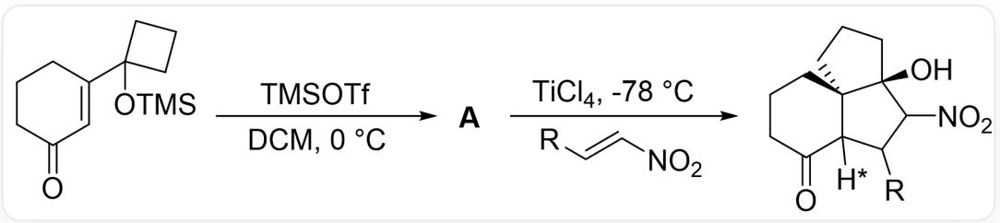
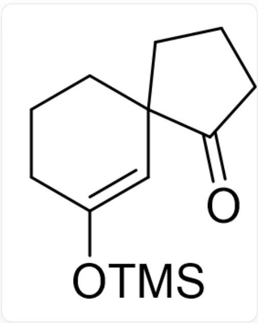

# Question

Recently, OL published an article on methodology for the synthesis of a 6-5-5 tricyclic system. The reaction scheme is shown in Figure 1, where the orientation of the hydrogen atom marked with  $*$  is unknown.

  
Fig. 1, the figure shows a two-step sequential reaction. The first step reaction is represented by SMILES as: O=C1CCCC(C2(O[Si](C)(C)C)CCC2)=C1>>[A], the reaction conditions are TMSOTf, DCM,  $0^{\circ}C$ . The second step reaction is represented by SMILES as: [A]>[R]/C=C/[N+]([O-])=O>O[C@]1(C(C(C23[H*])[R]) [N+]([O-])=O)CCC[C@@]31CCCC2=O. The reaction conditions are TiCl4, -78°C

Deduce the structure of  $\mathbf{A}$ , considering the orientation of the hydrogen atom marked with  $*$ .

There are the following statements:

1. A contains three rings of six members or less.  
2. A contains a carbonyl group located on a six-membered ring.  
3. With the five-membered ring containing  $\mathbf{R}$  as the plane, the reaction product with  $\mathbf{H}^*$  pointing out of the plane of the paper is more abundant.  
4. With the five-membered ring containing  $\mathbf{R}$  as the plane, the reaction product with  $\mathbf{H}^*$  pointing into the plane of the paper is more abundant.

Among the following options, the one with all correct statements and the largest number of correct statements is:

A. All other options are incorrect

B. 1  
C. 2  
D. 3  
E. 4  
F. 1,2  
G. 1,3  
H. 1,4  
1. 2,3  
J. 2,4  
K. 1,2,3  
L. 1,2,4

# Answer

Correct Answer: D

# Detailed Explanation

The first step, under the action of a strong Lewis acid, is a Pinacol-like rearrangement reaction, which opens the unstable four-membered ring, forming a more stable five-membered spirocycle, forming intermediate A as shown in Figure 2.

  
Fig. 2, the molecule is represented by SMILES as: O=C(CCC1)C21C=C(O[Si](C)(C)C)CCC2

CHECKPOINT

1 PTS

Pinacol-like rearrangement occurs to form the intermediate  $\mathrm{O} = \mathrm{C}(\mathrm{CCC1})\mathrm{C21C} = \mathrm{C}(\mathrm{O}[\mathrm{Si}](\mathrm{C})(\mathrm{C})\mathrm{CC}\mathrm{C}2$

A contains only two rings, statement 1 is incorrect. The carbonyl group is located on the five-membered ring, statement 2 is incorrect.

After adding the unsaturated nitroalkene, a Michael addition reaction occurs, yielding a carbanion, which further undergoes an addition reaction with the nearby carbonyl group, and workup yields the final product.

# CHECKPOINT

# 1 PTS

The silyl enol ether further undergoes a Michael addition reaction, and the resulting carbanion is coupled with the nearby carbonyl group to obtain the product given in the question

When  $\mathbf{A}$  is added to the nitroalkene, the silyl enol ether can initiate an attack from above the six-membered ring, i.e., near the carbonyl group of the five-membered spirocycle, or from below the six-membered ring, i.e., near the methylene group of the five-membered spirocycle. Both the intramolecular carbonyl group and the enol hydroxyl group are bonded to the Lewis acid  $\mathrm{TiCl_4}$ . The carbonyl group has a larger steric hindrance, while the methylene group contains only two hydrogen atoms and has a smaller steric hindrance. Therefore, the reaction preferentially occurs on the side away from the carbonyl group, resulting in a reaction product with the five-membered ring where  $\mathbf{R}$  is located as the plane and  $\mathbf{H}^*$  pointing out of the paper. Statement 3 is correct, and statement 4 is incorrect.

# CHECKPOINT

# 1 PTS

Since the carbonyl group is bonded to the Lewis acid  $\mathrm{TiCl_4}$  and has a larger steric hindrance than the methylene group, the Michael addition reaction preferentially occurs on the side away from the carbonyl group