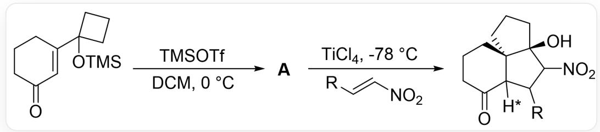
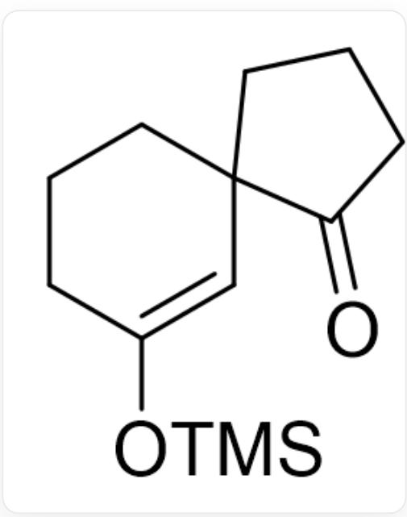

# 题目

近期, OL刊登了一篇构建 6-5-5 三环的方法学文章。其反应模式如图1所示, 图中 * 标记的氢原子朝向未知。

  
Fig. 1, 图中为两步连续反应, 第一步反应以SMILES记做: O=C1CCCC(C2(O[Si](C)(C)C)CCC2)=C1>> [A], 反应条件为TMSOTf、DCM、 $0^{\circ} \mathrm{C}$  。第二步反应以SMILES记做:  $[A] > [R] / C = C / [N + ]$ $([\mathrm{O}-])=\mathrm{O}>\mathrm{O}[\mathrm{C} @]1(\mathrm{C}(\mathrm{C}(\mathrm{C}23[\mathrm{H}^{*}])[\mathrm{R}])[\mathrm{N}+]([\mathrm{O}-])=\mathrm{O}) \mathrm{CCC}[\mathrm{C} @ @]31 \mathrm{CCCC}2=\mathrm{O}$  。反应条件为TiCl4、-78°C

推断A的结构，考虑被\*标记的氢原子的朝向。

# 有以下说法

1. A 含有三个六元及以下的环  
2. A中含有位于六元环上的羰基  
3. 以  $\mathbf{R}$  所在五元环为平面,  $\mathbf{H}^{*}$  指向纸面外的反应产物更多  
4. 以  $\mathbf{R}$  所在五元环为平面,  $\mathbf{H}^{*}$  指向纸面内的反应产物更多

下列选项中说法全部正确且正确说法数量最多的为：

A. 其他选项均不正确  
B. 1  
C. 2

D. 3  
E. 4  
F. 1,2  
G. 1,3  
H. 1,4  
1. 2,3  
J. 2,4  
K. 1,2,3  
L. 1,2,4

# 答案

正确答案: D

# 详细解析

第一步在强路易斯酸作用下，发生类Pinacol重排反应，打开不稳定的四元环，形成更稳定的五元螺环，形成中间体A如图2。

  
Fig. 2, 分子以SMILES表示为: O=C(CCC1)C21C=C(O[Si](C)(C)C)CCC2

CHECKPOINT

1 PTS

发生类Pinacol重排形成中间体O=C(CCC1)C21C=C(O[Si](C)(C)CCC2

A中仅含有两个环，说法1错误。羰基位于五元环上，说法2错误。

加入不饱和硝基烯烃后，发生Michael加成反应，得到碳负离子，该碳负离子进一步与附近的羰基发生加成反应，后处理得到最终产物。

# CHECKPOINT

1 PTS

烯醇硅醚进一步发生Michael加成反应，得到的碳负离子与附近的羰基偶联，得到题中给出的产物

在A与硝基烯烃加成时，烯醇硅醚可以从六元环上方即靠近五元螺环羰基处发起进攻，或从六元环下方即靠近五元螺环亚甲基处发起进攻。分子内羰基和烯醇羟基均与路易斯酸  $\mathrm{TiCl_4}$  结合，羰基空间位阻较大，亚甲基只含有两个氢原子，空间位阻较小，因此反应优先在远离羰基一侧发生，得到以R所在五元环为平面， $\mathbf{H}^*$  指向纸面外的反应产物，说法3正确，4错误。

# CHECKPOINT

1 PTS

由于羰基与路易斯酸  $\mathrm{TiCl_4}$  结合，位阻大于亚甲基，因此Michael加成反应优先在远离羰基侧发生