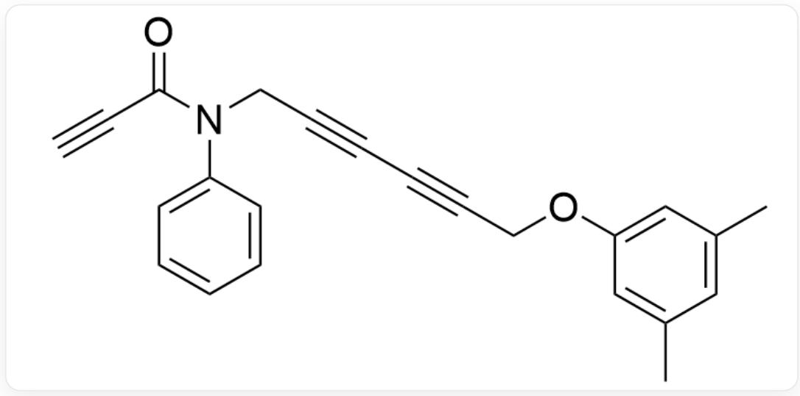
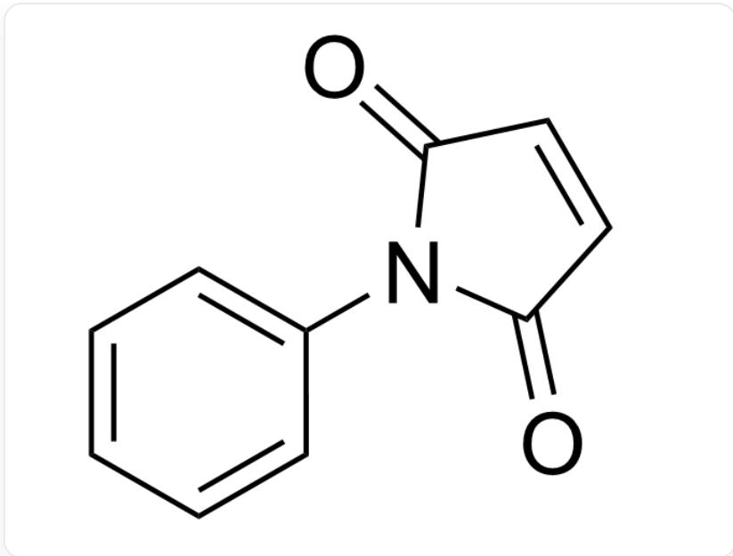
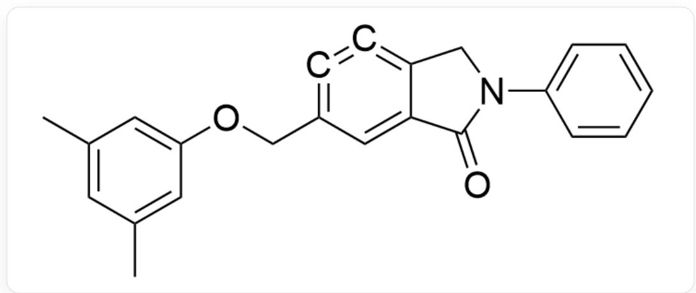
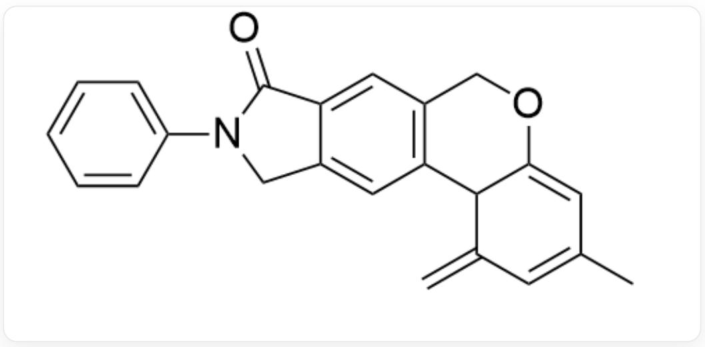
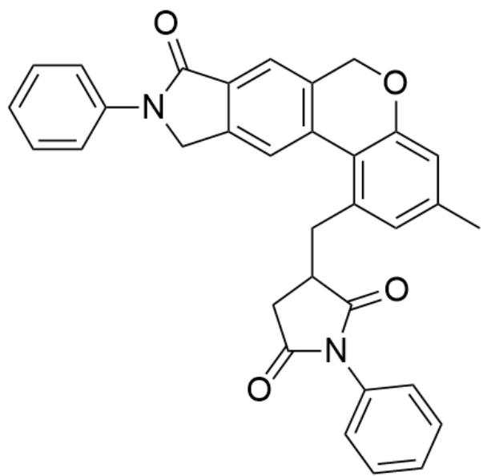
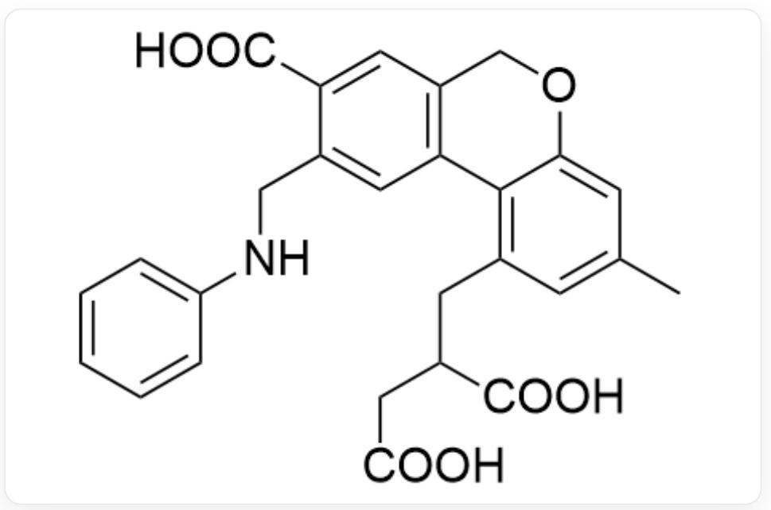

# Question

The structure of molecule A is:

  
$\mathrm{O = C(C\#C)N(CC\#CC\#CCOC1 = CC(C) = CC(C) = C1)C2 = CC = CC = C2}$

A first transforms into a highly reactive six-membered ring intermediate  $\mathbf{B}$  at high temperature, then undergoes a reaction to form intermediate  $\mathbf{C}$ , and finally reacts with compound  $\mathbf{D}$  to produce compound  $\mathbf{E}$ . It is known that all alkyne bonds participate in the reaction in the first step, and the subsequent two steps are both ene reactions.

The structure of compound  $\mathbf{D}$  is:

  
$\mathrm{O = C(C = C1)N(C2 = CC = CC = C2)C1 = O}$

Select the correct option regarding this reaction from the following choices.

A. The intermediate C contains four rings  
B. Compound  $\mathbf{E}$  contains three six-membered ring structures.  
C. The compound  $\mathbf{E}$  contains two carbonyl structures.  
D. The intermediate C contains two methyl groups  
E. The intermediate  $\mathbf{B}$  contains two six-membered rings.  
F. The intermediate B contains an oxygen atom with nucleophilicity stronger than that of the oxygen atom in diethyl ether.  
G. There is a nitrogen atom in compound  $\mathbf{E}$  with nucleophilicity stronger than that of the nitrogen atom in triethylamine.

H. The compound  $\mathbf{E}$  undergoes hydrolysis in a strong alkaline solution, with the main products containing a phenyl group.

# Answer

Correct Answer: H

# Detailed Explanation

At high temperatures, the alkyne bond exhibits diradical character, first undergoing a  $[4 + 2]$  cycloaddition reaction with a conjugated diyne. Thus, the structure of intermediate B is:

$$
O = C 1 C 2 = C C (C O C 3 = C C (C) = C C (C) = C 3) = C = C = C 2 C N 1 C 4 = C C = C C = C 4
$$

# CHECKPOINT

1 PTS

$[4 + 2]$  cycloaddition reaction between alkyne and conjugated diyne

# CHECKPOINT

1 PTS

$$
O = C 1 C 2 = C C (C O C 3 = C C (C) = C C (C) = C 3) = C = C = C 2 C N 1 C 4 = C C = C C = C 4
$$

Benzyne is highly reactive and undergoes an intramolecular ene reaction with a methyl-substituted benzene ring in a suitable position within the molecule, forming a new six-membered ring to yield intermediate C. The structure of C is:

  
$\mathrm{O = C1C2 = CC3 = C(C4C(OC3) = CC(C) = CC4 = C)C = C2CN1C5 = CC = CC = C5}$

# CHECKPOINT

1 PTS

Ene reaction between benzene and intramolecular methyl-substituted benzene ring to form a six-membered ring

# CHECKPOINT

1 PTS

$$
O = C 1 C 2 = C C 3 = C (C 4 C (O C 3) = C C (C) = C C 4 = C) C = C 2 C N 1 C 5 = C C = C C = C 5
$$

The methyl-substituted benzene ring, whose aromaticity was disrupted during the ene reaction, tends to restore its aromaticity. Therefore, intermediate C undergoes another ene reaction with an alkene bond in another molecule to regain aromaticity. Thus, intermediate C reacts with D via an ene reaction to form product E, whose structure is:

  
$O = C1C2 = CC3 = C(C4 = C(CC5CC(N(C6 = CC = CC = C6)C5 = O) = O)C = C(C)C = C4OC3)C = C2CN1C7 = CC = CC = C7$

# CHECKPOINT

1 PTS

Ener reaction between intermediate C and D

# CHECKPOINT

1 PTS

$$
O = C 1 C 2 = C C 3 = C (C 4 = C (C C 5 C C (N (C 6 = C C = C C = C 6) C 5 = O) = O) C = C (C) C = C 4 O C 3) C = C 2 C N 1 C 7 = C C = C C = C 7
$$

Based on the deduced structures, options A through E can all be determined to be incorrect.

The oxygen atoms in intermediate B include carbonyl oxygen and aryl ether oxygen. The carbonyl oxygen requires one p orbital to form a  $\pi$  bond, so the lone pair occupies an orbital with lower p character and higher s character, resulting in lower energy and weaker nucleophilicity compared to the oxygen in diethyl ether. The aryl ether oxygen is conjugated with the aromatic ring, causing electron density to shift toward the ring and reducing

electron density on the oxygen atom, making its nucleophilicity also weaker than that of diethyl ether oxygen. Thus, option F is incorrect.

# CHECKPOINT

1 PTS

Oxygen atoms in intermediate B include carbonyl oxygen and aryl ether oxygen

# CHECKPOINT

1 PTS

The nucleophilicity of both carbonyl oxygen and aryl ether oxygen is weaker than that of diethyl ether oxygen

The nitrogen atoms in compound  $\mathbf{E}$  include amide nitrogen and imide nitrogen. Since both nitrogen atoms are conjugated with strongly electron-withdrawing carbonyl groups, their electron density decreases, resulting in nucleophilicity inferior to that of the nitrogen in triethylamine (which is bonded only to three alkyl groups). Thus, option G is incorrect.

# CHECKPOINT

1 PTS

Nitrogen atoms in intermediate  $\mathbf{E}$  include amide nitrogen and imide nitrogen

# CHECKPOINT

1 PTS

The nucleophilicity of both amide nitrogen and imide nitrogen is inferior to that of triethylamine nitrogen

The product of complete hydrolysis of compound  $\mathbf{E}$  is:

  
CC1=CC(CC(C(O)=O)CC(O)=O)=C(C(OC2)=C1)C3=C2C=C(C(O)=O)C(NC4=CC=CC=C4)=C3

It contains only one phenyl group, so option H is correct.

# CHECKPOINT

1 PTS

$$
C C 1 = C C (C C (C (O) = O) C C (O) = O) = C (C (O C 2) = C 1) C 3 = C 2 C = C (C (O) = O) C (N C 4 = C C = C C = C 4) = C 3
$$