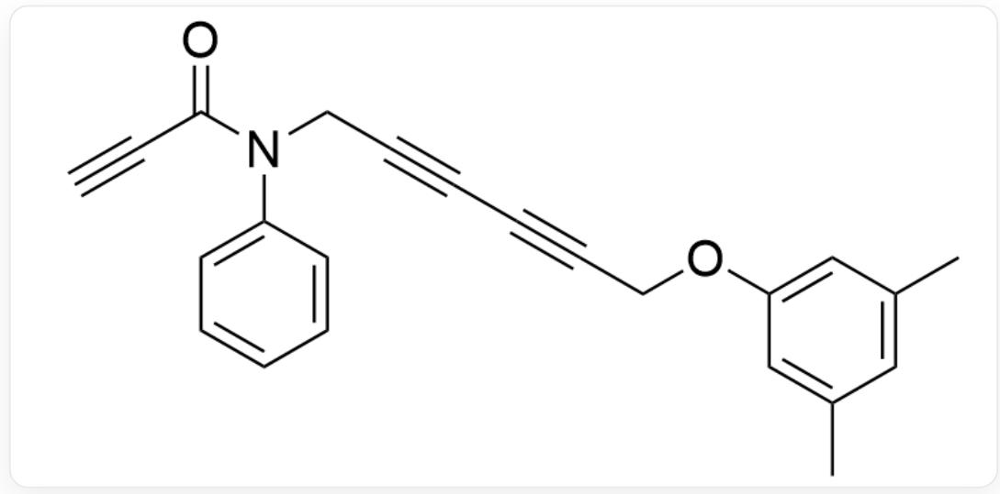
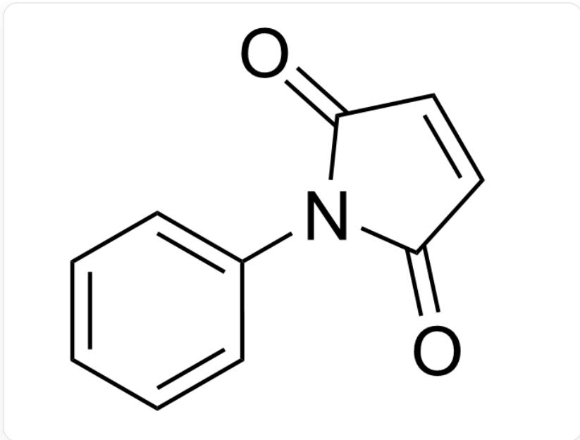
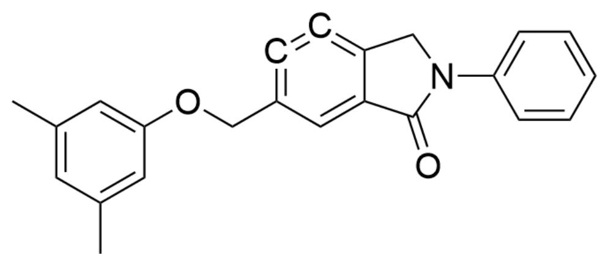
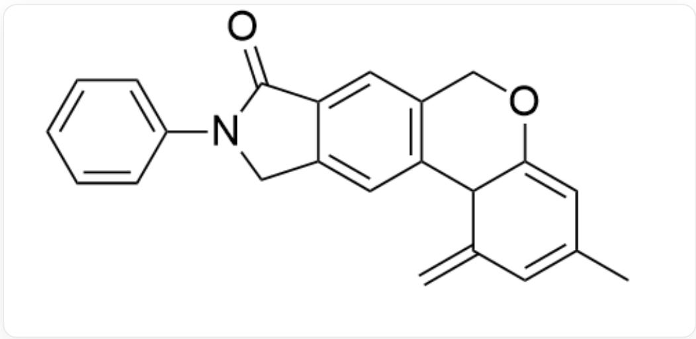
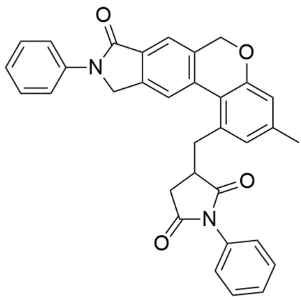
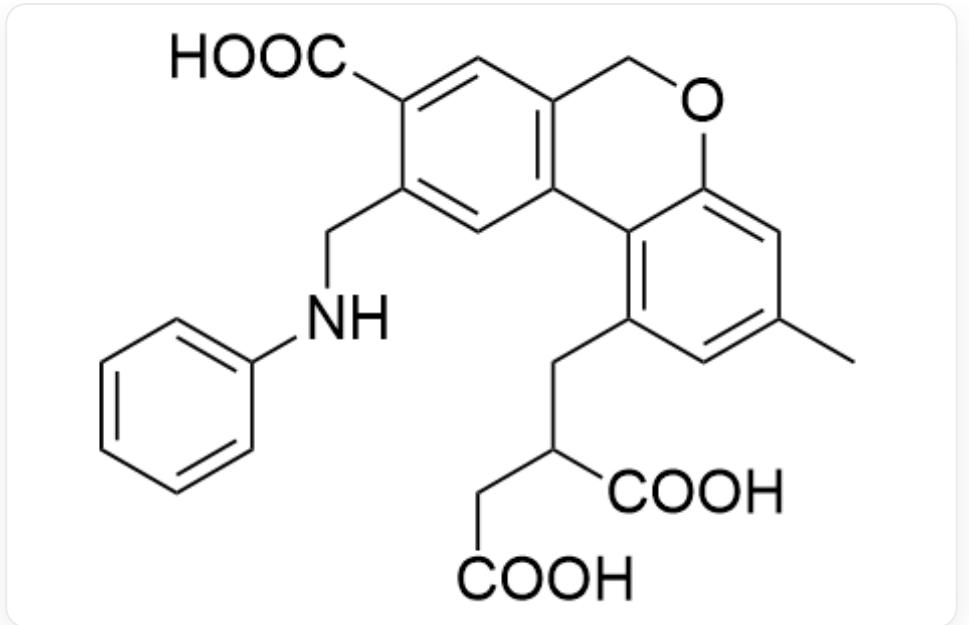

# 题目

分子A的结构为：

  
$\mathrm{O = C(C\#C)N(CC\#CC\#CCOC1 = CC(C) = CC(C) = C1)C2 = CC = CC = C2}$

A在高温下首先转变为活性极高的六元环中间体B，随后发生反应转变为中间体C，最后与化合物D发生反应生成化合物E。已知第一步中所有炔键均参与了反应，后两步反应均为ene反应。

化合物D的结构为：

$\mathrm{O = C(C = C1)N(C2 = CC = CC = C2)C1 = O}$

选择下列选项中关于这个反应正确的一个选项。

A. 中间体C包含四个环  
B. 化合物  $\mathbf{E}$  包含三个六元环结构  
C. 化合物  $\mathrm{E}$  包含两个羰基结构  
D. 中间体C包含两个甲基  
E. 中间体  $\mathrm{B}$  包含两个六元环  
F. 中间体B包含亲核性强于乙醚中氧原子的氧原子  
G. 化合物  $\mathbf{E}$  中存在亲核性强于三乙胺中氮原子的氮原子

H. 化合物  $\mathrm{E}$  在强碱溶液中水解, 主要产物包含一个苯基

# 答案

正确答案: H

# 详细解析

炔键在高温下体现双自由基性质，首先发生炔键和共轭二炔的  $[4 + 2]$  环加成反应，故中间体B的结构为：

  
$\mathrm{O = C1C2 = CC(COC3 = CC(C) = CC(C) = C3) = C = C = C2CN1C4 = CC = CC = C4}$

# CHECKPOINT

1 PTS

炔键和共轭二炔的  $[4 + 2]$  环加成反应

# CHECKPOINT

1 PTS

$$
O = C 1 C 2 = C C (C O C 3 = C C (C) = C C (C) = C 3) = C = C = C 2 C N 1 C 4 = C C = C C = C 4
$$

苯炔具有高反应活性，与分子内处于合适位置的带甲基苯环发生分子内烯反应并形成新的六元环，生成中间体C，C的结构为：

  
$\mathrm{O = C1C2 = CC3 = C(C4C(OC3) = CC(C) = CC4 = C)C = C2CN1C5 = CC = CC = C5}$

# CHECKPOINT

1 PTS

苯炔与分子内带甲基苯环发生烯反应生成六元环

# CHECKPOINT

1 PTS

$$
O = C 1 C 2 = C C 3 = C (C 4 C (O C 3) = C C (C) = C C 4 = C) C = C 2 C N 1 C 5 = C C = C C = C 5
$$

在烯反应中被破坏芳香性的带甲基苯环有恢复芳香性的倾向，因此中间体C会与另一分子中的烯键再发生一次烯反应，恢复芳香性。因此中间体C与D发生烯反应生成产物E，E的结构为

$O = C1C2 = CC3 = C(C4 = C(CC5CC(N(C6 = CC = CC = C6)C5 = O) = O)C = C(C)C = C4OC3)C = C2CN1C7 = CC = CC = C7$

# CHECKPOINT

1 PTS

中间体C与D发生烯反应

# CHECKPOINT

1 PTS

[ \mathrm{O} = \mathrm{C}1\mathrm{C}2 = \mathrm{CC}3 = \mathrm{C}(\mathrm{C}4 = \mathrm{C}(\mathrm{CC}5\mathrm{CC}(\mathrm{N}(\mathrm{C}6 = \mathrm{CC} = \mathrm{CC} = \mathrm{C}6)\mathrm{C}5 = \mathrm{O}) = \mathrm{O})\mathrm{C} = \mathrm{C}(\mathrm{C})\mathrm{C} = \mathrm{C}4\mathrm{OC}3)\mathrm{C} = \mathrm{C}2\mathrm{CN}1\mathrm{C}7 = \mathrm{CC} = \mathrm{CC} = \mathrm{C}7) ]

根据上述推理出的结构可判断选项A到E均错误。

中间体B中氧原子包括羰基氧原子和芳基醚氧原子。羰基氧原子需要1个p轨道形成π键，因此孤对电子占据轨道的p成分较低、s成分较高，能量较低，故亲核性弱于乙醚中的氧原子；芳基醚氧原子与芳环共轭，电子密度向芳环转移，氧原子上电子密度降低，亲核性也弱于乙醚中的氧原子，故F选项错误。

# CHECKPOINT

1 PTS

中间体B中氧原子包括羰基氧原子和芳基醚氧原子

# CHECKPOINT

1 PTS

羰基氧原子和芳基醚氧原子的亲核性均弱于乙醚中氧原子

化合物E中氮原子包括酰胺氮原子和酰亚胺氮原子，由于氮原子均与具有强共轭吸电子性质的羰基共轭，氮原子的电子云密度下降，导致两种氮原子的亲核性不如只连接三个烷基的三乙胺氮原子，故G选项错误。

# CHECKPOINT

1 PTS

中间体  $\mathbf{E}$  中氮原子包括酰胺氮原子和酰亚胺氮原子

# CHECKPOINT

1 PTS

酰胺氮原子和酰亚胺氮原子的亲核性均不如三乙胺氮原子

化合物  $\mathbf{E}$  完全水解的产物为：

  
CC1=CC(CC(C(O)=O)CC(O)=O)=C(C(OC2)=C1)C3=C2C=C(C(O)=O)C(NC4=CC=CC=C4)=C3

只包含1个苯基，故H选项正确。

# CHECKPOINT

1 PTS

$$
C C 1 = C C (C C (C (O) = O) C C (O) = O) = C (C (O C 2) = C 1) C 3 = C 2 C = C (C (O) = O) C (N C 4 = C C = C C = C 4) = C 3
$$