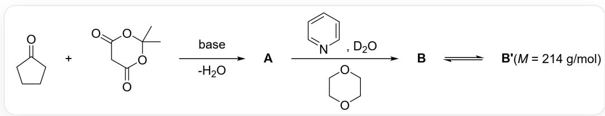
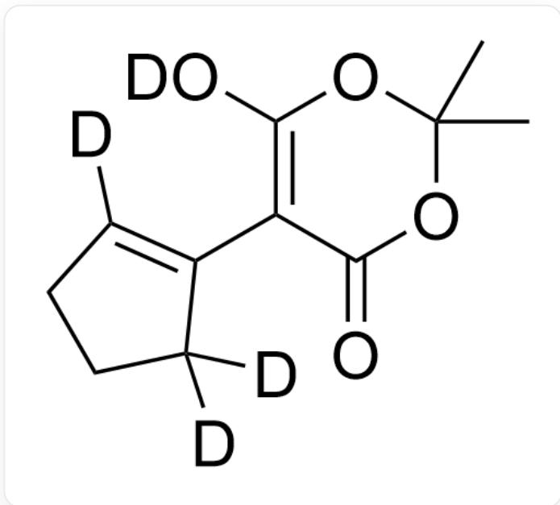
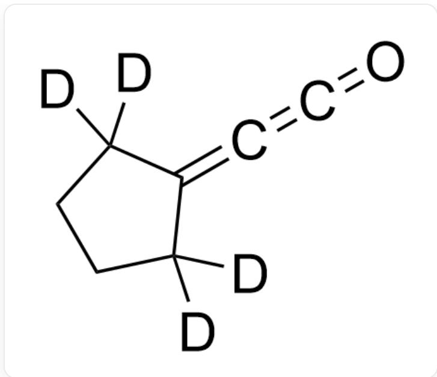
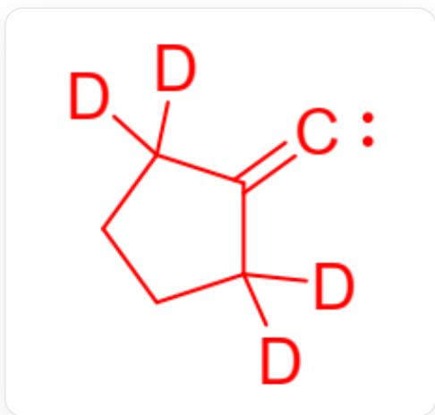
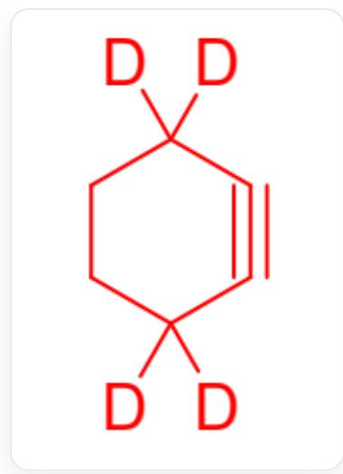
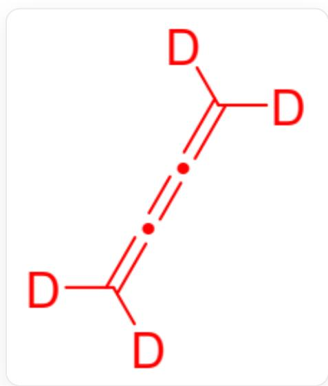

# Question

Organic reaction, the substrates are O=C1CCCC1 and O=C(C1)OC(C)(C)OC1=O. The two undergo dehydration under basic conditions to form A. A reacts under the conditions of pyridine,  $D_{2}O$ , and 1,4-dioxane to form B. B and B' constitute an equilibrium, and the molecular weight of B' is 214 g/mol

It is known that B does not contain a hydroxyl group, and B and B' are tautomers. B' generates G and H upon heating, and the reaction mechanism may be as follows: B' loses  $(CH_{3})_{2}CO$  under heating conditions to form C. C loses  $CO_{2}$  to form D. D loses  $CO$  to form E. E can be converted to F. F can be converted to G and H.

It is known that the reaction types for B' losing small molecules to form C and F generating G and H are the same. D has two carbon atoms adopting sp hybridization, E has an electron-deficient structure, F has a six-membered ring, and the molecular weight of G is greater than that of H.

Which of the following options is correct?

A. If isotopic differences are ignored, B has one more  $H_{2}O$  in its molecular formula than A.  
B. B' has a conjugated diene structure and lacks a hydroxyl group.  
C. There are no atoms in C that adopt sp hybridization.  
D. D contains a carbon-carbon triple bond structure  
E. E exhibits a carbene structure and the carbon that does not satisfy the octet rule conjugates with a carbon-carbon double bond.

F. The structures of D, E, F, G, and H all contain mirror planes (assuming the rings are planar).

# Answer

Correct Answer: F

# Detailed Explanation

A=

  
CC1(C)OC(=O)C(=C2CCCC2)C(=O)O1

B=

  
CC1(C)OC(=O)C(=C2C([2H])([2H])CCC2([2H])[2H])C(=O)O1

$\mathrm{B}^{\prime} =$

CC1(C)OC([2H])=C(C2=C([2H])CCC2([2H])[2H])C(=O)O1

C=

C1CC([2H])([2H])C(=C1[2H])C(=C=O)C(=O)O[2H]

D=

  
C1CC([2H])([2H])C(=C=C=O)C1([2H])[2H]

$\mathrm{E} =$

  
[2H]C1([2H])CCC([2H])([2H])C1=[C]

F=

  
[2H]C1([2H])CCC([2H])([2H])C#C1

G=

  
$\mathrm{C([2H])([2H]) = C = C = C([2H][2H]}$

$$
\mathrm {H} = C _ {2} H _ {4}
$$

The acidic hydrogen in A is deuterated to form B. B and B' exhibit keto-enol tautomerism. A 1,2-migration occurs from E to F. The decomposition of F and B involves retro-cycloaddition reactions.

If isotopic differences are ignored, A and B have the same molecular formula.

# CHECKPOINT

1 PTS

If isotopic differences are ignored, A and B have the same molecular formula.

B' contains a conjugated diene and a hydroxyl group.

# CHECKPOINT

1 PTS

B' contains a conjugated diene and a hydroxyl group.

The carbon atom of the ketene in C is sp-hybridized.

# CHECKPOINT

1 PTS

The carbon atom of the ketene in C is sp-hybridized.

D contains an allene structure but no carbon-carbon triple bond.

# CHECKPOINT

1 PTS

D contains an allene structure but no carbon-carbon triple bond.

E has a carbene structure, but the non-bonding orbital of the carbene and the orbital forming the carbon-carbon double bond are not parallel, so the carbon violating the octet rule cannot conjugate with the carbon-carbon double bond.

# CHECKPOINT

1 PTS

In E, the carbon violating the octet rule cannot conjugate with the carbon-carbon double bond.

If the rings of D, E, and F are assumed to be planar, the ring plane serves as a molecular mirror plane; molecules G and H are also planar and possess mirror planes. Option F is correct.

# CHECKPOINT

1 PTS

If the rings are assumed planar, the structures of D, E, F, G, and H all contain mirror planes.