# Question

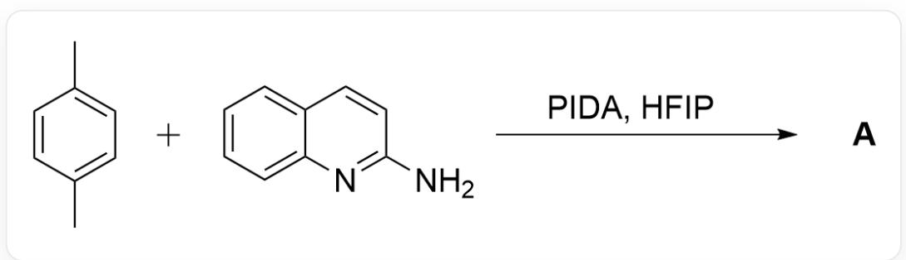  
CC1=CC=C(C)C=C1.NC2=NC3=CC=C3C=C2> [PIDA],[HFIP]>[A], A is the reaction product

In the process of generating A, PIDA first oxidizes p-xylene to a benzylic cation via a free radical mechanism. After being captured by aminoquinoline, it is further oxidized twice by PIDA to obtain product A. Please try to deduce the structure of product A based on this hint. (HFIP is hexafluoroisopropanol)

A. All other options are incorrect  
B.

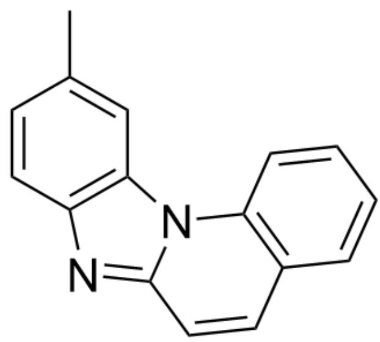  
CC1=CC2=C(N=C3N2C4=C(C=CC=C4)C=C3)C=C1

C.

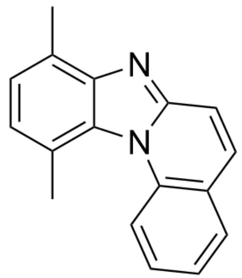

CC1=C2C(N(C(C=CC=C3)=C3C=C4)C4=N2)=C(C)C=C1

D.

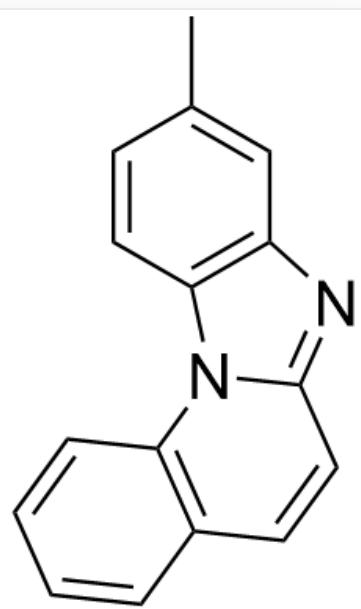

CC1=CC2=C(N(C(C=CC=C3)=C3C=C4)C4=N2)C=C1

E.

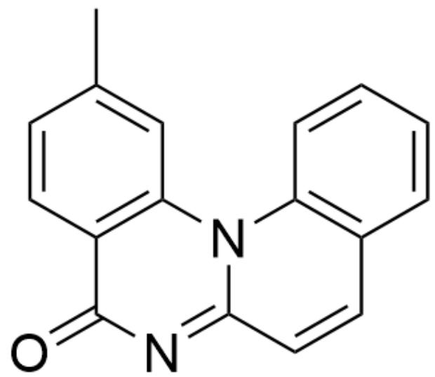

CC1=CC2=C(C(N=C3N2C4=C(C=CC=C4)C=C3)=O)C=C1

F.

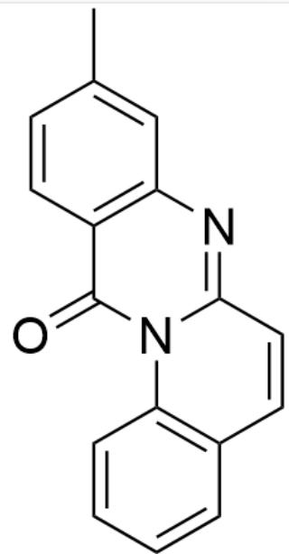

CC1=CC2=C(C(N(C(C=C=C3)=C3C=C4)C4=N2)=O)C=C1

# Answer

Correct Answer: B

# Detailed Explanation

According to the question prompt, the benzylic cation intermediate generated in this reaction is first attacked by ammonia nucleophilically, and then the nitrogen atom combines with 1 molecule of oxidant PIDA to obtain the intermediate

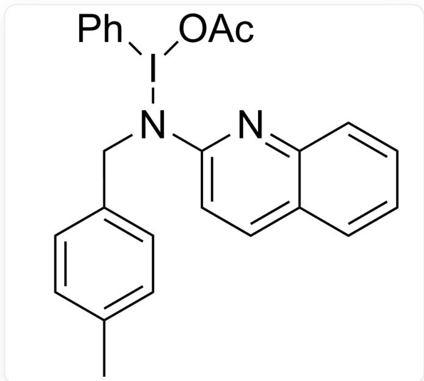  
CC1=CC=C(CN(I(C2=CC=CC=C2)OC(C)=O)C3=CC=C(C=CC=C4)C4=N3)C=C1

CHECKPOINT

1 PTS

The first intermediate is CC1=CC=C(CN(I(C2=CC=CC=C2)OC(C)=O)C3=CC=C(C=CC=C4)C4=N3)C=C1

Then a phenyl migration reaction occurs to obtain the intermediate

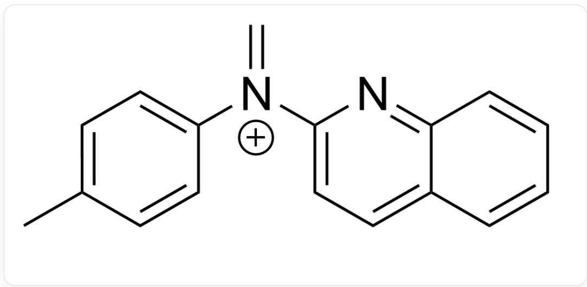

$\mathrm{C = [N + ](C1 = CC = C(C = CC = C2)C2 = N1)C3 = CC = C(C)C = C3}$

# CHECKPOINT

1 PTS

Then a phenyl migration reaction occurs to obtain the intermediate:  $C = [N + ]$ $(C1 = CC = C(C = CC = C2)C2 = N1)C3 = CC = C(C)C = C3$

Subsequently, the intermediate is captured by the anion in the system

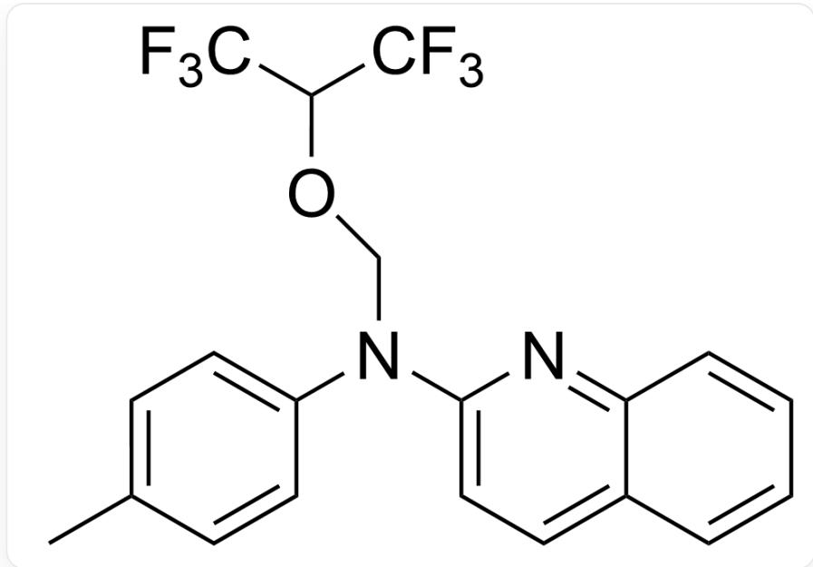  
CC(C=C1)=CC=C1N(COC(C(F)(F)F)C(F)(F)F)C2=CC=C(C=CC=C3)C3=N2

# CHECKPOINT

1 PTS

The third intermediate:  $\mathrm{CC(C = C1) = CC = C1N(COC(C(F)(F)F)C(F)(F)F)C2 = CC = C(C = CC = C3)C3 = N2}$

Then the secondary amine intermediate is reformed

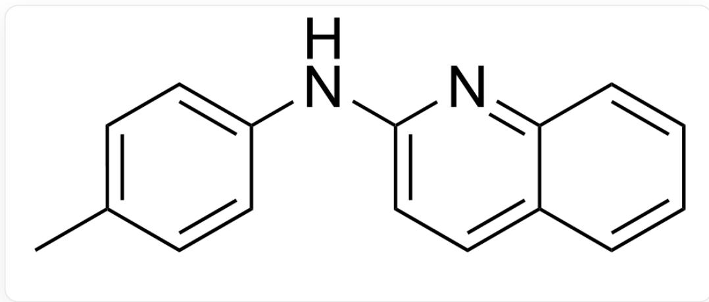  
CC(C=C1)=CC=C1NC2=CC=C(C=CC=C3)C3=N2

# CHECKPOINT

1 PTS

Secondary amine intermediate: CC(C=C1) = CC=C1NC2=CC=C(C=CC=C3)C3=N2

Subsequently, the nitrogen atom combines again with 1 molecule of oxidant PIDA

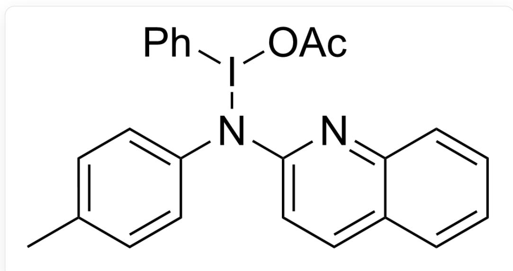

$$
C C (C = C 1) = C C = C 1 N (I (C 2 = C C = C C = C 2) O C (C) = O) C 3 = C C = C (C = C C = C 4) C 4 = N 3
$$

# CHECKPOINT

1 PTS

The fifth intermediate:  $\mathrm{CC(C = C1) = CC = C1N(I(C2 = CC = CC = C2)OC(C) = O)C3 = CC = C(C = CC = C4)C4 = N3}$

The nitrogen atom performs nucleophilic attack on the benzene ring, yielding the intermediate

CC1=CC2[N+]3=C(N=C2C=C1)C=CC4=C3C=C4

# CHECKPOINT

1 PTS

The sixth intermediate: CC1=CC2[N+]3=C(N=C2C=C1)C=CC4=C3C=CC=C4

Finally, the final product is obtained via deprotonation and aromatization