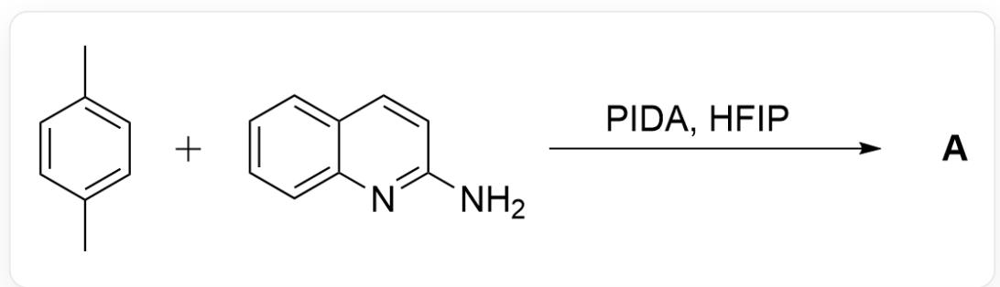
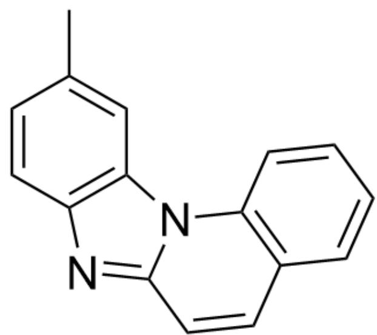
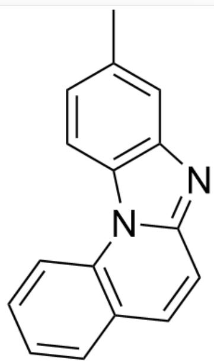
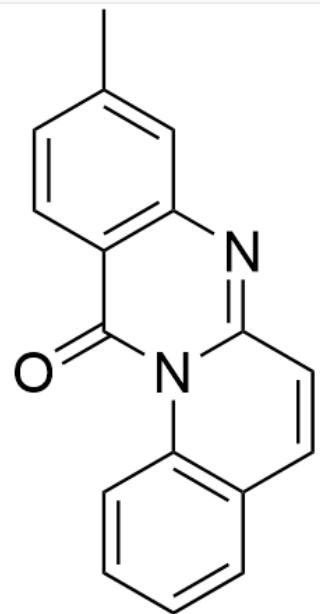
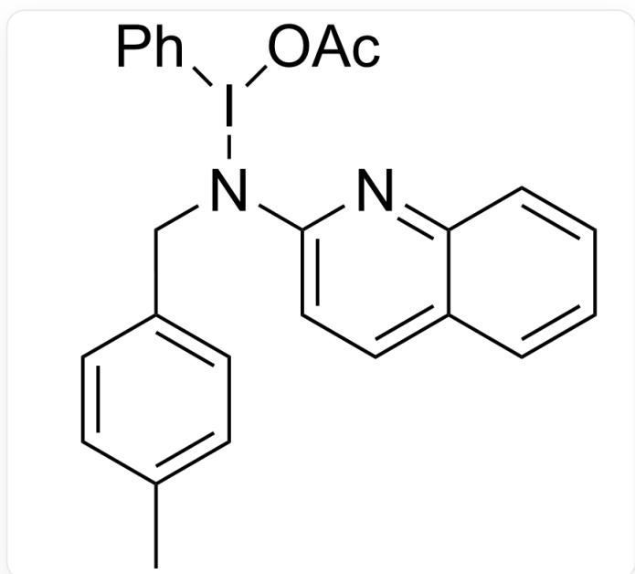
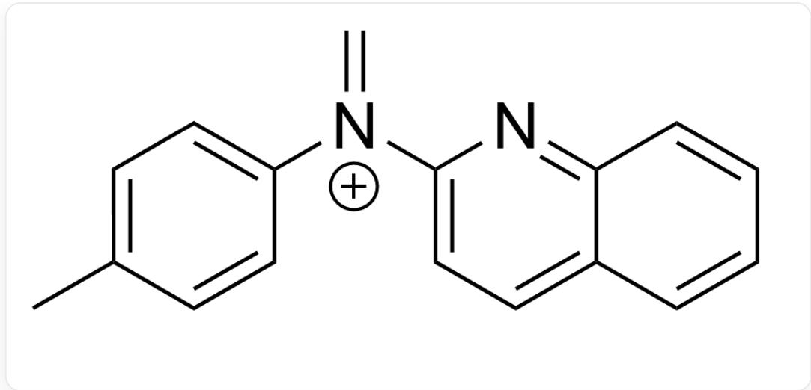
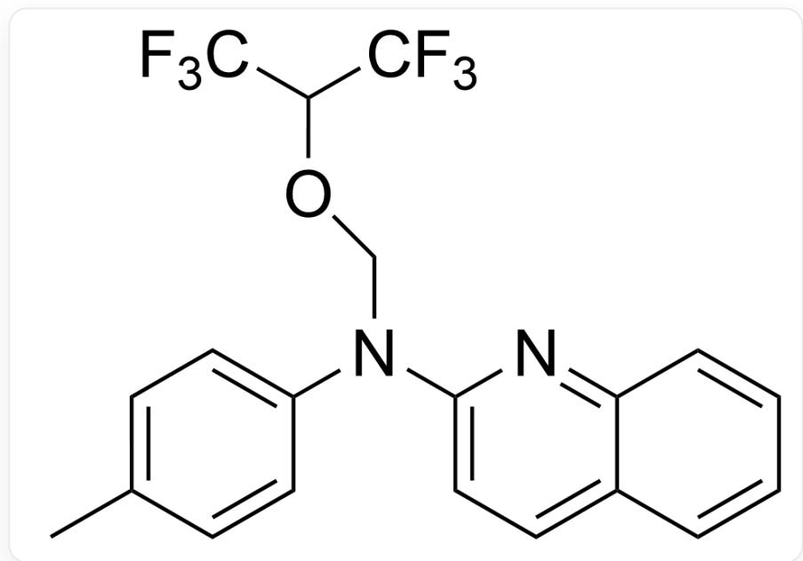
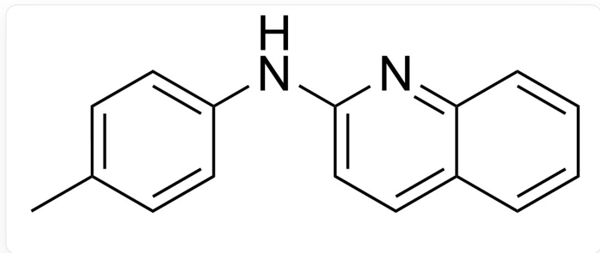
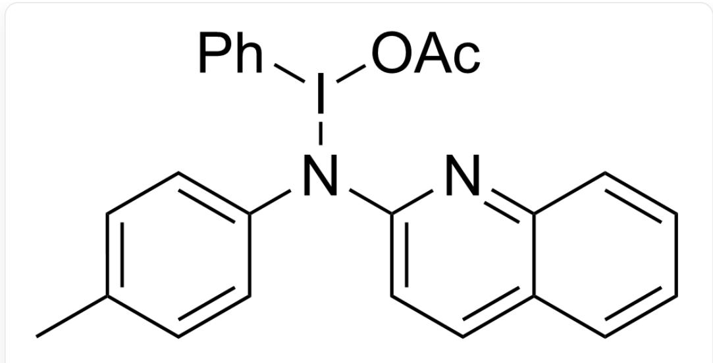
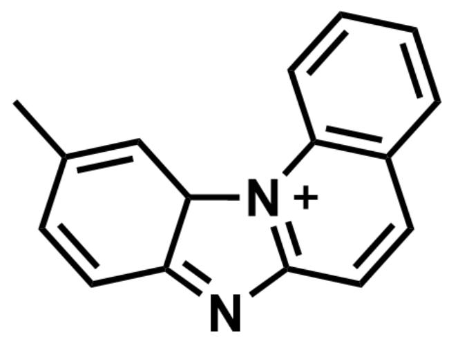

# 题目

CC1=CC=C(C)C=C1.NC2=NC3=CC=C3C=C2> [PIDA],[HFIF]>[A],A为反应产物

在生成 A 的历程中, PIDA 先通过自由基机理将对二甲苯氧化成苄基正离子, 被氨基喹啉捕获后被 PIDA继续氧化两次得到产物 A。请根据此提示尝试推测出产物 A 的结构。(HFIP 为六氟异丙醇)

A. 其他选项均不正确  
B.

CC1=CC2=C(N=C3N2C4=C(C=CC=C4)C=C3)C=C1

C.

CC1=C2C(N(C(C=CC=C3)=C3C=C4)C4=N2)=C(C)C=C1

D.

CC1=CC2=C(N(C(C=CC=C3)=C3C=C4)C4=N2)C=C1

E.

CC1=CC2=C(C(N=C3N2C4=C(C=CC=C4)C=C3)=O)C=C1

F.

CC1=CC2=C(C(N(C(C=C=C3)=C3C=C4)C4=N2)=O)C=C1

# 答案

正确答案: B

# 详细解析

根据题目提示，该反应生成的苄基正离子中间体首先被氨基亲核进攻，随后氮原子与1分子氧化剂PIDA结合得到中间体

  
CC1=CC=C(CN(I(C2=CC=CC=C2)OC(C)=O)C3=CC=C(C=CC=C4)C4=N3)C=C1

CHECKPOINT

1 PTS

第一个中间体是CC1=CC=C(CN(I(C2=CC=CC=C2)OC(C)=O)C3=CC=C(C=CC=C4)C4=N3)C=C1

接着发生苯基迁移反应得到中间体

$$
C = [ N + ] (C 1 = C C = C (C = C C = C 2) C 2 = N 1) C 3 = C C = C (C) C = C 3
$$

# CHECKPOINT

1 PTS

接着发生苯基迁移反应得到中间体：C=[N+](C1=CC=C(C=CC=C2)C2=N1)C3=CC=C(C)C=C3

随后该中间体被体系中的阴离子捕获

$$
C C (C = C 1) = C C = C 1 N (C O C (C (F) (F) F) C (F) (F) F) C 2 = C C = C (C = C C = C 3) C 3 = N 2
$$

# CHECKPOINT

1 PTS

第三个中间体：CC(C=C1)=CC=C1N(COC(C(F)(F)F)C(F)(F)F)C2=CC=C(C=CC=C3)C3=N2

接着重新形成伸胺中间体

CC(C=C1)=CC=C1NC2=CC=C(C=CC=C3)C3=N2

# CHECKPOINT

1 PTS

仲胺中间体：CC(C=C1)=CC=C1NC2=CC=C(C=CC=C3)C3=N2

随后氮原子再次结合1分子氧化剂PIDA

CC(C=C1)=CC=C1N(I(C2=CC=CC=C2)OC(C)=O)C3=CC=C(C=CC=C4)C4=N3

# CHECKPOINT

1 PTS

第五个中间体：CC(C=C1)=CC=C1N(I(C2=CC=CC=C2)OC(C)=O)C3=CC=C(C=CC=C4)C4=N3

氮原子对苯环进行亲核进攻，得到中间体

CC1=CC2[N+]3=C(N=C2C=C1)C=CC4=C3C=C4

# CHECKPOINT

1 PTS

第六个中间体：CC1=CC2[N+]3=C(N=C2C=C1)C=CC4=C3C=CC=C4

最后经去质子芳构化得到最终产物