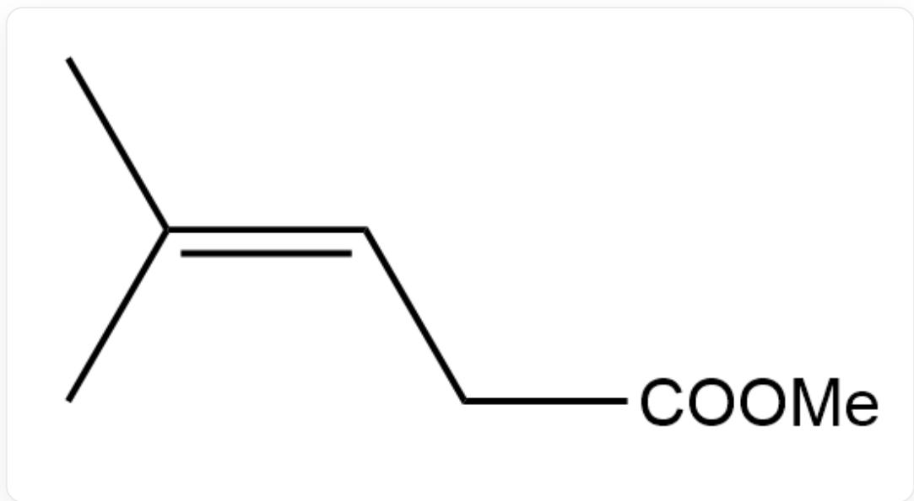
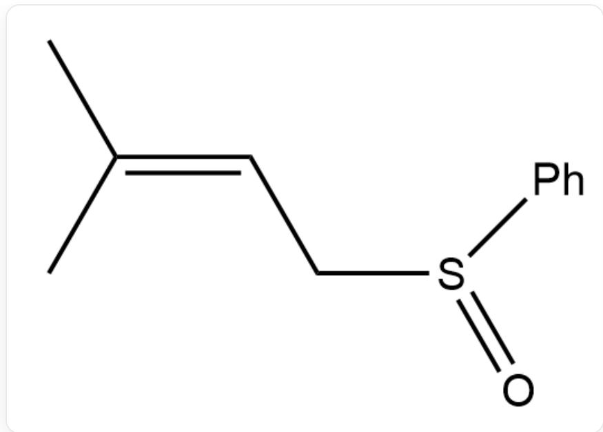
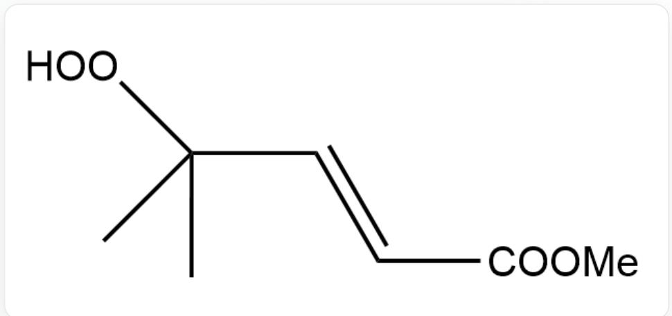
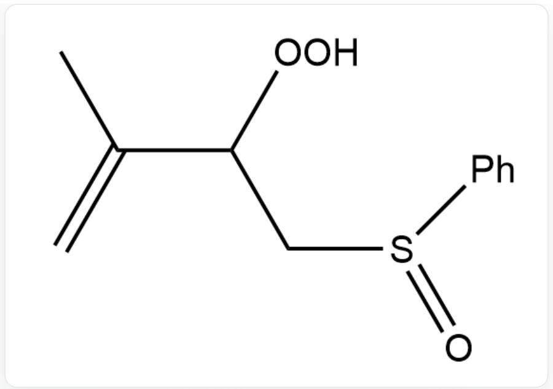
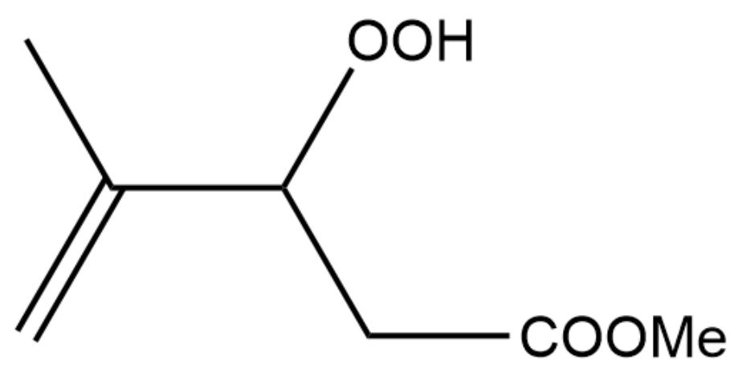
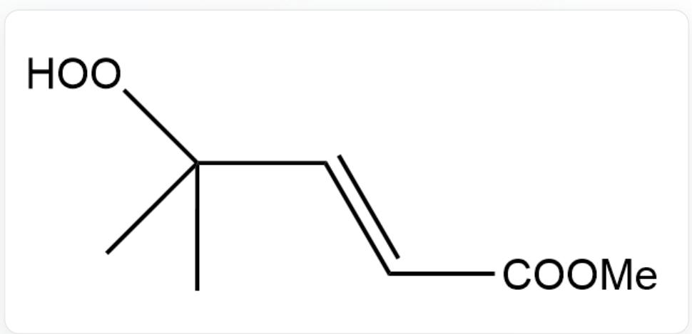
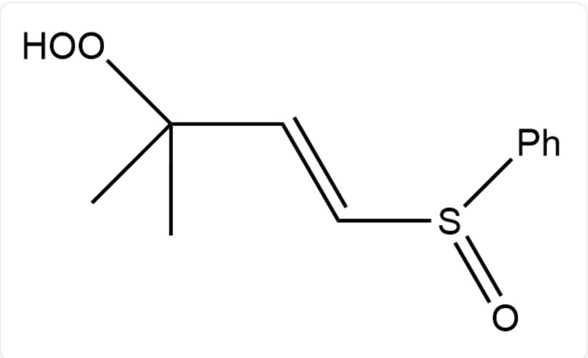
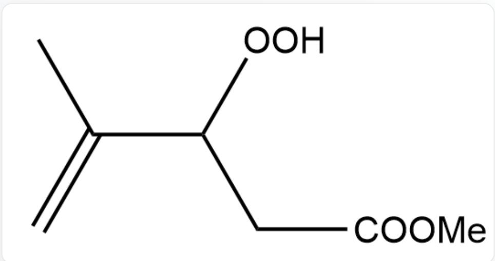
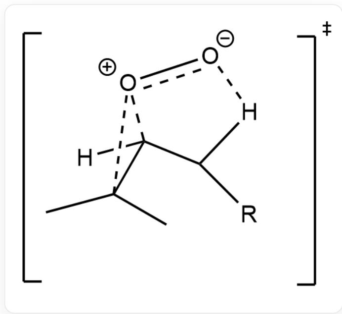

# Question

Singlet oxygen  $^{1}O_{2}$  can react with the following two substrates. Please provide the main product of each addition reaction (without considering stereoisomers).

  
C/C(C) = C/CC(OC) = O, Substrate 1

Substrate 1

  
C/C(C) = C/CS(C1 = CC = CC = C1) = O, Substrate 2

# Substrate 2

A. All other options are incorrect  
B.

  
CC(C)(OO)/C=C/C(OC)=O,Product 1

Product 1

  
C.

CC(C(OO)CS(C1=CC=CC=C1)=O)=C,Product 2

Product 2

CC(C(OO)CC(OC)=O)=C,Product 1

Product 1

  
D.

CC(C(OO)CS(C1=CC=CC=C1)=O)=C,Product 2

Product 2

CC(C)(OO)/C=C/C(OC)=O,Product 1

Product 1

  
E.

[ \mathrm{O} = \mathrm{S}(\mathrm{C}1 = \mathrm{CC} = \mathrm{CC} = \mathrm{C}1) / \mathrm{C} = \mathrm{C} / \mathrm{C}(\mathrm{C})(\mathrm{OO})\mathrm{C}, \text{Product 2} ]

Product 2

CC(C(OO)CC(OC)=O)=C,Product 1

Product 1

$\mathrm{O = S(C1 = CC = CC = C1) / C = C / C(C)(OO)C,}$  Product 2

Product 2

# Answer

Correct Answer: B

# Detailed Explanation

Compared to carbonyl groups, sulfoxides exhibit greater polarization with more concentrated negative charge on the oxygen.

# CHECKPOINT

1 PTS

Compared to carbonyl groups, sulfoxides exhibit greater polarization with more concentrated negative charge on the oxygen

This is the transition state of the reaction (taking Reaction 1 as an example)

[H]C1(C([O+]1[O-])(C)C([R])[H]

For R=COOMe, attacking the hydrogen at the ortho-position of the carbonyl group, the carbonyl group can stabilize the transition state through conjugation, resulting in the conjugated product.

# CHECKPOINT

1 PTS

For R=COOMe, attacking the hydrogen at the ortho-position of the carbonyl group, the carbonyl group can stabilize the transition state through conjugation, resulting in the conjugated product

For  $\mathrm{R = SOPh}$ , the excessive negative charge on the oxygen creates strong repulsion between the peroxy group and sulfoxide oxygen in the transition state when attacking the ortho-position hydrogen, thus favoring the formation of terminal alkenes.

# CHECKPOINT

1 PTS

For R=SOPh, the excessive negative charge on the oxygen creates strong repulsion between the peroxy group and sulfoxide oxygen in the transition state when attacking the ortho-position hydrogen, thus favoring the formation of terminal alkenes