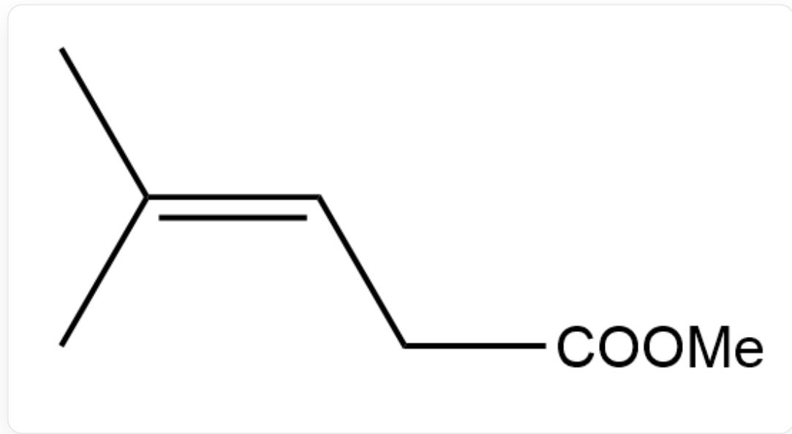
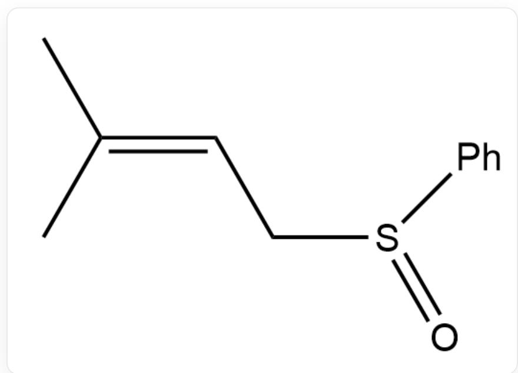
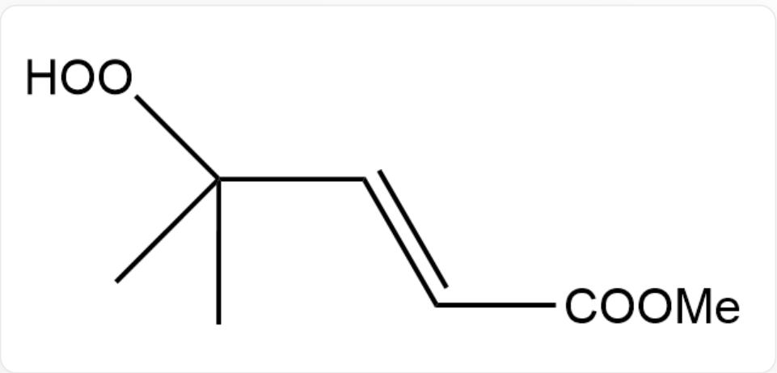
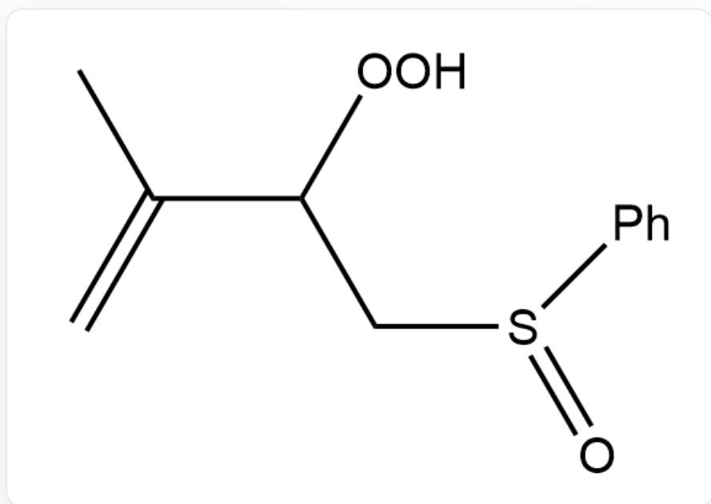
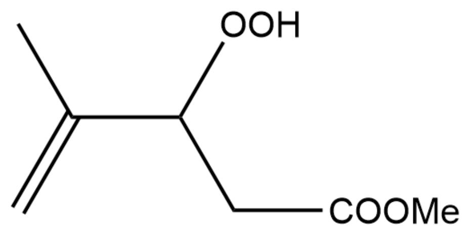
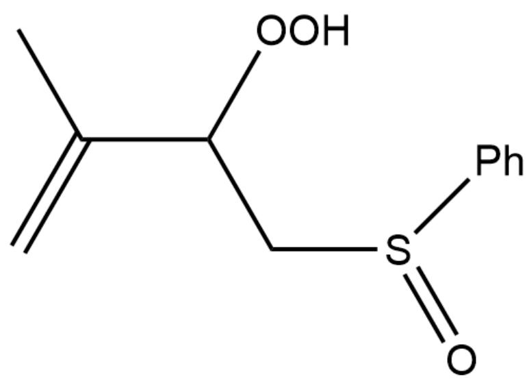
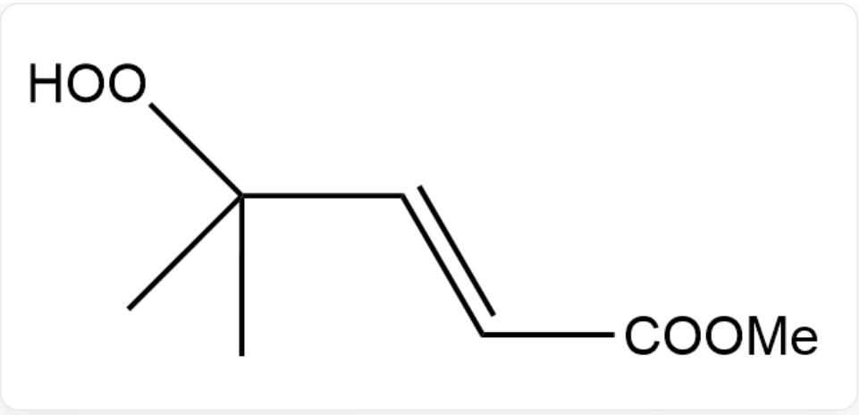
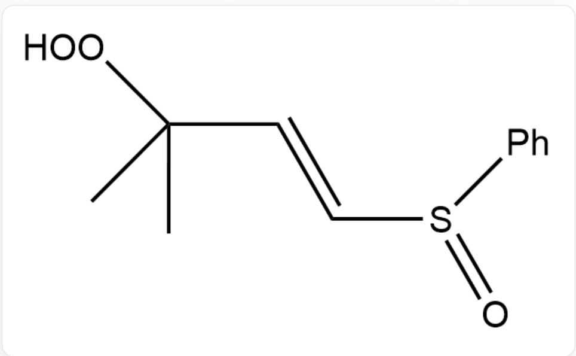
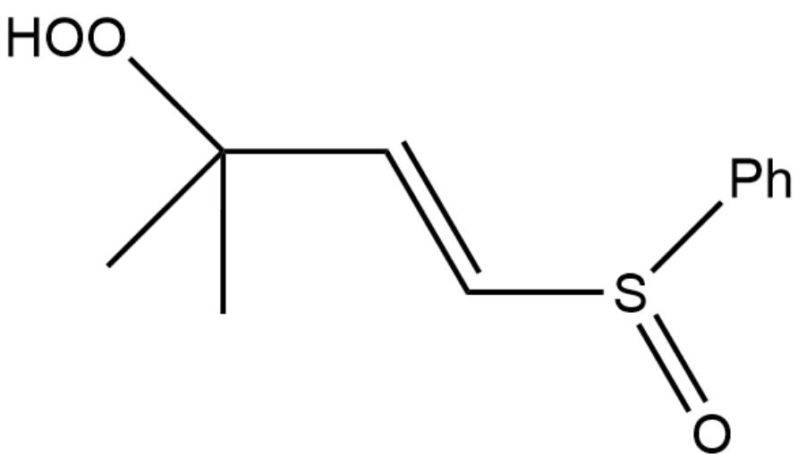
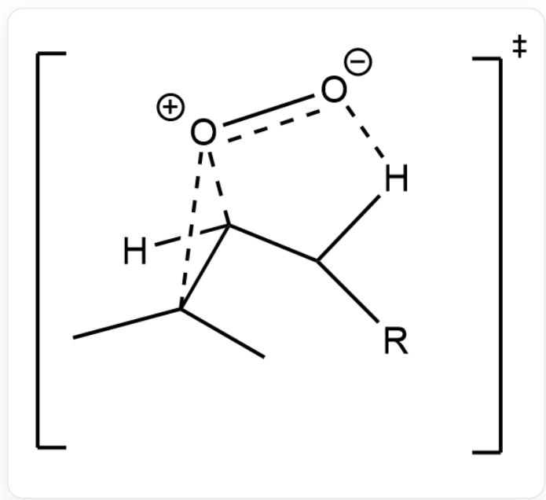

# 题目

单线态氧  ${ }^{1} O_{2}$  可以与以下两种底物发生反应, 请分别给出该加成反应的主产物 (不考虑立体异构)

  
C/C(C)=C/CC(OC)=O,底物1

底物1

  
C/C(C)=C/CS(C1=CC=CC=C1)=O,底物2

# 底物2

A. 其他选项均不正确

B.  
  
CC(C)(OO)/C=C/C(OC)=O,产物1

产物1  
产物2  
C.  
  
CC(C(OO)CS(C1=CC=CC=C1)=O)=C,产物2

CC(C(OO)CC(OC)=O)=C,产物1

产物1

CC(C(OO)CS(C1=CC=CC=C1)=O)=C,产物2

产物2

D.

  
CC(C)(OO)/C=C/C(OC)=O,产物1

产物1

  
$\mathrm{O = S(C1 = CC = CC = C1) / C = C / C(C)(OO)C,}$  产物2

产物2

E.

CC(C(OO)CC(OC)=O)=C,产物1

产物1

[ \mathrm{O} = \mathrm{S}(\mathrm{C}1 = \mathrm{CC} = \mathrm{CC} = \mathrm{C}1) / \mathrm{C} = \mathrm{C} / \mathrm{C}(\mathrm{C})(\mathrm{OO})\mathrm{C}, ] 产物2

产物2

# 答案

正确答案: B

# 详细解析

亚砜与羰基相比其极化程度更大,氧上负电荷更集中

CHECKPOINT

1 PTS

亚砜与羰基相比其极化程度更大,氧上负电荷更集中

这是反应的过渡态（以反应1为例）

  
[H]C1(C([O+]1[O-])(C)C([R])[H]

对于R=COOMe,进攻羰基邻位的氢,羰基可通过共轭效应稳定过渡态,故得到共轭产物

# CHECKPOINT

1 PTS

对于R=COOMe,进攻羰基邻位的氢,羰基可通过共轭效应稳定过渡态,故得到共轭产物

对于R=SOPh,氧上的负电荷过多,使得进攻其邻位氢的过渡态中过氧基和亚砜氧间存在强烈排斥,故倾向生成末端烯烃

# CHECKPOINT

1 PTS

对于R=SOPh,氧上的负电荷过多,使得进攻其邻位氢的过渡态中过氧基和亚砜氧间存在强烈排斥,故倾向生成末端烯烃