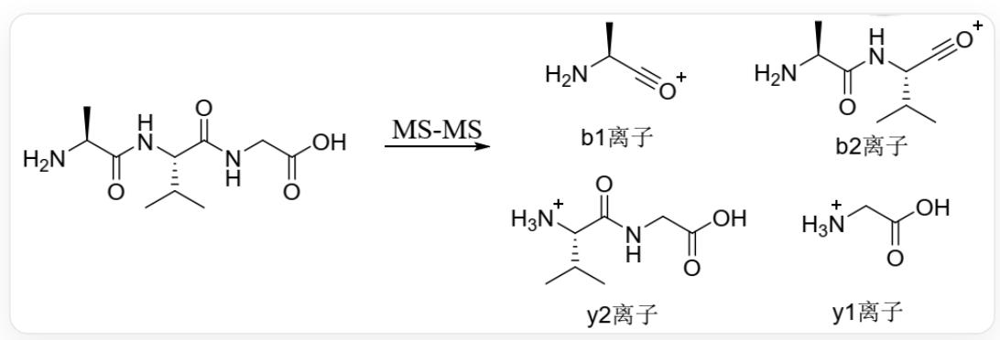

# Question

Tandem mass spectrometry (MS-MS) provides a rapid method for determining the amino acid sequence of peptides. Peptides undergo fragmentation reactions in the mass spectrometer, often accompanied by the breaking of amide bonds, forming so-called "b ions" and "y ions". The following shows the b and y ions formed in the tandem mass spectrum of alanine-valine-glycine (Ala-Val-Gly).

  
Alanine-valine-glycine (NC(C(NC(C(C)C)C(NCC(O)=O)=O)=O)C), which can be fragmented in secondary mass spectrometry to produce four b and y ions, where b1 ion is NC(C)C#[O+], y2 ion is [NH3+]C(C(C)C)C(NCC(O)=O)=O, b2 ion is NC(C(NC(C(C)C)C#[O+])=O)C, y1 ion is [NH3+]CC(O)=O

It is known that peptide X is an octapeptide, in which one amino acid has been modified, and this modification will not be reflected in the amino acid composition determination after hydrolysis. Tandem mass spectrometry was used to sequence peptide X. The mass-to-charge ratios of the formed b and y ions are given in the table below:

<table><tr><td>Ion</td><td>m/z</td><td>Ion</td><td>m/z</td><td>Ion</td><td>m/z</td></tr><tr><td>y1</td><td>90.1</td><td>b3</td><td>298.1</td><td>b6</td><td>598.2</td></tr><tr><td>b1</td><td>112</td><td>y4</td><td>374.2</td><td>y6</td><td>618.3</td></tr><tr><td>b2</td><td>169.1</td><td>y7</td><td>675.3</td><td>b7</td><td>697.3</td></tr><tr><td>y2</td><td>189.1</td><td>b4</td><td>413.1</td><td>y5</td><td>489.2</td></tr><tr><td>y3</td><td>246.1</td><td>b5</td><td>541.2</td><td>b8</td><td>768.3</td></tr></table>

The following statements are now available:

1. The composition of the polypeptide is: 1 Ala, 1 Asp, 1 Gly, 2 Glu, 1 Val and 1 modified amino acid  
2. There are a total of 20160 kinds of polypeptides (including X itself) with the same amino acid composition as polypeptide X but different amino acid sequences.  
3. The modified amino acid is produced by Asp or Asn  
4. The modified amino acid is located at the C-terminus  
5. The polypeptide has 2 free carboxyl groups  
6. The molecular weight of the modified amino acid is 129  
7. The polypeptide can be sequenced by Edman degradation  
8. The polypeptide sequence is Mod-Gly-Glu-Asp-Gln-Gly-Val-Ala, where Mod refers to the modified amino acid

Select all the correct statements.

A. 1,2,3,4,7  
B. 1,2,4,6,7  
C. 2, 5, 6, 8  
D. 2,5,6,7,8  
E.  $1, 2, 3, 4, 5$  
F. 1,2,3,4,5,7  
G. 3,5,8  
H. 2,3,5,8  
1. 3,4,7  
J. 3,4,5,7  
K. 2, 3, 4, 5, 7  
L. 2, 3, 5, 6, 8  
M. All of the above options are incorrect.

# Answer

Correct Answer: C

# Detailed Explanation

According to the given picture information, it can be categorized that: In tandem mass spectrometry, the fragmentation of peptide bonds in a polypeptide, where fragments containing the acyl portion produce acyl positive ions, are called b ions; fragments containing the amino portion produce amino positive ions, are called y ions.

# CHECKPOINT

1 PTS

In tandem mass spectrometry, the fragmentation of peptide bonds in a polypeptide, where fragments containing the acyl portion produce acyl positive ions, are called b ions; fragments containing the amino portion produce amino positive ions, are called y ions.

Therefore, the mass-to-charge ratio of the b ion plus 17 is the molecular weight of the corresponding amino acid, and the mass-to-charge ratio of the y ion minus one is the molecular weight of the corresponding amino acid. At the same time, increasing the sequence number of the b ion is equivalent to adding amino acids from the N-terminus of the polypeptide; increasing the sequence number of the y ion is equivalent to adding amino acids from the C-terminus of the polypeptide.

# CHECKPOINT

1 PTS

The mass-to-charge ratio of the b ion plus 17 is the molecular weight of the corresponding amino acid, and the mass-to-charge ratio of the y ion minus one is the molecular weight of the corresponding amino acid

# CHECKPOINT

1 PTS

Increasing the sequence number of the b ion is equivalent to adding amino acids from the N-terminus of the polypeptide; increasing the sequence number of the y ion is equivalent to adding amino acids from the C-terminus of the polypeptide

Analyzing the table data, the molecular weight of the amino acid corresponding to the y1 ion is 89, which is Ala; the molecular weight of the amino acid corresponding to the b1 ion is 129, which does not correspond to any amino acid, and should be a modified amino acid, statement 6 is correct.

# CHECKPOINT

1 PTS

The molecular weight of the amino acid corresponding to the b1 ion is 129, which should be a modified amino acid

The molecular weight of the polypeptide corresponding to the y2 ion is 188.1, subtracting the molecular weight of the Ala residue is 117.1, which is Val; the molecular weight of the polypeptide corresponding to the b2 ion is 186.1, subtracting the molecular weight of the modified amino acid residue is 75.1, which is Gly; the molecular weight of the polypeptide corresponding to the y3 ion is 245.1, subtracting the molecular weight of the polypeptide corresponding to the y2 ion is 57, corresponding to the mass of the amino acid residue, and adding a molecule of water is 75, corresponding to the mass of the amino acid, which is Gly. Subsequent b and y ions are analyzed using the same method, and the polypeptide sequence can be obtained as Mod-Gly-Glu-Asp-Gln-Gly-Val-Ala, where Mod refers to the modified amino acid, and the modified amino acid is located at the N-terminus. Therefore, statement 8 is correct and 1 is incorrect.

# CHECKPOINT

2 PTS

The polypeptide sequence is Mod-Gly-Glu-Asp-Gln-Gly-Val-Ala, the modified amino acid is located at the N-terminus

For the composition of polypeptide  $\mathbf{X}$ , there are a total of  $8! / 2! = 20160$  possible sequences, statement 2 is correct.

# CHECKPOINT

1 PTS

For the composition of polypeptide  $\mathbf{X}$ , there are a total of  $8! / 2! = 20160$  possible sequences

The modified amino acid is the same as the original amino acid after hydrolysis, which is a hydrolyzable modification, considered as acylation modification;

# CHECKPOINT

1 PTS

Consider the amino acid modification as acylation modification

Comparing Ser, Tyr, Thr, Arg, Lys, Cys, Asn/Asp, Gln/Glu, which can produce acylation modifications, the difference value is only 17/18 when it is Gln/Glu, corresponding to a molecule of ammonia or water, then the modified amino acid is pyroglutamic acid, statement 3 is incorrect.

# CHECKPOINT

1 PTS

The modified amino acid is produced by Gln or Glu, modified as pyroglutamic acid

The pyroglutamic acid amino group and the side chain carboxyl group are acylated to form a ring, and the N-terminus is blocked, so it cannot be sequenced by Edman degradation, statement 7 is incorrect.

# CHECKPOINT

1 PTS

The pyroglutamic acid amino group and the side chain carboxyl group are acylated to form a ring, and the N-terminus is blocked, so it cannot be sequenced by Edman degradation.

There are a total of three free carboxyl groups in polypeptide X: the C-terminal carboxyl group, one Asp side chain carboxyl group, and one Glu side chain carboxyl group, but the free carboxyl group of Asp forms a ring with the pyroglutamic acid amino group, so there are only two free carboxyl groups, statement 5 is correct.

# CHECKPOINT

1 PTS

There are a total of two free carboxyl groups in polypeptide  $\mathbf{X}$

Therefore, option C is correct.